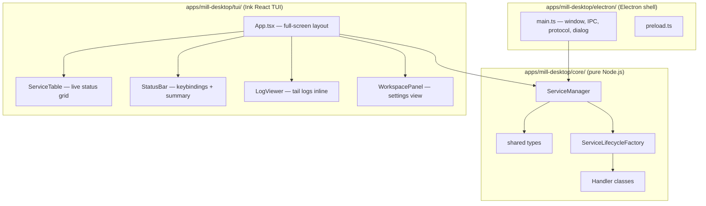

# Interactive TUI + Shared Core Library

## Current State

Almost all business logic in `electron/main.ts` is pure Node.js. Only two tiny methods (`openLog` via `shell.openPath`, `openServiceLink` via `shell.openExternal`) and the Electron shell (windows, dialogs, IPC, protocol) are Electron-specific. The entire `electron/lifecycle/` tree and `shared/service.ts` have zero Electron imports.

## Architecture



## Why Ink

**Ink** is React for the terminal. Since the Electron GUI already uses React + TypeScript + JSX, the TUI can reuse the same mental model, hooks, and component patterns. Used in production by Anthropic (Claude Code), Google (Gemini CLI), Cloudflare (Wrangler), and Prisma. It supports:

- Full-screen alternate-screen mode (like htop/k9s)
- `useInput` hook for keyboard navigation
- `<Box>`, `<Text>` with flexbox layout
- Live re-rendering on state changes (same as React)
- Scrollable regions, colors, borders, bold/dim text

## Step 1 — Extract shared core (unchanged from previous plan)

Create `apps/mill-desktop/core/` with pure Node.js files:

- Move `shared/service.ts` to `core/types.ts` (re-export from old path for backward compat)
- Move `electron/lifecycle/` tree to `core/lifecycle/`
- Extract `ServiceManager` class from [electron/main.ts](apps/mill-desktop/electron/main.ts) into `core/ServiceManager.ts`
  - Inject `PlatformAdapter` for the two Electron-dependent methods:

```typescript
export interface PlatformAdapter {
  openPath(filePath: string): Promise<void>;
  openExternal(url: string): Promise<void>;
}
```

  - Inject `assetUrlBuilder: (absolutePath: string) => string` (Electron uses `mill-asset://`, TUI ignores or uses file path)

## Step 2 — Wire Electron GUI to shared core

In `electron/main.ts`:

- Import `ServiceManager` from `core/ServiceManager`
- Provide Electron-specific `PlatformAdapter` using `shell.openPath` / `shell.openExternal`
- Provide `assetUrlBuilder` using the `mill-asset://` protocol
- Everything else (window, IPC, protocol, dialog) stays in `main.ts`

No UI changes needed — the GUI works exactly as before.

## Step 3 — Build the interactive TUI

### 3.1 Dependencies

```
npm install ink ink-table ink-text-input ink-select-input ink-spinner
```

### 3.2 TUI layout (k9s-inspired)

```
┌─────────────────────────────────────────────────────────────────┐
│  Mill Launcher TUI    Workspace: C:\Users\vm\Downloads          │
│  Slug: downloads      2/4 running                               │
├─────────────────────────────────────────────────────────────────┤
│  ID                  TYPE     STATUS    PREREQ   PID    NAME    │
│▶ mill-grinder-ui     node     RUNNING   ok       12345  Fake..  │
│  mill-ai-service     node     STOPPED   ok       -      Fake..  │
│  redis               docker   RUNNING   ok       12346  Redis   │
│  postgres-compose    dc       ERROR     missing  -      PG..    │
├─────────────────────────────────────────────────────────────────┤
│  [s]tart  [S]top  [a]ll start  [A]ll stop  [r]eload  [l]og     │
│  [w]orkspace  [c]heck  [d]elete  [q]uit                        │
└─────────────────────────────────────────────────────────────────┘
```

### 3.3 Components

| Component | Purpose |
|-----------|---------|
| `tui/App.tsx` | Full-screen Ink app with `useApp`, `useInput`, state management, `ServiceManager` instance |
| `tui/components/ServiceTable.tsx` | Navigable table with arrow-key selection, colored status cells, type badges |
| `tui/components/StatusBar.tsx` | Bottom bar with keybinding hints and running/total count |
| `tui/components/Header.tsx` | Top bar with workspace info and branding |
| `tui/components/LogViewer.tsx` | Scrollable log tail for selected service (toggle with `l`) |
| `tui/components/WorkspacePanel.tsx` | Overlay/panel for workspace switch, reload, import, settings |
| `tui/components/ConfirmDialog.tsx` | Inline yes/no prompt (delete, reload, quit with running services) |
| `tui/index.tsx` | Entry point: parse args, create `ServiceManager`, render `<App>` with `ink.render()` |
| `tui/adapters.ts` | `PlatformAdapter` for TUI: `openPath` uses `child_process.exec` with OS opener |

### 3.4 Keyboard interactions

| Key | Action |
|-----|--------|
| `↑` / `↓` or `j` / `k` | Navigate service list |
| `Enter` or `s` | Start selected service |
| `S` (shift) | Stop selected service |
| `a` | Start all |
| `A` | Stop all |
| `l` | Toggle log viewer for selected service |
| `r` | Reload workspace (with confirm) |
| `w` | Open workspace panel (switch, import, settings) |
| `c` | Run prerequisite check on selected service |
| `d` | Delete selected service (with confirm) |
| `q` | Quit (confirm if services running) |
| `?` | Toggle help overlay |

### 3.5 Live status updates

Use `setInterval` + React state (same pattern as the Electron renderer's `refreshStatuses` polling) — every 2 seconds call `serviceManager.listServices()` and update the table. Ink re-renders only what changed.

## Step 4 — Add build scripts

In [package.json](apps/mill-desktop/package.json):

- `"tui": "node dist-tui/tui/index.js"` — run the TUI
- `"build:tui": "tsc -p tsconfig.tui.json"` — compile TUI
- `"dev:tui": "tsc -p tsconfig.tui.json --watch"` — watch mode
- New `tsconfig.tui.json` targeting `core/` + `tui/`, with `jsx: "react-jsx"`, no Electron types

In [apps/Makefile](apps/Makefile):

- `make desktop-tui` — build and launch TUI

## File structure after refactor

```
apps/mill-desktop/
  core/
    types.ts                          # was shared/service.ts
    ServiceManager.ts                 # extracted from electron/main.ts
    PlatformAdapter.ts                # interface definition
    lifecycle/
      ServiceLifecycleHandler.ts
      ServiceLifecycleFactory.ts
      handlers/
        CommandServiceLifecycleHandler.ts
        NodeServiceLifecycleHandler.ts
        JavaBootServiceLifecycleHandler.ts
        DockerServiceLifecycleHandler.ts
        DockerComposeServiceLifecycleHandler.ts
  shared/
    service.ts                        # re-exports from core/types.ts
  electron/
    main.ts                           # slim: window + IPC + protocol + adapter
    preload.ts                        # unchanged
  tui/
    index.tsx                         # entry point
    App.tsx                           # full-screen layout + state
    adapters.ts                       # PlatformAdapter for TUI
    components/
      Header.tsx
      ServiceTable.tsx
      StatusBar.tsx
      LogViewer.tsx
      WorkspacePanel.tsx
      ConfirmDialog.tsx
  src/                                # Electron React renderer (unchanged)
```

## Key decisions

- **Ink (React for terminals)** — same JSX/hooks mental model as the Electron renderer; team already knows React. Widely adopted (Claude Code, Gemini CLI, Wrangler).
- **Single package** — core, TUI, and GUI live in `apps/mill-desktop`. No monorepo overhead for a POC.
- **Adapter pattern** — `PlatformAdapter` keeps `ServiceManager` clean; Electron provides `shell.*`, TUI provides OS-native openers.
- **k9s-style navigation** — arrow keys + single-letter keybindings. No subcommand memorization needed.
- **Alternate screen** — TUI uses the terminal's alternate screen buffer (like vim/htop), so it leaves the terminal clean on exit.
