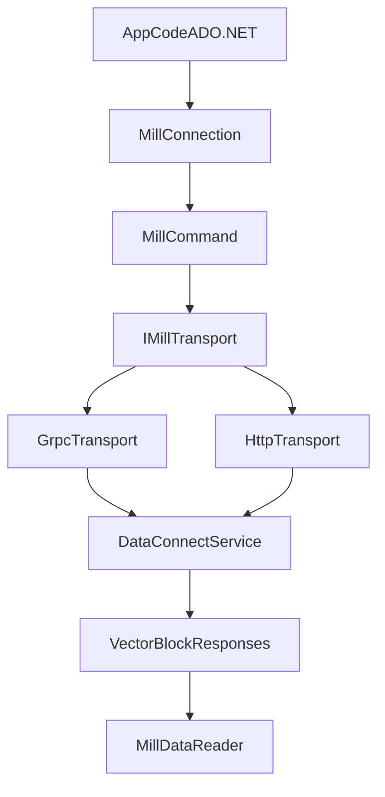

# ADO.NET Provider Design

Design track for a managed .NET data provider for Mill, scoped independently from ODBC.

Related onboarding material:

- [ADO.NET Provider Start Here](01-adonet-provider-start-here.md)
- [ADO.NET Provider Data Lane](02-adonet-provider-data-lane.md)
- [ADO.NET Provider WI Draft](03-adonet-provider-wi-draft.md)
- `docs/workitems/WI-077-adonet-provider.md`

## Goal

Deliver a production-ready ADO.NET provider that supports:
- gRPC and HTTP transports
- query execution and result streaming/paging
- schema metadata discovery
- auth and TLS parity with existing clients

This track intentionally does not depend on ODBC decisions.

## Why This Is Feasible

Existing assets already cover the core wire contract and client behavior:
- `proto/data_connect_svc.proto` defines service RPCs (`Handshake`, `ListSchemas`, `GetSchema`, `ExecQuery`, paging APIs).
- `proto/statement.proto` and `proto/vector.proto` define query payload and vectorized results.
- `clients/mill-jdbc-driver/src/main/java/io/qpointz/mill/client/GrpcMillClient.java` and `HttpMillClient.java` already prove dual transport with shared semantics.

## Target Provider Surface

- `MillConnection : DbConnection`
- `MillCommand : DbCommand`
- `MillDataReader : DbDataReader`
- `MillParameterCollection` (read-only/limited initially)
- `MillTransaction` as no-op or unsupported (read-only model)
- optional `MillDbProviderFactory`

## Architecture

## Mill Types: Logical vs Physical

Mill uses a fixed logical type system at the schema/API level, but result values are transported
using a smaller set of physical vector encodings.

Short version:

- **Logical type** = the semantic meaning of the value
  - examples: `DATE`, `TIME`, `TIMESTAMP_TZ`, `UUID`
- **Physical type** = the wire/storage shape used in vectors
  - examples: `i32`, `i64`, `bytes`, `string`

This matters because multiple Mill logical types share the same physical encoding:

- `TINY_INT`, `SMALL_INT`, `INT`, `INTERVAL_DAY`, `INTERVAL_YEAR` -> `I32Vector`
- `BIG_INT`, `DATE`, `TIME`, `TIMESTAMP`, `TIMESTAMP_TZ` -> `I64Vector`
- `BINARY`, `UUID` -> `BytesVector`

The ADO.NET provider therefore cannot map values based only on the vector field type. It must
look at the field's **logical type id** from schema metadata and then interpret the underlying
physical value correctly.

Authoritative references:

- `proto/common.proto`
- `proto/vector.proto`
- `docs/design/data/mill-type-system.md`
- `docs/public/src/sources/types.md`

## Existing Mill Type Model

Mill currently exposes these logical scalar types:

- `BOOL`
- `TINY_INT`
- `SMALL_INT`
- `INT`
- `BIG_INT`
- `FLOAT`
- `DOUBLE`
- `STRING`
- `BINARY`
- `DATE`
- `TIME`
- `TIMESTAMP`
- `TIMESTAMP_TZ`
- `INTERVAL_DAY`
- `INTERVAL_YEAR`
- `UUID`

Current wire semantics to remember:

- `DATE` = epoch days in `int64`
- `TIME` = nanoseconds since midnight in `int64`
- `TIMESTAMP` = epoch milliseconds in `int64`, no timezone semantics
- `TIMESTAMP_TZ` = epoch milliseconds in `int64`, interpreted as UTC
- `UUID` = 16-byte binary payload

Known current platform limitation:

- there is no dedicated Mill decimal logical type today
- SQL `DECIMAL`/`NUMERIC` are typically collapsed into floating-point representations upstream
- high-precision numeric round-tripping is therefore not guaranteed

## Draft Proposed Mapping To .NET

The table below is the recommended first-pass provider mapping for `DbDataReader.GetFieldType()`,
typed getters, and general CLR materialization.

| Mill logical type | Physical vector | Proposed CLR type | ADO.NET notes |
|-------------------|-----------------|-------------------|---------------|
| `BOOL` | `BoolVector` | `bool` | Expose as `DbType.Boolean` |
| `TINY_INT` | `I32Vector` | `sbyte` for semantic type, `int` for raw internal decode | Reader should support `GetByte`-adjacent conversions carefully; provider may internally decode as `int` then range-check |
| `SMALL_INT` | `I32Vector` | `short` | Internal decode may still read from 32-bit vector storage |
| `INT` | `I32Vector` | `int` | Straightforward `DbType.Int32` |
| `BIG_INT` | `I64Vector` | `long` | `DbType.Int64` |
| `FLOAT` | `FP32Vector` | `float` | `DbType.Single` |
| `DOUBLE` | `FP64Vector` | `double` | `DbType.Double` |
| `STRING` | `StringVector` | `string` | `DbType.String` |
| `BINARY` | `BytesVector` | `byte[]` | `DbType.Binary`; stream accessor can be added later |
| `UUID` | `BytesVector` | `Guid` | Transport is 16 bytes; provider should also permit `byte[]` via `GetValue()` fallback only if needed |
| `DATE` | `I64Vector` | `DateOnly` | Fallback to `DateTime` for older target frameworks if necessary |
| `TIME` | `I64Vector` | `TimeOnly` | Fallback to `TimeSpan` if target framework or consumer compatibility requires it |
| `TIMESTAMP` | `I64Vector` | `DateTime` | Use `DateTimeKind.Unspecified` to preserve "no timezone" semantics |
| `TIMESTAMP_TZ` | `I64Vector` | `DateTimeOffset` | Prefer `DateTimeOffset` because Mill defines UTC-aware semantics here |
| `INTERVAL_DAY` | `I32Vector` | `TimeSpan` | Day-count intervals map naturally to whole-day `TimeSpan` values |
| `INTERVAL_YEAR` | `I32Vector` | `int` | Treat as year-count value for MVP; no perfect BCL interval type exists |

## Recommended Provider Semantics

### 1. Preserve logical meaning over physical storage

A `DATE` and a `BIG_INT` may both arrive as `int64`, but they must not have the same CLR type.
The field metadata is authoritative.

### 2. Prefer modern .NET types when the target framework allows them

Recommended modern baseline:

- `DateOnly` for `DATE`
- `TimeOnly` for `TIME`
- `DateTime` for `TIMESTAMP`
- `DateTimeOffset` for `TIMESTAMP_TZ`
- `Guid` for `UUID`

If the package must support older target frameworks, keep conversion fallbacks explicit rather
than weakening the logical model silently.

### 3. Keep nullability at the reader boundary, not in CLR type declarations

As with normal ADO.NET providers:

- `GetFieldType()` should return the non-nullable CLR type
- nullability is represented through schema metadata and `IsDBNull(...)`
- `GetValue(...)` should return `DBNull.Value` semantics where required by ADO.NET contracts

### 4. Avoid over-promising on decimal precision

Until Mill has a true decimal logical type, the provider should not imply exact decimal fidelity.
If a source/backend value is already surfaced as Mill `DOUBLE`, the ADO.NET provider should expose
it as floating-point, not pretend it is an exact `decimal`.

## Draft Mapping Details And Tradeoffs

### Integer family

Mill stores `TINY_INT`, `SMALL_INT`, and `INT` all in `I32Vector`. That is a storage optimization
detail, not the client contract.

Recommended approach:

- decode raw values from the vector as `int`
- expose logical semantic types in metadata
- typed getters should coerce/range-check appropriately

This avoids losing the declared column type while keeping the decoder simple.

### Temporal family

Temporal values need the clearest policy because they are easy to get subtly wrong.

- `DATE`
  - wire: epoch days
  - preferred CLR: `DateOnly`
- `TIME`
  - wire: nanoseconds since midnight
  - preferred CLR: `TimeOnly`
  - note: .NET cannot preserve arbitrary nanosecond precision in all APIs, so sub-tick precision
    policy must be documented during implementation
- `TIMESTAMP`
  - wire: epoch millis
  - semantic meaning: local/naive timestamp without timezone
  - preferred CLR: `DateTime` with `Kind=Unspecified`
- `TIMESTAMP_TZ`
  - wire: epoch millis UTC
  - preferred CLR: `DateTimeOffset`
  - using `DateTimeOffset` is clearer than UTC `DateTime` for consumer correctness

### UUID

Mill transports UUID as 16-byte binary, not as canonical string text.

Recommended approach:

- expose `Guid` as the primary CLR type
- convert from the 16-byte Mill binary payload in one place in the reader/decoder layer
- avoid surfacing UUID as `string` unless a consumer explicitly asks for string conversion

### Intervals

Mill has two interval logical types with limited client support today:

- `INTERVAL_DAY`
- `INTERVAL_YEAR`

Recommended MVP policy:

- `INTERVAL_DAY` -> `TimeSpan`
- `INTERVAL_YEAR` -> `int`

This is not mathematically perfect for all downstream semantics, but it is clear, implementable,
and honest about the lack of a native BCL "year interval" type.

## Suggested Initial `DbType` Mapping

This is a draft proposal for command parameters and schema metadata surfaces:

| Mill logical type | Proposed `DbType` |
|-------------------|-------------------|
| `BOOL` | `Boolean` |
| `TINY_INT` | `SByte` if supported by provider code path, otherwise `Int32` |
| `SMALL_INT` | `Int16` |
| `INT` | `Int32` |
| `BIG_INT` | `Int64` |
| `FLOAT` | `Single` |
| `DOUBLE` | `Double` |
| `STRING` | `String` |
| `BINARY` | `Binary` |
| `UUID` | `Guid` |
| `DATE` | `Date` |
| `TIME` | `Time` |
| `TIMESTAMP` | `DateTime` |
| `TIMESTAMP_TZ` | `DateTimeOffset` |
| `INTERVAL_DAY` | `Object` initially, or provider-specific handling |
| `INTERVAL_YEAR` | `Int32` or `Object` |

`INTERVAL_*` may need provider-specific handling in schema APIs because `DbType` has no ideal
cross-provider interval representation.

## Open Mapping Decisions For Implementation

These should be resolved early in the actual .NET implementation:

1. Which target frameworks are supported, and whether `DateOnly`/`TimeOnly` can be used directly.
2. Whether `TINY_INT` should be exposed as `sbyte` or normalized to `int` for broader consumer compatibility.
3. Whether `TIME` should materialize as `TimeOnly` or `TimeSpan` in the public reader surface.
4. Whether `GetValue()` for nulls should return `DBNull.Value` directly or use a tighter internal wrapper before ADO.NET projection.
5. How much typed-getter coverage is needed for `Guid`, `DateOnly`, and `TimeOnly` versus `GetFieldValue<T>()`.

## Dialect Considerations

The provider must not assume that every Mill server speaks the same SQL dialect.

Although many local/test examples use Calcite-style SQL conventions, Mill servers may be configured
with different dialect descriptors and may require clients to generate, validate, quote, or report
SQL according to the server-selected dialect.

Relevant service operations:

- `Handshake`
  - indicates whether dialect discovery is supported through
    `Handshake.capabilities.supportDialect`
- `GetDialect`
  - returns the server dialect descriptor when supported

Important client implication:

- the ADO.NET provider should treat SQL dialect as a server capability, not a client constant

### What This Means Practically

1. **Do not hardcode Calcite assumptions into provider metadata**

Examples of assumptions to avoid:

- identifier quoting is always backticks
- case-sensitivity rules are always Calcite defaults
- paging syntax is always one fixed shape
- function/operator support is universal

2. **Use dialect discovery when available**

If `supportDialect=true`, the provider should call `GetDialect` and cache the returned descriptor
at the connection or metadata layer.

This descriptor can inform:

- identifier quote characters
- server product/dialect naming in metadata surfaces
- capabilities exposed through provider metadata
- future SQL-builder or command-helper behavior if such features are added later

3. **Keep raw SQL submission simple in MVP**

For the initial ADO.NET provider, the main requirement is to send user SQL through to the server,
not to rewrite SQL aggressively on the client.

That means:

- users remain responsible for sending SQL valid for the target Mill server
- the provider should expose dialect metadata when available
- server-side parse/validation errors should pass back clearly

4. **Expect dialect differences across environments**

The same provider may connect to:

- a local Calcite/Flow-backed sample service
- a service fronting JDBC-backed sources
- future deployments with different quoting, functions, limits, or type-info surfaces

The provider should therefore separate:

- transport behavior
- result decoding behavior
- dialect/metadata behavior

### Suggested MVP Dialect Policy

- On open or first metadata access, call `Handshake`
- If `supportDialect=true`, call `GetDialect`
- Cache the dialect descriptor per connection
- Surface dialect identity and key quoting/type-info metadata where practical
- Do not block query execution if dialect discovery is unavailable
- Fall back gracefully when the server does not support `GetDialect`

### Existing References

- Service contract: `proto/dialect.proto`
- RPC registration: `proto/data_connect_svc.proto`
- Server dispatch: `data/mill-data-backend-core/src/main/java/io/qpointz/mill/data/backend/dispatchers/DataOperationDispatcherImpl.java`
- JDBC metadata consumer:
  `clients/mill-jdbc-driver/src/main/java/io/qpointz/mill/MillDatabaseMetadata.java`

The main design rule is simple: the provider can be dialect-aware, but it must not be dialect-fixed.

## OLE DB Relationship

OLE DB is treated as separate from this managed provider:
- immediate scope: ADO.NET only
- optional future: compatibility adapter if required by consumers
- no COM/OLE DB obligations are assumed for Phase 1

## Phased Implementation

1. **Transport and contract layer**
   - C# proto generation and transport clients (gRPC + HTTP)
   - request/response parity with current Java client behavior
2. **Core ADO.NET objects**
   - `DbConnection`, `DbCommand`, `DbDataReader` minimal compliant implementation
3. **Metadata and capabilities**
   - `GetSchema` integration, reader schema, basic provider metadata
4. **Authentication and TLS**
   - basic/bearer auth, TLS/mTLS settings parity
5. **Conformance and hardening**
   - integration tests against Mill service
   - behavior validation in Dapper/EF-read scenarios

## Risks

- ADO.NET compatibility expectations differ by consumer (Dapper, EF Core, BI tools).
- Temporal and binary type handling requires careful conversion rules.
- HTTP and gRPC behavior must stay semantically identical for paging and errors.

## Test Strategy

- Unit tests: type conversion, reader behavior, null handling, command lifecycle.
- Integration tests: gRPC and HTTP query parity, schema metadata parity, auth/TLS modes.
- Compatibility checks: smoke tests with Dapper and plain `DbProviderFactory` patterns.

## Out of Scope

- ODBC driver implementation
- native OLE DB COM provider implementation
- write/transaction semantics beyond explicit read-only behavior
