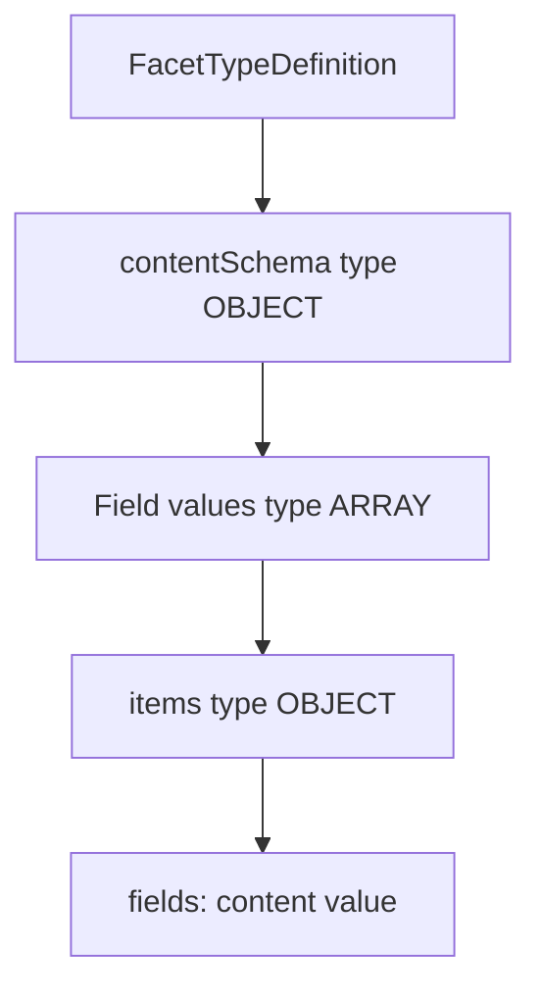

# Facet payload schema reference (`contentSchema`)

**Status:** Reference for seed authors and API consumers  
**Last updated:** 2026-04-16  
**Related:** [`facet-type-descriptor-formats.md`](facet-type-descriptor-formats.md) (descriptor envelope + same type vocabulary), [`dynamic-facet-types-schema-and-validation.md`](dynamic-facet-types-schema-and-validation.md) (design context), [`value-mapping-indexing-facet-types.md`](value-mapping-indexing-facet-types.md) (AI value-mapping facets)

---

## Purpose

Platform **`FacetTypeDefinition`** rows in YAML use a **`contentSchema`** property for the **facet instance payload** shape (JSON on the wire). This document:

- Aligns **terminology:** seeds use **`contentSchema`**; some older prose refers to a **`payload`** node — same recursive schema tree as in `facet-type-descriptor-formats.md` § Canonical Contract.
- Provides a **copy-pasteable example** for **`ARRAY`** whose **`items`** are **`OBJECT`** (array of objects), taken from production seed YAML.

---

## Type vocabulary (summary)

| `schema.type` | Notes |
|---------------|--------|
| `OBJECT` | `fields` + optional `required` (field names). |
| `ARRAY` | **`items`** (required): nested schema node for each element. |
| `STRING` | Optional `format`: `date`, `date-time`, `email`, `uri`. |
| `NUMBER` | — |
| `BOOLEAN` | — |
| `ENUM` | `values: [{ value, description }, …]` |

Unsupported at this layer: `oneOf` / `anyOf` / `allOf`, conditional JSON Schema (see `facet-type-descriptor-formats.md` § Strictness Rules).

---

## Array of scalars

Example: **`tags`** on the **`descriptive`** facet — `ARRAY` of `STRING` (`items` is a scalar schema):

```yaml
- name: tags
  schema:
    type: ARRAY
    title: Tags
    description: "List of tags attached to the entity."
    items:
      type: STRING
      title: Tag
      description: "One tag value."
  required: false
```

(Source: [`platform-bootstrap.yaml`](../../../metadata/mill-metadata-core/src/main/resources/metadata/platform-bootstrap.yaml) — `urn:mill/metadata/facet-type:descriptive`.)

---

## Array of objects (canonical example)

Use this pattern when each array element is a **structured row** (multiple named fields).

**Facet:** `urn:mill/metadata/facet-type:ai-column-value-mapping-values`  
**Field:** `values` — required `ARRAY` whose **`items`** is an **`OBJECT`** with **`content`** and **`value`** (both strings).

Excerpt from [`platform-bootstrap.yaml`](../../../metadata/mill-metadata-core/src/main/resources/metadata/platform-bootstrap.yaml) (trimmed for focus):

```yaml
contentSchema:
  type: OBJECT
  title: Static value list payload
  description: >-
    Manual or supplemental list of embedding text (content) and substitution value (value) pairs.
  fields:
    - name: values
      schema:
        type: ARRAY
        title: Values
        description: Static rows for indexing and resolution (see §4 for content vs value).
        items:
          type: OBJECT
          title: Static value row
          description: One pair — semantic text to embed and canonical value for substitution.
          fields:
            - name: content
              schema:
                type: STRING
                title: Content
                description: Text to embed for semantic match.
              required: true
            - name: value
              schema:
                type: STRING
                title: Value
                description: Canonical value to use when this row matches.
              required: true
      required: true
  required: []
```

**Wire JSON:** the facet instance payload will contain **`values`** as a JSON **array** of **objects**, e.g. `[{ "content": "…", "value": "…" }, …]`.

Another seed example of **array of objects** (flow backend): field **`tableInputs`** on **`urn:mill/metadata/facet-type:flow-table`** — see [`platform-flow-facet-types.yaml`](../../../metadata/mill-metadata-core/src/main/resources/metadata/platform-flow-facet-types.yaml).

---

## Diagram (array-of-objects shape)



---

## See also

- Normative descriptor field names and API import rules: [`facet-type-descriptor-formats.md`](facet-type-descriptor-formats.md)
- Value-mapping facet roles: [`value-mapping-indexing-facet-types.md`](value-mapping-indexing-facet-types.md)
- Full catalog of platform seed facet types: [`platform-standard-facet-types.md`](platform-standard-facet-types.md)
