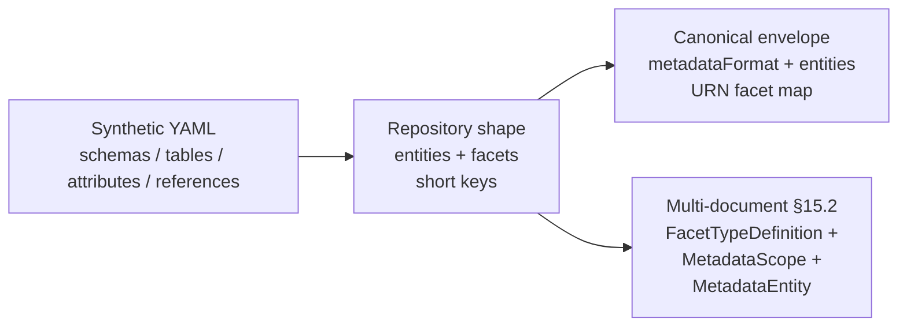

# Synthetic dataset metadata → canonical multipart YAML — implementer handoff

**Audience:** Engineers implementing or replacing a **generator** that reads the **internal synthetic dataset format** and writes **Mill canonical metadata YAML** (single-document `metadataFormat: CANONICAL` envelope and/or **multi-document §15.2** `kind:` stream).

**Normative interchange & import:** [`metadata-canonical-yaml-spec.md`](metadata-canonical-yaml-spec.md), [`mill-metadata-domain-model.md`](mill-metadata-domain-model.md), [`metadata-urn-platform.md`](metadata-urn-platform.md).

**Reference synthetic input:** `test/datasets/skymill/skymill-meta.yaml`  
**Reference intermediate (repository shape):** `test/datasets/skymill/skymill-meta-repository.yaml` — same information as today’s curated hand-off from synthetic → `entities` + short facet keys.  
**Reference outputs:**

- Envelope: `test/datasets/skymill/skymill-meta-canonical.yaml` (`metadataFormat: CANONICAL`, `entities`, full facet/scope URNs).
- Multi-document: `test/datasets/skymill/skymill-meta-multidoc-v1.yaml` (`kind: FacetTypeDefinition` / `MetadataScope` / `MetadataEntity`, `---` separators).

**Existing automation (read before reimplementing):**

- `test/datasets/build_multidoc_metadata_fixtures.py` — repository YAML → §15.2 multidoc + facet definitions from `metadata/mill-metadata-core/src/main/resources/metadata/platform-facet-types.json`.
- `test/datasets/convert_to_canonical_yaml.py` — normalises facet keys in an **already-entity** root map to full URNs (does **not** parse `schemas:` synthetic).

---

## 1. End-to-end pipeline



1. **Parse synthetic** → in-memory **logical model** (schemas, tables, columns, FK graph).
2. **Emit repository shape** (optional persistence step): `entities` list with `type`, coordinate fields (`schemaName`, `tableName`, `attributeName`), `facets` using **short** keys (`descriptive`, `structural`, `relation`) under `global` scope.
3. **Emit canonical envelope** — transform facet map to **full URNs** (see §5–§6).
4. **Emit multi-document stream** — facet type definitions + global scope + one `MetadataEntity` document per entity (see §7–§9).

Steps 2–4 can be fused in one pass; separating them matches existing fixtures and tests.

---

## 2. Source format: synthetic dataset YAML (`schemas:`)

### 2.1 Grammar (as used by Skymill)

Root mapping **must** contain:

| Key | Type | Meaning |
|-----|------|---------|
| `schemas` | sequence | One or more **schema** objects (Skymill uses one: `name: skymill`). |

Each **schema** object:

| Key | Type | Required | Meaning |
|-----|------|----------|---------|
| `name` | string | yes | Logical schema name (e.g. `skymill`). Used for all entity coordinates. |
| `tables` | sequence | yes | Table definitions for this schema. |
| `references` | sequence | no | Schema-level foreign-key edges (see §4). |

Each **table** object:

| Key | Type | Required | Meaning |
|-----|------|----------|---------|
| `name` | string | yes | Table name in the source catalog (e.g. `cities`). |
| `attributes` | sequence | yes | Column definitions. |

Each **attribute** object:

| Key | Type | Required | Meaning |
|-----|------|----------|---------|
| `name` | string | yes | Column name. |
| `type` | string | yes | Synthetic type string (`int`, `varchar`, `boolean`, `decimal(15,4)`, …). |
| `description` | string or null | no | Free-text; maps to **descriptive** facet on the attribute entity. Null/empty → omit descriptive or emit empty strings per product rules. |

### 2.2 Conventions

- Synthetic files **do not** carry table- or schema-level titles beyond `name`; **repository** YAML adds human `displayName` / `description` for schemas and tables. A generator may:
  - **Derive** `displayName` (e.g. title case of `cities` → `Cities`), and
  - Leave **schema** / **table** `description` empty or use a one-line template.
- **Primary keys** are **not** flagged in synthetic YAML. Repository YAML marks `isPrimaryKey: true` on appropriate attributes. A generator should apply **inference rules** (see §4.3) or leave `isPK` false if inference is out of scope (then fixups happen in curation).

---

## 3. Target A — repository shape (`entities` + short facet keys)

This is the **bridge format** stored in `*-meta-repository.yaml`. It matches what `DefaultMetadataImportService` accepts when using legacy short keys under `facets` (see [`metadata-canonical-yaml-spec.md`](metadata-canonical-yaml-spec.md) §5–§6).

### 3.1 Entity rows

Emit one `MetadataEntity`-compatible object per **schema**, **table**, and **attribute**.

| `type` | `id` (short) | Coordinate fields | Notes |
|--------|----------------|---------------------|--------|
| `SCHEMA` | `{schemaName}` | `schemaName` | Same as synthetic `schemas[].name`. |
| `TABLE` | `{schema}.{table}` | `schemaName`, `tableName` | Use **lower case** for `id` to match fixtures. |
| `ATTRIBUTE` | `{schema}.{table}.{column}` | `schemaName`, `tableName`, `attributeName` | Column = attribute `name`. |

Optional but recommended on every entity for round-trip parity with fixtures:

- `createdAt`, `updatedAt` — ISO-8601 instants (constants acceptable for generated data).
- `createdBy`, `updatedBy` — optional strings.

### 3.2 `facets` layout (short keys)

Top level: `facets:` mapping.

- **`descriptive`** → `{ global: { displayName, description } }`
  - On **ATTRIBUTE**: use synthetic `description`; `displayName` can mirror column `name` uppercased or title-cased.
  - On **TABLE** / **SCHEMA**: generator-provided strings.
- **`structural`** → `{ global: { … } }`
  - **TABLE**: `physicalName` (uppercase table name in Skymill repo), `tableType: TABLE`, `backendType: jdbc` (or `flow` / `calcite` per deployment).
  - **ATTRIBUTE**: `physicalName` (uppercase column), `physicalType` (map synthetic type → JDBC-ish name, e.g. `int` → `INTEGER`, `varchar` → `VARCHAR`), `nullable`, `isPrimaryKey`, `isForeignKey`, `backendType`.
- **`relation`** → `{ global: { relations: [ … ] } }` on **TABLE** entities only (see §4). Each relation object uses the **repository** shape expected by import transforms:

```yaml
name: cities_segments_origin
description: Origin city for segments
sourceTable: { schema: skymill, table: cities }
sourceAttributes: [ id ]
targetTable: { schema: skymill, table: segments }
targetAttributes: [ origin ]
cardinality: ONE_TO_MANY
type: FOREIGN_KEY
joinSql: cities.id = segments.origin
```

Import normalisation rewrites these into persisted `source` / `target` / `expression` shapes (`joinSql` → `expression`); see spec §6.3.

---

## 4. Synthetic `references` → `relation` facets

### 4.1 Input shape

Under each schema, `references` is a list of:

```yaml
parent:
  table: cities
  attribute: id
child:
  table: segments
  attribute: origin
cardinality: 1-*
```

**Semantics:** the **child** table holds a column (`child.attribute`) that points to **parent** (`parent.table.parent.attribute`). This matches the Skymill repository: `segments.origin` → `cities.id`.

### 4.2 Relation object (per reference)

Attach the generated relation to the **`TABLE` entity that acts as `sourceTable` in Mill’s relation facet** for that edge. Skymill repository attaches **outgoing** relations from the **parent** side when the parent is the referenced entity (e.g. relations listed under **`cities`** for edges where cities is the lookup target). Follow this pattern for consistency with UI and existing datasets:

- **sourceTable** = parent table (referenced).
- **targetTable** = child table (holds FK).
- **sourceAttributes** = `[ parent.attribute ]`.
- **targetAttributes** = `[ child.attribute ]`.
- **joinSql** = `{parent.table}.{parent.attribute} = {child.table}.{child.attribute}` (use actual synthetic names; importer lowercases canonical entity ids, not necessarily inline SQL — keep consistent with `skymill-meta-repository.yaml`).
- **name** — stable slug, e.g. `{parent_table}_{child_table}_{child_attribute}`.
- **description** — optional; synthetic format has none → generate short text or leave empty.
- **type** — `FOREIGN_KEY` matches fixtures.
- **cardinality** — map synthetic string → enum (§4.4).

### 4.3 PK / FK inference (when upgrading synthetic only)

If you do **not** have repository YAML:

- Any column appearing as **parent.attribute** in a reference is a **referenced key**; treat as logical PK candidate on that table for `isPrimaryKey` when it is the **only** such column or matches naming (`id`).
- Any column appearing as **child.attribute** in a reference should set `isForeignKey: true` on that attribute’s **structural** facet.

### 4.4 Cardinality mapping

Map synthetic `cardinality` strings to relation **`cardinality`** enums consumed by import:

| Synthetic pattern | Suggested enum |
|-------------------|----------------|
| `1-*`, `1—*` | `ONE_TO_MANY` |
| `*-1` | `MANY_TO_ONE` |
| `1-1` | `ONE_TO_ONE` |
| `*-*` | `MANY_TO_MANY` |

Skymill uses `1-*`. Unknown values → `UNKNOWN` or omit and let import default.

---

## 5. Target B — canonical envelope (`metadataFormat: CANONICAL`)

### 5.1 Root document

Single YAML mapping:

```yaml
metadataFormat: CANONICAL
formatVersion: 1
entities:
  - ...
```

- **`formatVersion`**: use `1` for alignment with `skymill-meta-canonical.yaml`.
- **UTF-8** text; one document (no leading `---` required for the first doc).

### 5.2 Entities

Same logical entities as §3, but:

- **`id`**: full Mill **entity instance URN** for relational metadata.

**Recommended for new writers** (matches current canonical datasets and the **typed** platform binding in `metadata-urn-platform.md`):

```text
urn:mill/model/schema:{schema}
urn:mill/model/table:{schema}.{table}
urn:mill/model/attribute:{schema}.{table}.{column}
urn:mill/model/model:model-entity
urn:mill/model/concept:{id}
```

Use **lower case** path segments after the colon (canonicalisation rule).

Do **not** emit the retired flat form `urn:mill/metadata/entity:<local>` for relational or model-root entities. `test/datasets/build_multidoc_metadata_fixtures.py` and canonical YAML under `test/datasets/` should use the **`urn:mill/model/…`** shapes above.

- **`type`**: `SCHEMA`, `TABLE`, `ATTRIBUTE` (uppercase, as in fixtures).

### 5.3 Facets: full URN keys

Replace short keys with nested maps:

```yaml
facets:
  urn:mill/metadata/facet-type:descriptive:
    urn:mill/metadata/scope:global:
      displayName: Cities
      description: ...
  urn:mill/metadata/facet-type:source-table:
    urn:mill/metadata/scope:global:
      sourceType: JDBC
      package: ''
      name: CITIES
  urn:mill/metadata/facet-type:relation:
    urn:mill/metadata/scope:global:
      relations:
        - name: ...
          sourceTable: { schema: skymill, table: cities }
          ...
          joinSql: cities.id = segments.origin
```

**Structural → source facets:** For envelope output you may emit **already-transformed** payloads:

- Tables → `urn:mill/metadata/facet-type:source-table` (not `structural`).
- Attributes → `urn:mill/metadata/facet-type:source-column`.

This matches `skymill-meta-canonical.yaml` and avoids relying on import-time `structural` transforms.

**Relation payload:** Under `relation` facet, keep the **`relations:`** list shape with `sourceTable`, `targetTable`, `sourceAttributes`, `targetAttributes`, `cardinality`, `type`, `joinSql` as in the canonical file — import rewrites to internal `source` / `target` / `expression`.

---

## 6. Import-time behaviour you must respect (envelope path)

Summarised from [`metadata-canonical-yaml-spec.md`](metadata-canonical-yaml-spec.md):

- **Short keys** (`descriptive`, `structural`, `relation`) are still accepted on import and normalised to URNs.
- **`structural`** on `TABLE` / `ATTRIBUTE` is **transformed** to `source-table` / `source-column` with specific field mappings (`physicalName` → `name`, `backendType` → `sourceType`, etc.).
- **`descriptive`** is trimmed to `displayName` / `description` only.
- If you emit **full URN keys** and **final** source-table / source-column payloads (§5.3), you bypass most of those transforms — preferred for a **writer** that targets stable on-disk format.

---

## 7. Target C — multi-document §15.2 stream (`kind:`)

This is the format **`MetadataYamlSerializer`** in `mill-metadata-core` reads and writes: split on `(?m)^---\s*$`, each document a map with **`kind`**.

### 7.1 Document order (recommended)

1. Optional **file header** — full-line `#` comments only before the first `---` (the Kotlin deserializer **ignores** comment-only segments; see `MetadataYamlSerializer.isIgnorableYamlDocument`).
2. **`kind: FacetTypeDefinition`** — one document per platform (or custom) facet type if you embed definitions (mirrors `build_multidoc_metadata_fixtures.py` + `platform-facet-types.json`).
3. **`kind: MetadataScope`** — at minimum the **global** scope.
4. **`kind: MetadataEntity`** — one document per entity, **file order** arbitrary but deterministic sorting (schema → table → attribute) aids diffs.

Between documents: a line containing only `---` (regex above).

### 7.2 `FacetTypeDefinition` document

Align fields with `MetadataYamlSerializer` / SPEC §15:

| Field | Required | Notes |
|--------|----------|--------|
| `kind` | yes | literal `FacetTypeDefinition` |
| `typeRes` | yes | full facet type URN |
| `displayName`, `description` | yes | from platform JSON `title` / `description` |
| `mandatory`, `enabled` | yes | booleans |
| `targetCardinality` | yes | `SINGLE` or `MULTIPLE` |
| `applicableTo` | optional | list of short applicability tokens (`table`, `schema`, …) as in fixtures |
| `schemaVersion` | optional | string |
| `contentSchema` | optional | JSON-Schema-like map for descriptive type; others may use `{ type: object, additionalProperties: true }` |

### 7.3 `MetadataScope` document (global)

```yaml
kind: MetadataScope
scopeRes: urn:mill/metadata/scope:global
scopeType: GLOBAL
referenceId: null
displayName: Global
visibility: PUBLIC
```

(`ownerId` optional; match serializer expectations.)

### 7.4 `MetadataEntity` document

| Field | Meaning |
|--------|---------|
| `kind` | `MetadataEntity` |
| `entityRes` | Full entity URN — use typed `urn:mill/model/…` per §5.2 (not `urn:mill/metadata/entity:…`). |
| `entityKind` | lowercase: `schema`, `table`, `attribute`, `model`, `concept` — must agree with the class segment of `entityRes`; field slated for removal with **WI-144** |
| `facets` | **list** of assignment objects (not nested map). |

Each **facet assignment**:

| Field | Meaning |
|--------|---------|
| `uid` | Stable UUID string. **Determinism:** either (a) UUID v5 from a fixed namespace + `(entityRes, facetType, scope, ordinal)` as in `build_multidoc_metadata_fixtures.py`, or (b) omit and let import derive — **serializer** expects explicit `uid` in files like `skymill-meta-multidoc-v1.yaml`. |
| `facetType` | Full facet type URN |
| `scope` | Full scope URN (`urn:mill/metadata/scope:global`) |
| `mergeAction` | Optional; default `SET` in parser |
| `payload` | Map: descriptive / source-table / source-column / `relations` list (same inner shape as envelope). |

**Important:** facet **`uid`** values are **opaque UUIDs**, not URNs. Do **not** pass them through `MetadataEntityUrn.canonicalize` in your writer (import code accepts raw UUID strings).

---

## 8. Writer algorithm (multi-document)

Pseudocode:

```
documents = []

# Optional header lines (comments)
emit("# …")

for def in platform_facet_type_definitions:
    documents.append(facet_type_definition_map(def))

documents.append(global_scope_map())

for entity in sorted_entities:
    assignments = []
    for each facet on entity:
        assignments.append({
            "uid": deterministic_uuid(entity, facet_type, scope, index),
            "facetType": urn_facet_type(facet),
            "scope": SCOPE_GLOBAL,
            "mergeAction": "SET",
            "payload": payload_map(facet),
        })
    documents.append({
        "kind": "MetadataEntity",
        "entityRes": entity_urn(entity),
        "entityKind": entity_kind_lowercase(entity),
        "facets": assignments,
    })

write_file:
    print(comment_header)
    for doc in documents:
        print("---")
        print(yaml_dump(doc))  # stable key order: disable sort_keys or use OrderedDict
```

- Use **UTF-8**.
- **Stable YAML** (`sort_keys=False`, fixed ordering in maps) minimises Git noise.

---

## 9. Validation checklist

Before calling the work done:

1. **Parse** output with **`MetadataYamlSerializer.deserialize`** (Kotlin) or load in **`DefaultMetadataImportService.import`** — no exceptions.
2. **Round-trip:** import → export (if applicable) preserves entity ids and facet counts for global scope.
3. **Compare** entity count:  
   `1 schema + #tables + sum(attributes per table)` matches synthetic input.
4. **Relations:** every synthetic `references` entry produces exactly one relation entry on the intended table entity (same as repository YAML policy).
5. **Pre-commit:** run `test/datasets/build_multidoc_metadata_fixtures.py` on your generated repository YAML and diff against golden multidoc if replacing the script.

---

## 10. Related code map

| Piece | Location |
|-------|----------|
| Multidoc + envelope deserializer | `metadata/mill-metadata-core/.../MetadataYamlSerializer.kt` |
| Stable assignment UUID (no explicit uid) | `MetadataYamlSerializer.stableAssignmentUid` |
| Import service | `metadata/mill-metadata-service/.../DefaultMetadataImportService.kt` |
| Platform facet JSON | `metadata/mill-metadata-core/src/main/resources/metadata/platform-facet-types.json` |
| Multidoc build script | `test/datasets/build_multidoc_metadata_fixtures.py` |
| URN key normaliser for envelope | `test/datasets/convert_to_canonical_yaml.py` |

---

*This handoff describes the Skymill synthetic → canonical writers as exercised by in-repo fixtures; adjust naming (`metadata/entity` vs `model/`) to match the import contract you test against.*
