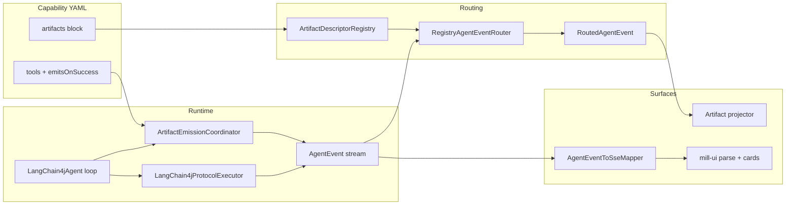

# Artifact foundation (v3 agentic runtime)

**Status:** Implemented (POC baseline)
**Audience:** Agents and developers extending chat artefacts, SSE structured parts, or persistence
**Modules:** `ai/mill-ai`, `ai/mill-ai-autoconfigure`, `ai/mill-ai-service`, `ai/mill-ai-persistence`, `ui/mill-ui`

Related docs:

| Document | Role |
|----------|------|
| [`artifact-emit-contract.md`](./artifact-emit-contract.md) | Original emit-contract decision record (WI-303–306) |
| [`chart-artifact-contract.md`](./chart-artifact-contract.md) | Canonical contract for renderer-agnostic `generated-chart` artifacts (WI-366) |
| [`v3-capability-manifest.md`](./v3-capability-manifest.md) | Capability YAML schema (tools, protocols, prompts) |
| [`ai-v3-chat-transport-extensions.md`](./ai-v3-chat-transport-extensions.md) | SSE wire model, mill-ui extension seam, per-reply views |
| [`chat-artefact-architecture.md`](../ai/chat-artefact-architecture.md) | Chat-type treatments, GET replay (`ArtifactWireMapper`), shared facet read-only layer |
| [`developer-manual/v3-developer-runtime-events-persistence.md`](./developer-manual/v3-developer-runtime-events-persistence.md) | Routed events, persistence lanes, observers |
| [`developer-manual/v3-developer-recipes.md`](./developer-manual/v3-developer-recipes.md) | Step recipes (tools, profiles, durable artifact types) |

---

## 1. What is an artifact?

In Mill v3, an **artifact** is a **structured, machine-readable payload** produced during an agent turn. Artifacts are distinct from conversational prose (`presentation: conversation`, `partType: text`).

Typical uses:

- **Generated SQL** — validated statement for host-side execution
- **Facet proposal** — metadata facet assignment candidate
- **Schema capture** — description/relation capture from schema authoring
- **Audit records** — e.g. `sql.validation` (persist only, not always chat-visible)

Artifacts flow through three concerns:

1. **Emission** — how runtime produces `AgentEvent.ProtocolFinal` or `AgentEvent.ToolResult`
2. **Routing & persistence** — registry maps events → `RoutedAgentEvent` → artifact store / pointers
3. **Chat stream & UI** — structured SSE parts → mill-ui cards

---

## 2. Single source of truth: `ArtifactDescriptor`

Every artifact kind is declared once in **capability YAML** under `artifacts:`.

Kotlin type: [`ArtifactDescriptor`](../../../ai/mill-ai/src/main/kotlin/io/qpointz/mill/ai/core/artifact/ArtifactDescriptor.kt)

Registry: [`ArtifactDescriptorRegistry`](../../../ai/mill-ai/src/main/kotlin/io/qpointz/mill/ai/core/artifact/ArtifactDescriptorRegistry.kt) — loaded from all capability manifests at startup (`loadDefault()`).

| Field | Purpose |
|-------|---------|
| `id` | Key within capability (e.g. `generated-sql`) |
| `capabilityId` | Owning capability (e.g. `sql-query`) |
| `protocolId` | Protocol for `protocol.final` routing (e.g. `sql-query.generated-sql`) |
| `artifactKind` | Logical kind in payloads (e.g. `generated-sql`, `facet-proposal`) |
| `persistKind` | Persistence bucket (e.g. `sql.generated`, `sql.validation`) |
| `pointerKeys` | Active pointer names updated on persist (e.g. `[last-sql]`) |
| `wirePartType` | SSE `partType` for chat stream (e.g. `sql`, `facet-proposal`) |
| `presentation` | SSE presentation (typically `structured`) |
| `protocolMode` | `STRUCTURED_FINAL` when a protocol is involved |
| `sourceEvent` | `tool.result` or `protocol.final` — which raw event the router matches |
| `emissionStrategy` | How runtime produces the artifact (see §3) |
| `destinations` | Routed lanes: `CHAT_STREAM`, `ARTIFACT`, `TELEMETRY`, … |

**Uniqueness rule:** `(persistKind, sourceEvent)` must be unique across all descriptors.

**Wire fallback:** If `wirePartType` is omitted, mappers use `artifactKind` as the SSE `partType` ([`AgentEventToSseMapper`](../../../ai/mill-ai/src/main/kotlin/io/qpointz/mill/ai/sse/AgentEventToSseMapper.kt), [`LangChain4jChatRuntime`](../../../ai/mill-ai-autoconfigure/src/main/kotlin/io/qpointz/mill/ai/autoconfigure/chat/LangChain4jChatRuntime.kt)). Prefer explicit `wirePartType` for stable client contracts.

Tool-level triggers (`emitsOnSuccess` on a tool) reference descriptor `id`:

```yaml
tools:
  validate_sql:
    emitsOnSuccess:
      artifact: generated-sql
      when:
        field: passed
        equals: true
```

---

## 3. Emission strategies

| Strategy | When | Producer | Model protocol call? |
|----------|------|----------|----------------------|
| **OnToolSuccess** | QUERY tool succeeds + trigger matches | [`ArtifactEmissionCoordinator`](../../../ai/mill-ai/src/main/kotlin/io/qpointz/mill/ai/runtime/langchain4j/ArtifactEmissionCoordinator.kt) synthesizes `ProtocolFinal` | **No** |
| **OnCaptureSuccess** | CAPTURE tool succeeds | [`LangChain4jProtocolExecutor`](../../../ai/mill-ai/src/main/kotlin/io/qpointz/mill/ai/runtime/langchain4j/LangChain4jProtocolExecutor.kt) | **Yes** (scripted step) |
| **FromToolResult** | Tool returns structured result | Router maps `ToolResult` directly | N/A |

### 3.1 OnToolSuccess (generated SQL)

**Problem solved:** `validate_sql` is a QUERY tool. The model often answers with prose SQL instead of invoking a protocol. Coordinator **constructs** `ProtocolFinal` when validation passes.

Flow:

1. Model calls `validate_sql`
2. Handler returns `{ artifactType: sql-validation, passed: true, normalizedSql: "..." }`
3. Coordinator matches `emitsOnSuccess` → builds `sql-query.generated-sql` payload
4. Router + SSE mapper emit structured chat part

**Guards:**

- Skip emit when `generated-sql` payload has blank `sql` (coordinator check)
- [`BackendSqlValidator`](../../../ai/mill-ai-data/src/main/kotlin/io/qpointz/mill/ai/data/sql/BackendSqlValidator.kt) must set `normalizedSql` on success; [`SqlQueryToolHandlers`](../../../ai/mill-ai/src/main/kotlin/io/qpointz/mill/ai/capabilities/sqlquery/SqlQueryToolHandlers.kt) falls back to input SQL

### 3.2 OnCaptureSuccess (facet, schema capture)

CAPTURE tools declare `kind: capture` and `protocol: …`. After successful capture, the protocol executor emits `ProtocolFinal` with the capture payload.

Examples:

- `propose_facet_assignment` → `metadata.faceting.capture` → `wirePartType: facet-proposal`
- Schema authoring capture tools → `facet-proposal` wire part (via [`FacetProposalWire`](../../../ai/mill-ai/src/main/kotlin/io/qpointz/mill/ai/core/artifact/FacetProposalWire.kt))

**Batch capture (`multi: true`):** protocols such as `metadata.faceting.capture` declare `multi: true` on the
structured-final manifest. The agent aggregates parallel successful CAPTURE tools into **one**
`AgentEvent.ProtocolFinal` envelope `{ results: [ … ] }` ([`ProtocolFinalBatch`](../../../ai/mill-ai/src/main/kotlin/io/qpointz/mill/ai/core/artifact/ProtocolFinalBatch.kt)).
Downstream fan-out:

- **Persistence** — [`StandardPersistenceProjector`](../../../ai/mill-ai/src/main/kotlin/io/qpointz/mill/ai/persistence/StandardPersistenceProjector.kt) writes **N** `ArtifactRecord` rows per turn and calls `attachArtifacts(turnId, allIds)` once; list pointers (`pointerCardinality: multiple`, e.g. `metadata-facet-proposals`) use [`ActiveArtifactPointerStore.appendAll`](../../../ai/mill-ai/src/main/kotlin/io/qpointz/mill/ai/persistence/ActiveArtifactPointerStore.kt).
- **SSE** — [`AgentEventToSseMapper`](../../../ai/mill-ai/src/main/kotlin/io/qpointz/mill/ai/sse/AgentEventToSseMapper.kt) emits **N** `item.part.updated` rows (first `replace`, rest `append`); `item.completed` sets `partType: multi`, `structuredPartCount`, and `partTypes[]` when N > 1.
- **GET replay** — N stored rows hydrate to N `TurnResponse.artifacts[]` entries in stable order (no composite wire blob).

Scalar (legacy) single-capture payloads normalize to `results` length 1.

### 3.3 FromToolResult (validation audit)

`sql-validation` emits a routed artifact envelope for telemetry; with **`persist: false`** it is **not** written to `ai_chat_artifact`. Router maps `ToolResult` with matching `artifactType`.

**No duplicate `sql.generated`:** When coordinator already emitted `ProtocolFinal` for generated SQL, router must not also promote a tool-result row to `sql.generated`.

---

## 4. End-to-end pipeline



**Correlation:** All SSE events for one assistant reply share the same `itemId`. Text deltas use V1 conversation parts; structured artifacts use `presentation: structured`.

---

## 5. Implemented POC artifacts

| Descriptor | Capability | `wirePartType` | `persistKind` | `persist` | Emission | Chat stream | Profiles |
|------------|------------|----------------|---------------|-----------|----------|-------------|----------|
| `generated-sql` | `sql-query` | `sql` | `sql.generated` | yes | OnToolSuccess | Yes | `data-analysis`, `schema-authoring` |
| `sql-validation` | `sql-query` | — | `sql.validation` | **no** | FromToolResult | No | same |
| `sql-result` | `sql-query` | — | `sql.result` | **no** (tool path) | FromToolResult | Yes | same |
| `inferred-facet` | `metadata-authoring` | `facet-proposal` | `metadata.faceting.capture` | yes | OnCaptureSuccess | Yes | `schema-authoring` |
| schema capture | `schema-authoring` | `facet-proposal` | `schema.authoring.capture` | yes | OnCaptureSuccess | Yes | `schema-authoring` |

Client-attached execution results (`POST …/execution-result`) remain **durable** `sql.result` rows regardless of the tool descriptor `persist` flag.

Manifest sources:

- [`sql-query.yaml`](../../../ai/mill-ai/src/main/resources/capabilities/sql-query.yaml)
- [`metadata-authoring.yaml`](../../../ai/mill-ai/src/main/resources/capabilities/metadata-authoring.yaml)
- [`schema-authoring.yaml`](../../../ai/mill-ai/src/main/resources/capabilities/schema-authoring.yaml)

### Profile gating

Profiles select **`capabilityIds` only** — no per-profile artifact tables.

| Profile | Capabilities | Artifacts in chat |
|---------|--------------|-------------------|
| `hello-world` | `conversation` | None |
| `data-analysis` | `conversation`, `schema`, `metadata`, `sql-dialect`, `sql-query` | SQL only |
| `schema-exploration` | read-only schema/metadata/sql | None (no authoring) |
| `schema-authoring` | above + `schema-authoring`, `metadata-authoring` | SQL + facet + schema capture |

Profile definitions: [`ai/mill-ai/src/main/kotlin/io/qpointz/mill/ai/profile/`](../../../ai/mill-ai/src/main/kotlin/io/qpointz/mill/ai/profile/)

**UI default:** new general chats use `data-analysis` ([`DEFAULT_GENERAL_CHAT_AGENT_PROFILE_ID`](../../../ui/mill-ui/src/features/chatPreferences.ts)).

---

## 6. SSE wire contract

Event type: `item.part.updated` with `presentation: structured`.

| Field | Role |
|-------|------|
| `itemId` | Assistant item correlation |
| `partType` | From descriptor `wirePartType` (or `artifactKind` fallback) |
| `presentation` | `structured` |
| `mode` | Typically `append` |
| `content` | **JSON string** — single serialised object |

Mapper: [`AgentEventToSseMapper`](../../../ai/mill-ai/src/main/kotlin/io/qpointz/mill/ai/sse/AgentEventToSseMapper.kt)

End-of-turn hint: `item.completed` repeats the last structured `presentation` / `partType` pair for layout routing without re-scanning all parts.

**V1 safety:** Clients that only handle conversation text must ignore unknown structured parts without aborting the stream.

---

## 7. mill-ui integration

### 7.1 Parse path

[`parseChatStructuredPart`](../../../ui/mill-ui/src/utils/chatArtifactParse.ts):

1. Parse `content` JSON
2. Infer kind from payload shape (`sql`, `facet-proposal`) or declared `partType`
3. Fallback: **`unknown`** card for any other `presentation: structured` payload

Types: [`ChatMessageArtifact`](../../../ui/mill-ui/src/types/chat.ts)

### 7.2 Layout routing

[`deriveAssistantReplyView`](../../../ui/mill-ui/src/utils/assistantReplyView.ts) precedence (client-only; GET omits `assistantReplyView`):

1. `facet-primary` if `facet-proposal` artifact present
2. **`chart-primary`** if `chart` artifact present ([`chart-reply-view.md`](./charts/chart-reply-view.md))
3. `sql-primary` if SQL/data present (no chart)
4. `artifact-primary` if unknown structured artifact present
5. else `conversation`

(`schema-primary` remains in the wire enum for backward compatibility but is not assigned for new turns.)

Router: [`AssistantReplyRouter`](../../../ui/mill-ui/src/components/chat/AssistantReplyRouter.tsx) → [`ArtifactCard`](../../../ui/mill-ui/src/components/chat/artifacts/ArtifactCard.tsx) (inline hosts) or [`MessageArtifactComposer`](../../../ui/mill-ui/src/components/chat/artifactPreview/MessageArtifactComposer.tsx) (`general`).

| `kind` | Component |
|--------|-----------|
| `sql` | `SqlArtifactCard`; **`SqlDataCondensedPreview`** on **`general`** |
| `facet-proposal` | **`FacetCondensedPreview`** on **`general`** (and configured inline hosts); `FacetProposalArtifactCard` elsewhere |
| `unknown` | `UnknownArtifactCard` (JSON preview) |

**Shared read-only facet body:** `FacetCondensedPreview` delegates field rendering to
[`FacetReadOnlyBody`](../../../ui/mill-ui/src/components/data-model/facets/FacetReadOnlyBody.tsx) —
the same module used by Data Model `EntityDetails`. See
[`chat-artefact-architecture.md`](../ai/chat-artefact-architecture.md) §7.1 and
[`model-view-facet-boxes.md`](../metadata/model-view-facet-boxes.md).

### 7.3 Live vs GET replay

| Phase | Artifacts |
|-------|-----------|
| **Live SSE** | Parsed via `parseChatStructuredPart` and attached to in-memory `Message.artifacts` |
| **GET transcript** | Rehydrated from persistence: [`ArtifactWireMapper`](../../../ai/mill-ai-service/src/main/kotlin/io/qpointz/mill/ai/service/ArtifactWireMapper.kt) maps `persistKind` → wire `kind` (`sql`, `data`, `facet-proposal`); client [`parseWireArtifacts`](../../../ui/mill-ui/src/utils/artifactWireParse.ts) in `turnToMessage` |

Replay `assistantReplyView` is derived client-side from wire artefacts. Unmapped persist kinds are omitted from `TurnResponse.artifacts` until wire mapping is added.

---

## 8. Checklist: add a new structured chat artifact

Work top-down; skip steps that do not apply.

### Backend

1. **Capability YAML** — add `artifacts:` entry with `persistKind`, `wirePartType`, `presentation: structured`, `sourceEvent`, `emissionStrategy`, `destinations`
2. **Protocol** (if OnCaptureSuccess) — declare `protocols:` + `finalSchema`; bind CAPTURE tool with `kind: capture` and `protocol: …`
3. **Tool trigger** (if OnToolSuccess) — add `emitsOnSuccess` on the producing tool; implement payload construction in coordinator if not generic map passthrough
4. **Handler** — return structured maps (not stringified JSON); include stable `artifactType` where applicable
5. **Profile** — add capability id to relevant [`AgentProfile`](../../../ai/mill-ai/src/main/kotlin/io/qpointz/mill/ai/profile/ProfileRegistry.kt) if new capability
6. **Tests**
   - `ArtifactDescriptorRegistryTest` — descriptor loads, no duplicate keys
   - `ArtifactEmissionCoordinatorTest` — emit / skip conditions
   - `ChatSseEventTypesTest` / mapper tests — `partType` + JSON shape
   - Scenario pack under `ai/mill-ai-test/src/testIT/resources/scenarios/artifact-emit/` (optional but preferred for acceptance)

### UI

1. Extend `ChatMessageArtifact` union in `chat.ts`
2. Add parse branch in `chatArtifactParse.ts` (live SSE) and `artifactWireParse.ts` (GET replay)
3. For facet-shaped payloads, use [`FacetCondensedPreview`](../../../ui/mill-ui/src/components/chat/artifactPreview/FacetCondensedPreview.tsx) + shared [`FacetReadOnlyBody`](../../../ui/mill-ui/src/components/data-model/facets/FacetReadOnlyBody.tsx); normalize schema capture shapes in [`FacetProposalWire`](../../../ai/mill-ai/src/main/kotlin/io/qpointz/mill/ai/core/artifact/FacetProposalWire.kt) / [`facetWireNormalize.ts`](../../../ui/mill-ui/src/utils/facetWireNormalize.ts) at wire boundaries
4. Otherwise add card under `components/chat/artifacts/` and register in `ArtifactCard`
5. Wire `deriveAssistantReplyView` + `chatArtifactTreatments` / `artifactGroups.ts` for `general` condensed preview
6. Vitest: `chatArtifactParse.test.ts`, `artifactWireParse.test.ts`, `assistantReplyView.test.ts`

### Persistence (optional, for reload parity)

1. Ensure router sends artifact to `ARTIFACT` destination
2. Projector writes `persistKind`
3. Add mapping in [`ArtifactWireMapper`](../../../ai/mill-ai-service/src/main/kotlin/io/qpointz/mill/ai/service/ArtifactWireMapper.kt); expose on `GET /api/v1/ai/chats/{id}` with `assistantReplyView`

---

## 9. Acceptance & regression

Scenario harness: [`ai/mill-ai-test`](../../../ai/mill-ai-test/)

- Packs: `src/testIT/resources/scenarios/artifact-emit/*.yml`
- Runner: `ArtifactEmitScenariosIT`
- Baselines: `src/testIT/resources/scenarios/baselines/*.record.normalized.json`
- Shape checks: artifact kinds, SSE `partType`, no facet on `data-analysis` negative pack
- **Chart packs (WI-369):** scripted chart emit scenarios — see [`charts/chart-test-proof-strategy.md`](./charts/chart-test-proof-strategy.md)
- **Live → scripted:** `GET /api/v1/ai/chats/{id}/scenario-export` when `mill.ai.chat.scenario-capture.enabled=true`

Service smoke: [`AiChatControllerIT`](../../../ai/mill-ai-service/src/testIT/kotlin/io/qpointz/mill/ai/service/AiChatControllerIT.kt) — profile list includes `data-analysis`, structured SSE smoke.

---

## 10. Key source index

| Concern | Location |
|---------|----------|
| Descriptor model | `ai/mill-ai/.../core/artifact/` |
| Coordinator | `ai/mill-ai/.../runtime/langchain4j/ArtifactEmissionCoordinator.kt` |
| Event router | `ai/mill-ai/.../runtime/events/AgentEventRouter.kt`, `RegistryAgentEventRouter` |
| SSE mapping | `ai/mill-ai/.../sse/AgentEventToSseMapper.kt` |
| Chat runtime bridge | `ai/mill-ai-autoconfigure/.../LangChain4jChatRuntime.kt` |
| HTTP + SSE service | `ai/mill-ai-service/` |
| GET wire mapping | `ai/mill-ai-service/.../ArtifactWireMapper.kt` |
| UI parse + views | `ui/mill-ui/src/utils/chatArtifactParse.ts`, `artifactWireParse.ts`, `assistantReplyView.ts` |
| UI cards + condensed preview | `ui/mill-ui/src/components/chat/artifacts/`, `artifactPreview/` |
| Shared facet read-only | `ui/mill-ui/src/components/data-model/facets/` |
| Default UI profile | `ui/mill-ui/src/features/chatPreferences.ts` |

---

## 11. Known gaps (follow-ups)

- **`sql-result` / chart** — descriptors stubbed or persist-only; limited chat cards
- **Execute SQL action** — host-side API not wired from SQL card
- **Server default profile** — still `hello-world` in `mill.ai.chat.default-profile`; UI sends `data-analysis` explicitly
- **Legacy split SQL + chart** — `sql.generated` / `chart.generated` replay via `QueryArtifactPersistence` and legacy protocol descriptors; new turns emit `query.generated` only

Label backlog items in [`ai-v3-chat-transport-extensions.md`](./ai-v3-chat-transport-extensions.md) when naming new `partType`s.

---

## 12. Unified query artifact (implemented 2026-07-02)

**Problem:** `generated-sql` + `generated-chart` as separate durable rows did not scale to multiple
panel types or SQL analytics (EXPLAIN, lineage).

**Locked follow-up direction:** One `generated-query` per SQL statement (`persistKind: query.generated`, pointer
`last-query`) with:

- **`presentations[]`** — UI panels (`grid` always server-injected; `chart` from chart-mapping)
- **`attachments[]`** — non-LLM facts (explain plan, lineage) referenced by presentations (WI-374–375)

Capabilities stay separate; emission and persistence unify. Row data remains `sql.result` at runtime.
Target wire: single SSE/GET `partType: query`. Target UI: `parseQueryArtifactPayload` -> one composite card.

Full contract: [`query-artifact-presentations.md`](./query-artifact-presentations.md)

**Legacy replay target:** `ArtifactDescriptorRegistry` retains `sql-query.generated-sql` and
`chart-mapping.generated-chart` descriptors; `QueryArtifactPersistence` normalizes old rows to
`generated-query` wire shape.
