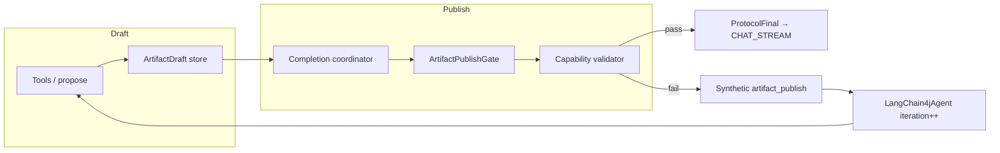

# Artifact publish validation

**Status:** Planned — implementation tracked in
[`docs/workitems/planned/artifact-publish-validation/`](../../workitems/planned/artifact-publish-validation/STORY.md).

**Related:** [`artifact-foundation.md`](./artifact-foundation.md),
[`artifact-emit-contract.md`](./artifact-emit-contract.md),
[`generated-sql-artifact-context.md`](./generated-sql-artifact-context.md)

---

## Summary

Mill's agentic runtime must guarantee that **host-actionable artifacts** (SQL strips, facet proposals,
chart finals) only reach **CHAT_STREAM** or durable **ARTIFACT** storage after **deterministic**
validation by the **owning capability**. The LLM drafts; the runtime publishes.

This document is the normative contract for:

- the **publish gate** (runtime)
- the **validator SPI** (capabilities)
- the **correction loop** (runtime-owned retries)
- the split between **diagnostic** and **publishable** artifact kinds

---

## Motivation

### Failure mode today

Capability YAML and prompts instruct the model to:

1. Call `validate_sql` (or similar).
2. Retry up to three times on failure.
3. Emit structured finals only when validation passed.

`SqlArtifactCompletionCoordinator` gates `generated-sql` emission on the **last tool result's**
`passed` flag. That makes the **model** the validation authority. Prompt non-compliance, mock UI,
and test shortcuts can surface actionable SQL without a platform invariant.

### Required invariant

> **Publish invariant:** If a publishable artifact appears in CHAT_STREAM or durable ARTIFACT for a
> turn, it passed the owning capability's publish validator in that turn.

Enforcement belongs in **code** at publish time, not in prompt prose.

---

## Terminology

| Term | Definition |
|------|------------|
| **Draft** | Turn-scoped candidate payload; not visible as a structured chat strip |
| **Publish** | Emission of `ProtocolFinal`, `StructuredPart`, or durable artifact row |
| **Publishable descriptor** | `ArtifactDescriptor` with `destinations` containing `CHAT_STREAM` and/or `ARTIFACT` |
| **Diagnostic descriptor** | `destinations: []` — tool feedback only (e.g. `sql-validation`) |
| **Validator key** | Qualified id `{capabilityId}.{descriptorId}` (primary lookup) |
| **Publish gate** | Runtime component invoking validators before publish |
| **`artifact_publish`** | Virtual tool name for synthetic rejection messages in the agent loop |

---

## Architecture

### Layered responsibilities

```text
┌─────────────────────────────────────────────────────────────┐
│ Capability (sql-query, metadata-authoring, chart-mapping)   │
│  - ArtifactPublishValidator implementations                 │
│  - Domain rules: parse SQL, facet shape, chart binding      │
└───────────────────────────┬─────────────────────────────────┘
                            │ register by key
┌───────────────────────────▼─────────────────────────────────┐
│ Runtime (mill-ai)                                           │
│  - ArtifactPublishValidatorRegistry                         │
│  - ArtifactPublishGate.tryPublish()                       │
│  - Completion coordinators (draft → finalize)               │
│  - LangChain4jAgent correction loop                         │
└───────────────────────────┬─────────────────────────────────┘
                            │ SSE / persistence
┌───────────────────────────▼─────────────────────────────────┐
│ Consumers (mill-ui, MCP, future hosts)                        │
│  - Assume published structured parts are validator-approved   │
└───────────────────────────────────────────────────────────────┘
```

### Emission pipeline (target)



---

## Publishable artifact catalog

Initial gated descriptors (from capability YAML). See
[`GAPS.md`](../../workitems/planned/artifact-publish-validation/GAPS.md) for open scope questions
on `sql-description` / `sql-result`.

| Qualified key | capabilityId | descriptorId | persistKind | wirePartType | destinations |
|---------------|--------------|--------------|-------------|--------------|--------------|
| `sql-query.generated-sql` | sql-query | generated-sql | sql.generated | sql | CHAT_STREAM, ARTIFACT |
| `sql-query.sql-description` | sql-query | sql-description | sql.description | — | CHAT_STREAM |
| `sql-query.sql-result` | sql-query | sql-result | sql.result | data | CHAT_STREAM |
| `metadata-authoring.inferred-facet` | metadata-authoring | inferred-facet | metadata.faceting.capture | facet-proposal | CHAT_STREAM, ARTIFACT |

**Diagnostic (not gated for chat):**

| artifactKind | destinations | Role |
|--------------|--------------|------|
| `sql-validation` | `[]` | Optional model feedback |
| `chart-validation` | `[]` | Optional model feedback |

Chart visualization payloads embedded in SQL finals are validated at publish time via chart-mapping
rules (WI-398).

---

## Validator SPI

### Interface

```kotlin
interface ArtifactPublishValidator {
    fun keys(): Set<ArtifactValidatorKey>
    fun validate(request: ArtifactPublishValidationRequest): ArtifactPublishValidationResult
}
```

### Key resolution

1. `capabilityId.descriptorId` (primary)
2. `persistKind` (secondary)
3. `artifactKind` (fallback if globally unique)

### Request / result

```kotlin
data class ArtifactPublishValidationRequest(
    val key: ArtifactValidatorKey,
    val descriptor: ArtifactDescriptor,
    val draftPayload: Map<String, Any?>,
    val attempt: Int,
    val context: AgentContext,
)

data class ArtifactPublishValidationResult(
    val passed: Boolean,
    val message: String? = null,
    val fieldErrors: Map<String, String> = emptyMap(),
    val normalizedPayload: Map<String, Any?>? = null,
    val warnings: List<String> = emptyList(),
)
```

### Registry rules

- Capabilities register validators through `CapabilityDependencyContainer` / Spring assembler.
- **Missing validator** for a publishable descriptor → **fail closed** (block publish + log/metric).
- Validators are **stateless**; draft state is turn-scoped in coordinators.

### Published payload

On `passed == true`, the wire body uses **`normalizedPayload`** from the validator as canonical
(e.g. normalized SQL, trimmed title/description).

Optional metadata on published artifacts (backward-compatible):

- `validation.warnings` — non-blocking capability warnings
- Implicit `validation.passed: true` (only published artifacts exist)

---

## Publish gate

### `ArtifactPublishGate`

```kotlin
sealed class PublishOutcome {
    data class Approved(val normalizedPayload: Map<String, Any?>) : PublishOutcome()
    data class Rejected(val result: ArtifactPublishValidationResult, val attempt: Int) : PublishOutcome()
    data class Exhausted(val last: ArtifactPublishValidationResult) : PublishOutcome()
}

interface ArtifactPublishGate {
    fun tryPublish(
        key: ArtifactValidatorKey,
        descriptor: ArtifactDescriptor,
        draft: Map<String, Any?>,
        context: AgentContext,
        attemptState: PublishAttemptState,
    ): PublishOutcome
}
```

### Integration points

| Component | Change |
|-----------|--------|
| `SqlArtifactCompletionCoordinator` | Finalize via gate; stop trusting `validate_sql.passed` |
| Other coordinators emitting `ProtocolFinal` | Same gate hook |
| `LangChain4jChatRuntime` | No change if gate runs before `ProtocolFinal` |
| Tool-result routing to CHAT_STREAM | Must route through gate for publishable kinds |

### Bypass policy

No production bypass. Test-only flags (if any) must be explicit, off by default, and documented in
test utilities — never in capability YAML.

---

## Draft vs publish

| Phase | Owner | Chat-visible |
|-------|--------|--------------|
| Compose / propose | LLM + tools | No |
| Merge into draft | Completion coordinator | No |
| **Validate** | Publish gate + capability | No |
| **Publish** | Runtime (`ProtocolFinal`) | Yes |

Model tools (`validate_sql`, `validate_chart_spec`) may remain as **draft helpers** but must not be
documented as publish authorities (WI-399).

---

## Correction loop

### Trigger

`PublishOutcome.Rejected` — validator returned `passed: false`.

### Actions

1. Do **not** emit `ProtocolFinal` / structured SSE part.
2. Increment `PublishAttemptState.attempt` for the validator key.
3. If `attempt > maxPublishAttempts` (default **3**) → `Exhausted`: terminal assistant prose with
   last `message`; **no strip**.
4. Else append synthetic `ToolExecutionResultMessage`:

```json
{
  "artifactKey": "sql-query.generated-sql",
  "passed": false,
  "attempt": 2,
  "message": "Syntax error near FROM",
  "fieldErrors": { "sql": "..." }
}
```

- Virtual tool id: **`artifact_publish`**
- Reuses existing `LangChain4jAgent` `iteration++` path

### Hard ceiling

Existing `maxIterations` (20) on `LangChain4jAgent` remains the outer bound.

### Consumer visibility

| Event | Structured strip |
|-------|------------------|
| Rejection / synthetic tool | Never |
| Approved publish | Yes |
| Exhausted | Prose error only |

Profile (`data-analysis`, `analysis-copilot`) and surface (inline, General Chat) do not alter this
table.

---

## Capability validator mapping (initial)

| Capability | Key | Implementation notes |
|------------|-----|----------------------|
| sql-query | `sql-query.generated-sql` | `BackendSqlValidator`, dialect normalizer, title/description per `generated-sql-artifact-context.md` |
| metadata-authoring | `metadata-authoring.inferred-facet` | Facet type, entity id, serialized payload shape |
| chart-mapping | (SQL final visualizations) | Column binding vs trusted schema; rules from `chart-artifact-contract.md` |

Detailed implementation: WI-398.

---

## Migration from model-owned validation

### SQL path

**Before:** `handleValidateSql` creates completion plan when tool `passed == true`.

**After:**

1. Draft from propose / merge tools regardless of `validate_sql`.
2. On plan finalize → `ArtifactPublishGate.tryPublish(sql-query.generated-sql, draft)`.
3. `validate_sql` optional or deprecated (WI-399).

### Prompts

Remove:

- "never skip validate_sql"
- "retry up to 3 times"
- "emit SQL only after validate_sql passes"

Replace with draft-oriented guidance and `artifact_publish` revision behavior (WI-399).

### Tests

Update scenarios that assert model-driven validation. Add regression: invalid draft → no strip →
revision → valid publish.

### Mock UI

`mill-ui` mock chat is not gate-faithful by default; document in public docs. Client stub optional
(GAP-3).

---

## Non-goals

- UI strip layout changes
- Full semantic SQL (beyond capability-defined checks)
- Out-of-process validation services
- User-visible "draft failed validation" strips

---

## Verification

```bash
cd ai && ./gradlew :mill-ai:test :mill-ai:testIT
cd ai && ./gradlew :mill-ai-service:testIT
```

**Acceptance:**

- Invalid SQL draft never produces `item.part.updated` with `partType: sql` until gate passes.
- Same behavior across profiles sharing `sql-query`.
- Missing validator blocks publish (fail closed).

---

## Work items

| WI | Deliverable |
|----|-------------|
| WI-397 | SPI, gate, correction loop, SQL coordinator hook, design doc (this file) |
| WI-398 | Capability validators + Spring wiring |
| WI-399 | Prompt/tool cleanup, scenarios, public docs |

Story tracker: [`STORY.md`](../../workitems/planned/artifact-publish-validation/STORY.md).
