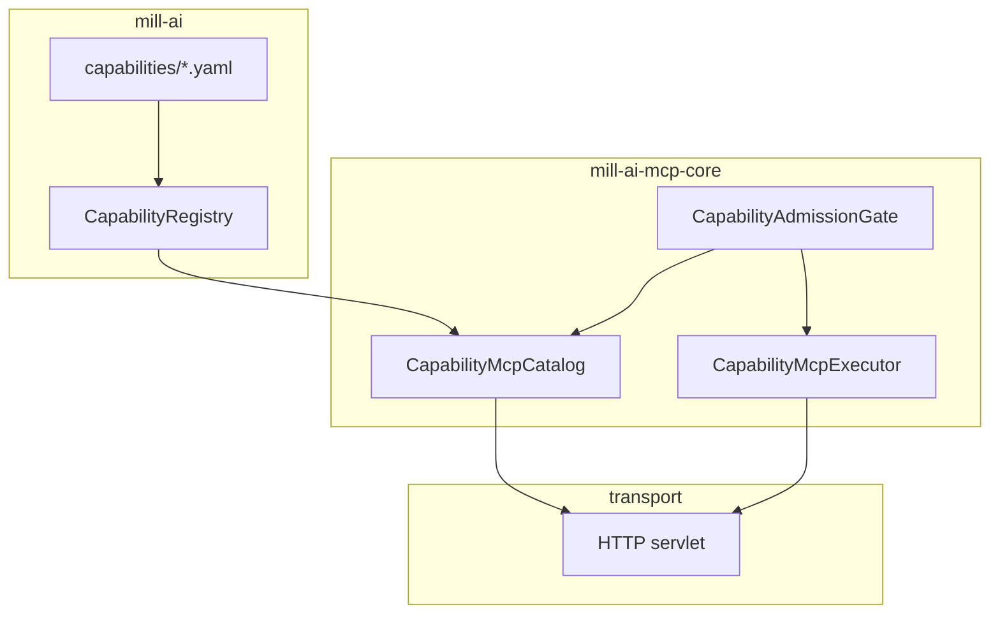
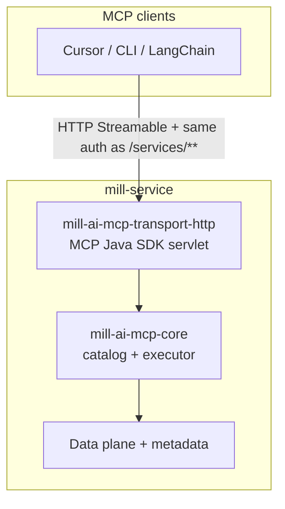
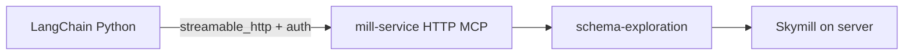

# Agentic Runtime v3 — MCP Capability Exposure

**Status:** Designed (closed **2026-06-22**: [`docs/workitems/completed/20260622-ai-v3-mcp-server-poc/`](../../workitems/completed/20260622-ai-v3-mcp-server-poc/STORY.md))  
**Delivery:** WI-325–WI-327, WI-329, WI-330 shipped; **WI-328** (stdio bridge) → backlog **A-96**.
**Date:** June 22, 2026  
**Backlog:** [A-56](../../workitems/BACKLOG.md), [A-31](../../workitems/BACKLOG.md)  
**Baseline:** [v3-foundation-decisions.md](./v3-foundation-decisions.md) §3.4–3.7

---

## 1. Purpose

Expose the v3 **AI capability registry** as a [Model Context Protocol](https://modelcontextprotocol.io/)
(MCP) server so external agents (Cursor, LangChain Python, other MCP clients) can discover and
invoke Mill capabilities without embedding the in-process `LangChain4jAgent` runtime.

This document is the **implementation guide** for backlog **A-56**. Strategic rationale lives in
[v3-foundation-decisions.md](./v3-foundation-decisions.md).

---

## 2. Architectural rules (locked)

| Rule | Detail |
|------|--------|
| **Single extension path** | New MCP tools, prompts, and resources = new `CapabilityProvider` + YAML manifest in `mill-ai`. No parallel MCP tool catalog. |
| **P-10 alignment** | Platform data-plane MCP ([`docs/design/platform/mcp.md`](../platform/mcp.md)) is **not** implemented as bespoke MCP. Missing behaviours become AI capabilities first; they then appear in MCP automatically. |
| **Core + transport split** | `mill-ai-mcp-core` is framework-free; **HTTP transport** depends on core + MCP Java SDK. Optional **stdio bridge** (backlog **A-96** / WI-328) would be MCP Java SDK only — pure protocol proxy to HTTP |
| **MCP Java SDK only** | Protocol wire via `io.modelcontextprotocol.sdk:mcp` (BOM) on all story MCP modules |
| **Projection, not duplication** | MCP maps existing `CapabilityRegistry` assets. Capability handler tests stay in `mill-ai`; MCP tests cover catalog, filters, and wire invocation. |
| **SQL execution** | `sql-query` exposes `validate_sql` only. SQL execution remains host-side (unchanged v3 rule). |

---

## 3. Module layout

| Module | Depends on | Role |
|--------|------------|------|
| `ai/mill-ai-mcp-core` | `mill-ai` | `CapabilityMcpCatalog`, `CapabilityMcpExecutor`, `CapabilityAdmissionGate`, `ExternalCapabilityAssetDescriptor` |
| `ai/mill-ai-mcp-transport-http` | core, MCP Java SDK servlet, Spring Boot | Authoritative HTTP MCP on mill-service; **`McpServiceDescriptor`** (`ai-mcp`) in well-known |
| `ai/mill-ai-mcp-transport-stdio` | MCP Java SDK | **Backlog A-96** — local stdio bridge → remote HTTP MCP (not in POC delivery) |



**Deferred (A-96):** `mill-ai-mcp-transport-stdio` — optional local stdio façade forwarding to HTTPt.

---

## 4. MCP asset mapping

Per [v3-foundation-decisions.md](./v3-foundation-decisions.md) §3.6:

| Mill asset | MCP surface | Identifier |
|------------|-------------|------------|
| Capability descriptor | Resource | `mill://capabilities/{capabilityId}` |
| Tool | MCP tool | `{capabilityId}.{toolName}` |
| Prompt | MCP prompt | `{capabilityId}/{promptId}` |
| Protocol | Resource | `mill://capabilities/{capabilityId}/protocols/{protocolId}` |
| Artifact schema | Resource | `mill://artifacts/{kind}` |

Tool input/output schemas come from the capability manifest / `ToolBinding.spec` (LangChain4j JSON
schema). **MCP wire:** `tools/list` tool registration exposes **input** parameters only; **output**
schema is carried on `ExternalCapabilityAssetDescriptor.Tool` resources (WI-326) when manifests
declare `output:` blocks. Protocol and prompt resources carry
[WI-326](../../workitems/completed/20260622-ai-v3-mcp-server-poc/WI-326-external-capability-asset-descriptors.md) descriptor metadata.

---

## 5. Exposure filter pipeline

MCP **listing and invocation** share the same exposure set. `CapabilityMcpCatalog` builds the exposed
tool/prompt/resource index; `CapabilityMcpExecutor` resolves `tools/call` **only** against that index
(catalog-scoped resolver). Clients cannot bypass profile or allowlist filters by guessing a tool name.

MCP catalog building applies filters in order:

1. **`CapabilityRegistry`** — all `ServiceLoader`-discovered providers (or injected registry in tests)
2. **`mcp.enabled`** (manifest) — drop capabilities opted out in YAML (default `true`). Controls the
   **entire** capability including QUERY and CAPTURE tools (see §15 tool inventory).
3. **`mill.ai.mcp.capabilities`** (server, optional) — when **absent or empty**, no server allowlist
   (all capabilities that passed step 2 remain eligible). When **non-empty**, only listed capability
   ids are exposed; new/unknown capabilities are **not** exposed until explicitly added (actuator-style
   allowlist — secure-by-default when ops tighten configuration).
4. **`AgentProfile`** (optional) — expose only `profile.capabilityIds` when server is configured via `mill.ai.mcp.profile` (mill-service or test fixture)
5. **`CapabilityAdmissionGate`** — stub in POC; align with backlog **A-79** later

In-process agent profiles and `LangChain4jAgent` are **not** affected by MCP filters.

### 5.1 Server capability allowlist

| `mill.ai.mcp.capabilities` | Behaviour |
|----------------------------|-----------|
| absent or `[]` | No server allowlist — all capabilities passing `mcp.enabled` are eligible |
| `["schema", "demo"]` | **Only** listed ids exposed; anything else blocked even if `mcp.enabled: true` |

Configured on the **HTTP MCP backend** (mill-service). A future stdio bridge would not re-apply allowlist.

**Not** using an exclude list — operators who want restriction must **explicitly allow** capability ids.

### 5.3 Catalog construction vs execution (locked)

`Capability.tools` exist only on a **materialized** `Capability` instance (`CapabilityProvider.create`
with `AgentContext` + `CapabilityDependencies`). Providers such as `schema` require ports at
`create()` time — the catalog **must not** instantiate capabilities to build `tools/list`.

| Phase | Data source | Dependencies required? |
|-------|-------------|------------------------|
| **Catalog** (`tools/list`, prompts, resources) | `CapabilityRegistry.allDescriptors()` + **manifest-level** metadata from `CapabilityManifest.load("capabilities/{capabilityId}.yaml")` | **No** — YAML declares tool names, descriptions, input/output schemas, `kind`, prompts, protocols |
| **Execution** (`tools/call`) | `registry.provider(id).create(context, dependencies)` → `ToolBinding.handler` | **Yes** — transport assembles `CapabilityDependencies` (e.g. `SpringCapabilityDependencyAssembler` on mill-service) |

**Manifest convention:** classpath resource `capabilities/{capabilityId}.yaml` where `name:` matches
the provider's `CapabilityDescriptor.id` (same pattern as existing capability classes).

**mill-ai API (WI-327):** extend `CapabilityManifest` with manifest-only accessors (e.g.
`declaredTools()` returning input **and** output schemas from YAML, existing `allPrompts` /
`allProtocols`) so MCP catalog builds `ExternalCapabilityAssetDescriptor` / MCP tool specs **without**
handlers. MCP tool registration uses input schema only; output schema populates
`ExternalCapabilityAssetDescriptor.Tool`. Handlers remain imperative in capability classes; only
invoke path touches `create()`.

`CapabilityMcpCatalog` is constructed from `CapabilityRegistry` + exposure config + profile; it
loads manifests per eligible capability id. `CapabilityMcpExecutor` shares the same exposure index
and receives `AgentContext` + `CapabilityDependencies` for each invocation.

### 5.2 Transport architecture (locked)

**Authoritative transport:** HTTP Streamable MCP on mill-service. Clients connect directly when they
support Streamable HTTP (Cursor 0.48+, LangChain `streamable_http`, etc.).



| Transport | Module | Role |
|-----------|--------|------|
| **HTTP (Streamable)** | `mill-ai-mcp-transport-http` | **Authoritative** MCP on mill-service; MCP Java SDK servlet + `mill-ai-mcp-core` |
| **stdio bridge** (deferred) | `mill-ai-mcp-transport-stdio` | Backlog **A-96** — local façade; would forward MCP to remote HTTP; no local capability execution |

**Security (POC):** HTTP MCP uses the **same authentication** as other `/services/**` providers
(`/services/jet`, `/services/export`) when `mill.security.enable=true`. A future stdio bridge would
forward credentials. RBAC remains admission stub.

**Endpoint path:** The MCP spec requires **one** HTTP endpoint URL but does **not** mandate `/mcp`
— that path appears in the spec as an **example** (`https://example.com/mcp`). Mill default:
**`/services/mcp`** — same **provider namespace** as [`/services/jet`](../../../services/mill-data-http-service),
[`/services/export`](../../../services/mill-export-service) (see
[`export-service.md`](../platform/export-service.md)). Secured by
[`ServicesSecurityConfiguration`](../../../security/mill-security-autoconfigure/src/main/java/io/qpointz/mill/security/configuration/ServicesSecurityConfiguration.java)
when `mill.security.enable=true`.

**Why `/services` not `/api/v1/ai`:** `/api/**` is the **application REST** surface (chat CRUD/SSE for
mill-ui). `/services/**` is the **machine-facing provider** surface (data plane, export, protocol
adapters). MCP is an agent protocol provider, not a chat UI API — it belongs with jet/export.

**Discovery:** **`McpServiceDescriptor`** (`name`: **`ai-mcp`**) appears under **`services`** in
**`/.well-known/mill`** when `mill.ai.mcp.enabled=true`. No **`connections`** entry — that bucket is
for JDBC/Python data-plane clients only; MCP hosts configure the Streamable HTTP URL directly.

**Stack alignment:** v3 **agent runtime** = LangChain4j (`LangChain4jAgent`). MCP **protocol exposure**
= **MCP Java SDK** (`io.modelcontextprotocol.sdk:mcp`). LangChain4j MCP types are **client-side**
(agents consuming external MCP tools); out of scope for this story's server transport.

## 6. Capability manifest: `mcp:` block

Declared in each capability YAML under `src/main/resources/capabilities/`. See
[v3-capability-manifest.md](./v3-capability-manifest.md) §3.1.

```yaml
name: schema
description: Read-only schema exploration.

mcp:
  enabled: true    # default when `mcp:` block omitted

prompts:
  ...
tools:
  ...
```

| Field | Default | Meaning |
|-------|---------|---------|
| `mcp.enabled` | `true` | When `false`, entire capability hidden from MCP (all tools, prompts, protocols). When `true`, **all** manifest tools are exposed including `kind: capture` (see §15). |

**Guidance (deployment, not repo default yet):** consider `mcp.enabled: false` on authoring
capabilities for public MCP. **Do not** change `schema-authoring` / `metadata-authoring` manifests
until explicitly decided — keep `mcp.enabled` default `true` in repo for now.

**Reserved** (document only; not implemented in POC):

```yaml
mcp:
  enabled: true
  # requireAuth: ...      # future per-capability auth tags
  # rateLimit: ...        # future rate limiting hints
```

Kotlin: `CapabilityMcpSettings(enabled: Boolean = true)` on `CapabilityManifest` and
`CapabilityDescriptor.mcp`.

---

## 7. Tool invocation flow

```
MCP client: tools/call(name="schema.list_tables", arguments={...})
  │
  ├─► CapabilityMcpExecutor (catalog-scoped)
  │     ├─ Reject if tool not in exposed catalog index (profile / allowlist / mcp.enabled)
  │     ├─ Parse namespaced name → capabilityId="schema", toolName="list_tables"
  │     ├─► CapabilityAdmissionGate.authorizeTool(...)
  │     ├─ registry.provider("schema").create(context, dependencies)
  │     ├─ find ToolBinding by toolName
  │     └─ handler(ToolRequest(arguments)) → ToolResult
  └─► Return structured JSON to MCP client
```

Transport adapters construct **one** `CapabilityMcpCatalog` + matching `CapabilityMcpExecutor` per
server instance (same `McpExposureConfig` and `AgentProfile`).

`CapabilityDependencies` are assembled per run:

- **mill-service `skymill-ai` (WI-330):** `SpringCapabilityDependencyAssembler` + Skymill data/metadata on server
- **HTTP transport testIT (WI-329):** `SpringCapabilityDependencyAssembler` or empty deps for `hello-world`

---

## 8. Testing strategy

| Layer | Module | Suite | Focus |
|-------|--------|-------|-------|
| Manifest | `mill-ai` | `test` | `mcp.enabled` YAML load |
| Core | `mill-ai-mcp-core` | `test` | Catalog, executor, filters (bulk of coverage) |
| HTTP | `mill-ai-mcp-transport-http` | `testIT` | MCP Java SDK servlet; auth + list/call (WI-329) |

**Do not** automate: LLM calls, full nine-capability data plane, `ScenarioPack` MCP scenarios.

**CI (MVP):**

```bash
./gradlew :ai:mill-ai:test --tests "*CapabilityManifest*"
./gradlew :ai:mill-ai-mcp-core:test
./gradlew :ai:mill-ai-mcp-transport-http:testIT
```

stdio bridge `testIT` deferred with **A-96** / WI-328.

---

## 9. Runnable entry points (target)

### mill-service HTTP MCP (authoritative)

```bash
./gradlew :apps:mill-service:bootRun \
  --args='--spring.profiles.active=skymill-ai --mill.ai.mcp.enabled=true --mill.ai.mcp.profile=schema-exploration'
# MCP at http://localhost:8080/services/mcp
```

### Cursor MCP config (Streamable HTTP — preferred)

Cursor 0.48+ supports **Streamable HTTP** directly — no stdio subprocess required.

```json
{
  "mcpServers": {
    "mill-capabilities": {
      "url": "http://localhost:8080/services/mcp",
      "headers": {
        "Authorization": "Basic YWRtaW46YWRtaW4="
      }
    }
  }
}
```

Use a real Bearer token or Basic credentials when `mill.security.enable=true`. The `Authorization`
value must include the scheme prefix (`Basic ` or `Bearer `).

See also [`misc/examples/ai-mcp-langchain-skymill/cursor-mcp.json.example`](../../../misc/examples/ai-mcp-langchain-skymill/cursor-mcp.json.example).

### stdio bridge (deferred — backlog A-96 / WI-328)

For hosts that only speak stdio MCP, a thin `mill-ai-mcp-transport-stdio` bridge may forward to the
HTTP endpoint above. **Not implemented in the POC story** — see
[WI-328](../../workitems/backlog/WI-328-mill-ai-mcp-transport-stdio.md).

Planned CLI shape (subject to change):

```json
{
  "mcpServers": {
    "mill-capabilities": {
      "command": "./gradlew",
      "args": [
        ":ai:mill-ai-mcp-transport-stdio:run",
        "--args=--remote-url=http://localhost:8080/services/mcp",
        "--console=plain"
      ],
      "env": {
        "MILL_MCP_TOKEN": "<bearer-token-if-security-enabled>"
      },
      "cwd": "/path/to/qpointz"
    }
  }
}
```

### LangChain + Skymill demo (WI-330)

See [WI-330](../../workitems/completed/20260622-ai-v3-mcp-server-poc/WI-330-langchain-python-skymill-mcp-example.md) and
[`misc/examples/ai-mcp-langchain-skymill/`](../../../misc/examples/ai-mcp-langchain-skymill/README.md): mill-service HTTP MCP
backend + Python LangChain agent over **Streamable HTTP** (`streamable_http`).

## 10. External integration example (WI-330)

Demonstrates LangChain Python + Skymill schema via MCP only:



- Stack: `langchain`, `langchain-openai`, `langchain-mcp-adapters`
- Transport: **`streamable_http`** to `http://localhost:8080/services/mcp` (no stdio bridge required)
- Profile: `schema-exploration` (`schema.list_*` tools)
- Manual only (`OPENAI_API_KEY`); not CI-gated
- Example: [`misc/examples/ai-mcp-langchain-skymill/`](../../../misc/examples/ai-mcp-langchain-skymill/README.md)
- See [WI-330](../../workitems/completed/20260622-ai-v3-mcp-server-poc/WI-330-langchain-python-skymill-mcp-example.md)

---

## 11. Configuration

### HTTP backend (mill-service, WI-329)

Uses **MCP Java SDK** servlet transport — configuration via `mill.ai.mcp.*` only.

| Property | Default | Meaning |
|----------|---------|---------|
| `mill.ai.mcp.enabled` | `false` | Enable MCP HTTP endpoint on mill-service |
| `mill.ai.mcp.profile` | `hello-world` | Profile filter for exposed capabilities |
| `mill.ai.mcp.capabilities` | `[]` (empty) | Server allowlist |
| `mill.ai.mcp.http.endpoint` | `/services/mcp` | Servlet mount path (under `/services/**` auth) |

Auth: same as `/services/jet`, `/services/export` when `mill.security.enable=true` (Bearer / Basic per
`AuthenticationMethods`).

### stdio bridge (deferred — A-96 / WI-328)

Not shipped in POC. When implemented, planned CLI / env:

| CLI / env | Meaning |
|-----------|---------|
| `--remote-url` / `MILL_MCP_URL` | Remote HTTP MCP base URL (required) |
| `--token` / `MILL_MCP_TOKEN` | Optional Bearer forwarded to remote |
| `--user` / `--password` | Optional Basic auth forwarded to remote |

Profile and allowlist remain on the **remote** server (`mill.ai.mcp.*`), not on the bridge.

---

## 12. Out of scope (POC)

- Full RBAC / per-capability authorization (admission **stub**; **A-79** later)
- MCP streaming of internal `AgentEvent`s
- LLM agent loop inside Mill over MCP
- Default `mill.ai.mcp.enabled=true` in production mill-service config
- Local data-plane bundling in stdio module (no embedded Skymill launcher)
- Third-party AI framework libraries on story MCP module classpaths
- Step-Back, chart capability, scenario FSM

---

## 13. Work items

| WI | Deliverable |
|----|-------------|
| [WI-325](../../workitems/completed/20260622-ai-v3-mcp-server-poc/WI-325-mcp-capability-exposure-design.md) | This document |
| [WI-326](../../workitems/completed/20260622-ai-v3-mcp-server-poc/WI-326-external-capability-asset-descriptors.md) | `ExternalCapabilityAssetDescriptor` |
| [WI-327](../../workitems/completed/20260622-ai-v3-mcp-server-poc/WI-327-mill-ai-mcp-core.md) | Core module |
| [WI-329](../../workitems/completed/20260622-ai-v3-mcp-server-poc/WI-329-mill-ai-mcp-transport-http.md) | HTTP MCP backend (MCP Java SDK servlet) |
| [WI-330](../../workitems/completed/20260622-ai-v3-mcp-server-poc/WI-330-langchain-python-skymill-mcp-example.md) | LangChain + Skymill (in story scope; manual smoke) |
| [WI-328](../../workitems/backlog/WI-328-mill-ai-mcp-transport-stdio.md) | stdio local bridge — **backlog A-96** (descoped from POC) |

---

## 14. Related documents

| Document | Relationship |
|----------|--------------|
| [v3-foundation-decisions.md](./v3-foundation-decisions.md) | Strategic MCP-friendly capability design |
| [v3-capability-manifest.md](./v3-capability-manifest.md) | YAML schema including `mcp:` block |
| [v3-developer-capabilities-profiles-and-dependencies.md](./developer-manual/v3-developer-capabilities-profiles-and-dependencies.md) | How to add capabilities |
| [platform/mcp.md](../platform/mcp.md) | Data-plane MCP spec (P-10 — capabilities-first) |
| [test/datasets/skymill/README.md](../../../test/datasets/skymill/README.md) | Skymill demo dataset |

---

## 15. Tool inventory (QUERY vs CAPTURE)

Authoritative source: `ai/mill-ai/src/main/resources/capabilities/*.yaml`. MCP exposes tools with
`{capabilityId}.{toolName}` when the capability passes the filter pipeline (§5).

Each MCP **tool descriptor** includes `toolKind: QUERY | CAPTURE` (from manifest `kind` /
`ToolBinding.kind`) as **client metadata only** — the POC does **not** filter or block tools by kind;
exposure is controlled by capability `mcp.enabled` and server allowlist (§5.1).

| Capability | Tool | Kind | MCP notes |
|------------|------|------|-----------|
| `conversation` | — | — | No tools |
| `demo` | `say_hello` | QUERY | MVP smoke test |
| `demo` | `echo_text` | QUERY | |
| `demo` | `noop` | QUERY | |
| `demo` | `list_demo_capabilities` | QUERY | |
| `schema` | `list_schemas` | QUERY | Skymill demo (WI-330) |
| `schema` | `list_tables` | QUERY | |
| `schema` | `list_columns` | QUERY | |
| `schema` | `list_relations` | QUERY | |
| `schema-authoring` | `request_clarification` | QUERY | |
| `schema-authoring` | `capture_description` | **CAPTURE** | Consider `mcp.enabled: false` for public MCP |
| `schema-authoring` | `capture_relation` | **CAPTURE** | |
| `metadata` | `list_facet_types` | QUERY | |
| `metadata` | `list_entity_facets` | QUERY | |
| `metadata` | `validate_facet_payload` | QUERY | |
| `metadata-authoring` | `propose_facet_assignment` | **CAPTURE** | Consider `mcp.enabled: false` for public MCP |
| `sql-dialect` | `get_sql_dialect_conventions` | QUERY | |
| `sql-dialect` | `get_sql_paging_rules` | QUERY | |
| `sql-dialect` | `get_sql_join_rules` | QUERY | |
| `sql-dialect` | `get_sql_functions` | QUERY | |
| `sql-dialect` | `get_sql_function_info` | QUERY | |
| `sql-query` | `validate_sql` | QUERY | No SQL execution over MCP |
| `value-mapping` | `get_value_mapping_attributes` | QUERY | |
| `value-mapping` | `get_value_mapping` | QUERY | |

**Totals:** 9 capabilities, **23 tools** — **20 QUERY**, **3 CAPTURE**.

Maintain this table when adding capabilities (WI-327 acceptance: catalog tool counts match inventory when all nine manifests are loaded and exposure filters are unset).
