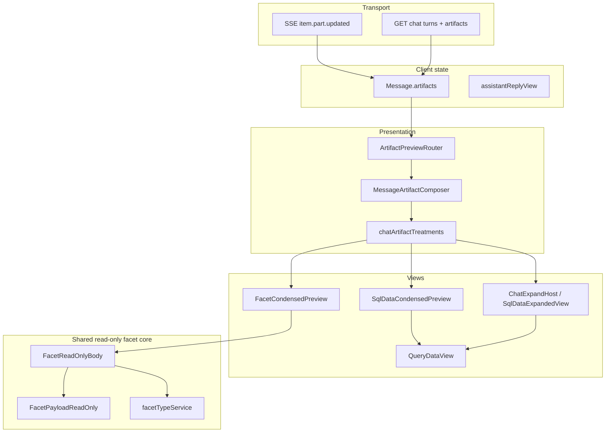

# Chat artefact architecture

End-to-end design for **chat-inferred artefact presentation** in Mill UI: replay wire → chat-type
treatment → condensed / expand views → host integrations.

**Story:** [`docs/workitems/completed/20260612-ai-sql-view-restart/`](../../workitems/completed/20260612-ai-sql-view-restart/STORY.md) (WI-289–298).

## 1. Layer separation

| Layer | Owner | Doc |
|-------|-------|-----|
| **Emission** (coordinator, descriptors, router, live SSE) | `ai-artifact-emit-contract` | [`artifact-foundation.md`](../agentic/artifact-foundation.md) |
| **Replay wire** (GET artefacts, attach-result) | `ai-sql-view-restart` WI-290 | §4 below |
| **Presentation** (treatments, condensed, expand) | `ai-sql-view-restart` WI-291–296 | §5–§9 below |

**Do not reimplement emission in the sql-view story.** If SQL appears as prose, fix the artefacts
foundation — not client salvage.

## 2. Principles

1. **Chat type is primary** — each `ChatType` registers how artefact *kinds* are treated (preview,
   host-apply, card, expand, navigate). Kinds do not own global UX.
2. **Client-side execution** — SQL runs via `queryService.executeQuery`; `POST …/execution-result`
   stores replay metadata only (no server SQL execution).
3. **Lazy data hydration** — condensed/expand views fetch pages through `executionId`; GET chat replay
   restores `sql` + `data` wire artefacts.
4. **Forward-compatible wire** — unknown structured parts use `UnknownArtifactCard`; text-only clients
   ignore unknown `partType` / `presentation` pairs.

## 3. Emission (cross-link — out of scope here)

Structured chat artefacts are emitted by the v3 agentic runtime per capability YAML descriptors.
See **[`artifact-foundation.md`](../agentic/artifact-foundation.md)** for:

- `ArtifactDescriptor`, `ArtifactEmissionCoordinator`, `RegistryAgentEventRouter`
- POC artefacts: `generated-sql`, facet proposal, schema capture
- SSE contract: `item.part.updated` with `presentation: structured`

This document covers **what happens after** emission reaches mill-ui and **GET replay**.

## 4. Replay wire (WI-290)

### GET chat detail

`GET /api/v1/ai/chats/{id}` → `TurnResponse` per turn:

- `artifacts: List<ArtifactResponse>` — consumer-safe wire kinds ( **N entries** when a batch capture turn persisted N rows; stable `turn.artifactIds` order)
- `assistantReplyView` — layout hint when artefacts present

### ArtifactWireMapper (mill-ai-service)

| Persisted kind | Wire `kind` | Notes |
|----------------|-------------|-------|
| `sql.generated` | `sql` | From agent emission |
| `sql.result` | `data` | From client attach |
| `metadata.faceting.capture` | `facet-proposal` | `propose_facet_assignment` (metadata-authoring) |
| `schema.authoring.capture` | `facet-proposal` | `capture_description` / `capture_relation` — normalized at wire ([`FacetProposalWire`](../../../ai/mill-ai/src/main/kotlin/io/qpointz/mill/ai/core/artifact/FacetProposalWire.kt)) |
| `sql.validation` | *(omitted)* | Audit only |

Mapper: [`ArtifactWireMapper`](../../../ai/mill-ai-service/src/main/kotlin/io/qpointz/mill/ai/service/ArtifactWireMapper.kt).
All facet-like captures (metadata faceting and schema authoring) wire as **`facet-proposal`**.
`assistantReplyView` on GET is omitted; mill-ui derives layout from artefacts ([`assistantReplyView.ts`](../../../ui/mill-ui/src/utils/assistantReplyView.ts)).

### Attach after Run

```http
POST /api/v1/ai/chats/{chatId}/turns/{turnId}/execution-result
```

Body: `executionId`, `columns`, `rowCount`, `truncated`, `sql`. Persists `sql.result`; does **not**
execute SQL.

**Known gap (stage 4 — [`metadata-authoring-profiles`](../../workitems/in-progress/metadata-authoring-profiles/STORY.md) WI-360):** attach is **turn-scoped** today; mill-ui keeps **one** `data` artefact per assistant message. Multiple `sql` cards on the same turn can show the **wrong grid** because pairing is positional, not id-based. **Planned in stage 4:** promote **`ArtifactRef`** to `mill-ai` core; expose **`artifactId`** on GET/SSE wire; bind `sql.result` → parent `sql.generated` via **`sourceArtifactId`** / attach **`parentArtifactId`**.

### Data wire payload

```json
{
  "kind": "data",
  "payload": {
    "executionId": "…",
    "sql": "SELECT …",
    "rowCount": 42,
    "truncated": false,
    "columns": [{ "name": "c1", "type": "INTEGER" }]
  }
}
```

Client: [`parseWireArtifacts`](../../../ui/mill-ui/src/utils/artifactWireParse.ts).

## 5. Chat types (v1)

| ChatType | Host | SQL/data treatment |
|----------|------|-------------------|
| `general` | `/chat` | Condensed preview, expand pane, Run/Export/Open in Analysis; **facet-like captures** use `FacetCondensedPreview` (see §7.1) |
| `inline-analysis` | Query Playground drawer | `host-apply` → editor (no in-drawer preview); facet proposals stay `FacetProposalArtifactCard` |
| `inline-model` / `inline-knowledge` | Explorer drawers | Compact SQL stub; facet proposals may use `FacetCondensedPreview`; other kinds via `ArtifactCard` |

Registry: [`chatArtifactTreatments.ts`](../../../ui/mill-ui/src/components/chat/artifactPreview/chatArtifactTreatments.ts).

## 6. Live SSE vs GET replay

| Phase | Artifacts source |
|-------|------------------|
| **Live** | `parseChatStructuredPart` on `item.part.updated` → `Message.artifacts` |
| **GET reload** | `parseWireArtifacts(turn.artifacts)` in `turnToMessage` |

SQL arrives **only** via structured SSE or GET wire — never prose inference.

## 7. UI layers



### 7.1 Shared facet read-only layer (Data Model + chat)

Chat facet presentation is **not** a parallel duplicate of the Data Model renderer. It reuses the
**same read-only field stack** under `ui/mill-ui/src/components/data-model/facets/` and wraps it in
**chat-only chrome**.

| Layer | Location | Role |
|-------|----------|------|
| **Read-only core (shared)** | `data-model/facets/` | `FacetReadOnlyBody` → `FacetPayloadReadOnly`; `facetDisplayUtils`; optional `StructuralFacet` when `modelStructuralFacet` |
| **Descriptor source (shared)** | `facetTypeService` | Loads `FacetTypeManifest` by facet-type key (same API as `/model`) |
| **Data Model host** | `EntityDetails.tsx` | Category tabs, edit/delete, inferred/captured badges, MULTIPLE nested cards |
| **Chat host** | `FacetCondensedPreview.tsx` | SQL-parity shell: `ChatArtifactCard`, Facet + JSON tabs, reserved action bar, “Proposed” badge |
| **Chat adapters** | `facetWireNormalize.ts`, `artifactGroups.ts` | Legacy schema-capture shapes normalize to `facet-proposal` at parse; group artefacts for treatment lookup |

**1:1 match (read-only body):** for the same `facetTypeKey` + payload + loaded descriptor, field
labels, stereotypes (hyperlink, email, tags), and JSON fallback behaviour match Data Model read mode.

**Not 1:1 (chrome):** chat adds tabbed artefact shell and JSON wire tab; Data Model adds entity
layout, mutation actions, and multi-facet navigation. See
[`model-view-facet-boxes.md`](../metadata/model-view-facet-boxes.md) §Shared read-only layer.

#### Artefact kinds → facet panel

| Wire / message `kind` | Persist kind (examples) | Normalised for `FacetReadOnlyBody` |
|-----------------------|-------------------------|-------------------------------------|
| `facet-proposal` | `metadata.faceting.capture` | Direct (`facetTypeKey`, `metadataEntityId`, `payload`) |
| `schema.authoring.capture` | `facet-proposal` (wire) | `FacetProposalWire`: `description` → `descriptive`, `relation` → `relation`; `targetEntityId` → `metadataEntityId` |

On **`general`** (and configured inline hosts), both kinds route through `artifactGroups` →
`facet-proposal` group → `FacetCondensedPreview` → `FacetReadOnlyBody`. Legacy
`SchemaCaptureArtifactCard` remains for passthrough only when not grouped (not used on general after
normalisation).

```text
Data Model:  EntityDetails ──────────► FacetReadOnlyBody ──► FacetPayloadReadOnly
                                              ▲
Chat:        FacetCondensedPreview ───────────┘   (+ ChatArtifactCard tabs, facetArtifactNormalize)
```

| Module | Role |
|--------|------|
| `ArtifactPreviewRouter` | Layout chrome from `assistantReplyView` |
| `MessageArtifactComposer` | Treatment by `chatType`; host-apply for inline-analysis |
| `SqlDataCondensedPreview` | In-thread SQL ↔ Data tabs, action bar |
| `FacetCondensedPreview` | Facet + JSON tabs; **shared** `FacetReadOnlyBody` |
| `ArtifactCard` | Unknown structured kinds; legacy facet stub on inline-analysis |
| `ChatExpandHost` | Full-pane overlay; back scrolls to originating message |
| `QueryDataView` | Shared grid (`condensed` \| `expanded` \| `playground`) |

## 8. Transitions

| Transition | Behaviour |
|------------|-----------|
| **Expand** | `general` + `sql-data-composite` → `ChatExpandHost` |
| **Open in Analysis** | Navigate to `/analysis` with `location.state.chatHandoff` `{ sql, suggestedName?, suggestedDescription? }` — no save, no `executionId`, no auto-run |
| **Host apply** | `inline-analysis` structured SQL → editor via `hostIntegrations` |

## 9. QueryDataView modes (WI-294–295)

| Mode | Context | Paging | Toolbar |
|------|---------|--------|---------|
| `condensed` | In-chat Data tab | first page / lazy | chat density |
| `expanded` | Expand pane | full | chat density + export |
| `playground` | Analysis | full | Analysis chrome |

## 10. Expand state (WI-294–296)

```typescript
interface ChatExpandState {
  messageId: string;
  turnId?: string;
  artefactKey?: string;
  providerKind?: string;
  returnScrollY?: number;
}
```

Expand gated by `chatArtifactTreatments[chatType][kind].transitions` including `expand`. v1:
`sql-data-composite` on **`general`** only.

## 11. Extension guide

1. Add backend wire mapping in `ArtifactWireMapper` (if new persist kind).
2. Extend `ChatMessageArtifact` + `parseChatStructuredPart` + `parseWireArtifacts`.
3. Register grouping in `artifactGroups.ts` (composite SQL/data, or facet normalisation).
4. Add row to `chatArtifactTreatments` per affected `ChatType`.
5. Register preview in `registry.tsx`; prefer reusing `FacetCondensedPreview` when the payload is
   facet-shaped (see §7.1). Add expand in `expandRegistry.ts` when needed.
6. Vitest + optional scenario pack.

**Facet-shaped captures:** if the new kind maps to a facet-type descriptor + payload, add a
normaliser beside [`facetArtifactNormalize.ts`](../../../ui/mill-ui/src/components/chat/artifactPreview/facetArtifactNormalize.ts)
instead of a bespoke read-only card.

For **new emission kinds**, start with [`artifact-foundation.md`](../agentic/artifact-foundation.md) §8.

## Related docs

- [`artifact-foundation.md`](../agentic/artifact-foundation.md) — emission (canonical)
- [`ai-v3-chat-transport-extensions.md`](../agentic/ai-v3-chat-transport-extensions.md) — SSE / replay
- [`model-view-facet-boxes.md`](../metadata/model-view-facet-boxes.md) — Data Model facet boxes + shared read-only module
- [`GENERAL-CHAT-DESIGN.md`](../ui/mill-ui/GENERAL-CHAT-DESIGN.md) — general chat UX
- [`capabilities_design.md`](capabilities_design.md) §15 — generate-only SQL
