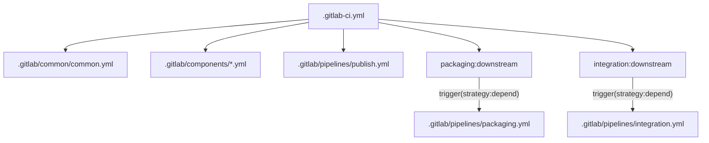

# GitLab CI Inventory

## Active Orchestrator

Primary pipeline entry:

- `.gitlab-ci.yml`

Root responsibilities:

- Defines high-level stages: `init`, `build`, `package`, `integration`, `publish`.
- Declares pipeline control variables (`RUN_INTEGRATION`, `RUN_PACKAGING`, `RUN_PUBLISH`).
- Includes shared/common templates.
- Includes module wrappers for build paths.
- Triggers downstream `packaging` and `integration` pipelines.

## Active Shared Configuration

Shared CI templates and defaults:

- `.gitlab/common/common.yml`
- `.gitlab/common/jobs.yml`
- `.gitlab/common/vars.yml`
- `.gitlab/templates/rules.yml`
- `.gitlab/templates/release.yml`
- `.gitlab/templates/gradle.yml`
- `.gitlab/templates/python.yml`
- `.gitlab/templates/node.yml`
- `.gitlab/templates/docker.yml`

## Active Pipeline Fragments

- `.gitlab/pipelines/packaging.yml`
  - Downstream packaging pipeline.
  - Builds UI assets and application packaging/docker images.
  - Requires propagated `QP_VERSION` from parent.
- `.gitlab/pipelines/integration.yml`
  - Downstream integration matrix.
  - Runs client and AI integration jobs.
  - Consumes packaged sample image tags.
- `.gitlab/pipelines/publish.yml`
  - Publish and release-facing jobs.
  - Included conditionally by root `RUN_PUBLISH` rules.
- `.gitlab/pipelines/.maven.yml`
  - Maven publish jobs (maintained but not currently wired by root include).

## Active Component Wrappers

Module wrappers under `.gitlab/components/`:

- `core.yml`
- `metadata.yml`
- `ai.yml`
- `ui.yml`
- `data.yml`
- `clients.yml`

These wrappers contain include rules and `changes` filters for corresponding module `.gitlab-ci.yml` files.

## Archived/Legacy CI

Archived pipeline tree:

- `.gitlab/legacy/`

Contains older `misc` and alternate `clients` CI definitions retained for historical reference and rollback.

## Include and Trigger Model

## Maintainer Guidance

- Add new cross-cutting CI functionality under `.gitlab/pipelines/`.
- Keep root file orchestration-only; avoid reintroducing large job blocks there.
- Prefer wrapper-based module registration in `.gitlab/components/`.
- Keep legacy files under `.gitlab/legacy/` until fully retired.
