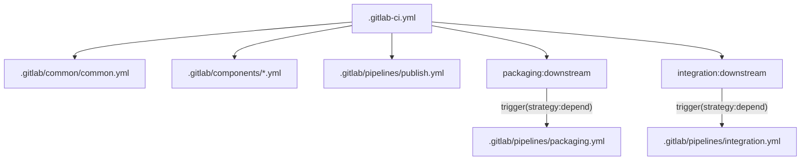

# GitLab CI Inventory

## Active Orchestrator

Primary pipeline entry:

- `.gitlab-ci.yml`

Root responsibilities:

- Defines high-level stages: `init`, `build`, `package`, `integration`, `publish`.
- Declares pipeline control variables (`RUN_INTEGRATION`, `RUN_PACKAGING`, `RUN_PUBLISH`).
- Includes shared/common templates.
- Includes module wrappers for build paths.
- Triggers downstream `packaging` and `integration` pipelines.

## Pipeline source policy (branch vs MR)

Feature branches must not run **both** a branch pipeline (`CI_PIPELINE_SOURCE == push`) and a
merge-request pipeline (`merge_request_event`) for the same commit. Protected branches
(`dev`, `rc`, `main`) are **exempt** — every push continues to run the branch pipeline.

Root `workflow: rules` (order matters — first match wins):

```yaml
workflow:
  rules:
    - if: '$CI_COMMIT_TAG && $CI_COMMIT_REF_PROTECTED == "true"'
      when: always
    - if: '$CI_COMMIT_TAG && $CI_COMMIT_REF_PROTECTED != "true"'
      when: never
    - if: '$CI_PIPELINE_SOURCE == "merge_request_event"'
      when: always
    - if: '$CI_COMMIT_REF_PROTECTED == "true"'
      when: always
    - if: '$CI_COMMIT_BRANCH && $CI_OPEN_MERGE_REQUESTS && $CI_PIPELINE_SOURCE == "push" && $CI_COMMIT_REF_PROTECTED != "true"'
      when: never
    - if: '$CI_COMMIT_BRANCH'
      when: always
    - when: always
```

| Scenario | Dedup applies? | Result |
|----------|----------------|--------|
| Feature branch, no open MR, push | — | One branch pipeline |
| Feature branch, open MR, push | Yes | MR pipeline only; branch push suppressed |
| MR closed/merged, next feature-branch push | — | Branch pipeline resumes |
| Protected branch push | No | Branch pipeline always (unchanged) |
| Protected tag | — | Release pipeline |

| Variable | Role |
|----------|------|
| `CI_PIPELINE_SOURCE` | `merge_request_event` vs `push`, `web`, `schedule`, `parent_pipeline`, etc. |
| `CI_OPEN_MERGE_REQUESTS` | Non-empty when the pushed branch is the source of at least one open MR |
| `CI_COMMIT_BRANCH` | Set on branch pipelines; absent on tag pipelines |
| `CI_COMMIT_REF_PROTECTED` | Limits dedup to feature branches |

`$CI_PIPELINE_SOURCE == "push"` on the suppress rule avoids blocking child pipelines triggered
from the root (`parent_pipeline` / `pipeline` source). Downstream configs under
`.gitlab/pipelines/` keep their own `workflow: { rules: [when: always] }`.

With an open MR, module includes stay off the MR pipeline (`$CI_PIPELINE_SOURCE !=
merge_request_event`); `test:downstream` runs the full test child pipeline instead. Branch-only
pushes without an MR use change-filtered module includes.

**Project setting:** **Settings → CI/CD → General pipelines → Merge request pipelines** must be
enabled or open-MR feature branches would get no CI after dedup.

Reference: [GitLab workflow — switch between branch and MR pipelines](https://docs.gitlab.com/ci/yaml/workflow/).

## Active Shared Configuration

Shared CI templates and defaults:

- `.gitlab/common/common.yml`
- `.gitlab/common/jobs.yml`
- `.gitlab/common/vars.yml`
- `.gitlab/templates/rules.yml`
- `.gitlab/templates/release.yml`
- `.gitlab/templates/gradle.yml`
- `.gitlab/templates/python.yml`
- `.gitlab/templates/node.yml`
- `.gitlab/templates/docker.yml`

## Active Pipeline Fragments

- `.gitlab/pipelines/packaging.yml`
  - Downstream packaging pipeline.
  - Builds UI assets and application packaging/docker images.
  - Requires propagated `QP_VERSION` from parent.
- `.gitlab/pipelines/integration.yml`
  - Downstream integration matrix.
  - Runs client and AI integration jobs.
  - Consumes packaged sample image tags.
- `.gitlab/pipelines/publish.yml`
  - Publish and release-facing jobs.
  - Included conditionally by root `RUN_PUBLISH` rules.
- `.gitlab/pipelines/.maven.yml`
  - Maven publish jobs (maintained but not currently wired by root include).

## Active Component Wrappers

Module wrappers under `.gitlab/components/`:

- `core.yml`
- `metadata.yml`
- `ai.yml`
- `ui.yml`
- `data.yml`
- `clients.yml`

These wrappers contain include rules and `changes` filters for corresponding module `.gitlab-ci.yml` files.

## Archived/Legacy CI

Archived pipeline tree:

- `.gitlab/legacy/`

Contains older `misc` and alternate `clients` CI definitions retained for historical reference and rollback.

## Include and Trigger Model


```mermaid
flowchart TD
  root[".gitlab-ci.yml"]
  common[".gitlab/common/common.yml"]
  comps[".gitlab/components/*.yml"]
  publish[".gitlab/pipelines/publish.yml"]
  pkgBridge["packaging:downstream"]
  itBridge["integration:downstream"]
  pkgChild[".gitlab/pipelines/packaging.yml"]
  itChild[".gitlab/pipelines/integration.yml"]

  root --> common
  root --> comps
  root --> publish
  root --> pkgBridge
  root --> itBridge
  pkgBridge -->|"trigger(strategy:depend)"| pkgChild
  itBridge -->|"trigger(strategy:depend)"| itChild
```

## Maintainer Guidance

- Add new cross-cutting CI functionality under `.gitlab/pipelines/`.
- Keep root file orchestration-only; avoid reintroducing large job blocks there.
- Prefer wrapper-based module registration in `.gitlab/components/`.
- Keep legacy files under `.gitlab/legacy/` until fully retired.
