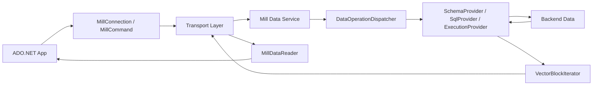

# ADO.NET Provider Data Lane

This document explains the high-level data lane that the ADO.NET provider must integrate with.
It is written for a client implementer, not for backend maintainers.

## Executive Summary

Mill is a remote query service. The client sends SQL or metadata requests over gRPC or HTTP.
The server parses SQL, plans it with Apache Calcite-based infrastructure, executes against the
configured backend, and returns results as columnar vector blocks.

For the ADO.NET provider, the key translation is:

- remote vectorized result protocol on the wire
- standard row-oriented `DbDataReader` API at the .NET boundary

## High-Level Request Flow



## Server-Side Components That Matter To A Client

The transport endpoints are defined in:

- `proto/data_connect_svc.proto`

The server entry points are:

- gRPC service:
  `services/mill-data-grpc-service/src/main/java/io/qpointz/mill/data/backend/MillGrpcService.java`
- HTTP controller:
  `services/mill-data-http-service/src/main/java/io/qpointz/mill/data/backend/access/http/controllers/AccessServiceController.java`

Both delegate into:

- `data/mill-data-backend-core/src/main/java/io/qpointz/mill/data/backend/dispatchers/DataOperationDispatcherImpl.java`

This is the critical backend boundary for a client implementer to understand because it defines
what the service actually does for each request.

## What Mill Reads And Processes

Mill can expose data from multiple backend families. For `C-17`, the most important point is
that the client does not need backend-specific code; it talks to the common service contract.

Common server-side backend modes include:

- Calcite backend
  - uses a Calcite model file
  - good mental model: schemas/tables are defined by Calcite itself
  - public docs: <https://docs.qpointz.io/backends/calcite/>
- Flow backend
  - uses Mill source descriptor YAML files over CSV/TSV/Parquet/Avro/Excel
  - this is the usual mental model for the `skymill` fixture
  - public docs: <https://docs.qpointz.io/backends/flow/>
- JDBC backend
  - remote database access behind the same Mill service surface

The ADO.NET provider stays above all of that. It should only rely on the transport contract and
returned schema/result metadata.

## What The SQL Execution Engine Is

Mill's SQL path is Calcite-based.

At a high level:

1. SQL text enters the service in `QueryRequest.statement.sql`.
2. `DataOperationDispatcherImpl` calls `SqlProvider.parseSql(...)`.
3. The SQL is parsed/planned into an internal plan representation.
4. The plan may be rewritten through `PlanRewriteChain`.
5. `ExecutionProvider.execute(...)` runs the rewritten plan against the configured backend.
6. The execution result is streamed back as `VectorBlock` payloads.

Important implications for the client:

- The provider does not parse SQL locally.
- SQL validation errors come back from the server.
- The SQL dialect exposed to clients is the server's configured dialect, and `GetDialect`
  can describe it when supported.
- The client should assume server-side planning/execution authority.

Public background:

- <https://docs.qpointz.io/backends/calcite/>

## Contract Surface The Provider Must Support

From `proto/data_connect_svc.proto`, the relevant methods are:

- `Handshake`
  - discover protocol version, auth context, and capabilities
- `ListSchemas`
  - list available schema names
- `GetSchema`
  - fetch a schema/table/field model
- `GetDialect`
  - fetch dialect descriptor when supported
- `ParseSql`
  - optional for debugging/tooling, not essential for ADO.NET MVP
- `ExecQuery`
  - gRPC server-streaming query execution
- `SubmitQuery`
  - HTTP initial query request
- `FetchQueryResult`
  - HTTP continuation/paging request

## gRPC vs HTTP Query Semantics

### gRPC

The gRPC path is the simpler query model:

- the client sends one `QueryRequest`
- the server returns a stream of `QueryResultResponse`
- each response can carry a `VectorBlock`

This maps naturally to a pull-style reader wrapper over a streaming enumerator.

### HTTP

The HTTP path is explicitly paged:

1. `SubmitQuery` returns the first `QueryResultResponse`
2. if `pagingId` is present, the client must call `FetchQueryResult`
3. paging continues until no further `pagingId` is returned

This means the ADO.NET reader needs an internal "next page" mechanism for HTTP even though
the public reader API remains row-oriented.

## Result Shape: Why Vector Blocks Matter

Mill returns query data as `VectorBlock` payloads, not as JSON row arrays and not as per-row
messages. This is a columnar transport format.

Implications for the ADO.NET provider:

- decode one block at a time
- cache block-local column vectors
- expose row-oriented getters like:
  - `GetValue`
  - `GetFieldType`
  - `GetName`
  - `GetOrdinal`
  - `IsDBNull`
- preserve field metadata from the block schema

The provider will need a dedicated adapter layer from:

- `QueryResultResponse` / `VectorBlock`
- to `DbDataReader` row access

That adapter is the hardest part of `C-17`.

## gRPC `VectorBlock` Protocol: High-Level Layout

For the ADO.NET implementer, this is the most important wire-format concept in the system.

The gRPC `ExecQuery` path returns a stream of `QueryResultResponse` messages. Each response may
contain a `VectorBlock`.

At a high level, a `VectorBlock` is:

- one self-describing chunk of result data
- schema + row count + one column vector per field

Conceptually:

```text
VectorBlock
├── schema
│   └── fields[0..N-1]
├── vectorSize   # number of rows in this block
└── vectors[0..N-1]
    ├── fieldIdx
    ├── nulls[]
    └── typed values[]
```

Relevant proto:

- `proto/vector.proto`

### What Is In A Block

Each `VectorBlock` contains:

- `schema`
  - ordered list of fields for this block
  - each field includes name, index, logical type, nullability
- `vectorSize`
  - number of row positions in the block
- `vectors`
  - repeated column vectors
  - each vector belongs to one field via `fieldIdx`

Important point:

- rows are not serialized directly
- columns are serialized independently, then stitched back into rows by the client

### What Is In A Vector

Each `Vector` contains:

- `fieldIdx`
  - which schema field this vector belongs to
- `nulls`
  - repeated boolean null mask
- `values`
  - exactly one typed vector payload:
    - `stringVector`
    - `i32Vector`
    - `i64Vector`
    - `fp32Vector`
    - `fp64Vector`
    - `boolVector`
    - `byteVector`

The `nulls` mask is row-position based:

- `nulls[i] = true` means value at row `i` is null
- if the value is null, the client must not interpret the corresponding typed payload entry as a
  meaningful business value

### Logical Type vs Physical Vector

The vector payload type alone is not enough to decode the value correctly.

Examples:

- `BIG_INT`, `DATE`, `TIME`, `TIMESTAMP`, `TIMESTAMP_TZ` all use `i64Vector`
- `TINY_INT`, `SMALL_INT`, `INT`, `INTERVAL_DAY`, `INTERVAL_YEAR` all use `i32Vector`
- `BINARY` and `UUID` both use `byteVector`

So decoding requires both:

1. the physical vector payload
2. the logical type from the schema field metadata

That is why the provider must read schema and vector data together.

### How To Turn A Block Into Rows

The correct mental model for the ADO.NET reader is:

1. take one `VectorBlock`
2. build one column-reader/decoder per field
3. keep `vectorSize` as the row count for the current block
4. for row `r`, column `c`:
   - check the vector null mask at `r`
   - if null: return `DBNull` / `IsDBNull=true`
   - otherwise:
     - read the physical value at position `r`
     - convert it using the field's logical type
5. when `r == vectorSize`, advance to the next block from the stream

This is effectively:

- outer iteration over blocks
- inner iteration over row index inside the current block

### Practical Reader Model

The easiest implementation shape is:

- maintain current block
- maintain current row index inside that block
- prebuild field decoders for the current block
- answer `GetValue(i)` by delegating to decoder `i` with current row index

This is already how the Java side thinks about vector blocks internally. See:

- `core/mill-core/src/main/java/io/qpointz/mill/sql/VectorBlockRecordIterator.java`
- `core/mill-core/src/main/java/io/qpointz/mill/sql/readers/vector/VectorColumnReaderFactory.java`

### Decoding Examples

- `STRING`
  - read from `stringVector.values[row]`
- `INT`
  - read from `i32Vector.values[row]`
- `DATE`
  - read from `i64Vector.values[row]` as epoch days, then convert to date
- `TIMESTAMP`
  - read from `i64Vector.values[row]` as epoch millis, then convert to local/naive timestamp
- `UUID`
  - read from `byteVector.values[row]` as 16-byte payload, then convert to `Guid`

### Why This Matters For ADO.NET

ADO.NET consumers expect row-oriented access:

- `Read()`
- `GetValue(i)`
- `GetName(i)`
- `GetFieldType(i)`
- `IsDBNull(i)`

Mill gives the provider a column-oriented stream. The provider therefore must be the adaptation
layer that reconstructs row semantics from:

- block-level schema
- column vectors
- null masks
- logical-type conversion rules

That conversion layer is the core technical challenge of the ADO.NET provider.

## Metadata Lane

The provider should not infer metadata from result rows alone. Mill already exposes dedicated
metadata operations:

- `Handshake` for:
  - protocol version
  - whether SQL is supported
  - whether dialect discovery is supported
  - current authenticated principal name
- `ListSchemas` for schema names
- `GetSchema` for full schema/table/field metadata
- `GetDialect` for SQL dialect descriptor

Existing clients already depend on this behavior:

- JDBC metadata: `clients/mill-jdbc-driver/src/main/java/io/qpointz/mill/MillDatabaseMetadata.java`
- Python dialect discovery: `clients/mill-py/mill/client.py`

## Error Lane

Error handling differs by transport but comes from the same server-side logic.

- gRPC errors are surfaced as gRPC status failures
- HTTP errors are mapped from server exceptions to HTTP status + response payload

For the ADO.NET provider, the requirement is not to preserve backend exception types; it is to
surface useful provider exceptions/messages while keeping transport parity.

The simplest correct initial strategy is:

- normalize transport errors into provider-specific exceptions
- include operation name and endpoint/method context
- preserve backend status code/detail where available

## Why Skymill Is The Right Fixture For This Work

The `skymill` dataset gives the provider implementation enough variety to prove:

- schema discovery
- simple selects
- joins
- paging
- multiple logical types
- realistic row counts

Useful references:

- local fixture summary: `test/datasets/skymill/README.md`
- public schema reference: <https://docs.qpointz.io/reference/skymill-schema/>
- public query examples: <https://docs.qpointz.io/reference/skymill-kpi-cookbook/>

## What The Provider Can Safely Ignore For MVP

The initial provider does not need to handle every server capability.

Safe MVP assumptions:

- read-only query model
- SQL text submission is enough
- local SQL parsing is unnecessary
- Substrait plan submission is unnecessary
- write transactions are unsupported
- advanced BI compatibility can come later

## Practical Takeaway

If the implementer remembers only one thing, it should be this:

Mill is a remote, Calcite-backed query service that returns columnar vector blocks. The ADO.NET
provider's job is to hide that transport/model detail behind standard .NET connection, command,
and reader abstractions without changing the underlying Mill contract.
