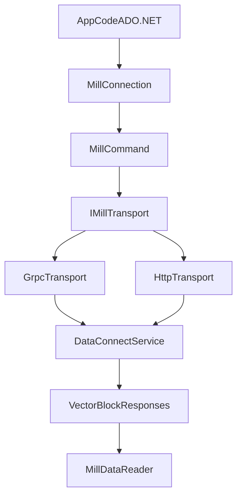

# ADO.NET Provider Design

Design track for a managed .NET data provider for Mill, scoped independently from ODBC.

## Goal

Deliver a production-ready ADO.NET provider that supports:
- gRPC and HTTP transports
- query execution and result streaming/paging
- schema metadata discovery
- auth and TLS parity with existing clients

This track intentionally does not depend on ODBC decisions.

## Why This Is Feasible

Existing assets already cover the core wire contract and client behavior:
- `proto/data_connect_svc.proto` defines service RPCs (`Handshake`, `ListSchemas`, `GetSchema`, `ExecQuery`, paging APIs).
- `proto/statement.proto` and `proto/vector.proto` define query payload and vectorized results.
- `clients/mill-jdbc-driver/src/main/java/io/qpointz/mill/client/GrpcMillClient.java` and `HttpMillClient.java` already prove dual transport with shared semantics.

## Target Provider Surface

- `MillConnection : DbConnection`
- `MillCommand : DbCommand`
- `MillDataReader : DbDataReader`
- `MillParameterCollection` (read-only/limited initially)
- `MillTransaction` as no-op or unsupported (read-only model)
- optional `MillDbProviderFactory`

## Architecture

## Type Mapping Baseline

- `STRING` -> `string`
- `BOOL` -> `bool`
- `INT`/`BIG_INT` -> `int`/`long`
- `FLOAT`/`DOUBLE` -> `float`/`double`
- `BINARY` -> `byte[]`
- `DATE`/`TIME`/`TIMESTAMP` -> `DateOnly`/`TimeOnly`/`DateTime` (or fallback strategy for older target frameworks)

Refine full mapping with nullable behavior and `DbType` mapping table during implementation.

## OLE DB Relationship

OLE DB is treated as separate from this managed provider:
- immediate scope: ADO.NET only
- optional future: compatibility adapter if required by consumers
- no COM/OLE DB obligations are assumed for Phase 1

## Phased Implementation

1. **Transport and contract layer**
   - C# proto generation and transport clients (gRPC + HTTP)
   - request/response parity with current Java client behavior
2. **Core ADO.NET objects**
   - `DbConnection`, `DbCommand`, `DbDataReader` minimal compliant implementation
3. **Metadata and capabilities**
   - `GetSchema` integration, reader schema, basic provider metadata
4. **Authentication and TLS**
   - basic/bearer auth, TLS/mTLS settings parity
5. **Conformance and hardening**
   - integration tests against Mill service
   - behavior validation in Dapper/EF-read scenarios

## Risks

- ADO.NET compatibility expectations differ by consumer (Dapper, EF Core, BI tools).
- Temporal and binary type handling requires careful conversion rules.
- HTTP and gRPC behavior must stay semantically identical for paging and errors.

## Test Strategy

- Unit tests: type conversion, reader behavior, null handling, command lifecycle.
- Integration tests: gRPC and HTTP query parity, schema metadata parity, auth/TLS modes.
- Compatibility checks: smoke tests with Dapper and plain `DbProviderFactory` patterns.

## Out of Scope

- ODBC driver implementation
- native OLE DB COM provider implementation
- write/transaction semantics beyond explicit read-only behavior
