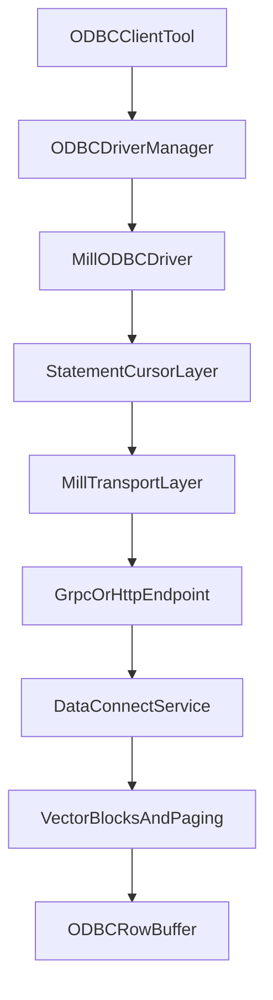

# ODBC Driver Design

Design track for a Mill ODBC driver, independent from the ADO.NET provider track.

## Goal

Deliver an ODBC driver that enables BI and SQL tools to query Mill through standard ODBC APIs, with predictable metadata and fetch behavior.

## Scope

- SQL execution and row fetching via ODBC statement/cursor model
- schema and column metadata for tool introspection
- DSN and DSN-less connection support
- authentication and TLS configuration

This document treats ODBC as its own engineering stream (separate timeline and risks from ADO.NET).

## Protocol Inputs Reused

- `proto/data_connect_svc.proto` for handshake, schema calls, query execution, paging
- `proto/vector.proto` for result representation (`VectorBlock`)
- query and parameter model from `proto/statement.proto`

## Implementation Strategies

### Strategy A: Native-first ODBC driver

- implement direct ODBC API surface (`SQLConnect`, `SQLExecDirect`, `SQLFetch`, descriptor functions)
- map ODBC handles/statements/cursors directly to Mill transport calls
- highest compatibility, highest complexity

### Strategy B: Wrapper-first bridge

- bootstrap with a thinner implementation layer to accelerate early validation
- can reduce initial complexity but may constrain feature parity
- still expected to converge on robust native behavior for full compatibility

## Recommended Direction

Start with native-first core for read/query path and metadata essentials.
Use wrapper ideas only where they do not compromise required ODBC semantics.

## Architecture (Conceptual)

## Key Technical Areas

1. **Statement and cursor semantics**
   - map `ExecQuery` streaming/paging to `SQLFetch` lifecycle
   - robust behavior for end-of-data, cancellation, and error propagation
2. **Metadata fidelity**
   - `SQLTables`, `SQLColumns`, and related catalog calls
   - map Mill schema model to ODBC metadata contracts
3. **Type mapping**
   - vector logical types to ODBC SQL types and C buffer conversions
4. **Connection and security**
   - DSN attributes for host/protocol/port/path/auth/TLS
   - basic/bearer auth handling compatible with driver manager constraints

## Phased Delivery

1. **Spike and contract validation**
   - toolchain setup, minimal connect + query roundtrip
2. **Read path baseline**
   - `connect`, `exec`, `fetch`, pagination, core type conversions
3. **Metadata coverage**
   - tables/columns/schema metadata sufficient for BI tool discovery
4. **Stability and compatibility**
   - test against representative tools (Power BI, Tableau, DBeaver, etc.)
5. **Packaging**
   - installer/distribution artifacts and configuration docs

## Risks

- ODBC behavior is strict and tool-dependent; compatibility testing is substantial.
- Native memory/buffer management introduces correctness and safety risk.
- Cross-platform packaging and driver manager differences increase support burden.

## Test Strategy

- unit tests for descriptor/type conversion and statement state machine
- integration tests against running Mill service for query/paging/metadata
- compatibility matrix tests across selected ODBC client tools

## Out of Scope

- ADO.NET provider implementation details
- OLE DB COM provider implementation
