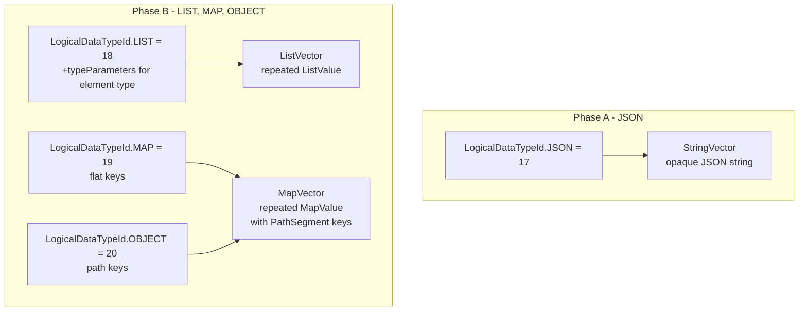

# Mill Complex Type Support

Add 4 complex types to Mill. Phase A adds JSON (opaque StringVector). Phase B adds LIST
(native ListVector), MAP and OBJECT (shared MapVector with typed PathSegment keys; MAP uses
flat single-segment keys, OBJECT uses multi-segment nested paths).

---

## Current State

Mill's type system is scalar-only across all layers:

- **Proto** (`proto/common.proto`): `LogicalDataTypeId` enum has 16 scalar types; `DataType` = `LogicalDataType` + `Nullability`; `Field` = name + index + `DataType`.
- **Wire format** (`proto/vector.proto`): `Vector` oneof has 7 physical types: `StringVector`, `I32Vector`, `I64Vector`, `FP64Vector`, `FP32Vector`, `BoolVector`, `BytesVector`.
- **Java core** (`core/mill-core/.../types/`): `LogicalType` -> `PhysicalType` -> `VectorProducer` pipeline. `LogicalTypeShuttle` (visitor), `LogicalTypeIdMapper` (switch dispatcher).
- **Backends**: `RelToDatabaseTypeConverter.convertArray`, `convertMap`, `convertRow` all throw "not implemented".
- **Python client** (`clients/mill-py/mill/types.py`): `MillType` enum with 16 scalar entries and per-type readers.
- **JDBC client**: Maps `LogicalDataTypeId` to `java.sql.Types`.

---

## Design Overview

### 4 Logical Types, 2 Phases

- **JSON** (Phase A): Opaque JSON document. Client responsible for interpretation. No Mill type guarantees inside. Backed by existing `StringVector`.
- **LIST** (Phase B): Homogeneous array of scalars. Element type declared via `typeParameters[0]`. Backed by native `ListVector` -- per-row `ListValue` containing typed `ListEntryValue` elements.
- **MAP** (Phase B): Flat `String -> heterogeneous scalar` map. No nesting. Values always scalars. Backed by native `MapVector` -- per-row `MapValue` containing self-describing `MapEntryValue` entries with typed `PathSegment` keys (single field segment).
- **OBJECT** (Phase B): Nested structure. Every leaf bound to a Mill logical type. **Same `MapVector` physical layout as MAP** -- difference is key interpretation: OBJECT uses multi-segment `PathSegment` paths to encode hierarchy (e.g. `[{field:"a"}, {field:"b"}, {index:0}]` for `a.b[0]`).

### Type Semantics

| Type | Schema params | Values | Nesting | Physical layout |
|------|--------------|--------|---------|-----------------|
| **JSON** | none | Opaque JSON document | N/A (client interprets) | StringVector |
| **LIST** | `typeParameters[0]` = element type | Homogeneous scalar array | No | Native ListVector |
| **MAP** | none | String keys, heterogeneous scalar values | No (flat only) | Native MapVector (single-segment keys) |
| **OBJECT** | none | Any Mill types, nested | Yes | Native MapVector (multi-segment keys) |

### Key Design Insight

MAP and OBJECT share the same proto wire format (`MapVector`). The `LogicalDataTypeId` (MAP vs OBJECT) tells the client how to interpret the `PathSegment` keys:
- MAP: single `PathSegment` per entry (flat key)
- OBJECT: multiple `PathSegment`s per entry (nested path), client reconstructs tree



---

## Phase A: JSON Type

Trivial addition. An opaque JSON document type backed by StringVector. Semantic: "Doc Out -> Doc In" -- the server writes a JSON document, the client receives it as-is and is solely responsible for interpretation. No Mill logical type consistency guarantees for content. This is NOT the same as OBJECT.

### A-1. Proto changes

**`proto/common.proto`**:
- Add `JSON = 17` to `LogicalDataTypeId`

No changes to `proto/vector.proto` -- reuses existing StringVector.

### A-2. Java core

**New file**: `core/mill-core/.../types/logical/JsonLogical.java`
- Implements `LogicalType<String, StringPhysical>`, returns `JSON` typeId
- Backed by `StringPhysical` (existing) -- same physical as StringLogical but different typeId

**Extend interfaces** (add `visit(JsonLogical)` / `mapJson()` to each):
- `LogicalTypeShuttle.java`
- `LogicalTypeIdMapper.java`

**Update all implementations**:
- `DatabaseType.java`: Add `json(nullable)` factory
- `DataTypeToSubstrait.java`: `mapJson()` -> Substrait STRING
- `JdbcUtils.java`: `JSON -> Types.OTHER`
- `VectorColumnReaderFactory.java`: `mapJson()` -> `StringColumnVectorReader`
- `ColumnMetadataFactory.java`: Add `mapJson()`
- `ResultSetVectorProducerFactory.java`: `visit(JsonLogical)` -> read as String, produce StringVector

### A-3. Backends

- `RelToDatabaseTypeConverter.java`: `convertVariant()`, `convertOther()` -> `DatabaseType.json(nullable)`
- `JdbcDatabaseTypeMapper.java`: Map JDBC `JAVA_OBJECT` -> `DatabaseType.json(nullable)`

### A-4. Clients

**Python** (`clients/mill-py/mill/types.py`):
- Add `JSON = (17, "stringVector", str)` to `MillType`
- `vectors.py`: Add `_read_json` (returns string as-is), register in `_READERS`
- `extras/arrow.py`: Map JSON -> `pa.string()`

**JDBC** (`JdbcUtils.java`):
- `JSON -> Types.OTHER`, type name "JSON"

### A-5. Tests

- Round-trip: write JSON string into VectorProducer, build Vector, read back via VectorColumnReader
- Python: `read_vector_block` with a JSON column

---

## Phase B: LIST, MAP, OBJECT (Native Vectors)

### B-1. Proto changes

**`proto/common.proto`**:
- Add `LIST = 18`, `MAP = 19`, `OBJECT = 20` to `LogicalDataTypeId`
- Add to `DataType`: `repeated DataType typeParameters = 3`
  - LIST: `typeParameters[0]` = element scalar DataType
  - MAP/OBJECT: empty (types carried per-entry in MapVector)

**`proto/vector.proto`** -- full proto definition to add inside `Vector` message:

```protobuf
message Vector {

  // ... existing nested messages (NullsVector, StringVector, I32Vector, etc.) ...

  // ---- LIST ----

  message ListEntryValue {
    bool isNull = 1;
    oneof value {
      string stringValue = 101;
      int32 i32Value = 102;
      int64 i64Value = 103;
      double fp64Value = 104;
      float fp32Value = 105;
      bool boolValue = 106;
      bytes byteValue = 107;
    }
  }

  message ListValue {
    repeated ListEntryValue entries = 1;
  }

  message ListVector {
    repeated ListValue values = 1;
  }

  // ---- MAP / OBJECT (shared physical layout) ----

  message PathSegment {
    oneof segment {
      string field = 1;
      uint32 index = 2;
    }
  }

  message MapEntryValue {
    repeated PathSegment key = 1;
    LogicalDataTypeId type = 2;
    bool isNull = 3;
    oneof value {
      string stringValue = 101;
      int32 i32Value = 102;
      int64 i64Value = 103;
      double fp64Value = 104;
      float fp32Value = 105;
      bool boolValue = 106;
      bytes byteValue = 107;
    }
  }

  message MapValue {
    repeated MapEntryValue entries = 1;
  }

  message MapVector {
    repeated MapValue values = 1;
  }

  // ---- existing fields + new oneof entries ----

  uint32 fieldIdx   = 1;
  NullsVector nulls = 2;
  oneof values {
    Vector.StringVector stringVector = 100;
    Vector.I32Vector i32Vector = 101;
    Vector.I64Vector i64Vector = 102;
    Vector.FP64Vector fp64Vector = 103;
    Vector.FP32Vector fp32Vector = 104;
    Vector.BoolVector  boolVector = 105;
    Vector.BytesVector byteVector = 106;
    Vector.ListVector listVector = 107;
    Vector.MapVector mapVector = 108;
  }

}
```

Note: `MapEntryValue.type` references `LogicalDataTypeId` from `common.proto` (needs import). MAP and OBJECT both use `MapVector` -- the logical type in the schema (`MAP` vs `OBJECT`) tells the client how to interpret `PathSegment` keys.

### Wire Examples

**LIST** -- 2 rows: `[1, 2, 3]`, `[4, 5]` (LIST\<INT\>):
```
listVector.values = [
  ListValue{entries: [{i32Value:1}, {i32Value:2}, {i32Value:3}]},
  ListValue{entries: [{i32Value:4}, {i32Value:5}]}
]
```

**MAP** -- `{"id": 1, "name": "foo", "accepted": true}`:
```
mapVector.values = [
  MapValue{entries: [
    {key:[{field:"id"}],       type:INT,    i32Value:1},
    {key:[{field:"name"}],     type:STRING, stringValue:"foo"},
    {key:[{field:"accepted"}], type:BOOL,   boolValue:true}
  ]}
]
```

**OBJECT** -- `{"id": 1, "address": {"city": "NYC"}, "tags": ["a","b"]}`:
```
mapVector.values = [
  MapValue{entries: [
    {key:[{field:"id"}],                      type:INT,    i32Value:1},
    {key:[{field:"address"},{field:"city"}],   type:STRING, stringValue:"NYC"},
    {key:[{field:"tags"},{index:0}],           type:STRING, stringValue:"a"},
    {key:[{field:"tags"},{index:1}],           type:STRING, stringValue:"b"}
  ]}
]
```

All leaf values carry their `LogicalDataTypeId`. Client reconstructs the tree from `PathSegment` sequences.

---

## PathSegment Reconstruction Algorithm (Entries -> Object)

Used by `ObjectColumnVectorReader` (Java) and `_read_object` (Python) to turn a flat list of `MapEntryValue` entries with multi-segment keys into a nested object tree.

**Input**: `List<MapEntryValue> entries` from one `MapValue` (one row)
**Output**: Nested `Map<String, Object>` (Java) or `dict` (Python)

```
function reconstruct(entries) -> Map:
    root = {}

    for each entry in entries:
        segments = entry.key       // repeated PathSegment
        value = readTypedValue(entry)  // null if entry.isNull

        // Walk segments[0..n-2] to find/create the parent container
        current = root
        for i = 0 to len(segments) - 2:
            seg = segments[i]
            nextSeg = segments[i + 1]

            if seg is field(name):
                if name not in current:
                    // Create intermediate: next segment determines container type
                    if nextSeg is field(_):
                        current[name] = {}       // next expects a map/object
                    else:  // nextSeg is index(_)
                        current[name] = []       // next expects a list
                current = current[name]

            else if seg is index(idx):
                // Ensure list is large enough
                while len(current) <= idx:
                    current.append(null)
                if current[idx] is null:
                    if nextSeg is field(_):
                        current[idx] = {}
                    else:
                        current[idx] = []
                current = current[idx]

        // Set the leaf value using the last segment
        leafSeg = segments[last]
        if leafSeg is field(name):
            current[name] = value
        else if leafSeg is index(idx):
            while len(current) <= idx:
                current.append(null)
            current[idx] = value

    return root
```

### readTypedValue

Dispatches on `entry.type` (LogicalDataTypeId):
```
function readTypedValue(entry) -> Object:
    if entry.isNull: return null
    switch entry.type:
        INT, SMALL_INT, TINY_INT -> entry.i32Value
        BIG_INT                  -> entry.i64Value
        FLOAT                    -> entry.fp32Value
        DOUBLE                   -> entry.fp64Value
        BOOL                     -> entry.boolValue
        STRING                   -> entry.stringValue
        BINARY, UUID             -> entry.byteValue
        DATE, TIME, TIMESTAMP,
        TIMESTAMP_TZ, INTERVAL_DAY,
        INTERVAL_YEAR            -> entry.i64Value (with logical conversion)
```

### Worked Example

Entries for `{"id": 1, "address": {"city": "NYC", "zip": 10001}, "tags": ["a", "b"]}`:

```
Step 1: entry {key:[field("id")], type:INT, i32Value:1}
  - segments has 1 element -> no intermediate walk
  - leafSeg = field("id") -> root["id"] = 1
  - root = {"id": 1}

Step 2: entry {key:[field("address"), field("city")], type:STRING, stringValue:"NYC"}
  - walk seg[0] = field("address"), nextSeg = field("city")
    -> "address" not in root, nextSeg is field -> root["address"] = {}
    -> current = root["address"]
  - leafSeg = field("city") -> current["city"] = "NYC"
  - root = {"id": 1, "address": {"city": "NYC"}}

Step 3: entry {key:[field("address"), field("zip")], type:INT, i32Value:10001}
  - walk seg[0] = field("address"), nextSeg = field("zip")
    -> "address" already in root -> current = root["address"]
  - leafSeg = field("zip") -> current["zip"] = 10001
  - root = {"id": 1, "address": {"city": "NYC", "zip": 10001}}

Step 4: entry {key:[field("tags"), index(0)], type:STRING, stringValue:"a"}
  - walk seg[0] = field("tags"), nextSeg = index(0)
    -> "tags" not in root, nextSeg is index -> root["tags"] = []
    -> current = root["tags"]
  - leafSeg = index(0) -> pad list, current[0] = "a"
  - root = {"id": 1, "address": {"city": "NYC", "zip": 10001}, "tags": ["a"]}

Step 5: entry {key:[field("tags"), index(1)], type:STRING, stringValue:"b"}
  - walk seg[0] = field("tags"), nextSeg = index(1)
    -> "tags" exists -> current = root["tags"]
  - leafSeg = index(1) -> pad list, current[1] = "b"
  - root = {"id": 1, "address": {"city": "NYC", "zip": 10001}, "tags": ["a", "b"]}
```

---

## Flattening Algorithm (Object -> Entries)

Used by `ObjectVectorProducer` (Java) and server-side serialization to turn a nested object into flat `MapEntryValue` entries.

**Input**: Nested `Map<String, Object>` (or `List`)
**Output**: `List<MapEntryValue>`

```
function flatten(obj, pathPrefix = []) -> List<MapEntryValue>:
    entries = []

    if obj is Map:
        for (key, value) in obj.entrySet():
            currentPath = pathPrefix + [field(key)]
            if value is Map or value is List:
                entries += flatten(value, currentPath)
            else:
                entries.append(makeEntry(currentPath, value))

    else if obj is List:
        for (i, value) in enumerate(obj):
            currentPath = pathPrefix + [index(i)]
            if value is Map or value is List:
                entries += flatten(value, currentPath)
            else:
                entries.append(makeEntry(currentPath, value))

    return entries

function makeEntry(path, value) -> MapEntryValue:
    return MapEntryValue {
        key: path,
        type: inferLogicalTypeId(value),
        isNull: (value == null),
        value: <set appropriate oneof field based on type>
    }

function inferLogicalTypeId(value) -> LogicalDataTypeId:
    if value is null     -> STRING (or any; isNull=true)
    if value is Boolean  -> BOOL
    if value is Integer  -> INT
    if value is Long     -> BIG_INT
    if value is Float    -> FLOAT
    if value is Double   -> DOUBLE
    if value is String   -> STRING
    if value is byte[]   -> BINARY
    if value is UUID     -> UUID
    // date/time types handled similarly
```

**Invariant**: `reconstruct(flatten(obj)) == obj` -- round-trip fidelity guaranteed because every leaf carries its `LogicalDataTypeId` and the path structure is lossless.

### MAP Reconstruction (Simplified)

For MAP columns, keys are always single-segment `field(name)` with scalar values only. No tree walk needed:

```
function reconstructMap(entries) -> Map:
    result = {}
    for each entry in entries:
        name = entry.key[0].field   // always single segment
        result[name] = readTypedValue(entry)
    return result
```

---

## Implementation Details

### B-2. Java core -- new types and vector read/write

**New logical types** in `core/mill-core/.../types/logical/`:
- `ListLogical` -- typeId = `LIST`, backed by new `ListPhysical`
- `MapLogical` -- typeId = `MAP`, backed by new `MapPhysical`
- `ObjectLogical` -- typeId = `OBJECT`, backed by `MapPhysical` (same physical as MAP)

**New physical types** in `core/mill-core/.../types/physical/`:
- `ListPhysical` implements `PhysicalType<List<?>>` -- creates `ListVectorProducer`
- `MapPhysical` implements `PhysicalType<Map<String,?>>` -- creates `MapVectorProducer`

**New vector producers** in `core/mill-core/.../vectors/`:
- `ListVectorProducer`: accepts `List<?>` per row, builds `ListVector` with per-row `ListValue`
- `MapVectorProducer`: accepts `Map<String,?>` per row, builds `MapVector` with per-row `MapValue`, single-segment `PathSegment` keys, per-entry typed values
- `ObjectVectorProducer`: accepts nested `Map<String,Object>` per row, flattens to `MapVector` with multi-segment `PathSegment` paths

**New column readers** in `core/mill-core/.../sql/readers/vector/`:
- `ListColumnVectorReader`: reads `ListVector`, returns `List<?>` per row
- `MapColumnVectorReader`: reads `MapVector`, single-segment keys -> `Map<String, Object>` per row
- `ObjectColumnVectorReader`: reads `MapVector`, multi-segment keys -> reconstructs nested `Map<String, Object>` tree per row

### B-3. Extend shuttles and mappers

Add `visit(ListLogical)`/`mapList()`, `visit(MapLogical)`/`mapMap()`, `visit(ObjectLogical)`/`mapObject()` to:
- `LogicalTypeShuttle.java` and `LogicalTypeIdMapper.java`
- All implementations: DatabaseType, DataTypeToSubstrait, JdbcUtils, VectorColumnReaderFactory, ColumnMetadataFactory, ResultSetVectorProducerFactory, PhysicalTypeShuttle, LogicalTypeToSubstrait, JdbcToSubstraitTypeMapper

### B-4. Backends

- `RelToDatabaseTypeConverter.java`:
  - `convertArray()` -> `DatabaseType.list(elementType, nullable)` (extract element type via `RelDataType.getComponentType()`)
  - `convertMap()` -> `DatabaseType.map(nullable)`
  - `convertRow()`, `convertStructured()` -> `DatabaseType.object(nullable)`
- `JdbcDatabaseTypeMapper.java`: `ARRAY -> list(...)`, `STRUCT -> object(nullable)`

### B-5. Clients

**Python** (`clients/mill-py/mill/types.py`):
- Add `LIST = (18, "listVector", list)`, `MAP = (19, "mapVector", dict)`, `OBJECT = (20, "mapVector", dict)` to `MillType`
- `vectors.py`: New readers:
  - `_read_list`: per-row `ListValue` -> Python `list`
  - `_read_map`: per-row `MapValue` with single-segment keys -> Python `dict`
  - `_read_object`: per-row `MapValue` with multi-segment `PathSegment` keys -> reconstruct nested Python `dict`
- `MillField`: expose `typeParameters` for LIST element type metadata
- `extras/arrow.py`: LIST -> `pa.list_(element_type)`, MAP/OBJECT -> `pa.string()` (JSON) or structured Arrow types

**JDBC**:
- `JdbcUtils.java`: `LIST -> Types.ARRAY`, `MAP -> Types.JAVA_OBJECT`, `OBJECT -> Types.JAVA_OBJECT`
- `ColumnsMetadata.java`: Handle new type IDs

### B-6. Tests

- VectorProducer round-trip for LIST: write lists -> ListVector -> read back -> verify
- VectorProducer round-trip for MAP: write flat maps -> MapVector with single-segment PathSegments -> read back -> verify
- VectorProducer round-trip for OBJECT: write nested objects -> MapVector with multi-segment PathSegments -> read back -> verify tree reconstruction
- Python: `read_vector_block` with LIST, MAP, OBJECT columns
- Backend: Calcite source with ARRAY/MAP/STRUCT columns -> query -> verify native vectors

---

## Affected Components

### Directly affected

| Component | Approx files | What changes |
|-----------|-------------|--------------|
| Proto | 2 | New enum values, typeParameters, ListVector, MapVector, PathSegment |
| Core Java (mill-core) | ~25 | New logical/physical types, producers, readers, extend all shuttles/mappers |
| Data source core (Kotlin) | ~5 | MultiFileSourceTable vector switch, RecordSchema, Bridges |
| Data source calcite (Kotlin) | ~2 | CalciteTypeMapper shuttle |
| Data backends (Java) | ~3 | RelToDatabaseTypeConverter, JdbcDatabaseTypeMapper |
| Python client (mill-py) | ~8 | MillType, vectors, arrow, tests |
| JDBC client | ~3 | JdbcUtils, ColumnsMetadata |
| Documentation | ~8 | This doc, type-system ref, user-facing docs, READMEs |

### Not affected (pass-through)

- gRPC service -- streams VectorBlock transparently
- HTTP service -- JsonFormat handles proto transparently
- Data service dispatcher -- passes VectorBlockIterator through
- AI modules
- UI (mill-grinder-ui)
- CI/CD pipelines
- OpenAPI specs
- `misc/mill-py` -- discontinued, to be deleted

---

## Key Files Changed (Summary)

**Phase A (JSON)** -- minimal:
- `proto/common.proto` -- 1 new enum value
- ~10 Java files in `core/mill-core` (new JsonLogical + extend all shuttles/mappers)
- ~2 Java files in `data/mill-data-backends`
- ~3 Python files in `clients/mill-py`

**Phase B (LIST + MAP + OBJECT)** -- substantial:
- `proto/common.proto` -- 3 new enum values + `typeParameters` field
- `proto/vector.proto` -- `ListVector`, `MapVector`, `PathSegment` and related messages + 2 new oneof variants
- ~18 Java files in `core/mill-core` (new logical/physical types, producers, readers, extend all shuttles/mappers)
- ~5 Java/Kotlin files in `data/mill-data-source-core` (MultiFileSourceTable, RecordSchema, etc.)
- ~2 Kotlin files in `data/mill-data-source-calcite` (CalciteTypeMapper)
- ~3 Java files in `data/mill-data-backends`
- ~3 Python files in `clients/mill-py`
- ~2 Java files in `clients/mill-jdbc-driver`
- Test files alongside each module

**Documentation:**
- New folder `docs/design/data/` with `complex-type-support.md`
- Move/update `mill-type-system.md`
- ~5 existing docs updated (types tables, Python types, export service, README)
