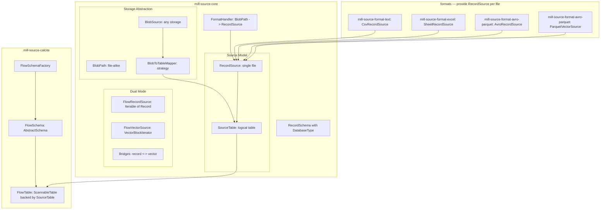

# source — Mill Source Provider

**Implementation language: Kotlin (JVM).** All source modules are Kotlin, using `kotlin("jvm")` Gradle plugin. mill-core (dependency) is Java.

Kotlin library providing file-based data (CSV, FWF, Excel, Avro, Parquet) as a data provider in the mill ecosystem.

Storage abstraction (BlobSource/BlobPath) for local/cloud backends. Three-level model aligned with mill's Schema/Table hierarchy: Source (= schema), SourceTable (= logical table, multi-file), RecordSource (= single file reader). Dual-mode: row-oriented or columnar. Mill-core type system. Calcite adapter in separate module.

## Key Design: Source = Schema, Table Mapper = Tables

In mill, a **schema** is a collection of tables. This module aligns with that:

- **Source** = one configured storage location (directory, S3 bucket, ...) with a format and table mapping strategy. **One source = one schema.** The source's `name` becomes the schema name in mill.
- **BlobToTableMapper** on that source determines **tables** — each mapped group of blobs becomes one logical table within the schema.
- **RecordSource** = reads ONE file/blob, produces records or vectors. This is the lowest-level, format-specific reader.

```mermaid
flowchart LR
    subgraph blobDiscovery [Storage Abstraction]
        BlobSrc["BlobSource: local / S3 / Azure / ..."]
        Mapper["BlobToTableMapper: regex / directory / ..."]
    end

    subgraph singleFile [RecordSource — single file]
        RS1["file_1.parquet -> RecordSource"]
        RS2["file_2.parquet -> RecordSource"]
        RS3["file_3.parquet -> RecordSource"]
    end

    subgraph sourceTable [SourceTable — logical table (multi-file)]
        DS["SourceTable: union of RecordSources"]
    end

    BlobSrc --> Mapper
    Mapper --> RS1
    Mapper --> RS2
    Mapper --> RS3
    RS1 --> DS
    RS2 --> DS
    RS3 --> DS
```

This mirrors the [rapids blob model](misc/rapids/rapids-core-legacy/src/main/java/io/qpointz/rapids/calcite/blob/):
- `BlobSource.listBlobs()` -> discover files
- `BlobToTableMapper.mapPathToTable()` -> group by table
- Per-file readers -> union into table

But flow_scala was missing this entirely — its `RecordReader` was always one file.

## Architecture



## Project Structure

```
source/                                         (root Gradle project)
  settings.gradle.kts
  build.gradle.kts
  gradle/wrapper/...
  mill-source-core/                            (source:mill-source-core)
      -- Storage abstraction, source model (Source/SourceTable/RecordSource), dual-mode, mill bridges
  formats/
    mill-source-format-text/                   (source:formats:mill-source-format-text)
        -- CSV + FWF (row-oriented RecordSource per file)
    mill-source-format-excel/                  (source:formats:mill-source-format-excel)
        -- Excel (row-oriented RecordSource per sheet)
    mill-source-format-avro-parquet/           (source:formats:mill-source-format-avro-parquet)
        -- Avro (row RecordSource) + Parquet (columnar VectorSource)
  mill-source-calcite/                         (source:mill-source-calcite)
      -- Calcite adapter (Source -> Calcite Schema, SourceTable -> ScannableTable)
```

## Build Setup

`source/settings.gradle.kts`:

```kotlin
rootProject.name = "source"

include("mill-source-core")
include("formats:mill-source-format-text")
include("formats:mill-source-format-excel")
include("formats:mill-source-format-avro-parquet")
include("mill-source-calcite")

includeBuild("../build-logic")
includeBuild("../core") {
    dependencySubstitution {
        substitute(module("io.qpointz.mill:mill-core")).using(project(":mill-core"))
    }
}
dependencyResolutionManagement {
    versionCatalogs { create("libs") { from(files("../libs.versions.toml")) } }
}
pluginManagement { includeBuild("../build-logic") }
```

**Already in libs.versions.toml** (no changes needed): `jackson-core`, `jackson-databind`, `jackson-dataformat-yaml`, `jackson-module-kotlin`, `calcite-core`, `guava`, `apache-poi`, `apache-poi-ooxml`, `junit-jupiter-api`, `mockito-core`, `slf4j-api`, `logback-*`.

**Add to libs.versions.toml** (new entries):

```toml
univocity-parsers = { module = "com.univocity:univocity-parsers", version = "2.9.1" }
apache-avro = { module = "org.apache.avro:avro", version = "1.12.0" }
apache-parquet-avro = { module = "org.apache.parquet:parquet-avro", version = "1.15.0" }
apache-hadoop-common = { module = "org.apache.hadoop:hadoop-common", version = "3.4.1" }
apache-hadoop-client = { module = "org.apache.hadoop:hadoop-client", version = "3.4.1" }
```

### Per-module build.gradle.kts

**mill-source-core:**

```kotlin
plugins {
    kotlin("jvm") version libs.versions.kotlin
    id("io.qpointz.plugins.mill")
}

mill {
    description = "Mill source core — storage abstraction, source model, descriptors"
    publishArtifacts = true
}

dependencies {
    implementation(project(":core:mill-core"))   // VectorBlock, DatabaseType, RecordReaders
    implementation(libs.jackson.databind)
    implementation(libs.jackson.dataformat.yaml)
    implementation(libs.jackson.module.kotlin)
    compileOnly(libs.bundles.logging)
    implementation(kotlin("stdlib-jdk8"))
}
```

**mill-source-format-text:**

```kotlin
plugins {
    kotlin("jvm") version libs.versions.kotlin
    id("io.qpointz.plugins.mill")
}

mill {
    description = "Mill source format — CSV, FWF"
    publishArtifacts = true
}

dependencies {
    implementation(project(":mill-source-core"))
    implementation(libs.univocity.parsers)
    compileOnly(libs.bundles.logging)
    implementation(kotlin("stdlib-jdk8"))
}
```

**mill-source-format-excel:**

```kotlin
plugins {
    kotlin("jvm") version libs.versions.kotlin
    id("io.qpointz.plugins.mill")
}

mill {
    description = "Mill source format — Excel"
    publishArtifacts = true
}

dependencies {
    implementation(project(":mill-source-core"))
    implementation(libs.apache.poi)
    implementation(libs.apache.poi.ooxml)
    compileOnly(libs.bundles.logging)
    implementation(kotlin("stdlib-jdk8"))
}
```

**mill-source-format-avro-parquet:**

```kotlin
plugins {
    kotlin("jvm") version libs.versions.kotlin
    id("io.qpointz.plugins.mill")
}

mill {
    description = "Mill source format — Avro, Parquet"
    publishArtifacts = true
}

dependencies {
    implementation(project(":mill-source-core"))
    implementation(libs.apache.avro)
    implementation(libs.apache.parquet.avro)
    implementation(libs.apache.hadoop.common)
    implementation(libs.apache.hadoop.client)
    compileOnly(libs.bundles.logging)
    implementation(kotlin("stdlib-jdk8"))
}
```

**mill-source-calcite:**

```kotlin
plugins {
    kotlin("jvm") version libs.versions.kotlin
    id("io.qpointz.plugins.mill")
}

mill {
    description = "Mill source Calcite adapter"
    publishArtifacts = true
}

dependencies {
    implementation(project(":mill-source-core"))
    implementation(project(":core:mill-core"))
    implementation(libs.calcite.core)
    implementation(libs.guava)
    compileOnly(libs.bundles.logging)
    implementation(kotlin("stdlib-jdk8"))
}
```

The Mill plugin (`io.qpointz.plugins.mill`) auto-applies Java, Jacoco, Lombok, and sets JVM toolchain. Tests use JUnit 5 (`libs.junit.jupiter.api`) and Mockito (`libs.mockito.core`) — add via test suites as in the `ai/` modules.

---

## mill-core types used

These types come from `core/mill-core` and are used throughout the source modules:

- **`DatabaseType`** — Java record (`io.qpointz.mill.types.sql`). Represents a column type: `DatabaseType.bool(nullable)`, `DatabaseType.string(nullable, size)`, `DatabaseType.i32(nullable)`, etc.
- **`VectorBlock`** — protobuf-generated (`proto/vector.proto`). A columnar batch: schema + vectorSize + list of Vectors.
- **`VectorBlockSchema`** — protobuf-generated. Schema of a VectorBlock: list of Fields.
- **`VectorBlockIterator`** — interface (`io.qpointz.mill.vectors`). `Iterator<VectorBlock>` with a `schema()` method.
- **`RecordReader`** — interface (`io.qpointz.mill.sql`). Cursor-style reader: `hasNext()`, `next()`, `isNull(col)`, typed getters.
- **`RecordReaders`** — utility class (`io.qpointz.mill.sql`). Factory methods, including `RecordReaders.recordReader(VectorBlockIterator)` to wrap a VectorBlockIterator as a RecordReader.

---

## mill-source-core

Package: `io.qpointz.mill.source`

**Dependencies:** `io.qpointz.mill:mill-core`, `libs.jackson.databind`, `libs.jackson.dataformat.yaml`, `libs.jackson.module.kotlin`, `libs.slf4j.api`

### Record

```kotlin
data class Record(val values: Map<String, Any?>) {
    operator fun get(key: String): Any? = values[key]
    companion object {
        fun of(vararg pairs: Pair<String, Any?>) = Record(mapOf(*pairs))
    }
}
```

### RecordSchema — using mill-core DatabaseType

```kotlin
data class SchemaField(val name: String, val index: Int, val type: DatabaseType)

data class RecordSchema(val fields: List<SchemaField>) {
    fun toVectorBlockSchema(): VectorBlockSchema { ... }
}
```

### Level 1: RecordSource — single file/blob

A RecordSource reads ONE file and produces data. It can be row-oriented or columnar:

```kotlin
// Base: every source has a schema
interface RecordSource {
    val schema: RecordSchema
}

// Row-oriented (natural for CSV, Excel, Avro)
interface FlowRecordSource : RecordSource, Iterable<Record>

// Columnar (natural for Parquet)
interface FlowVectorSource : RecordSource {
    fun vectorBlocks(batchSize: Int = 1024): VectorBlockIterator
}
```

Format modules create ONE RecordSource per file/blob.

### SourceTable — one logical table (multi-file)

A `SourceTable` represents one logical table within a source/schema. It is backed by multiple files (one `RecordSource` per file), unioned into a single stream:

```kotlin
interface SourceTable {
    val schema: RecordSchema

    // Row-oriented access: union of all files as records
    fun records(): Iterable<Record>

    // Columnar access: union of all files as VectorBlocks
    fun vectorBlocks(batchSize: Int = 1024): VectorBlockIterator

    // Mill integration
    fun asMillRecordReader(batchSize: Int = 1024): io.qpointz.mill.sql.RecordReader
}
```

Default implementation:

```kotlin
class MultiFileSourceTable(
    override val schema: RecordSchema,
    private val sources: List<RecordSource>
) : SourceTable {

    override fun records(): Iterable<Record> {
        // For each source:
        //   FlowRecordSource -> iterate directly
        //   FlowVectorSource -> bridge to records
        // Concatenate all
    }

    override fun vectorBlocks(batchSize: Int): VectorBlockIterator {
        // For each source:
        //   FlowVectorSource -> iterate directly (no conversion!)
        //   FlowRecordSource -> bridge to VectorBlocks
        // Concatenate all
    }

    override fun asMillRecordReader(batchSize: Int): io.qpointz.mill.sql.RecordReader {
        return RecordReaders.recordReader(vectorBlocks(batchSize))
    }
}
```

Key: if all underlying sources are columnar (e.g., Parquet), the columnar path has zero overhead — no row materialization. If all are row-oriented (e.g., CSV), the record path has zero overhead. Mixed is also fine.

### Storage Abstraction — BlobSource + BlobPath

**This is a core architectural abstraction.** `BlobSource` / `BlobPath` represent anything "file-alike" — local filesystem, S3, Azure Blob Storage, GCS, HDFS. All file discovery and I/O in flow-kt goes through this interface. Format modules and SourceTable never touch `java.io.File` or `java.nio.file.Path` directly.

Inspired by rapids [BlobSource](misc/rapids/rapids-core-legacy/src/main/java/io/qpointz/rapids/calcite/blob/BlobSource.java) and [LocalFilesystemBlobSource](misc/rapids/rapids-core-legacy/src/main/java/io/qpointz/rapids/providers/local/blob/LocalFilesystemBlobSource.java):

```kotlin
// Identifies a single "file-alike" resource in any storage system
interface BlobPath {
    val uri: URI
}

// Storage-agnostic access to a collection of blobs
interface BlobSource : Closeable {
    // Discover all blobs in this source
    fun listBlobs(): Sequence<BlobPath>
    // Read a blob as a stream
    fun openInputStream(path: BlobPath): InputStream
    // Read a blob with random access (needed by Parquet)
    fun openSeekableChannel(path: BlobPath): SeekableByteChannel
}
```

**Built-in implementation — local filesystem:**

```kotlin
class LocalBlobSource(private val rootPath: Path) : BlobSource {
    override fun listBlobs(): Sequence<BlobPath> { /* walk directory tree recursively */ }
    override fun openInputStream(path: BlobPath): InputStream { ... }
    override fun openSeekableChannel(path: BlobPath): SeekableByteChannel { ... }
}

data class LocalBlobPath(override val uri: URI, val relativePath: Path) : BlobPath
```

**Future implementations** (not in this PR, but the interface is designed for them):
- `S3BlobSource` — backed by AWS S3 SDK, lists objects by prefix
- `AzureBlobSource` — backed by Azure Blob Storage SDK
- `HdfsBlobSource` — backed by Hadoop FileSystem API

### BlobToTableMapper — interface + implementations

`BlobToTableMapper` is a **strategy interface** for deciding how blobs map to logical table names. Different storage layouts need different mappers.

```kotlin
data class TableMapping(val tableName: String, val partitionValues: Map<String, Any> = emptyMap())

// Strategy interface — multiple implementations expected
interface BlobToTableMapper {
    fun mapToTable(path: BlobPath): TableMapping?   // null = skip this blob
}
```

**Built-in implementations:**

```kotlin
// Regex: extract table name from path via named capture group
class RegexTableMapper(
    val pattern: Regex,
    val tableNameGroup: String = "table"
) : BlobToTableMapper { ... }

// Directory-based: each subdirectory = one table, files inside it = blobs for that table
class DirectoryTableMapper : BlobToTableMapper { ... }
```

**Future implementations** (not in this PR):
- `HivePartitionTableMapper` — parses `key=value/` directory structure into table name + partition values
- `GlobTableMapper` — uses glob patterns per table

### FormatHandler — creates RecordSource from a single blob

```kotlin
interface FormatHandler {
    fun inferSchema(blob: BlobPath, blobSource: BlobSource): RecordSchema
    fun createRecordSource(blob: BlobPath, blobSource: BlobSource): RecordSource
}
```

Returns either `FlowRecordSource` or `FlowVectorSource` depending on the format.

### Source Descriptor — declarative source definition

A source (= one schema) is fully described by a serializable descriptor. The descriptor is a plain data structure — no runtime objects, no open connections. It can be stored as YAML, JSON, or in a database, and materialised into a live `SourceResolver` on demand.

```kotlin
data class SourceDescriptor(
    val name: String,
    val storage: StorageDescriptor,
    val format: FormatDescriptor,
    val tableMapping: TableMappingDescriptor
)

// --- Storage ---
// Core defines the interface + built-in local type.
// Future storage modules add their own subtypes.

@JsonTypeInfo(use = JsonTypeInfo.Id.NAME, property = "type")
@JsonSubTypes(
    JsonSubTypes.Type(value = LocalStorageDescriptor::class, name = "local")
    // future: S3StorageDescriptor "s3", AzureStorageDescriptor "azure", ...
)
interface StorageDescriptor

data class LocalStorageDescriptor(
    val rootPath: String
) : StorageDescriptor

// --- Format ---
// Core defines the interface. Each format module defines its own subtypes.
// Subtypes are registered via Jackson's @JsonSubTypes in core (since core
// knows the full set of supported formats at compile time).

@JsonTypeInfo(use = JsonTypeInfo.Id.NAME, property = "type")
@JsonSubTypes(
    JsonSubTypes.Type(value = CsvFormatDescriptor::class, name = "csv"),
    JsonSubTypes.Type(value = FwfFormatDescriptor::class, name = "fwf"),
    JsonSubTypes.Type(value = ExcelFormatDescriptor::class, name = "excel"),
    JsonSubTypes.Type(value = AvroFormatDescriptor::class, name = "avro"),
    JsonSubTypes.Type(value = ParquetFormatDescriptor::class, name = "parquet")
)
interface FormatDescriptor

data class CsvFormatDescriptor(
    val delimiter: Char = ',',
    val quote: Char = '"',
    val hasHeader: Boolean = true,
    val encoding: String = "UTF-8"
) : FormatDescriptor

data class ParquetFormatDescriptor(
    val batchSize: Int = 1024
) : FormatDescriptor

// FwfFormatDescriptor, ExcelFormatDescriptor, AvroFormatDescriptor — same pattern

// --- Table mapping ---

@JsonTypeInfo(use = JsonTypeInfo.Id.NAME, property = "type")
@JsonSubTypes(
    JsonSubTypes.Type(value = RegexTableMappingDescriptor::class, name = "regex"),
    JsonSubTypes.Type(value = DirectoryTableMappingDescriptor::class, name = "directory")
)
interface TableMappingDescriptor

data class RegexTableMappingDescriptor(
    val pattern: String,
    val tableNameGroup: String = "table"
) : TableMappingDescriptor

data class DirectoryTableMappingDescriptor(
    val depth: Int = 1
) : TableMappingDescriptor
```

All descriptor data classes live in **core** — they are plain configuration POJOs with no format-specific dependencies. The actual implementations (`CsvRecordSource`, `ParquetVectorSource`, etc.) live in format modules. Polymorphic serialization uses Jackson `@JsonTypeInfo` / `@JsonSubTypes` with a `type` discriminator field.

**YAML serialization example:**

```yaml
name: airline-data
storage:
  type: local
  rootPath: /data/airlines
format:
  type: parquet
  batchSize: 2048
tableMapping:
  type: regex
  pattern: ".*(?<table>[^/]+)\\.parquet$"
  tableNameGroup: table
```

**Materialisation:** `SourceDescriptor` -> live runtime objects via a registry:

```kotlin
// Registry maps descriptor types to factory functions.
// Format modules register their handlers at startup (Spring config, SPI, or manual).
class SourceMaterializer(
    private val storageFactories: Map<Class<out StorageDescriptor>, (StorageDescriptor) -> BlobSource>,
    private val formatFactories: Map<Class<out FormatDescriptor>, (FormatDescriptor) -> FormatHandler>,
    private val mappingFactories: Map<Class<out TableMappingDescriptor>, (TableMappingDescriptor) -> BlobToTableMapper>
) {
    fun materialize(descriptor: SourceDescriptor): SourceResolver {
        val blobSource = storageFactories[descriptor.storage::class.java]!!(descriptor.storage)
        val formatHandler = formatFactories[descriptor.format::class.java]!!(descriptor.format)
        val tableMapper = mappingFactories[descriptor.tableMapping::class.java]!!(descriptor.tableMapping)
        return SourceResolver(blobSource, tableMapper, formatHandler)
    }
}
```

Core provides `SourceMaterializer` and built-in factories (e.g., `LocalStorageDescriptor` -> `LocalBlobSource`, `RegexTableMappingDescriptor` -> `RegexTableMapper`). Format modules register their own format factories (e.g., `CsvFormatDescriptor` -> `CsvFormatHandler`). In Spring context, format modules contribute `@Bean` registrations; without Spring, use `ServiceLoader` or manual registration.

### SourceResolver — resolves a source into tables (= schema)

One `SourceResolver` corresponds to one source = one schema. It discovers blobs, groups them by table name, and produces `SourceTable` instances:

```kotlin
class SourceResolver(
    private val blobSource: BlobSource,
    private val tableMapper: BlobToTableMapper,
    private val formatHandler: FormatHandler
) {
    fun discoverTables(): Map<String, SourceTable> {
        // 1. blobSource.listBlobs()
        // 2. tableMapper.mapToTable(blob) -> group by tableName
        // 3. For each table: formatHandler.inferSchema() from first blob
        // 4. For each table: create RecordSource per blob via formatHandler
        // 5. Wrap in MultiFileSourceTable
        return tables
    }
}
```

### Bridges — record <-> vector

```kotlin
// Row -> Columnar
fun FlowRecordSource.asVectorSource(batchSize: Int = 1024): FlowVectorSource

// Columnar -> Row
fun FlowVectorSource.asRecordSource(): FlowRecordSource
```

### Writer

```kotlin
interface FlowRecordWriter : AutoCloseable {
    fun open()
    fun write(record: Record)
    override fun close()
}
```

Built-in: `InMemoryRecordSource`, `InMemoryRecordWriter` for testing.

---

## mill-source-calcite — Calcite Adapter

Package: `io.qpointz.mill.source.calcite`

**Dependencies:** `mill-source-core`, `mill-core`, `libs.calcite.core`, `libs.guava`

### FlowTable — backed by SourceTable

```kotlin
class FlowTable(
    private val sourceTable: SourceTable
) : AbstractTable(), ScannableTable {

    override fun getRowType(typeFactory: RelDataTypeFactory): RelDataType =
        CalciteTypeMapper.toRelDataType(sourceTable.schema, typeFactory)

    override fun scan(root: DataContext): Enumerable<Array<Any?>> {
        // Uses sourceTable.records() or sourceTable.vectorBlocks()
        // to produce Enumerable<Object[]> for Calcite
    }
}
```

### FlowSchema — one source = one Calcite schema

```kotlin
class FlowSchema(
    private val sourceResolver: SourceResolver,
    private val cacheSeconds: Int = 300
) : AbstractSchema() {

    override fun getTableMap(): Map<String, Table> {
        return sourceResolver.discoverTables()
            .mapValues { FlowTable(it.value) }
    }
}
```

### FlowSchemaFactory

```kotlin
class FlowSchemaFactory : SchemaFactory {
    override fun create(parentSchema: SchemaPlus, name: String, operand: Map<String, Any>): Schema {
        // Parse: rootDir, format, rx.pattern, rx.tableGroup, fs.type, cache
        // Create BlobSource (local or extensible)
        // Create RegexTableMapper
        // Look up FormatHandler by format name
        // Build SourceResolver -> FlowSchema
    }
}
```

```json
{
  "schemas": [{
    "name": "MY_DATA",
    "type": "custom",
    "factory": "io.qpointz.mill.source.calcite.FlowSchemaFactory",
    "operand": {
      "rootDir": "./data/airlines/",
      "format": "parquet",
      "rx.pattern": ".*(?<table>[^/]+)\\.parquet$",
      "rx.tableGroup": "table"
    }
  }]
}
```

### CalciteTypeMapper

```kotlin
object CalciteTypeMapper {
    fun toRelDataType(dbType: DatabaseType, typeFactory: RelDataTypeFactory): RelDataType
    fun toRelDataType(schema: RecordSchema, typeFactory: RelDataTypeFactory): RelDataType
}
```

---

## mill-source-format-text

Package: `io.qpointz.mill.source.format.text`

**Dependencies:** `mill-source-core`, `univocity-parsers`

RecordSources are **single-file, row-oriented** (`FlowRecordSource`):

- `CsvRecordSource(inputStream: InputStream, schema: RecordSchema, settings: CsvSettings)` — reads ONE CSV file
- `FwfRecordSource(inputStream: InputStream, schema: RecordSchema, settings: FwfSettings)` — reads ONE FWF file
- `CsvSettings`, `FwfSettings` — data classes with defaults
- `CsvRecordWriter`, `FwfRecordWriter`
- `CsvFormatHandler : FormatHandler` — creates `CsvRecordSource` per blob
- `FwfFormatHandler : FormatHandler` — creates `FwfRecordSource` per blob

Usage: `SourceResolver` with `CsvFormatHandler` discovers `data/*.csv`, creates one `CsvRecordSource` per file, unions them into a `SourceTable`.

---

## mill-source-format-excel

Package: `io.qpointz.mill.source.format.excel`

**Dependencies:** `mill-source-core`, `libs.apache.poi`, `libs.apache.poi.ooxml`

RecordSources are **single-sheet, row-oriented** (`FlowRecordSource`):

- `SheetRecordSource(sheet: Sheet, settings: SheetSettings)` — reads ONE sheet
- `SheetSettings` — column definitions, null/blank/error handling
- Cell type mapping with mill-core types
- `SheetCriteria` sealed interface: `AnySheet`, `SheetByName`, `SheetByIndex`, `SheetByPattern`
- `SheetSelector` — include/exclude logic
- `WorkbookRecordSource(workbook: Workbook, settings: WorkbookSettings)` — selects sheets, produces `FlowRecordSource` per sheet, can be treated as a SourceTable-like multi-source
- Extension functions: `Workbook.sheets()`, `Sheet.index`, `Sheet.name`
- `ExcelFormatHandler : FormatHandler`

---

## mill-source-format-avro-parquet

Package: `io.qpointz.mill.source.format.avro`, `io.qpointz.mill.source.format.parquet`

**Dependencies:** `mill-source-core`, `apache-avro`, `apache-parquet-avro`, `apache-hadoop-common`, `apache-hadoop-client`

### Avro — single-file, row-oriented (`FlowRecordSource`)

- `AvroRecordSource(inputStream: InputStream, schema: RecordSchema)` — reads ONE `.avro` file as `FlowRecordSource`
- `AvroRecordWriter(settings: AvroWriterSettings)`
- `AvroSchemaSource` interface: `ConstantSchemaSource`, `JsonSchemaSource`
- `AvroFormatHandler : FormatHandler` — creates `AvroRecordSource` per blob

### Parquet — single-file, columnar (`FlowVectorSource`)

- `ParquetVectorSource(path: Path, seekableChannel: SeekableByteChannel)` — reads ONE `.parquet` file as `FlowVectorSource`, reads column chunks directly into `VectorBlock`s
- `ParquetRecordWriter(settings: ParquetWriterSettings)`
- `ParquetFormatHandler : FormatHandler` — creates `ParquetVectorSource` per blob

Usage: `SourceResolver` with `ParquetFormatHandler` discovers `data/*.parquet`, creates one `ParquetVectorSource` per file. `MultiFileSourceTable.vectorBlocks()` concatenates them natively — zero row-materialization overhead for the columnar path.

### AvroSchemaConverter

Converts Avro `Schema` -> `RecordSchema` with mill-core `DatabaseType`:

| Avro Type | DatabaseType |
|-----------|-------------|
| BOOLEAN | `DatabaseType.bool(nullable)` |
| INT | `DatabaseType.i32(nullable)` |
| LONG | `DatabaseType.i64(nullable)` |
| FLOAT | `DatabaseType.fp32(nullable, -1, -1)` |
| DOUBLE | `DatabaseType.fp64(nullable, -1, -1)` |
| STRING | `DatabaseType.string(nullable, -1)` |
| BYTES | `DatabaseType.binary(nullable, -1)` |
| UNION with NULL | nullable variant |

---

## Target Context

Sources configured here are managed through the mill-ui Admin section (Data Sources) and consumed by Model, Analysis, Connect, Chat, and Knowledge views. This drives several design requirements:

- Sources must be declaratively described via `SourceDescriptor` — a plain serializable data structure (YAML/JSON/DB) that captures storage, format, and table mapping. No runtime objects in the descriptor, materialisation happens on demand
- Table discovery (`SourceResolver.discoverTables`) must be callable on demand — admin triggers it, results feed into the schema explorer and query engine
- One source = one Calcite schema. The Calcite adapter is the primary runtime integration point — configured sources become Calcite schemas queryable by Analysis and Chat (NL-to-SQL)

---

## Plan

### Requirements for every work item

- **Unit tests** — each work item includes tests covering happy path, edge cases, and error handling. Follow `<Subject>Test` / `shouldX_whenY` conventions per repo guidelines. Maintain Jacoco coverage threshold (0.8).
- **KDoc** — public interfaces, classes, and non-trivial functions must have KDoc. Describe purpose, parameters, return values, and usage examples where helpful.

### Dependencies

```
Phase 1: mill-source-core
    |
    +---> Phase 2a: format-text
    +---> Phase 2b: format-excel
    +---> Phase 2c: format-avro-parquet
    |
Phase 3: mill-source-calcite
    |
Phase 4: source definition model + management API
```

### Phase 1: mill-source-core

| # | Work Item | Status |
|---|-----------|--------|
| 1.1 | Record, RecordSchema, SchemaField data classes | - |
| 1.2 | RecordSource, FlowRecordSource, FlowVectorSource interfaces | - |
| 1.3 | BlobPath, BlobSource interfaces | - |
| 1.4 | LocalBlobSource, LocalBlobPath implementation | - |
| 1.5 | BlobToTableMapper, TableMapping, RegexTableMapper, DirectoryTableMapper | - |
| 1.6 | FormatHandler interface | - |
| 1.7 | SourceTable, MultiFileSourceTable | - |
| 1.8 | SourceDescriptor, StorageDescriptor, FormatDescriptor, TableMappingDescriptor (Jackson polymorphic serialization) | - |
| 1.9 | SourceMaterializer registry + built-in factories (local storage, regex/directory mapping) | - |
| 1.10 | SourceResolver | - |
| 1.11 | Record-vector bridges | - |
| 1.12 | FlowRecordWriter, InMemoryRecordSource, InMemoryRecordWriter | - |

### Phase 2a: mill-source-format-text

| # | Work Item | Status |
|---|-----------|--------|
| 2a.1 | CsvSettings, CsvRecordSource | - |
| 2a.2 | CsvFormatHandler, schema inference | - |
| 2a.3 | FwfSettings, FwfRecordSource, FwfFormatHandler | - |
| 2a.4 | CsvRecordWriter, FwfRecordWriter | - |

### Phase 2b: mill-source-format-excel

| # | Work Item | Status |
|---|-----------|--------|
| 2b.1 | SheetSettings, SheetRecordSource | - |
| 2b.2 | SheetCriteria, SheetSelector | - |
| 2b.3 | WorkbookRecordSource | - |
| 2b.4 | ExcelFormatHandler | - |

### Phase 2c: mill-source-format-avro-parquet

| # | Work Item | Status |
|---|-----------|--------|
| 2c.1 | AvroSchemaConverter | - |
| 2c.2 | AvroRecordSource, AvroFormatHandler | - |
| 2c.3 | AvroRecordWriter, AvroSchemaSource | - |
| 2c.4 | ParquetVectorSource (columnar), ParquetFormatHandler | - |
| 2c.5 | ParquetRecordWriter | - |

### Phase 3: mill-source-calcite

| # | Work Item | Status |
|---|-----------|--------|
| 3.1 | CalciteTypeMapper | - |
| 3.2 | FlowTable (ScannableTable) | - |
| 3.3 | FlowSchema (AbstractSchema) | - |
| 3.4 | FlowSchemaFactory | - |

### Phase 4: source definition model + management API

| # | Work Item | Status |
|---|-----------|--------|
| 4.1 | Serializable source definition model (storage, format, mapping config) | - |
| 4.2 | Source definition persistence | - |
| 4.3 | Source management API (CRUD) | - |
| 4.4 | On-demand table discovery endpoint | - |
| 4.5 | Runtime wiring: source definition -> SourceResolver -> Calcite schema | - |
