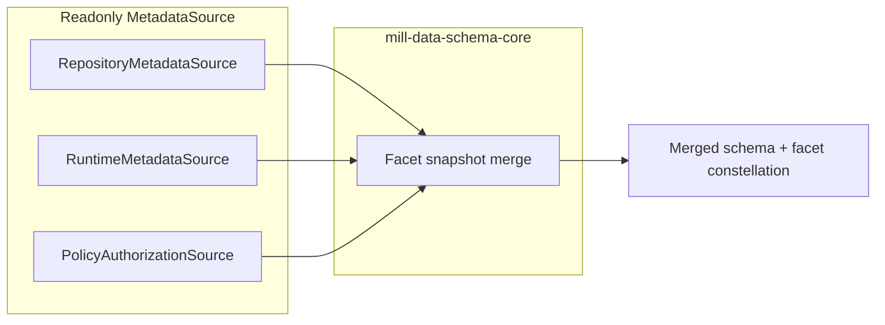

# Story: Layered metadata sources and inferred facets

**Status:** design / backlog  
**Tracked:** `docs/workitems/BACKLOG.md` — **M-31**  
**Related code (today):**  
`SchemaFacetService` / `SchemaFacetServiceImpl` in `data/mill-data-schema-core`, `FacetRepository` / `MetadataReader` in `metadata/mill-metadata-core`, physical schema via `SchemaProvider` in `data/mill-data-backend-core`.

## Objective

Full schema-bound metadata visible to users and APIs must be the **combination** of:

1. **Collected (captured) facets** — persisted as **`FacetAssignment`** rows (domain); JPA maps via **`JpaFacetInstance`**. Editable through metadata services and UI; merged read view uses **`FacetInstance`** with `origin = CAPTURED`.
2. **Inferred facets** — represented at **read time** from other subsystems (physical schema, backends, **authorization/policy**, etc.). They are **not** stored as metadata assignments and **must not** be created, updated, or deleted through metadata mutation APIs.

The aggregation boundary remains **`mill-data-schema-core`** (alongside today’s `SchemaFacetService`), so every physical schema/table/column from `SchemaProvider` still appears in the merged result, now with facets from **all** sources.

## Core contract: `MetadataSource` (read-only)

- **`MetadataSource`** is a **pure readonly** per-**origin** contract: **`fetchForEntity(entityId, MetadataReadContext) -> List<FacetInstance>`** (alias `contributeForEntity` ok). **`FacetInstance`** here is the **unified read model** (captured or inferred: `origin`, `originId`, `assignmentUid`, payload).
- **No** save/update/delete on this interface.
- **Not** the persisted **catalog-only** read bundle; that optional type is **`PersistenceCatalogReads` (`EntityReadSide` + `FacetReadSide`)** — see [`DESIGN-GAPS.md`](../../workitems/metadata-and-ui-improve-and-clean/DESIGN-GAPS.md).
- The **repository** participates as a source via **`RepositoryMetadataSource`**, using **`FacetReadSide`** to load **`FacetAssignment`** rows and map them to **`FacetInstance`** (`CAPTURED`). **Writes** stay on **`FacetRepository`** ( **`FacetWriteSide`** ) / `FacetService` / REST — **orthogonal** to **`MetadataSource`**.

## Full population

**Full metadata** for a schema-facing snapshot = **merge** contributions from **every** registered **`MetadataSource`** (repository read + runtime/backend readers + policy, etc.) into one effective view per node, subject to explicit **precedence rules** per facet type (see below).

**Implementation note — composition first, class when reuse appears:** Merge logic
should live where the product already resolves “effective facets” (**e.g.**
**`FacetService.resolve`** for metadata REST, **`SchemaFacetServiceImpl`** for the
schema/model tree), as **inline composition** over injected **`List<MetadataSource>`**
(or explicit collaborators). **Do not** introduce a public **`CompositeMetadataSource`**
/ **`AggregatingMetadataSource`** type until **reuse is identified** (second call site
or testable surface that must share the exact same merge + muting rules).

**As-built (confirm):** **`MetadataSource`** is not in production Kotlin yet (WI-132).
Captured-facet merge today is centralized in **`FacetService`** (`MetadataEntityController`,
**`MetadataView`**); schema-bound aggregation is **`SchemaFacetService`**. There is
**no** existing shared type that merges multiple origins — so a **dedicated merger class
is optional / premature** until inferred sources land and **two** stacks need the same
orchestration.

When reuse appears, extract a **small** read-only helper or **`MetadataSource`**
decorator and cover it with unit tests; still **do not** replace **`FacetRepository`**
globally — see [`DESIGN-GAPS.md` §Aggregation](../../workitems/metadata-and-ui-improve-and-clean/DESIGN-GAPS.md).

## Examples of inferred facets

| Kind | Owned by | Metadata CRUD |
|------|----------|---------------|
| Structural / physical signals from `Schema` proto | Backend / `SchemaProvider` | Read-only via metadata |
| Data **authorization** (policy-bound, schema coordinates) | Security / policy (`TableFacetFactoryImpl`-class bridges today) | Read-only via metadata; changes via policy tooling |

## Combining rule

Keep combining logic intentionally simple:

- inferred subsystems should emit their own facet types
- combine contributions for one entity into a single list/set of facets
- avoid field-level merge between inferred sources
- if two inferred sources emit the same facet type for the same entity, treat
  that as a misconfiguration or miswiring signal rather than a supported merge
  case

Captured vs inferred overlap may still be handled explicitly where product rules
require it, but inferred-to-inferred duplicate merge is not a design goal.

## Type modeling

- **Persisted path (domain):** **`FacetAssignment`** in **`FacetRepository`** / **`FacetReadSide`** / **`FacetWriteSide`**; JPA **`JpaFacetInstance`** internal to persistence adapter.
- **Read/merge path:** **`FacetInstance`** for **both** captured and inferred rows (single DTO); older docs used **`FacetContribution`** — retired in favor of **`FacetInstance`** for the unified read model.
- Merge output feeds **`SchemaFacets`** / `*WithFacets` and any new **list-shaped** read API (see UI section).
- Project `origin`, `originId`, `editable`, and `assignmentUid` so the UI can render and gate actions from explicit fields.

## UI: consolidated facet constellation

- **One** merged view in the Data Model / schema explorer: **all** effective facets (**captured + inferred**) are **visible**.  
- **Edit / delete / create** only for **captured** rows (persisted assignments). Inferred rows are **read-only** in place.  
- Prefer **facet-instance-level** fields in the read API so the UI does not infer editability from facet type alone, for example:
  - `origin` (e.g. `CAPTURED`, `INFERRED`)
  - `editable` (true only when captured and the principal may mutate metadata)
  - `assignmentUid` when backed by `FacetInstance.uid`
  - `originId` for source attribution/debugging such as `repository-local`, `flow`, or `policy`

Today’s **`SchemaFacets`** maps one value per well-known facet type; exposing a **`facetsResolved`-style list** (name TBD) may be required when multiple contributions per type or mixed provenance must be shown. OpenAPI should carry this shape for generated clients.

## Mutation guards

- Inferred contributions must **never** be persisted via `FacetRepository`.  
- `FacetService` / REST update & delete must **reject** targets that are not real persisted assignments (synthetic uids / origin checks).

## Delivery checklist (high level)

- [ ] Define `MetadataSource` + **`FacetInstance`** (read) + **`FacetAssignment`** (domain store) + `FacetOrigin` + `MetadataReadContext` in **`mill-metadata-core`** (contracts); JPA types in persistence module — see [`DESIGN-GAPS.md`](../../workitems/metadata-and-ui-improve-and-clean/DESIGN-GAPS.md), **WI-132**.  
- [ ] `RepositoryMetadataSource` (read-only; uses **`FacetReadSide`**).  
- [ ] Runtime source from physical schema; optional policy/authorization source (bridge from existing policy surfaces).  
- [ ] Merge in `SchemaFacetServiceImpl` (or dedicated merger) with the simple contribution-combining rule documented above.  
- [ ] Read API + OpenAPI: list of resolved facets with instance-level `origin`, `originId`, `editable`, and `assignmentUid`.  
- [ ] Mill UI: show full constellation; disable edit chrome for non-captured rows.  
- [ ] Tests: merge rules; mutation rejection for inferred-only targets.

## Open decisions

- Inferred subsystems should own distinct facet types; duplicate inferred facet types for one coordinate should be treated as misconfiguration or miswiring.  
- **Closed:** `MetadataSource` and repository splits — see [`DESIGN-GAPS.md`](../../workitems/metadata-and-ui-improve-and-clean/DESIGN-GAPS.md).

## Related backlog

- **M-32** — Facet **type** catalog visibility: admin facet-type view and list API should include **`FacetTypeSource.OBSERVED`** types alongside **DEFINED** descriptors (metadata capture often creates observed keys before full definitions exist). See [`metadata-facet-type-catalog-defined-and-observed.md`](metadata-facet-type-catalog-defined-and-observed.md).
