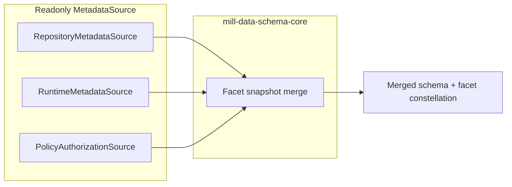

# Story: Layered metadata sources and ephemeral facets

**Status:** design / backlog  
**Tracked:** `docs/workitems/BACKLOG.md` — **M-31**  
**Related code (today):**  
`SchemaFacetService` / `SchemaFacetServiceImpl` in `data/mill-data-schema-core`, `FacetRepository` / `MetadataReader` in `metadata/mill-metadata-core`, physical schema via `SchemaProvider` in `data/mill-data-backend-core`.

## Objective

Full schema-bound metadata visible to users and APIs must be the **combination** of:

1. **Collected (captured) facets** — persisted in the metadata repository (`FacetInstance` rows), editable through metadata services and UI.
2. **Ephemeral / system facets** — derived at **read time** from other subsystems (physical schema, backends, **authorization/policy**, etc.). They are **not** stored as metadata assignments and **must not** be created, updated, or deleted through metadata mutation APIs.

The aggregation boundary remains **`mill-data-schema-core`** (alongside today’s `SchemaFacetService`), so every physical schema/table/column from `SchemaProvider` still appears in the merged result, now with facets from **all** sources.

## Core contract: `MetadataSource` (read-only)

- **`MetadataSource`** is a **pure readonly** contract: it supplies facet **contributions** for entity coordinates (schema / table / column, aligned with existing URN binding).  
- **No** save/update/delete on this interface.  
- The **repository** participates as a source via a **`RepositoryMetadataSource`** adapter that **reads** persisted facets (after scope/cardinality merge via `MetadataReader` or equivalent). **Writes** stay on `FacetRepository` / `FacetService` / REST — **orthogonal** to `MetadataSource`.

## Full population

**Full metadata** for a schema-facing snapshot = **merge** contributions from **every** registered `MetadataSource` (repository read + runtime/backend readers + policy, etc.) into one effective view per node, subject to explicit **precedence rules** per facet type (see below).

## Examples of ephemeral / system facets

| Kind | Owned by | Metadata CRUD |
|------|----------|---------------|
| Structural / physical signals from `Schema` proto | Backend / `SchemaProvider` | Read-only via metadata |
| Data **authorization** (policy-bound, schema coordinates) | Security / policy (`TableFacetFactoryImpl`-class bridges today) | Read-only via metadata; changes via policy tooling |

## Precedence (must be explicit per product)

Define a small **rule table** per facet type before implementation. Illustrative defaults:

- **`structural`:** physical truth often from runtime; collected overlays need non-overlapping fields or a separate facet type.  
- **`descriptive` / `relation` / `concept` / `value-mapping`:** usually **collected** only unless product adds backend-derived descriptions.  
- **`authorization` / policy:** **system-only** in the merged view; never written or overridden through the metadata repository.

Document the chosen rules next to the merge implementation and back them with tests.

## Type modeling

- Persisted path unchanged: **`FacetInstance`** for repository rows.  
- Ephemeral contributions should use a **DTO** at the merge boundary (e.g. synthetic contribution or `FacetContribution`) rather than fake `FacetInstance` uids.  
- Merge output feeds **`SchemaFacets`** / `*WithFacets` and any new **list-shaped** read API (see UI section).

## UI: consolidated facet constellation

- **One** merged view in the Data Model / schema explorer: **all** effective facets (**captured + ephemeral/system**) are **visible**.  
- **Edit / delete / create** only for **captured** rows (persisted assignments). Ephemeral rows are **read-only** in place.  
- Prefer **facet-instance-level** fields in the read API so the UI does not infer editability from facet type alone, for example:
  - `provenance` / `sourceKind` (e.g. `CAPTURED`, `EPHEMERAL`, `SYSTEM`)
  - `editable` (true only when captured and the principal may mutate metadata)
  - `assignmentUid` when backed by `FacetInstance.uid`
  - optional `sourceId` for debugging

Today’s **`SchemaFacets`** maps one value per well-known facet type; exposing a **`facetsResolved`-style list** (name TBD) may be required when multiple contributions per type or mixed provenance must be shown. OpenAPI should carry this shape for generated clients.

## Mutation guards

- Ephemeral contributions must **never** be persisted via `FacetRepository`.  
- `FacetService` / REST update & delete must **reject** targets that are not real persisted assignments (synthetic uids / provenance checks).

## Delivery checklist (high level)

- [ ] Define `MetadataSource` + contribution DTO + provenance enum in appropriate module (`mill-metadata-core` vs `mill-data-schema-core` — decide dependency direction).  
- [ ] `RepositoryMetadataSource` (read-only).  
- [ ] Runtime source from physical schema; optional policy/authorization source (bridge from existing policy surfaces).  
- [ ] Merge in `SchemaFacetServiceImpl` (or dedicated merger) with documented precedence.  
- [ ] Read API + OpenAPI: list of resolved facets with instance-level provenance and `editable`.  
- [ ] Mill UI: show full constellation; disable edit chrome for non-captured rows.  
- [ ] Tests: merge rules; mutation rejection for ephemeral-only targets.

## Open decisions

- When two sources supply the **same** facet type for one coordinate: collected vs ephemeral vs field-level merge — prefer **non-overlapping ownership by facet type** unless product requires overlap.  
- Exact module placement of the `MetadataSource` interface for minimal coupling.

## Related backlog

- **M-32** — Facet **type** catalog visibility: admin facet-type view and list API should include **`FacetTypeSource.OBSERVED`** types alongside **DEFINED** descriptors (metadata capture often creates observed keys before full definitions exist). See [`metadata-facet-type-catalog-defined-and-observed.md`](metadata-facet-type-catalog-defined-and-observed.md).
