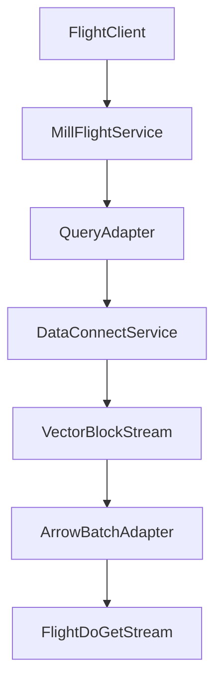

# Arrow Flight Server Design

## Goal

Expose Mill query execution over Apache Arrow Flight for high-throughput columnar transport.

This track is transport-first and independent from Arrow Flight SQL command semantics.

## Scope

- Flight endpoints for data retrieval (`GetFlightInfo`, `DoGet`)
- schema and ticket model for query execution
- auth/TLS alignment with existing Mill service modes
- stable Mill logical type to Arrow type mapping

## Why It Fits Mill

- Mill already serves columnar payloads (`VectorBlock`) with schema metadata.
- Existing query APIs support paging and streaming patterns that can map to Flight streams.
- gRPC service foundation exists, reducing transport integration risk.

## Type Mapping Baseline (Mill -> Arrow)

- `TINY_INT` -> `int8` (wire is widened `int32`, cast in adapter)
- `SMALL_INT` -> `int16` (wire is widened `int32`, cast in adapter)
- `INT` -> `int32`
- `BIG_INT` -> `int64`
- `BOOL` -> `bool`
- `FLOAT` -> `float32`
- `DOUBLE` -> `float64`
- `STRING` -> `utf8`
- `BINARY` -> `binary`
- `UUID` -> `fixed_size_binary(16)` (preferred over string)
- `DATE` -> `date32`
- `TIME` -> `time64(ns)`
- `TIMESTAMP` -> `timestamp(ms)`
- `TIMESTAMP_TZ` -> `timestamp(ms, "UTC")`
- `INTERVAL_DAY` -> `duration(s)` (or documented alternative)
- `INTERVAL_YEAR` -> `int32` with explicit semantic metadata

## Temporal Timezone Rule

Arrow timestamp timezone is column-level metadata, not per-row.

For per-row timezone data, use:
- instant column: `timestamp(ms, "UTC")`
- companion zone column: IANA id (`utf8`)

For wire efficiency, zone ids should use Arrow dictionary encoding.

## Architecture

## Phases

1. Basic Flight service skeleton and auth
2. Query ticket format + `GetFlightInfo`/`DoGet`
3. Type mapping and nullability parity tests
4. Throughput, backpressure, and memory tuning
5. Compatibility validation with Arrow Flight clients

## Risks

- timestamp/interval semantic drift across consumers
- nullability and precision mismatches during conversion
- flow-control/backpressure behavior for large result sets
