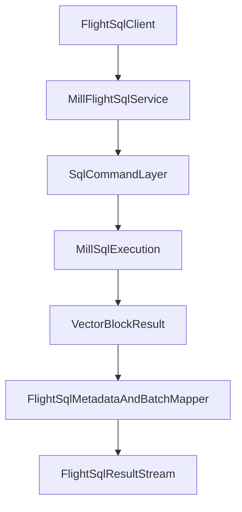

# Arrow Flight SQL Server Design

## Goal

Add Arrow Flight SQL semantics on top of the Flight transport layer so SQL clients and BI tools can query Mill with metadata discovery and standard command flow.

This track is separate from base Arrow Flight transport and depends on it.

## Scope

- Flight SQL command handling for statement execution
- metadata surfaces (catalogs, schemas, tables, columns)
- prepared statement lifecycle support (as feasible)
- compatibility focus for common Flight SQL clients

## Dependency

Requires baseline Flight server capability from `arrow-flight-server-design.md`.

## Semantic Model

- SQL text enters Flight SQL command path.
- Mill query backend executes SQL and returns vector blocks.
- Flight SQL layer maps result schema/metadata to Flight SQL responses.

## Temporal Timezone Contract

For per-row time zone scenarios:
- Keep instant as UTC timestamp column (`timestamp(ms, "UTC")`).
- Carry zone id as separate IANA string column.
- Use dictionary encoding for zone-id column to reduce wire size.

This avoids abusing Arrow timestamp `tz` metadata, which is column-level only.

## Architecture

## Phases

1. Implement core Flight SQL command routing for statement execution
2. Add metadata endpoints (schemas/tables/columns) from Mill schema APIs
3. Add prepared statement support or document explicit limitations
4. Validate with Flight SQL client/tool matrix
5. Harden error mapping, auth behavior, and observability

## Risks

- Feature expectation mismatch across Flight SQL clients
- metadata compatibility nuances (identifier case, schema catalog behavior)
- prepared statement and parameter semantics may require staged rollout

## Out of Scope

- replacing existing gRPC/HTTP APIs
- introducing non-IANA numeric timezone identifiers
