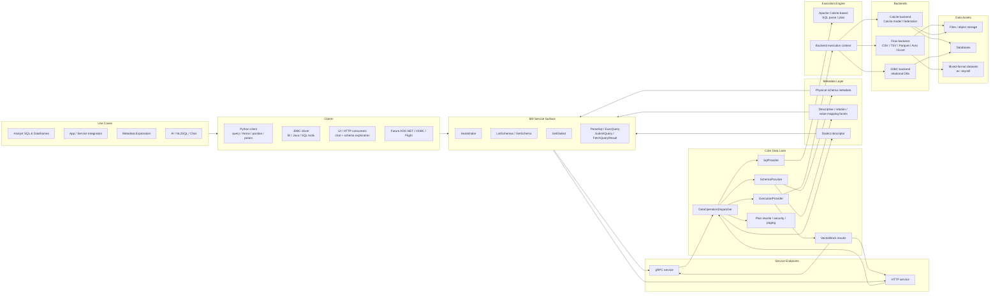

# Mill Data Lane One-Pager

One-page architecture view of how Mill turns heterogeneous data into a consistent SQL and metadata
service for clients.

## What Mill Does

Mill sits between heterogeneous data sources and multiple client surfaces. It normalizes schemas,
executes SQL through a common engine/service boundary, enriches the model with metadata, and serves
results over transport APIs that can be consumed by Python, JDBC, UI, and AI layers.

Real example tracks in `C:\Users\vm\wip\qpointz\examples`:

- `01_QuickStart`: query a running Mill service from Python
- `02_ConnectCSV`: expose local CSV files through Flow backend
- `03_JdbcBackend`: expose JDBC-backed H2 / relational data through Mill
- `05_DataframesExample`: consume Mill results as pandas / Arrow / polars
- `06_MixingFormats`: join CSV + Parquet + Excel in one logical schema

## Visual

## End-to-End Data Flow

1. Data is registered through a backend:
   Flow over files, Calcite models, or JDBC over databases.
2. Mill exposes those assets as logical schemas and tables.
3. Clients discover capabilities and metadata through `Handshake`, `ListSchemas`, `GetSchema`,
   and optionally `GetDialect`.
4. SQL arrives through gRPC or HTTP.
5. Mill parses and plans SQL with Calcite-based infrastructure.
6. The selected backend executes the plan and returns columnar `VectorBlock` chunks.
7. Clients materialize those chunks into rows, dataframes, JDBC result sets, UI payloads, or AI
   workflow inputs.

## Layer Notes

### Sources and Backends

- **Flow backend**: best for file-based analytics and mixed-format datasets.
  Example: CSV + Parquet + Excel under one `skymill` schema.
- **JDBC backend**: best when Mill fronts an existing relational system.
  Example: H2 initialized from `skymill.sql`.
- **Calcite backend**: best when schemas are defined by Calcite models or federation rules.

### SQL Engine

- Mill is a remote SQL service, not an embedded client-side SQL engine.
- SQL parsing/planning is Calcite-based.
- Backend-specific access is hidden behind provider/execution boundaries.
- Dialect may vary by deployment and is discoverable through the dialect endpoint when supported.

### Metadata

- Mill serves more than rows.
- It serves:
  - schema/table/field structure
  - dialect descriptor and SQL capabilities
  - higher-level metadata facets used by UI and AI flows

### Result Model

- Wire result format is **columnar vector blocks**
- Client-facing result models may be:
  - Python dict rows / Arrow / pandas / polars
  - JDBC `ResultSet`
  - UI tables and schema views
  - AI reasoning inputs

## Why This Architecture Matters

- **One logical SQL surface** across files, databases, and mixed sources
- **One metadata surface** for clients, UI, and AI
- **One transport/service contract** for multiple client ecosystems
- **Backend flexibility** without changing the client contract
- **Columnar result transport** for efficient paging and downstream dataframe conversion

## Primary References

- Public quickstart: <https://docs.qpointz.io/quickstart/>
- Flow backend: <https://docs.qpointz.io/backends/flow/>
- Calcite backend: <https://docs.qpointz.io/backends/calcite/>
- Skymill schema: <https://docs.qpointz.io/reference/skymill-schema/>
- Service contract: `proto/data_connect_svc.proto`
- Dispatcher boundary:
  `data/mill-data-backend-core/src/main/java/io/qpointz/mill/data/backend/dispatchers/DataOperationDispatcherImpl.java`
- gRPC service:
  `services/mill-data-grpc-service/src/main/java/io/qpointz/mill/data/backend/MillGrpcService.java`
- HTTP controller:
  `services/mill-data-http-service/src/main/java/io/qpointz/mill/data/backend/access/http/controllers/AccessServiceController.java`
  (failures surfaced as RFC 9457 Problem Details via
  `.../access/http/advice/AccessServiceProblemAdvice.java`)
- Client error mapping (Python JDBC, parity): [`docs/design/client/client-error-transparency.md`](../client/client-error-transparency.md)
