# Mill Platform — Module Dependency Graph

**Generated:** February 2026
**Scope:** All Gradle modules, annotated PURE / SPRING

## Legend

- **PURE** — zero Spring dependencies in main compile classpath (test-only Spring is OK)
- **SPRING** — Spring Boot / Spring Security / Spring AI in main compile classpath
- **SPRING ⚠** — should-be-pure module that still carries Spring contamination
- `-->|api|` — Gradle `api()` dependency (transitive)
- `-->|impl|` — Gradle `implementation()` dependency (non-transitive)

## Mermaid Diagram

```mermaid
graph TD
    classDef pure fill:#c8e6c9,stroke:#2e7d32,stroke-width:2px,color:#1b5e20
    classDef spring fill:#ffcdd2,stroke:#c62828,stroke-width:2px,color:#b71c1c
    classDef mixed fill:#fff9c4,stroke:#f9a825,stroke-width:2px,color:#f57f17
    classDef app fill:#e1bee7,stroke:#6a1b9a,stroke-width:2px,color:#4a148c

    subgraph CORE
        mill-core[mill-core<br/>PURE]:::pure
        mill-security[mill-security<br/>PURE]:::pure
        mill-security-ac[mill-security-autoconfigure<br/>SPRING]:::spring
        mill-test-kit[mill-test-kit<br/>SPRING]:::spring
        mill-well-known[mill-well-known-service<br/>SPRING]:::spring
    end

    subgraph METADATA
        meta-core[mill-metadata-core<br/>SPRING ⚠]:::mixed
        meta-ac[mill-metadata-autoconfigure<br/>SPRING]:::spring
        meta-provider[mill-metadata-provider<br/>PURE]:::pure
        meta-service[mill-metadata-service<br/>SPRING]:::spring
    end

    subgraph DATA
        data-service[mill-data-service<br/>PURE]:::pure
        data-backends[mill-data-backends<br/>SPRING ⚠]:::mixed
        data-ac[mill-data-autoconfigure<br/>SPRING]:::spring
        data-grpc[mill-data-grpc-service<br/>SPRING]:::spring
        data-http[mill-data-http-service<br/>SPRING]:::spring
    end

    subgraph DATA-SOURCE
        source-core[mill-data-source-core<br/>PURE]:::pure
        source-calcite[mill-data-source-calcite<br/>PURE]:::pure
        fmt-text[format-text<br/>PURE]:::pure
        fmt-excel[format-excel<br/>PURE]:::pure
        fmt-avro[format-avro<br/>PURE]:::pure
        fmt-parquet[format-parquet<br/>PURE]:::pure
    end

    subgraph AI
        ai-v1-core[mill-ai-v1-core<br/>SPRING]:::spring
        ai-v1-chat[mill-ai-v1-nlsql-chat-service<br/>SPRING]:::spring
        ai-v2[mill-ai-v2<br/>SPRING]:::spring
        ai-v2-test[mill-ai-v2-test<br/>SPRING]:::spring
    end

    subgraph CLIENTS
        jdbc-driver[mill-jdbc-driver<br/>PURE]:::pure
        jdbc-shell[mill-jdbc-shell<br/>PURE]:::pure
    end

    subgraph UI
        grinder[mill-grinder-service<br/>SPRING]:::spring
    end

    subgraph APPS
        mill-app[mill-service<br/>SPRING assembly]:::app
    end

    %% CORE internal
    mill-security-ac -->|api| mill-security
    mill-security-ac -->|impl| mill-core

    %% METADATA
    meta-core -->|api| mill-core
    meta-ac -->|api| meta-core
    meta-provider -->|api| mill-core
    meta-provider -->|api| meta-core
    meta-provider -->|api| data-service
    meta-service -->|api| meta-core
    meta-service -->|impl| data-ac

    %% DATA
    data-service -->|api| mill-core
    data-service -->|api| mill-security
    data-backends -->|api| data-service
    data-ac -->|api| mill-security-ac
    data-ac -->|api| data-service
    data-ac -->|api| data-backends
    data-ac -->|api| meta-provider
    data-grpc -->|impl| data-backends
    data-grpc -->|impl| data-ac
    data-http -->|impl| data-backends
    data-http -->|impl| data-ac

    %% DATA-SOURCE
    source-core -->|api| mill-core
    source-calcite -->|api| source-core
    source-calcite -->|api| mill-core
    fmt-text -->|api| source-core
    fmt-excel -->|api| source-core
    fmt-avro -->|api| source-core
    fmt-parquet -->|api| source-core
    fmt-parquet -->|impl| fmt-avro

    %% High-level consumers
    mill-test-kit -->|api| data-ac
    mill-well-known -->|api| data-ac
    ai-v1-core -->|api| data-ac
    ai-v1-chat -->|api| ai-v1-core
    ai-v2 -->|impl| mill-core
    ai-v2-test -->|impl| ai-v2
    ai-v2-test -->|impl| mill-core
    grinder -->|impl| data-ac
    jdbc-driver -->|impl| mill-core
    jdbc-shell -->|impl| jdbc-driver

    %% APP assembly
    mill-app -->|impl| data-ac
    mill-app -->|impl| meta-ac
    mill-app -->|impl| mill-well-known
    mill-app -->|impl| meta-service
    mill-app -->|impl| data-backends
    mill-app -->|impl| data-grpc
    mill-app -->|impl| data-http
    mill-app -->|impl| ai-v1-chat
    mill-app -->|impl| grinder
    mill-app -->|impl| source-core
    mill-app -->|impl| source-calcite
    mill-app -->|impl| fmt-text
    mill-app -->|impl| fmt-excel
    mill-app -->|impl| fmt-avro
    mill-app -->|impl| fmt-parquet
```

## Module Summary

| # | Module | Lane | Pure/Spring | Spring deps in main | Internal deps (api + impl) |
|---|--------|------|-------------|---------------------|---------------------------|
| 1 | `core:mill-core` | core | **PURE** | — | — |
| 2 | `core:mill-security` | core | **PURE** | — | — |
| 3 | `core:mill-security-autoconfigure` | core | SPRING | boot-starter-security, OAuth2 | `mill-security` (api), `mill-core` (impl) |
| 4 | `core:mill-test-kit` | core | SPRING | boot-starter, boot-starter-web, boot-starter-test | `data-autoconfigure` (api) |
| 5 | `core:mill-well-known-service` | core | SPRING | boot-starter, boot-starter-web, boot-starter-security | `data-autoconfigure` (api) |
| 6 | `metadata:mill-metadata-core` | metadata | **SPRING ⚠** | **boot-starter (api)** | `mill-core` (api) |
| 7 | `metadata:mill-metadata-autoconfigure` | metadata | SPRING | boot-starter | `metadata-core` (api) |
| 8 | `metadata:mill-metadata-provider` | metadata | **PURE** | — | `mill-core` (api), `metadata-core` (api), `data-service` (api) |
| 9 | `metadata:mill-metadata-service` | metadata | SPRING | boot-starter, boot-starter-web, springdoc | `metadata-core` (api), `data-autoconfigure` (impl) |
| 10 | `data:mill-data-service` | data | **PURE** | — | `mill-core` (api), `mill-security` (api) |
| 11 | `data:mill-data-backends` | data | **SPRING ⚠** | **boot-starter, boot-config-processor** | `data-service` (api) |
| 12 | `data:mill-data-autoconfigure` | data | SPRING | boot-starter, boot-starter-security, jackson | `security-autoconfigure` (api), `data-service` (api), `data-backends` (api), `metadata-provider` (api) |
| 13 | `data:mill-data-grpc-service` | data | SPRING | boot-starter-security, gRPC-Spring-Boot | `data-backends` (impl), `data-autoconfigure` (impl) |
| 14 | `data:mill-data-http-service` | data | SPRING | (transitive via backends/autoconfigure) | `data-backends` (impl), `data-autoconfigure` (impl) |
| 15 | `data:mill-data-source-core` | data | **PURE** | — | `mill-core` (api) |
| 16 | `data:mill-data-source-calcite` | data | **PURE** | — | `data-source-core` (api), `mill-core` (api) |
| 17 | `data:formats:mill-source-format-text` | data | **PURE** | — | `data-source-core` (api) |
| 18 | `data:formats:mill-source-format-excel` | data | **PURE** | — | `data-source-core` (api) |
| 19 | `data:formats:mill-source-format-avro` | data | **PURE** | — | `data-source-core` (api) |
| 20 | `data:formats:mill-source-format-parquet` | data | **PURE** | — | `data-source-core` (api), `format-avro` (impl) |
| 21 | `ai:mill-ai-v1-core` | ai | SPRING | boot-starter, Spring AI | `data-autoconfigure` (api) |
| 22 | `ai:mill-ai-v1-nlsql-chat-service` | ai | SPRING | boot-starter, security, webflux, JPA | `ai-v1-core` (api) |
| 23 | `ai:mill-ai-v2` | ai | SPRING | boot-starter, Spring AI, webflux | `mill-core` (impl) |
| 24 | `ai:mill-ai-v2-test` | ai | SPRING | Spring AI, JUnit | `ai-v2` (impl), `mill-core` (impl) |
| 25 | `clients:mill-jdbc-driver` | clients | **PURE** | — | `mill-core` (impl) |
| 26 | `clients:mill-jdbc-shell` | clients | **PURE** | — | `jdbc-driver` (impl) |
| 27 | `ui:mill-grinder-service` | ui | SPRING | boot-starter, boot-starter-web | `data-autoconfigure` (impl) |
| 28 | `apps:mill-service` | apps | SPRING (assembly) | everything | (all modules) |

## Scorecard

| Metric | Count |
|--------|-------|
| Total modules | 28 |
| Pure (no Spring in main) | **12** |
| Spring (intentionally Spring) | **14** |
| Contaminated (should-be-pure) | **2** |

## Remaining Contamination

### 1. `metadata:mill-metadata-core` — `api(libs.boot.starter)`

This is the most impactful contamination point. `boot-starter` is declared as `api`,
meaning it leaks transitively to every consumer of `metadata-core` — including
`mill-metadata-provider` (which is otherwise pure). The dependency is likely used
for `@Service` or `@Value` annotations that should be removed or replaced.

### 2. `data:mill-data-backends` — `implementation(libs.boot.starter)` + `annotationProcessor(libs.boot.configuration.processor)`

Contains `@ConfigurationProperties` classes (`BackendConfiguration`,
`JdbcCalciteConfiguration`, `CalciteServiceConfiguration`) that are tightly coupled
with backend implementation classes. Splitting these out requires separating the
property-holder POJOs from their `@ConfigurationProperties` annotations — a non-trivial
refactoring deferred during the initial cleanup.
