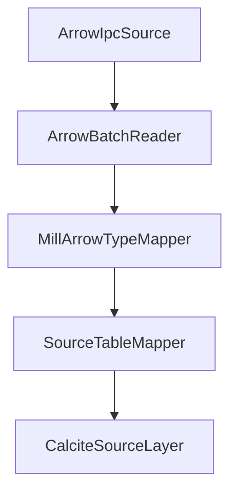

# Arrow Format Support Design

## Goal

Add Apache Arrow format support in the source lane as the first step before Arrow Flight and Flight SQL services.

This step focuses on Arrow as a data serialization/representation format, not only as a wire protocol.

## Scope (Phase 1)

- New source format module for Arrow input under `data/formats`
- Read Arrow IPC stream/file payloads into Mill source abstractions
- Canonical Mill logical type to Arrow type mapping contract
- Validation tests for type parity and nullability

Out of scope for this phase:
- Arrow Flight server endpoints
- Arrow Flight SQL command/metadata protocol
- write-back/export path (can be phase 2)

## Why Start Here

- Reuses existing source-format architecture (`text`, `excel`, `avro`, `parquet`)
- De-risks type mapping semantics before protocol implementation
- Creates a reusable mapping layer for future Flight/Flight SQL work

## Proposed Module

- `data/formats:mill-source-format-arrow`

Responsibilities:
- parse Arrow IPC into tabular source records/batches
- expose schema and row readers compatible with existing source pipeline
- keep conversion logic isolated for reuse by transport layers later

## Type Mapping Contract (Baseline)

- `TINY_INT` -> Arrow `int8` (wire may be widened upstream)
- `SMALL_INT` -> Arrow `int16`
- `INT` -> Arrow `int32`
- `BIG_INT` -> Arrow `int64`
- `BOOL` -> Arrow `bool`
- `FLOAT` -> Arrow `float32`
- `DOUBLE` -> Arrow `float64`
- `STRING` -> Arrow `utf8`
- `BINARY` -> Arrow `binary`
- `UUID` -> Arrow `fixed_size_binary(16)`
- `DATE` -> Arrow `date32`
- `TIME` -> Arrow `time64(ns)`
- `TIMESTAMP` -> Arrow `timestamp(ms)`
- `TIMESTAMP_TZ` -> Arrow `timestamp(ms, "UTC")`
- `INTERVAL_DAY` -> Arrow `duration(s)` (documented convention)
- `INTERVAL_YEAR` -> Arrow `int32` + semantic metadata

## Per-Row Time Zone Rule

Arrow timestamp timezone metadata is column-level only.

For per-row timezone values:
- keep UTC instant in timestamp column
- add companion IANA zone-id string column
- prefer dictionary encoding for zone-id column to reduce wire/storage size

## Architecture

## Phases

1. Introduce `mill-source-format-arrow` module and parser skeleton
2. Implement schema + core scalar type mapping
3. Add temporal and UUID mapping with strict tests
4. Add interval conventions and companion timezone-column guidance tests
5. Integrate with source/calcite pipeline and end-to-end tests

## Risks

- semantic mismatches for intervals and timezone handling
- Arrow vector memory model differences from existing row/record adapters
- compatibility of dictionary-encoded timezone columns across consumers

## Deliverables

- new module in `data/formats`
- mapping spec and tests
- source-lane integration proof (queryable through existing backend path)
