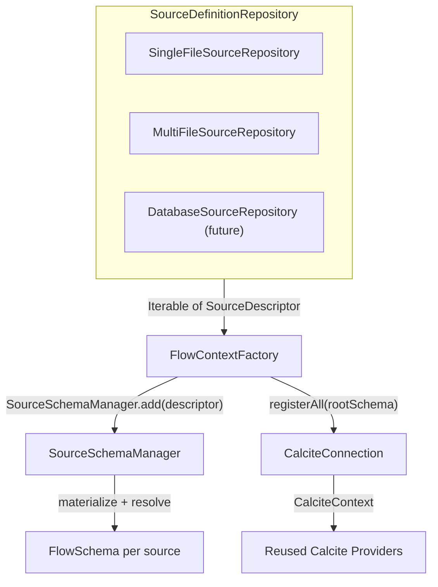
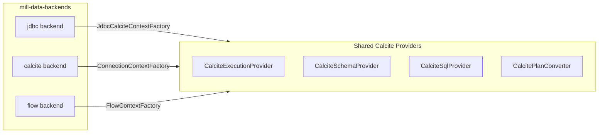

# Flow Backend — Source-Descriptor-Driven Calcite Backend

## 1. Motivation

Mill currently ships two data backends:

| Backend | Data comes from | CalciteContextFactory source |
|---------|----------------|------------------------------|
| **jdbc** | A relational database via JDBC | Calcite model wired to a JDBC adapter |
| **calcite** | A Calcite model JSON file (CSV, file adapters, etc.) | `ConnectionContextFactory` with properties |

Both require the caller to supply a Calcite model or a JDBC URL. Neither supports Mill's own
**source descriptor** model — the YAML-driven, format-agnostic, storage-abstracted framework
implemented in `mill-data-source-core` and exposed to Calcite via `mill-data-source-calcite`.

The **flow** backend closes this gap:

- It accepts one or more `SourceDescriptor` definitions (YAML files today, database rows tomorrow).
- It materializes them into Calcite `FlowSchema` / `FlowTable` instances.
- It reuses the full Calcite provider stack (plan conversion, SQL parsing, schema introspection, execution) — no new provider implementations needed.

The key differentiator is the **repository abstraction**: source definitions can come from
files, a directory scan, a database, or any future storage — the backend does not care.

## 2. Architecture

```
SourceDefinitionRepository          (where definitions live)
        |
        |  getSourceDefinitions() -> Iterable<SourceDescriptor>
        v
FlowContextFactory                  (CalciteContextFactory impl)
        |
        |  creates CalciteConnection
        |  uses SourceSchemaManager to materialize + register FlowSchemas
        v
CalciteContext                       (standard Calcite context)
        |
        +---> CalciteExecutionProvider   (executes plans via RelRunner)
        +---> CalciteSchemaProvider      (introspects schemas/tables)
        +---> CalciteSqlProvider         (parses SQL to Substrait)
        +---> CalcitePlanConverter       (Substrait <-> RelNode <-> SQL)
```

### Data flow



### Why reuse, not rewrite

The existing Calcite providers (`CalciteExecutionProvider`, `CalciteSchemaProvider`,
`CalciteSqlProvider`, `CalcitePlanConverter`) are parameterized only by `CalciteContextFactory`.
They have no knowledge of where schemas come from. By implementing `CalciteContextFactory`
in `FlowContextFactory`, the entire provider stack works without modification.

## 3. SourceDefinitionRepository

```java
package io.qpointz.mill.data.backend.flow;

import io.qpointz.mill.source.descriptor.SourceDescriptor;

public interface SourceDefinitionRepository {
    Iterable<SourceDescriptor> getSourceDefinitions();
}
```

**Contract:**
- Returns zero or more `SourceDescriptor` instances.
- Each descriptor's `name` must be unique across the repository (it becomes a Calcite schema name).
- Implementations may read eagerly (file-based) or lazily (database-backed).
- Implementations should be reusable — `getSourceDefinitions()` may be called multiple times
  (e.g., on each `createContext()` call).

### 3.1 SingleFileSourceRepository

Reads one YAML descriptor file from a `Path`.

```java
public class SingleFileSourceRepository implements SourceDefinitionRepository {
    private final Path descriptorPath;

    public SingleFileSourceRepository(Path descriptorPath) { ... }

    @Override
    public Iterable<SourceDescriptor> getSourceDefinitions() {
        // parse YAML, return singleton list
    }
}
```

### 3.2 MultiFileSourceRepository

Reads multiple YAML descriptor files.

```java
public class MultiFileSourceRepository implements SourceDefinitionRepository {
    private final List<Path> descriptorPaths;

    public MultiFileSourceRepository(List<Path> descriptorPaths) { ... }
    public MultiFileSourceRepository(Path... descriptorPaths) { ... }

    @Override
    public Iterable<SourceDescriptor> getSourceDefinitions() {
        // parse each YAML, return list; validate name uniqueness
    }
}
```

### 3.3 Future: DatabaseSourceRepository

Would implement the same interface, reading `SourceDescriptor` from a JPA repository or JDBC
query. The serialized descriptor could be stored as a YAML/JSON text column, or decomposed
into relational tables. This is out of scope for the initial implementation but the repository
interface is designed to accommodate it.

### 3.4 Future: DirectorySourceRepository

Scans a directory for `*.yaml` / `*.yml` files and treats each as a source descriptor.
Useful for configuration-as-code deployments.

## 4. FlowContextFactory

Implements `CalciteContextFactory`. On each `createContext()` call:

1. Opens a bare Calcite JDBC connection (no model file).
2. Creates a `SourceSchemaManager`.
3. Iterates `repository.getSourceDefinitions()` and calls `manager.add(descriptor)` for each.
4. Calls `manager.registerAll(rootSchema)` to register `FlowSchema` instances as Calcite sub-schemas.
5. Builds and returns a `CalciteContext` wrapping the connection.

```java
package io.qpointz.mill.data.backend.flow;

import io.qpointz.mill.data.backend.calcite.CalciteContext;
import io.qpointz.mill.data.backend.calcite.CalciteContextFactory;
import io.qpointz.mill.source.calcite.SourceSchemaManager;

public class FlowContextFactory implements CalciteContextFactory {

    private final SourceDefinitionRepository repository;
    private final Properties connectionProperties;

    public FlowContextFactory(
            SourceDefinitionRepository repository,
            Properties connectionProperties) { ... }

    @Override
    public CalciteContext createContext() throws Exception {
        // 1. Open Calcite connection
        // 2. Create SourceSchemaManager
        // 3. For each descriptor: manager.add(descriptor)
        // 4. manager.registerAll(rootSchema)
        // 5. Return CalciteContext
    }
}
```

### Connection properties

`FlowContextFactory` accepts a `Properties` object for Calcite connection configuration
(parser settings, case sensitivity, etc.). The `CalciteSqlDialectConventions` utility can
produce these from a `SqlDialectSpec`, same as in the calcite backend.

## 5. Constants

```java
package io.qpointz.mill.data.backend.flow;

public final class FlowBackendConstants {
    private FlowBackendConstants() {}

    public static final String BACKEND_NAME = "flow";
}
```

The name is centralized here so renaming the backend later requires changing one constant.

## 6. FlowBackendContextRunner (Test Rig)

Extends `BackendContextRunner` in `mill-data-testkit`. Follows the same pattern as
`CalciteBackendContextRunner` but constructs `FlowContextFactory` from a
`SourceDefinitionRepository` instead of a Calcite model path.

```kotlin
class FlowBackendContextRunner(
    private val repository: SourceDefinitionRepository,
    private val sqlDialectConventions: CalciteSqlDialectConventions,
    private val extensionCollection: SimpleExtension.ExtensionCollection,
    private val extensionCollector: ExtensionCollector,
    private val substraitDispatcher: SubstraitDispatcher,
    // override parameters...
) : BackendContextRunner(...) {

    override fun buildCalciteContextFactory(): CalciteContextFactory {
        return FlowContextFactory(repository, sqlDialectConventions.asProperties())
    }

    // buildPlanConverter, buildExecutionProvider, buildSchemaProvider, buildSqlProvider
    // are identical to CalciteBackendContextRunner

    companion object {
        @JvmStatic
        fun flowContext(repository: SourceDefinitionRepository): FlowBackendContextRunner { ... }

        @JvmStatic
        fun flowContext(descriptorPath: Path): FlowBackendContextRunner {
            return flowContext(SingleFileSourceRepository(descriptorPath))
        }

        @JvmStatic
        fun flowContext(descriptorPaths: List<Path>): FlowBackendContextRunner {
            return flowContext(MultiFileSourceRepository(descriptorPaths))
        }
    }
}
```

## 7. Module Dependencies

### mill-data-backends

```kotlin
// build.gradle.kts — new dependency
api(project(":data:mill-data-source-calcite"))
```

This transitively brings in `mill-data-source-core`.

### mill-data-testkit

```kotlin
// build.gradle.kts — new dependency
api(project(":data:mill-data-source-calcite"))
```

## 8. Package Layout

```
data/mill-data-backends/src/main/java/io/qpointz/mill/data/backend/
├── calcite/          (existing)
├── jdbc/             (existing)
└── flow/             (new)
    ├── FlowBackendConstants.java
    ├── FlowContextFactory.java
    ├── SourceDefinitionRepository.java
    ├── SingleFileSourceRepository.java
    └── MultiFileSourceRepository.java
```

## 9. Extensibility

### Adding a new repository implementation

1. Implement `SourceDefinitionRepository`.
2. Pass it to `FlowContextFactory` or `FlowBackendContextRunner`.
3. No changes to providers, no changes to the backend wiring.

### Adding new source formats

Source formats (CSV, Parquet, Avro, etc.) are handled by `mill-data-source-core` via SPI.
Adding a new format handler automatically makes it available to the flow backend — no
changes in `mill-data-backends` required.

### Adding new storage backends

Storage backends (local, S3, Azure, HDFS) are also SPI-based in `mill-data-source-core`.
Same principle: add the implementation, and the flow backend picks it up.

### CalciteContextFactory override

Because `FlowContextFactory` is a standard `CalciteContextFactory`, it can be overridden
via `BackendContextRunner.withCalciteContextFactory()` in tests, or swapped in Spring
autoconfiguration.

## 10. Relationship to Existing Backends



All three backends produce a `CalciteContextFactory`. The shared providers are agnostic
to the source of schemas. The backends differ only in how they populate the Calcite root
schema:

| Backend | Schema source | CalciteContextFactory |
|---------|--------------|----------------------|
| jdbc | JDBC database via Calcite JDBC adapter | `JdbcCalciteContextFactory` |
| calcite | Calcite model JSON file | `ConnectionContextFactory` |
| **flow** | SourceDescriptor YAML via SourceSchemaManager | `FlowContextFactory` |

## 11. Spring Auto-Configuration

Package: `io.qpointz.mill.autoconfigure.data.backend.flow`

Follows the same pattern as `CalciteBackendAutoConfiguration` and `JdbcBackendAutoConfiguration`:
activated by `mill.data.backend.type=flow`.

### FlowBackendProperties

```java
@ConfigurationProperties(prefix = MILL_DATA_BACKEND_CONFIG_KEY + ".flow")
public class FlowBackendProperties {
    /**
     * Paths to source descriptor YAML files.
     * A single path yields one schema; multiple paths yield multiple schemas.
     */
    private List<String> sources = new ArrayList<>();
}
```

Configuration example:

```yaml
mill:
  data:
    backend:
      type: flow
      flow:
        sources:
          - /etc/mill/sources/warehouse.yaml
          - /etc/mill/sources/analytics.yaml
```

### FlowBackendAutoConfiguration

```java
@AutoConfiguration(after = BackendAutoConfiguration.class)
@EnableConfigurationProperties(FlowBackendProperties.class)
@ConditionalOnProperty(prefix = MILL_DATA_BACKEND_CONFIG_KEY, name = "type", havingValue = "flow")
public class FlowBackendAutoConfiguration {

    @Bean
    public SourceDefinitionRepository flowSourceDefinitionRepository(FlowBackendProperties props) {
        List<Path> paths = props.getSources().stream()
                .map(Path::of)
                .toList();
        return new MultiFileSourceRepository(paths);
    }

    @Bean
    public CalciteContextFactory flowCalciteContextFactory(
            SourceDefinitionRepository repository,
            CalciteSqlDialectConventions sqlDialectConventions,
            SqlProperties sqlProperties) {
        Properties props = new Properties();
        props.putAll(sqlDialectConventions.asMap(sqlProperties.getConventions()));
        return new FlowContextFactory(repository, props);
    }

    @Bean
    public PlanConverter flowPlanConverter(
            CalciteContextFactory ctxFactory,
            SimpleExtension.ExtensionCollection extensionCollection,
            CalciteSqlDialectConventions conventions) {
        return new CalcitePlanConverter(ctxFactory, conventions.sqlDialect(), extensionCollection);
    }

    @Bean
    public ExtensionCollector flowExtensionCollector() {
        return new ExtensionCollector();
    }

    @Bean
    public SchemaProvider flowSchemaProvider(
            CalciteContextFactory ctxFactory,
            ExtensionCollector extensionCollector) {
        return new CalciteSchemaProvider(ctxFactory, extensionCollector);
    }

    @Bean
    public ExecutionProvider flowExecutionProvider(
            CalciteContextFactory ctxFactory,
            PlanConverter converter) {
        return new CalciteExecutionProvider(ctxFactory, converter);
    }

    @Bean
    public SqlProvider flowSqlProvider(
            CalciteContextFactory ctxFactory,
            SubstraitDispatcher substraitDispatcher) {
        return new CalciteSqlProvider(ctxFactory, substraitDispatcher);
    }
}
```

### Registration

Add to `META-INF/spring/org.springframework.boot.autoconfigure.AutoConfiguration.imports`:

```
io.qpointz.mill.autoconfigure.data.backend.flow.FlowBackendAutoConfiguration
```

---

*Created: 2026-02-22*
