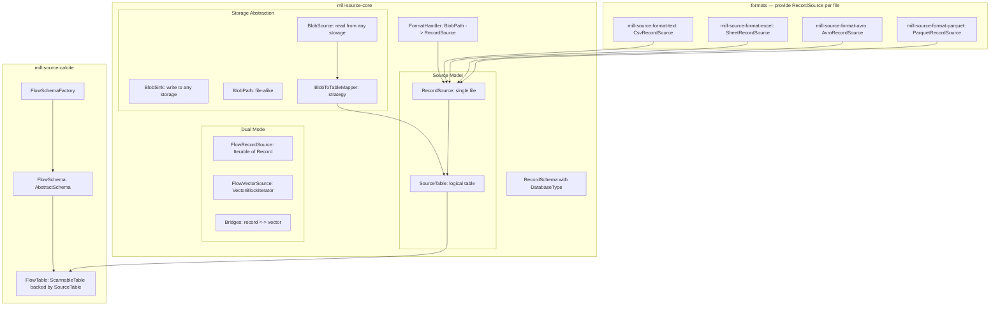

# source — Mill Source Provider

**Implementation language: Kotlin (JVM).** All source modules are Kotlin, using `kotlin("jvm")` Gradle plugin. mill-core (dependency) is Java.

Kotlin library providing file-based data (CSV, FWF, Excel, Avro, Parquet) as a data provider in the mill ecosystem.

Storage abstraction (BlobSource/BlobSink/BlobPath) for local/cloud backends. Three-level model aligned with mill's Schema/Table hierarchy: Source (= schema), SourceTable (= logical table, multi-file), RecordSource (= single file reader). Dual-mode: row-oriented or columnar. Mill-core type system. Calcite adapter in separate module.

## Key Design: Source = Schema, Table Mapper = Tables

In mill, a **schema** is a collection of tables. This module aligns with that:

- **Source** = one configured storage location (directory, S3 bucket, ...) with a format and table mapping strategy. **One source = one schema.** The source's `name` becomes the schema name in mill.
- **BlobToTableMapper** on that source determines **tables** — each mapped group of blobs becomes one logical table within the schema.
- **RecordSource** = reads ONE file/blob, produces records or vectors. This is the lowest-level, format-specific reader.

```mermaid
flowchart LR
    subgraph blobDiscovery [Storage Abstraction]
        BlobSrc["BlobSource: read from local / S3 / Azure / ..."]
        BlobSnk["BlobSink: write to local / S3 / Azure / ..."]
        Mapper["BlobToTableMapper: regex / directory / ..."]
    end

    subgraph singleFile [RecordSource — single file]
        RS1["file_1.parquet -> RecordSource"]
        RS2["file_2.parquet -> RecordSource"]
        RS3["file_3.parquet -> RecordSource"]
    end

    subgraph sourceTable [SourceTable — logical table (multi-file)]
        DS["SourceTable: union of RecordSources"]
    end

    BlobSrc --> Mapper
    Mapper --> RS1
    Mapper --> RS2
    Mapper --> RS3
    RS1 --> DS
    RS2 --> DS
    RS3 --> DS
```

This mirrors the [rapids blob model](misc/rapids/rapids-core-legacy/src/main/java/io/qpointz/rapids/calcite/blob/):
- `BlobSource.listBlobs()` -> discover files
- `BlobToTableMapper.mapPathToTable()` -> group by table
- Per-file readers -> union into table

But flow_scala was missing this entirely — its `RecordReader` was always one file.

## Architecture



## Project Structure

```
source/                                         (included from root settings.gradle.kts)
  build.gradle.kts
  mill-source-core/                            (:source:mill-source-core)
      -- Storage abstraction (BlobSource, BlobSink), source model, dual-mode, mill bridges
  formats/
    mill-source-format-text/                   (:source:formats:mill-source-format-text)
        -- CSV, FWF, TSV (row-oriented RecordSource per file)
    mill-source-format-excel/                  (:source:formats:mill-source-format-excel)
        -- Excel (row-oriented RecordSource per sheet)
    mill-source-format-avro/                   (:source:formats:mill-source-format-avro)
        -- Avro (row-oriented RecordSource per file, no Hadoop dependency)
    mill-source-format-parquet/                (:source:formats:mill-source-format-parquet)
        -- Parquet (row-oriented RecordSource per file, minimal Hadoop, BlobInputFile/BlobOutputFile)
  mill-source-calcite/                         (:source:mill-source-calcite)
      -- Calcite adapter (Source -> Calcite Schema, SourceTable -> ScannableTable)
```

## Build Setup

Source modules are included from the **root** `settings.gradle.kts` (there is no `source/settings.gradle.kts`):

```kotlin
// in repo root settings.gradle.kts
include (":source")
include (":source:mill-source-core")
include (":source:formats:mill-source-format-text")
include (":source:formats:mill-source-format-excel")
include (":source:formats:mill-source-format-avro")
include (":source:formats:mill-source-format-parquet")
include (":source:mill-source-calcite")
```

**All entries are present in `libs.versions.toml`:** `jackson-core`, `jackson-databind`, `jackson-dataformat-yaml`, `jackson-module-kotlin`, `jackson-datatype-jsr310`, `jackson-datatype-jdk8`, `calcite-core`, `apache-poi`, `apache-poi-ooxml`, `univocity-parsers`, `apache-avro`, `apache-parquet-avro`, `apache-hadoop-common`, `apache-hadoop-client`, `hadoop-bare-naked-local-fs-lib`, `caffeine`, `junit-jupiter-api`, `mockito-core`, `slf4j-api`, `logback-*`.

### Per-module build.gradle.kts

**mill-source-core:**

```kotlin
plugins {
    kotlin("jvm")
    id("io.qpointz.plugins.mill")
}

mill {
    description = "Mill source core — storage abstraction, source model, descriptors"
    publishArtifacts = true
}

dependencies {
    api(project(":core:mill-core"))
    implementation(libs.jackson.databind)
    implementation(libs.jackson.dataformat.yaml)
    implementation(libs.jackson.module.kotlin)
    implementation(libs.jackson.datatype.jsr310)
    implementation(libs.jackson.datatype.jdk8)
    compileOnly(libs.bundles.logging)
}
```

**mill-source-format-text:**

```kotlin
plugins {
    kotlin("jvm")
    id("io.qpointz.plugins.mill")
}

mill {
    description = "Mill source format — CSV, FWF"
    publishArtifacts = true
}

dependencies {
    api(project(":source:mill-source-core"))
    implementation(libs.univocity.parsers)
    compileOnly(libs.bundles.logging)
}
```

**mill-source-format-excel:**

```kotlin
plugins {
    kotlin("jvm")
    id("io.qpointz.plugins.mill")
}

mill {
    description = "Mill source format — Excel"
    publishArtifacts = true
}

dependencies {
    api(project(":source:mill-source-core"))
    implementation(libs.apache.poi)
    implementation(libs.apache.poi.ooxml)
    compileOnly(libs.bundles.logging)
}
```

**mill-source-format-avro:**

```kotlin
dependencies {
    api(project(":source:mill-source-core"))
    implementation(libs.apache.avro)
    compileOnly(libs.bundles.logging)
}
```

**mill-source-format-parquet:**

```kotlin
dependencies {
    api(project(":source:mill-source-core"))
    implementation(project(":source:formats:mill-source-format-avro"))
    implementation(libs.apache.parquet.avro)
    // Minimal hadoop-common (~4.5MB) with aggressive exclusions.
    // Only core Hadoop classes (Configuration, Configurable, codecs)
    // are needed internally by parquet-hadoop.
    implementation(libs.apache.hadoop.common) {
        exclude(group = "org.slf4j")
        exclude(group = "org.eclipse.jetty")
        exclude(group = "javax.servlet")
        exclude(group = "org.apache.curator")
        exclude(group = "org.apache.zookeeper")
        exclude(group = "org.apache.kerby")
        exclude(group = "org.apache.hadoop", module = "hadoop-auth")
        // ... more exclusions to strip ~400MB of transitive bloat
    }
    implementation("org.apache.hadoop:hadoop-mapreduce-client-core:3.4.1") {
        // ... similar exclusions
    }
    implementation(libs.apache.avro)
    compileOnly(libs.bundles.logging)
}
```

**mill-source-calcite:**

```kotlin
plugins {
    kotlin("jvm")
    id("io.qpointz.plugins.mill")
}

mill {
    description = "Mill source Calcite adapter"
    publishArtifacts = true
}

dependencies {
    api(project(":source:mill-source-core"))
    api(project(":core:mill-core"))
    implementation(libs.calcite.core)
    compileOnly(libs.bundles.logging)
}
```

The Mill plugin (`io.qpointz.plugins.mill`) auto-applies Java, Jacoco, Lombok, and sets JVM toolchain. Kotlin plugin version is managed by `pluginManagement`. Tests use JUnit 5 and Mockito via `testing { suites { ... } }` blocks:

```kotlin
testing {
    suites {
        configureEach {
            if (this is JvmTestSuite) {
                useJUnitJupiter(libs.versions.junit.get())
                dependencies {
                    implementation(project())
                    implementation(libs.mockito.core)
                    implementation(libs.mockito.junit.jupiter)
                    implementation(libs.slf4j.api)
                    implementation(libs.logback.core)
                    implementation(libs.logback.classic)
                }
            }
        }
    }
}
```

---

## mill-core types used

These types come from `core/mill-core` and are used throughout the source modules:

- **`DatabaseType`** — Java record (`io.qpointz.mill.types.sql`). Represents a column type: `DatabaseType.bool(nullable)`, `DatabaseType.string(nullable, size)`, `DatabaseType.i32(nullable)`, etc.
- **`VectorBlock`** — protobuf-generated (`proto/vector.proto`). A columnar batch: schema + vectorSize + list of Vectors.
- **`VectorBlockSchema`** — protobuf-generated. Schema of a VectorBlock: list of Fields.
- **`VectorBlockIterator`** — interface (`io.qpointz.mill.vectors`). `Iterator<VectorBlock>` with a `schema()` method.
- **`RecordReader`** — interface (`io.qpointz.mill.sql`). Cursor-style reader: `hasNext()`, `next()`, `isNull(col)`, typed getters.
- **`RecordReaders`** — utility class (`io.qpointz.mill.sql`). Factory methods, including `RecordReaders.recordReader(VectorBlockIterator)` to wrap a VectorBlockIterator as a RecordReader.

---

## mill-source-core

Package: `io.qpointz.mill.source`

**Dependencies:** `io.qpointz.mill:mill-core`, `libs.jackson.databind`, `libs.jackson.dataformat.yaml`, `libs.jackson.module.kotlin`, `libs.jackson.datatype.jsr310`, `libs.jackson.datatype.jdk8`, `libs.slf4j.api`

### Record

```kotlin
data class Record(val values: Map<String, Any?>) {
    operator fun get(key: String): Any? = values[key]
    companion object {
        fun of(vararg pairs: Pair<String, Any?>) = Record(mapOf(*pairs))
        fun empty() = Record(emptyMap())
    }
}
```

### RecordSchema — using mill-core DatabaseType

```kotlin
data class SchemaField(val name: String, val index: Int, val type: DatabaseType) {
    fun toProtoField(): Field   // converts to protobuf Field message
}

data class RecordSchema(val fields: List<SchemaField>) {
    val size: Int get() = fields.size
    val fieldNames: List<String> get() = fields.map { it.name }
    fun field(name: String): SchemaField?       // lookup by name
    fun field(index: Int): SchemaField?         // lookup by index
    fun toVectorBlockSchema(): VectorBlockSchema { ... }

    companion object {
        fun of(vararg fields: Pair<String, DatabaseType>): RecordSchema   // indexes assigned sequentially
        fun empty(): RecordSchema = RecordSchema(emptyList())
    }
}
```

### Level 1: RecordSource — single file/blob

A RecordSource reads ONE file and produces data. It can be row-oriented or columnar:

```kotlin
// Base: every source has a schema
interface RecordSource {
    val schema: RecordSchema
}

// Row-oriented (natural for CSV, Excel, Avro)
interface FlowRecordSource : RecordSource, Iterable<Record>

// Columnar (natural for Parquet)
interface FlowVectorSource : RecordSource {
    fun vectorBlocks(batchSize: Int = 1024): VectorBlockIterator
}
```

Format modules create ONE RecordSource per file/blob.

### SourceTable — one logical table (multi-file)

A `SourceTable` represents one logical table within a source/schema. It is backed by multiple files (one `RecordSource` per file), unioned into a single stream:

```kotlin
interface SourceTable {
    val schema: RecordSchema

    // Row-oriented access: union of all files as records
    fun records(): Iterable<Record>

    // Columnar access: union of all files as VectorBlocks
    fun vectorBlocks(batchSize: Int = 1024): VectorBlockIterator

    // Mill integration — default method, delegates to vectorBlocks()
    fun asMillRecordReader(batchSize: Int = 1024): io.qpointz.mill.sql.RecordReader {
        return RecordReaders.recordReader(vectorBlocks(batchSize))
    }
}
```

Default implementation:

```kotlin
class MultiFileSourceTable(
    override val schema: RecordSchema,
    private val sources: List<RecordSource>
) : SourceTable {

    override fun records(): Iterable<Record> {
        // For each source:
        //   FlowRecordSource -> iterate directly
        //   FlowVectorSource -> bridge to records
        // Concatenate all
    }

    override fun vectorBlocks(batchSize: Int): VectorBlockIterator {
        // For each source:
        //   FlowVectorSource -> iterate directly (no conversion!)
        //   FlowRecordSource -> bridge to VectorBlocks
        // Concatenate all (ConcatenatingVectorBlockIterator)
    }

    companion object {
        fun ofSingle(schema: RecordSchema, source: RecordSource): MultiFileSourceTable
        fun empty(schema: RecordSchema): MultiFileSourceTable
    }
}
```

Key: if all underlying sources are columnar (e.g., Parquet), the columnar path has zero overhead — no row materialization. If all are row-oriented (e.g., CSV), the record path has zero overhead. Mixed is also fine.

### Storage Abstraction — BlobSource + BlobPath

**This is a core architectural abstraction.** `BlobSource` / `BlobPath` represent anything "file-alike" — local filesystem, S3, Azure Blob Storage, GCS, HDFS. All file discovery and I/O in flow-kt goes through this interface. Format modules and SourceTable never touch `java.io.File` or `java.nio.file.Path` directly.

Inspired by rapids [BlobSource](misc/rapids/rapids-core-legacy/src/main/java/io/qpointz/rapids/calcite/blob/BlobSource.java) and [LocalFilesystemBlobSource](misc/rapids/rapids-core-legacy/src/main/java/io/qpointz/rapids/providers/local/blob/LocalFilesystemBlobSource.java):

```kotlin
// Identifies a single "file-alike" resource in any storage system
interface BlobPath {
    val uri: URI
}

// Storage-agnostic access to a collection of blobs
interface BlobSource : Closeable {
    // Discover all blobs in this source
    fun listBlobs(): Sequence<BlobPath>
    // Read a blob as a stream
    fun openInputStream(path: BlobPath): InputStream
    // Read a blob with random access (needed by Parquet)
    fun openSeekableChannel(path: BlobPath): SeekableByteChannel
}
```

**Built-in implementation — local filesystem:**

```kotlin
class LocalBlobSource(val rootPath: Path) : BlobSource {
    override fun listBlobs(): Sequence<BlobPath> { /* walk directory tree recursively */ }
    override fun openInputStream(path: BlobPath): InputStream { ... }
    override fun openSeekableChannel(path: BlobPath): SeekableByteChannel { ... }
    override fun close() { /* no-op for local */ }
}

data class LocalBlobPath(
    override val uri: URI,
    val relativePath: Path,
    val absolutePath: Path
) : BlobPath {
    companion object {
        fun of(rootPath: Path, absolutePath: Path): LocalBlobPath
    }
}
```

**Future implementations** (not in this PR, but the interface is designed for them):
- `S3BlobSource` — backed by AWS S3 SDK, lists objects by prefix
- `AzureBlobSource` — backed by Azure Blob Storage SDK
- `HdfsBlobSource` — backed by Hadoop FileSystem API

### BlobToTableMapper — interface + implementations

`BlobToTableMapper` is a **strategy interface** for deciding how blobs map to logical table names. Different storage layouts need different mappers.

```kotlin
data class TableMapping(val tableName: String, val partitionValues: Map<String, Any> = emptyMap())

// Strategy interface — multiple implementations expected
interface BlobToTableMapper {
    fun mapToTable(path: BlobPath): TableMapping?   // null = skip this blob
}
```

**Built-in implementations:**

```kotlin
// Regex: extract table name from path via named capture group
class RegexTableMapper(
    val pattern: Regex,
    val tableNameGroup: String = "table"
) : BlobToTableMapper { ... }

// Directory-based: each subdirectory = one table, files inside it = blobs for that table
class DirectoryTableMapper : BlobToTableMapper { ... }
```

**Future implementations** (not in this PR):
- `HivePartitionTableMapper` — parses `key=value/` directory structure into table name + partition values
- `GlobTableMapper` — uses glob patterns per table

### FormatHandler — creates RecordSource from a single blob

```kotlin
interface FormatHandler {
    fun inferSchema(blob: BlobPath, blobSource: BlobSource): RecordSchema
    fun createRecordSource(blob: BlobPath, blobSource: BlobSource, schema: RecordSchema): RecordSource
}
```

The `schema` parameter is typically the result of a prior `inferSchema()` call. Returns either `FlowRecordSource` or `FlowVectorSource` depending on the format.

### Source Descriptor — declarative source definition (multi-reader model)

A source (= one schema) is fully described by a serializable descriptor. The descriptor is a plain data structure — no runtime objects, no open connections. It can be stored as YAML, JSON, or in a database, and materialised into a live `SourceResolver` on demand.

The descriptor uses a **multi-reader** model: one storage location can have multiple readers, each with its own format. Table-level configuration (mapping strategy + attributes) is grouped under a `table` key at both source and reader levels. Conflict resolution handles table name collisions across readers.

```kotlin
data class SourceDescriptor(
    val name: String,
    val storage: StorageDescriptor,
    val table: TableDescriptor? = null,             // shared default
    val conflicts: ConflictResolution = ConflictResolution.DEFAULT,
    val readers: List<ReaderDescriptor>
) : Verifiable

data class ReaderDescriptor(
    val type: String,               // format identifier (e.g. "csv", "parquet")
    val label: String? = null,      // optional suffix for table names
    val format: FormatDescriptor,   // format-specific options
    val table: TableDescriptor? = null  // override (replaces source-level entirely)
) : Verifiable

data class TableDescriptor(
    val mapping: TableMappingDescriptor? = null,
    val attributes: List<TableAttributeDescriptor> = emptyList()
) : Verifiable

enum class ConflictStrategy { REJECT, UNION }

data class ConflictResolution(
    val default: ConflictStrategy = ConflictStrategy.REJECT,
    val rules: Map<String, ConflictStrategy> = emptyMap()
)
```

**Override semantics:** When a reader defines its own `table`, it replaces the source-level `table` entirely — no partial merging of `mapping` or `attributes`.

**ReaderDescriptor** uses a custom deserializer that lifts the reader's `type` into the `format` sub-tree, so users don't need to repeat the type discriminator:

```yaml
readers:
  - type: csv           # ← injected into format as "type: csv"
    label: raw
    format:
      delimiter: ","    # format-specific options only
    table:
      mapping:
        type: regex
        pattern: ".*\\.csv$"
      attributes:
        - name: pipeline
          source: constant
          value: "raw-ingest"
```

**ConflictResolution** supports two YAML forms — string shorthand (`conflicts: reject`) and map form with per-table rules (`conflicts: { default: reject, orders: union }`).

#### Storage, Format, TableMapping descriptors

```kotlin
// --- Storage ---
@JsonTypeInfo(use = JsonTypeInfo.Id.NAME, property = "type")
interface StorageDescriptor

@JsonTypeName("local")
data class LocalStorageDescriptor(val rootPath: String) : StorageDescriptor, Verifiable

// --- Format ---
@JsonTypeInfo(use = JsonTypeInfo.Id.NAME, property = "type")
interface FormatDescriptor
// Subtypes in format modules, e.g. @JsonTypeName("csv") CsvFormatDescriptor

// --- Table mapping ---
@JsonTypeInfo(use = JsonTypeInfo.Id.NAME, property = "type")
interface TableMappingDescriptor

@JsonTypeName("regex")
data class RegexTableMappingDescriptor(
    val pattern: String, val tableNameGroup: String = "table"
) : TableMappingDescriptor, Verifiable

@JsonTypeName("directory")
data class DirectoryTableMappingDescriptor(val depth: Int = 1) : TableMappingDescriptor, Verifiable
```

All descriptor interfaces live in **core** (`io.qpointz.mill.source.descriptor`). Built-in subtypes (local storage, regex/directory mapping) are in core. Format-specific subtypes live in their respective modules.

**Polymorphic serialization uses SPI (not @JsonSubTypes):**

Each module provides a `DescriptorSubtypeProvider` implementation registered via `META-INF/services/io.qpointz.mill.source.descriptor.DescriptorSubtypeProvider`. The `DescriptorModule` (a Jackson `SimpleModule`) uses `ServiceLoader` to discover all providers and register `NamedType`s at mapper initialization. This makes the system extensible — third-party modules can contribute new descriptor subtypes without modifying core.

```kotlin
interface DescriptorSubtypeProvider { fun subtypes(): List<NamedType> }

class DescriptorModule : SimpleModule("MillSourceDescriptorModule") {
    override fun setupModule(context: SetupContext) {
        super.setupModule(context)
        ServiceLoader.load(DescriptorSubtypeProvider::class.java).forEach { provider ->
            provider.subtypes().forEach { context.registerSubtypes(it) }
        }
    }
}

object SourceObjectMapper {
    val yaml: ObjectMapper  // YAMLFactory, KotlinModule, JavaTimeModule, Jdk8Module, DescriptorModule
    val json: ObjectMapper  // Same modules, JSON format
}
```

**YAML serialization example (multi-reader with attributes):**

```yaml
name: warehouse
storage:
  type: local
  rootPath: /data/warehouse
table:
  mapping:
    type: directory
    depth: 1
  attributes:
    - name: source_id
      source: constant
      value: "warehouse-01"
conflicts:
  default: reject
  orders: union
readers:
  - type: csv
    label: raw
    format:
      delimiter: ","
  - type: parquet
    label: processed
    table:                        # overrides source-level table entirely
      mapping:
        type: regex
        pattern: ".*(?<table>[^/]+)\\.parquet$"
      attributes:
        - name: batch_date
          source: regex
          pattern: ".*_(?<date>\\d{8})\\.parquet$"
          group: date
          type: date
          format: yyyyMMdd
```

**Materialisation:** `SourceDescriptor` -> live runtime objects via SPI-based factory discovery:

```kotlin
interface StorageFactory {
    val descriptorType: Class<out StorageDescriptor>
    fun create(descriptor: StorageDescriptor): BlobSource
}
interface FormatHandlerFactory {
    val descriptorType: Class<out FormatDescriptor>
    fun create(descriptor: FormatDescriptor): FormatHandler
}
interface TableMapperFactory {
    val descriptorType: Class<out TableMappingDescriptor>
    fun create(descriptor: TableMappingDescriptor): BlobToTableMapper
}

class SourceMaterializer(classLoader: ClassLoader = ...) {
    fun createBlobSource(descriptor: StorageDescriptor): BlobSource
    fun createFormatHandler(descriptor: FormatDescriptor): FormatHandler
    fun createTableMapper(descriptor: TableMappingDescriptor): BlobToTableMapper
    fun materializeReader(reader: ReaderDescriptor, sourceTable: TableDescriptor?): MaterializedReader
    fun materialize(descriptor: SourceDescriptor): MaterializedSource
}

data class MaterializedReader(
    val type: String,
    val label: String?,
    val formatHandler: FormatHandler,
    val tableMapper: BlobToTableMapper,
    val attributeExtractor: TableAttributeExtractor? = null
)

data class MaterializedSource(
    val name: String,
    val blobSource: BlobSource,
    val readers: List<MaterializedReader>,
    val conflicts: ConflictResolution
) : AutoCloseable, Verifiable
```

Core provides `SourceMaterializer` and built-in factories. Format modules register their own via SPI. Third-party modules only need a service file on the classpath.

### SourceResolver — resolves a source into tables (= schema)

`SourceResolver` is a stateless object that takes a `MaterializedSource` and resolves it into a map of table names to `SourceTable` instances, applying multi-reader conflict resolution:

```kotlin
object SourceResolver {
    fun resolve(source: MaterializedSource): Map<String, SourceTable>
    fun resolveDescriptor(descriptor: SourceDescriptor, materializer: SourceMaterializer = ...): ResolvedSource
}

data class ResolvedSource(
    val materialized: MaterializedSource,
    val tables: Map<String, SourceTable>
) : AutoCloseable {
    val name: String
    val tableNames: Set<String>
    operator fun get(tableName: String): SourceTable?
}
```

The multi-reader resolve pipeline:

1. `blobSource.listBlobs()` — discover all files once
2. For each reader: `tableMapper.mapToTable(blob)` — classify blobs into tables
3. Group entries by raw table name, detect collisions across readers
4. Apply conflict resolution:
   - **Explicit per-table rule** — the rule applies (labels are ignored, tables merged or rejected)
   - **Labels disambiguate** — if all colliding readers have labels, names are suffixed (e.g. `orders_raw`, `orders_processed`)
   - **Default strategy** — `reject` (fail) or `union` (merge) for remaining collisions
5. `formatHandler.inferSchema()` from first blob per table
6. If `attributeExtractor` is present, augment schema with extra fields and wrap each blob's `RecordSource` in `AttributeEnrichingRecordSource`
6. `formatHandler.createRecordSource()` per blob
7. Wrap in `MultiFileSourceTable`

### Source Verification — Verifiable interface

Every level of the source hierarchy implements a `Verifiable` interface for composable, non-throwing verification. Descriptors perform static config checks (no I/O); materialized objects perform deep checks (probe storage, schemas, conflicts). Parents aggregate child reports.

```kotlin
interface Verifiable {
    fun verify(): VerificationReport
}

data class VerificationReport(
    val issues: List<VerificationIssue> = emptyList(),
    val tables: List<TableSummary> = emptyList()
) {
    val isValid: Boolean   // true if no ERROR-level issues
    val errors: List<VerificationIssue>
    val warnings: List<VerificationIssue>
    val infos: List<VerificationIssue>
    operator fun plus(other: VerificationReport): VerificationReport

    companion object {
        val EMPTY = VerificationReport()
        fun of(issue: VerificationIssue): VerificationReport
        fun of(issues: List<VerificationIssue>): VerificationReport
    }
}

data class VerificationIssue(
    val severity: Severity,   // ERROR, WARNING, INFO
    val phase: Phase,         // DESCRIPTOR, STORAGE, READER, TABLE_MAPPING, FORMAT, SCHEMA, CONFLICT
    val message: String,
    val context: Map<String, String> = emptyMap()
)
```

**Descriptor-level (static):** `LocalStorageDescriptor`, `RegexTableMappingDescriptor`, `DirectoryTableMappingDescriptor`, `ReaderDescriptor`, `SourceDescriptor` each implement `Verifiable`. Checks include: blank fields, invalid regex, missing named groups, duplicate labels, missing table mapping without source-level default.

**Materialized-level (deep):** `MaterializedSource` implements `Verifiable` — lists blobs, delegates to each reader, runs cross-reader conflict analysis, reports unused conflict rules. `MaterializedReader.verify(blobs, blobSource)` maps blobs to tables and probes schema inference.

**Convenience entry point:**

```kotlin
object SourceVerifier {
    fun verifyDescriptor(descriptor: SourceDescriptor): VerificationReport  // static only
    fun verify(source: MaterializedSource): VerificationReport              // deep only
    fun verify(descriptor: SourceDescriptor, materializer: ...): VerificationReport  // static + deep
}
```

Third-party descriptor subtypes can opt-in by implementing `Verifiable` — parent verification checks `if (child is Verifiable)` before delegating.

### Table Attributes — extra columns from file paths or constants

Table attributes inject extra columns into every record. Values can be extracted from file paths using regex named groups, or set as constants. Attributes are configured under `table.attributes` at source or reader level.

```kotlin
enum class AttributeSource { REGEX, CONSTANT }
enum class AttributeType { STRING, INT, LONG, FLOAT, DOUBLE, BOOL, DATE, TIMESTAMP }

data class TableAttributeDescriptor(
    val name: String,
    val source: AttributeSource,
    val type: AttributeType = AttributeType.STRING,
    val format: String? = null,     // required for DATE, TIMESTAMP
    val pattern: String? = null,    // required for REGEX
    val group: String? = null,      // required for REGEX
    val value: String? = null       // required for CONSTANT
) : Verifiable
```

**Type coercion:** Extracted string values are coerced to the target `AttributeType`. If coercion fails, the value becomes `null`. `DATE` and `TIMESTAMP` require a `format` pattern (e.g. `ddMMyyyy`). Each `AttributeType` maps to a `DatabaseType` for schema generation.

**Runtime classes:**

- `TableAttributeExtractor` — compiles regex patterns, extracts values from `BlobPath`, coerces types, produces `SchemaField` definitions
- `AttributeEnrichingRecordSource` — decorates a `RecordSource`, injecting extracted attribute values into every record and augmenting the schema

**Wiring:** `SourceMaterializer.materializeReader()` creates a `TableAttributeExtractor` when `table.attributes` is non-empty. `SourceResolver` wraps each blob's `RecordSource` in `AttributeEnrichingRecordSource` during table resolution.

**Verification:** `TableAttributeDescriptor` implements `Verifiable` — checks blank name, missing pattern/group/value, regex compilation, named group existence, date format validity. `TableDescriptor` verifies its mapping and checks for duplicate attribute names. Deep verification probes attribute extraction on sample blobs and warns when values are null.

### Bridges — record <-> vector

```kotlin
// Row -> Columnar
fun FlowRecordSource.asVectorSource(batchSize: Int = 1024): FlowVectorSource

// Columnar -> Row
fun FlowVectorSource.asRecordSource(): FlowRecordSource
```

### Writer

```kotlin
interface FlowRecordWriter : AutoCloseable {
    fun open()
    fun write(record: Record)
}
```

Built-in: `InMemoryRecordSource`, `InMemoryRecordWriter` for testing.

---

## mill-source-calcite — Calcite Adapter

Package: `io.qpointz.mill.source.calcite`

**Dependencies:** `mill-source-core`, `mill-core`, `libs.calcite.core`

### CalciteTypeMapper

Maps Mill `DatabaseType` / `RecordSchema` to Calcite `RelDataType` using `LogicalTypeShuttle` to dispatch each Mill logical type to the corresponding `SqlTypeName`. Handles precision/scale only when the target Calcite type permits it, and uses `createSqlIntervalType()` for interval types.

> **TODO:** Going forward this should be consolidated into a shared `mill-calcite` project so both `mill-source-calcite` and `mill-data-backends` can reuse the same type mapping.

```kotlin
object CalciteTypeMapper {
    fun toRelDataType(dbType: DatabaseType, typeFactory: RelDataTypeFactory): RelDataType
    fun toRelDataType(schema: RecordSchema, typeFactory: RelDataTypeFactory): RelDataType
}
```

### FlowTable — backed by SourceTable

`ScannableTable` implementation. Row type derived via `CalciteTypeMapper`. Scan iterates over `sourceTable.records()` and projects each `Record` into an `Object[]` in schema-field order.

```kotlin
class FlowTable(
    private val sourceTable: SourceTable
) : AbstractTable(), ScannableTable {

    override fun getRowType(typeFactory: RelDataTypeFactory): RelDataType =
        CalciteTypeMapper.toRelDataType(sourceTable.schema, typeFactory)

    override fun scan(root: DataContext): Enumerable<Array<Any?>> {
        // Iterates sourceTable.records(), projects each Record
        // into Object[] by schema field name order
    }
}
```

### FlowSchema — one resolved source = one Calcite schema

Wraps a `ResolvedSource`. Each `SourceTable` is exposed as a `FlowTable`.

```kotlin
class FlowSchema(
    private val resolvedSource: ResolvedSource
) : AbstractSchema() {

    override fun getTableMap(): Map<String, Table> {
        return resolvedSource.tables.mapValues { FlowTable(it.value) }
    }

    fun flowTables(): Map<String, Table> = tableMap
    fun resolvedSource(): ResolvedSource = resolvedSource
}
```

### FlowSchemaFactory

Supports two creation modes:

**Mode 1 — Calcite model file-reference operand:**

```json
{
  "schemas": [{
    "name": "MY_DATA",
    "type": "custom",
    "factory": "io.qpointz.mill.source.calcite.FlowSchemaFactory",
    "operand": {
      "descriptorFile": "/path/to/source-descriptor.yaml"
    }
  }]
}
```

The `descriptorFile` points to a standard `SourceDescriptor` YAML file. The factory deserializes it, materializes runtime components via SPI-based `SourceMaterializer`, resolves tables, and returns a `FlowSchema`.

**Mode 2 — Programmatic API (no descriptor file):**

```kotlin
// From a SourceDescriptor
val schema = FlowSchemaFactory.createSchema(descriptor)

// From a pre-resolved source
val schema = FlowSchemaFactory.createSchema(resolvedSource)
```

---

## mill-source-format-text

Package: `io.qpointz.mill.source.format.text`

**Dependencies:** `mill-source-core`, `univocity-parsers`

RecordSources are **single-file, row-oriented** (`FlowRecordSource`):

- `CsvRecordSource(inputStream: InputStream, schema: RecordSchema, settings: CsvSettings)` — reads ONE CSV file
- `FwfRecordSource(inputStream: InputStream, schema: RecordSchema, settings: FwfSettings)` — reads ONE FWF file
- `TsvRecordSource(inputStream: InputStream, schema: RecordSchema, settings: TsvSettings)` — reads ONE TSV file
- `CsvSettings`, `FwfSettings`, `TsvSettings` — data classes with defaults
- `CsvRecordWriter`, `FwfRecordWriter`, `TsvRecordWriter`
- `CsvFormatHandler : FormatHandler` — creates `CsvRecordSource` per blob
- `FwfFormatHandler : FormatHandler` — creates `FwfRecordSource` per blob
- `TsvFormatHandler : FormatHandler` — creates `TsvRecordSource` per blob
- `CsvFormatDescriptor`, `FwfFormatDescriptor`, `TsvFormatDescriptor` — format-specific YAML descriptors
- `CsvFormatHandlerFactory`, `FwfFormatHandlerFactory`, `TsvFormatHandlerFactory` — SPI factory implementations
- `TextDescriptorSubtypeProvider` — registers all text format descriptor subtypes

Usage: `SourceResolver` with `CsvFormatHandler` discovers `data/*.csv`, creates one `CsvRecordSource` per file, unions them into a `SourceTable`.

---

## mill-source-format-excel

Package: `io.qpointz.mill.source.format.excel`

**Dependencies:** `mill-source-core`, `libs.apache.poi`, `libs.apache.poi.ooxml`

RecordSources are **single-sheet, row-oriented** (`FlowRecordSource`):

- `SheetRecordSource(sheet: Sheet, settings: SheetSettings)` — reads ONE sheet
- `SheetSettings` — column definitions, null/blank/error handling
- `ExcelSchemaInferer` — infers `RecordSchema` from sheet content
- Cell type mapping with mill-core types
- `SheetCriteria` sealed interface: `AnySheet`, `SheetByName`, `SheetByIndex`, `SheetByPattern`
- `SheetSelector` — include/exclude logic
- `WorkbookRecordSource(workbook: Workbook, settings: WorkbookSettings)` — selects sheets, produces `FlowRecordSource` per sheet, can be treated as a SourceTable-like multi-source
- Extension functions: `Workbook.sheets()`, `Sheet.index`, `Sheet.name`
- `ExcelFormatHandler : FormatHandler`
- `ExcelFormatDescriptor`, `ExcelFormatHandlerFactory`, `ExcelDescriptorSubtypeProvider` — SPI wiring

---

## mill-source-format-avro

Package: `io.qpointz.mill.source.format.avro`

**Dependencies:** `mill-source-core`, `apache-avro` (no Hadoop)

### Avro — single-file, row-oriented (`FlowRecordSource`)

- `AvroRecordSource(inputStream: InputStream, schema: RecordSchema)` — reads ONE `.avro` file as `FlowRecordSource`
- `AvroRecordWriter(settings: AvroWriterSettings)`
- `AvroSchemaSource` interface: `ConstantSchemaSource`, `JsonSchemaSource`
- `AvroFormatHandler : FormatHandler` — creates `AvroRecordSource` per blob
- `AvroDescriptorSubtypeProvider` — SPI, registers only `AvroFormatDescriptor`

---

## mill-source-format-parquet

Package: `io.qpointz.mill.source.format.parquet`

**Dependencies:** `mill-source-core`, `mill-source-format-avro`, `apache-parquet-avro`, `apache-hadoop-common` (minimal, with aggressive exclusions), `hadoop-mapreduce-client-core` (minimal)

### Parquet — single-file, row-oriented (`FlowRecordSource`)

- `ParquetRecordSource(inputFile: InputFile, schema: RecordSchema)` — reads ONE `.parquet` file as `FlowRecordSource` via `parquet-avro` (`AvroParquetReader` -> `GenericRecord` -> `Record`)
- `ParquetRecordWriter(settings: ParquetWriterSettings, outputFile: OutputFile)`
- `ParquetFormatHandler : FormatHandler` — creates `ParquetRecordSource` per blob using `BlobInputFile`
- `ParquetDescriptorSubtypeProvider` — SPI, registers only `ParquetFormatDescriptor`

### Storage-agnostic Parquet I/O

- `BlobInputFile(blobPath, blobSource) : InputFile` — bridges `BlobSource.openSeekableChannel()` to parquet-common's `InputFile`. Works with any storage backend (local, ADLS, S3).
- `BlobOutputFile(blobPath, blobSink) : OutputFile` — bridges `BlobSink.openOutputStream()` to parquet-common's `OutputFile`. Works with any storage backend.
- `ChannelSeekableInputStream` — bridges `SeekableByteChannel` to parquet's `SeekableInputStream`
- `CountingPositionOutputStream` — wraps `OutputStream` with byte-position tracking for parquet's `PositionOutputStream`

Usage: `SourceResolver` with `ParquetFormatHandler` discovers `data/*.parquet`, creates one `ParquetRecordSource` per file, unions them into a `SourceTable`.

### AvroSchemaConverter

Converts Avro `Schema` -> `RecordSchema` with mill-core `DatabaseType`:

| Avro Type | DatabaseType |
|-----------|-------------|
| BOOLEAN | `DatabaseType.bool(nullable)` |
| INT | `DatabaseType.i32(nullable)` |
| LONG | `DatabaseType.i64(nullable)` |
| FLOAT | `DatabaseType.fp32(nullable, -1, -1)` |
| DOUBLE | `DatabaseType.fp64(nullable, -1, -1)` |
| STRING | `DatabaseType.string(nullable, -1)` |
| BYTES | `DatabaseType.binary(nullable, -1)` |
| UNION with NULL | nullable variant |

---

## Target Context

Sources configured here are managed through the mill-ui Admin section (Data Sources) and consumed by Model, Analysis, Connect, Chat, and Knowledge views. This drives several design requirements:

- Sources must be declaratively described via `SourceDescriptor` — a plain serializable data structure (YAML/JSON/DB) that captures storage, format, and table mapping. No runtime objects in the descriptor, materialisation happens on demand
- Table discovery (`SourceResolver.discoverTables`) must be callable on demand — admin triggers it, results feed into the schema explorer and query engine
- One source = one Calcite schema. The Calcite adapter is the primary runtime integration point — configured sources become Calcite schemas queryable by Analysis and Chat (NL-to-SQL)

---

## Cold Start Guide

This section contains everything needed to pick up development from scratch (new session, new contributor, or AI agent cold-starting). Read this before making any changes.

### Repository and module location

- **Repo root:** `/home/vm/wip/ag/qpointz/qpointz` (Gradle multi-repo)
- **Source modules root:** `source/` (has `build.gradle.kts`; modules included from root `settings.gradle.kts`)
- **Design docs:** `docs/design/source/` — `flow-kt-design.md` (this file), `mill-source-calcite.md`, `mill-type-system.md`
- **User docs:** `docs/public/src/sources/`
- **Test datasets:** `test/datasets/airlines/csv/` (cities.csv, flights.csv, passenger.csv, segments.csv)
- **Repo-wide rules:** `AGENTS.md` at repo root

### Build commands

All commands run from the **repo root** (not `source/`):

```bash
# Compile a single module
./gradlew :source:mill-source-core:compileKotlin
./gradlew :source:mill-source-calcite:compileKotlin

# Run tests for a single module
./gradlew :source:mill-source-core:test
./gradlew :source:mill-source-calcite:test
./gradlew :source:formats:mill-source-format-text:test

# Run all source tests
./gradlew :source:mill-source-core:test :source:mill-source-calcite:test :source:formats:mill-source-format-text:test :source:formats:mill-source-format-excel:test :source:formats:mill-source-format-avro:test :source:formats:mill-source-format-parquet:test

# Coverage
./gradlew :source:mill-source-core:jacocoTestReport
```

### Branching rules (critical)

1. **Always create a new branch from `origin/feature`** for every work item or phase:
   ```bash
   git fetch origin && git checkout -b feat/port-flow-<name> origin/feature
   ```
2. **Never commit directly to `feature`** — the user reviews and merges.
3. **Never reuse a previous work-item branch** — start fresh from latest `origin/feature`.
4. **Push to origin** when complete: `git push -u origin feat/port-flow-<name>`
5. Branch naming: `feat/port-flow-<phase-or-item>` (e.g. `feat/port-flow-phase5`)

### Commit conventions

- Bracketed prefix: `[feat]`, `[fix]`, `[change]`, `[docs]`, `[wip]`
- Imperative tense, under 72 chars
- **Never add `Co-Authored-By`** or similar trailers
- Use HEREDOC for multi-line messages:
  ```bash
  git commit -m "$(cat <<'EOF'
  [feat] summary here

  Body here.
  EOF
  )"
  ```

### Coding conventions

- **Language:** Kotlin JVM for all source modules. `mill-core` (dependency) is Java.
- **Indentation:** 4 spaces
- **Naming:** `PascalCase` classes, `camelCase` methods, `SCREAMING_SNAKE` constants
- **KDoc:** Required on all public interfaces, classes, and non-trivial functions
- **Tests:** JUnit 5 + Mockito. Class: `<Subject>Test`. Methods: `shouldX_whenY`. Jacoco threshold: 0.8
- **Test stubs:** `StubFormatDescriptor` and `StubFormatHandler` in `mill-source-core/src/test/` — use these for unit tests that don't need real file parsing
- **SPI pattern:** All extension points use `ServiceLoader`. Register via `META-INF/services/`. Test SPI files live in `src/test/resources/META-INF/services/`.
- **Descriptors:** Jackson polymorphic via SPI (`DescriptorSubtypeProvider`), not `@JsonSubTypes`. `@JsonTypeName("xxx")` on concrete classes.
- **Error handling in discovery/verification:** Never throw — wrap in try/catch, return `VerificationIssue` with appropriate `Severity` and `Phase`.

### Key packages and their contents

| Module | Package | Key classes |
|--------|---------|------------|
| `mill-source-core` | `io.qpointz.mill.source` | `Record`, `RecordSchema`, `SchemaField`, `BlobPath`, `BlobSource`, `LocalBlobSource`, `BlobSink`, `LocalBlobSink`, `BlobToTableMapper`, `RegexTableMapper`, `DirectoryTableMapper`, `FormatHandler`, `RecordSource`, `FlowRecordSource`, `FlowVectorSource`, `SourceTable`, `MultiFileSourceTable`, `InMemoryRecordSource`, `SourceResolver`, `ResolvedSource` |
| `mill-source-core` | `io.qpointz.mill.source.descriptor` | `SourceDescriptor`, `ReaderDescriptor`, `StorageDescriptor`, `LocalStorageDescriptor`, `FormatDescriptor`, `TableMappingDescriptor`, `RegexTableMappingDescriptor`, `DirectoryTableMappingDescriptor`, `TableDescriptor`, `TableAttributeDescriptor`, `ConflictResolution`, `ConflictStrategy`, `SourceObjectMapper`, `DescriptorSubtypeProvider`, `DescriptorModule` |
| `mill-source-core` | `io.qpointz.mill.source.factory` | `StorageFactory`, `FormatHandlerFactory`, `TableMapperFactory`, `SourceMaterializer`, `MaterializedSource`, `MaterializedReader` |
| `mill-source-core` | `io.qpointz.mill.source.verify` | `Verifiable`, `VerificationReport`, `VerificationIssue`, `Severity`, `Phase`, `SourceVerifier`, `TableSummary` |
| `mill-source-core` | `io.qpointz.mill.source.discovery` | `SourceDiscovery`, `DiscoveryResult`, `DiscoveredTable`, `DiscoveryOptions` |
| `mill-source-calcite` | `io.qpointz.mill.source.calcite` | `CalciteTypeMapper`, `FlowTable`, `FlowSchema`, `FlowSchemaFactory`, `SourceSchemaManager` |
| `mill-source-format-text` | `io.qpointz.mill.source.format.text` | `CsvRecordSource`, `CsvSettings`, `CsvFormatHandler`, `CsvFormatDescriptor`, `CsvFormatHandlerFactory`, `CsvRecordWriter`, `FwfRecordSource`, `FwfSettings`, `FwfFormatHandler`, `FwfFormatDescriptor`, `FwfFormatHandlerFactory`, `FwfRecordWriter`, `TsvRecordSource`, `TsvSettings`, `TsvFormatHandler`, `TsvFormatDescriptor`, `TsvFormatHandlerFactory`, `TsvRecordWriter`, `TextDescriptorSubtypeProvider` |
| `mill-source-format-excel` | `io.qpointz.mill.source.format.excel` | `SheetRecordSource`, `SheetSettings`, `SheetCriteria`, `SheetSelector`, `WorkbookRecordSource`, `ExcelSchemaInferer`, `ExcelFormatHandler`, `ExcelFormatDescriptor`, `ExcelFormatHandlerFactory`, `ExcelDescriptorSubtypeProvider` |
| `mill-source-format-avro` | `io.qpointz.mill.source.format.avro` | `AvroRecordSource`, `AvroFormatHandler`, `AvroSchemaConverter`, `AvroRecordWriter`, `AvroSchemaSource`, `AvroFormatDescriptor`, `AvroFormatHandlerFactory`, `AvroDescriptorSubtypeProvider` |
| `mill-source-format-parquet` | `io.qpointz.mill.source.format.parquet` | `ParquetRecordSource`, `ParquetFormatHandler`, `ParquetSchemaConverter`, `ParquetRecordWriter`, `ParquetFormatDescriptor`, `ParquetFormatHandlerFactory`, `ParquetDescriptorSubtypeProvider`, `BlobInputFile`, `BlobOutputFile`, `ChannelSeekableInputStream`, `CountingPositionOutputStream` |

### Key design decisions (rationale)

1. **SourceDiscovery vs SourceVerifier**: Verification asks "is this valid?" — it validates config and throws/reports. Discovery asks "what did you find?" — it runs the full pipeline, never throws, always returns partial results. Both reuse `VerificationIssue` but serve different use cases.

2. **CalciteTypeMapper placement**: Lives in `mill-source-calcite` for now. Has a `TODO` comment to consolidate into a shared `mill-calcite` project alongside the reverse mapper (`RelToDatabaseTypeConverter` in `mill-data-backends`).

3. **Caching strategy (Phase 5)**: Cache at `BlobSource.listBlobs()` and `FormatHandler.inferSchema()` levels using decorator pattern, NOT at `FlowSchema` level. Rationale: caching belongs where I/O happens so all consumers benefit (discovery, verification, schema creation).

4. **FlowSchemaFactory modes**: Mode 1 is file-reference (`descriptorFile` operand in Calcite model JSON). Mode 2 is programmatic (`FlowSchemaFactory.createSchema(descriptor)`). Inline config in operands was rejected — descriptors are complex enough to warrant their own files.

5. **SourceSchemaManager**: Needed because one `FlowSchema` = one `SourceDescriptor`. The manager holds multiple named schemas, handles lifecycle (add/remove/replace with proper close), and can bulk-register into Calcite. Thread-safe via `ConcurrentHashMap`.

6. **Guava removed**: Was in `mill-source-calcite` build.gradle.kts but unused. Removed. Caffeine is the chosen caching library (Phase 5).

7. **Phase 4 scope changes**: 4.1 (serializable model) withdrawn — already `SourceDescriptor`. 4.2 (persistence) and 4.3 (CRUD API) parked to Phase 6. 4.4 redefined as non-failing discovery (classes, not endpoints). 4.5 redefined as programmatic `SourceSchemaManager`.

8. **Phase 6 scope**: Persistence, CRUD API, programmatic builders, and reactive wiring (persistence events -> `SourceSchemaManager`). All deferred intentionally to keep the core library dependency-free.

### Branch status (as of Phase 4 completion)

| Branch | Status | Notes |
|--------|--------|-------|
| `origin/feature` | baseline | All completed phases (1-4) squash-merged here |
| `feat/port-flow-calcite` | merged | Phase 3 |
| `feat/port-flow-phase4` | merged | Phase 4 (squash-merged as `82c4c06`) |

For the next phase: always `git fetch origin && git checkout -b feat/port-flow-phase5 origin/feature`.

### Test dataset layout

```
test/datasets/airlines/csv/
  cities.csv
  flights.csv
  passenger.csv
  segments.csv
```

Used by `SourceVerifierTest`, `SourceDiscoveryTest`, and `SourceResolverTest` via relative path `../../test/datasets/airlines/csv` from the module root.

---

## Plan

### Requirements for every work item

- **Branching** — every work item (or phase) must be implemented on a **new dedicated branch** created from `origin/feature`. Always `git fetch origin && git checkout -b <branch-name> origin/feature` before starting work. Never commit directly to `feature`. Never reuse a previous work-item branch. Push the work-item branch to origin when complete; the user will review and merge into `feature`.
- **Unit tests** — each work item includes tests covering happy path, edge cases, and error handling. Follow `<Subject>Test` / `shouldX_whenY` conventions per repo guidelines. Maintain Jacoco coverage threshold (0.8).
- **KDoc** — public interfaces, classes, and non-trivial functions must have KDoc. Describe purpose, parameters, return values, and usage examples where helpful.
- **User documentation** — update `docs/public/src/sources/` at the end of each milestone. Describe new YAML configuration options, formats, and usage examples. Keep it operational (how to configure/use), not implementation details.

### Dependencies

```
Phase 1: mill-source-core                          [DONE]
    |
    +---> Phase 2a: format-text                    [DONE]
    +---> Phase 2b: format-excel                   [DONE]
    +---> Phase 2c: format-avro-parquet            [DONE → split in Phase 7]
    |
Phase 3: mill-source-calcite                       [DONE]
    |
Phase 4: source discovery + schema manager         [DONE]
    |
Phase 5: caching (Caffeine)                        [pending]
    |
Phase 6: persistence, CRUD API, builders           [pending]
```

### Phase 1: mill-source-core — DONE

| # | Work Item | Status |
|---|-----------|--------|
| 1.1 | Record, RecordSchema, SchemaField data classes | done |
| 1.2 | RecordSource, FlowRecordSource, FlowVectorSource interfaces; InMemoryRecordSource, InMemoryRecordWriter, FlowRecordWriter | done |
| 1.3-1.6 | BlobPath, BlobSource, LocalBlobSource; BlobToTableMapper, RegexTableMapper, DirectoryTableMapper; FormatHandler; SourceTable, MultiFileSourceTable; Record-vector bridges | done |
| 1.7 | Descriptors (SPI-based polymorphic serialization): SourceDescriptor, StorageDescriptor, FormatDescriptor, TableMappingDescriptor; DescriptorSubtypeProvider SPI; DescriptorModule; SourceObjectMapper | done |
| 1.8 | Factory interfaces (StorageFactory, FormatHandlerFactory, TableMapperFactory); SourceMaterializer (SPI discovery); SourceResolver; ResolvedSource | done |
| 1.9 | Multi-reader refactor: ReaderDescriptor, ConflictResolution, ConflictStrategy; SourceDescriptor multi-reader model with backward compat; SourceMaterializer/MaterializedSource multi-reader; SourceResolver conflict resolution logic; comprehensive tests | done |
| 1.10 | Source verification: Verifiable interface, VerificationReport, static descriptor checks, deep materialized checks (storage, schema, conflicts), SourceVerifier convenience API | done |
| 1.11 | Table attributes & table config refactor: replace `tableMapping` with `table: {mapping, attributes}`; `TableDescriptor`, `TableAttributeDescriptor`, `AttributeSource`, `AttributeType`; `TableAttributeExtractor` (regex extraction, constant injection, type coercion); `AttributeEnrichingRecordSource` decorator; wired through `MaterializedReader`, `SourceMaterializer`, `SourceResolver`; comprehensive tests; user docs and design doc updates | done |

### Phase 1.5: Mill Schema & Type System Inventory (documentation only) — DONE

| # | Work Item | Status |
|---|-----------|--------|
| 1.5.1 | Document proto type hierarchy: `LogicalDataType` (17 type IDs), `DataType` (nullability), `Field`, `VectorBlockSchema`, `VectorBlock`, `Schema`, `Table` | done |
| 1.5.2 | Document `DatabaseType` Java record and factory methods (`bool`, `string`, `i16`, `i32`, `i64`, `fp32`, `fp64`, `binary`, `date`, `time`, `timetz`) | done |
| 1.5.3 | Document `LogicalType` hierarchy (16 classes) and `LogicalTypeShuttle` visitor | done |
| 1.5.4 | Document Vector encoding: which `LogicalDataTypeId` maps to which `Vector` oneof variant via `PhysicalType` | done |
| 1.5.5 | Document JDBC type mappings: `JdbcDatabaseTypeMapper` — JDBC SQL types to Mill `DatabaseType` | done |
| 1.5.6 | Document Python type mappings: Mill types to Python native types and PyArrow types | done |
| 1.5.7 | Cross-reference table: Mill LogicalDataTypeId vs PhysicalType vs Vector encoding vs JDBC vs Python vs PyArrow | done |
| 1.5.8 | Document known gaps for future implementation | done |
| 1.5.9 | Write type system reference in `docs/design/mill-type-system.md` and summary in `docs/public/src/sources/types.md` | done |

### Phase 2a: mill-source-format-text — DONE

| # | Work Item | Status |
|---|-----------|--------|
| 2a.1 | CsvSettings, CsvRecordSource | done |
| 2a.2 | CsvFormatHandler, CsvFormatDescriptor, CsvFormatHandlerFactory, SPI wiring, schema inference | done |
| 2a.3 | FwfSettings, FwfRecordSource, FwfFormatHandler, FwfFormatDescriptor, FwfFormatHandlerFactory | done |
| 2a.4 | CsvRecordWriter, FwfRecordWriter | done |
| 2a.5 | Update user documentation | done |
| 2a.6 | Verify test coverage (87.5% instruction coverage) | done |

### Phase 2b: mill-source-format-excel — DONE

| # | Work Item | Status |
|---|-----------|--------|
| 2b.1 | SheetSettings, SheetRecordSource, ExcelSchemaInferer | done |
| 2b.2 | SheetCriteria (sealed interface), SheetSelector | done |
| 2b.3 | WorkbookRecordSource | done |
| 2b.4 | ExcelFormatHandler, ExcelFormatDescriptor, ExcelFormatHandlerFactory, ExcelDescriptorSubtypeProvider, SPI wiring | done |
| 2b.5 | Update user documentation | done |
| 2b.6 | Verify test coverage (83.4% instruction coverage) | done |

### Phase 2c: mill-source-format-avro-parquet — DONE (split in Phase 7)

| # | Work Item | Status |
|---|-----------|--------|
| 2c.1 | AvroSchemaConverter — Avro Schema to Mill RecordSchema with type mapping | done |
| 2c.2 | AvroRecordSource, AvroFormatHandler, AvroFormatDescriptor, SPI wiring | done |
| 2c.3 | AvroRecordWriter, AvroSchemaSource (ConstantSchemaSource, JsonSchemaSource) | done |
| 2c.4 | ParquetRecordSource, ParquetFormatHandler, ParquetFormatDescriptor, ParquetSchemaConverter, SPI wiring | done |
| 2c.5 | ParquetRecordWriter | done |
| 2c.6 | Update user documentation | done |
| 2c.7 | Verify test coverage (83.4% instruction coverage) | done |

### Phase 3: mill-source-calcite — DONE

| # | Work Item | Status |
|---|-----------|--------|
| 3.1 | CalciteTypeMapper (LogicalTypeShuttle-based, Mill->Calcite) | done |
| 3.2 | FlowTable (ScannableTable backed by SourceTable) | done |
| 3.3 | FlowSchema (AbstractSchema wrapping ResolvedSource) | done |
| 3.4 | FlowSchemaFactory (file-ref operand + programmatic API) | done |
| 3.5 | Tests (82.6% instruction coverage) | done |

### Phase 4: Source Discovery + Schema Manager — DONE

4.1 (serializable source definition model) — withdrawn, already implemented as `SourceDescriptor`.
4.2 (persistence) and 4.3 (CRUD API) — parked to Phase 6.

| # | Work Item | Status |
|---|-----------|--------|
| 4.4 | Source Discovery — non-failing discovery pipeline returning findings | done |
| 4.5 | SourceSchemaManager — programmatic multi-schema lifecycle + Calcite registration | done |

#### 4.4 Source Discovery

Non-failing discovery that runs the full pipeline (materialize, list blobs, map tables, infer schemas) and returns structured findings. Never throws — each step is wrapped in try/catch so partial results are always returned.

Key difference from `SourceVerifier`: verification asks "is this valid?", discovery asks "what did you find?".

Package: `io.qpointz.mill.source.discovery` in `mill-source-core`.

Classes:

- `SourceDiscovery` — entry point
  - `discover(descriptor: SourceDescriptor, options: DiscoveryOptions = DiscoveryOptions()): DiscoveryResult`
  - `discover(source: MaterializedSource, options: DiscoveryOptions = DiscoveryOptions()): DiscoveryResult`
- `DiscoveryResult` — top-level findings
  - `tables: List<DiscoveredTable>` — successfully discovered tables
  - `issues: List<VerificationIssue>` — reuses existing issue model
  - `blobCount: Int`, `unmappedBlobCount: Int`
  - `isSuccessful: Boolean`
- `DiscoveredTable` — per-table findings
  - `name`, `schema: RecordSchema?`, `blobPaths: List<BlobPath>`
  - `readerType`, `readerLabel`
  - `sampleRecords: List<Record>` — optional preview rows (empty if not requested)
- `DiscoveryOptions` — configuration
  - `maxSampleRecords: Int = 0` — max preview rows per table (0 = no samples)

#### 4.5 SourceSchemaManager

Programmatic manager holding multiple named `FlowSchema` instances. Can register them into a Calcite `SchemaPlus` root schema. `AutoCloseable`.

Package: `io.qpointz.mill.source.calcite` in `mill-source-calcite`.

- `add(descriptor)`, `add(name, resolvedSource)`
- `remove(name)`, `get(name)`, `names()`
- `registerAll(rootSchema: SchemaPlus)`
- `close()` — closes all managed resolved sources

### Phase 5: Caching (Caffeine) — PENDING

TTL-based caching at the source and reader levels using [Caffeine](https://github.com/ben-manes/caffeine). Caches blob discovery and inferred schemas — the two operations that are I/O-expensive and produce stable, small results. Record/vector data is never cached (stateful iterators tied to open streams must stay fresh per query).

Implementation approach: **decorator pattern** — `CachingBlobSource` wraps any `BlobSource`, `CachingFormatHandler` wraps any `FormatHandler`. Transparent to consumers. Wired in `SourceMaterializer` when cache config is present.

| # | Work Item | Status |
|---|-----------|--------|
| 5.1 | Add `com.github.ben-manes.caffeine:caffeine` dependency to `mill-source-core` | - |
| 5.2 | `CachingBlobSource` — decorator around `BlobSource` that caches `listBlobs()` results with configurable TTL. Cache key: storage identity (single-entry cache per source). Invalidation: TTL expiry or explicit `invalidate()`. | - |
| 5.3 | `CachingFormatHandler` — decorator around `FormatHandler` that caches `inferSchema()` results. Cache key: `BlobPath` (+ last-modified timestamp when available from blob metadata). | - |
| 5.4 | Cache configuration in `SourceDescriptor` — optional `cache` section in YAML: `blobListTtlSeconds`, `schemaTtlSeconds`, `enabled`. Defaults: enabled, 300s TTL for both. | - |
| 5.5 | Wire caching decorators into `SourceMaterializer` — when cache config is present, wrap `BlobSource` and `FormatHandler` in their caching decorators transparently. Non-caching path stays zero-overhead. | - |
| 5.6 | Tests and documentation | - |

### Phase 6: Persistence, CRUD API, Builders — PENDING

| # | Work Item | Status |
|---|-----------|--------|
| 6.1 | Source definition persistence (DB/filesystem store for descriptors) | - |
| 6.2 | Source management API (CRUD endpoints — gRPC/HTTP) | - |
| 6.3 | Programmatic builders for SourceDescriptor, ReaderDescriptor, FormatDescriptors, etc. | - |
| 6.4 | Runtime wiring: persistence events -> SourceSchemaManager add/remove | - |

### Phase 7: Split Avro/Parquet, Reduce Hadoop, BlobSink — DONE

Split the monolithic `mill-source-format-avro-parquet` module into two independent modules to eliminate the 450MB boot JAR bloat caused by Hadoop transitive dependencies.

**Branch:** `feat/phase7-split-avro-parquet`

| # | Work Item | Status |
|---|-----------|--------|
| 7.1 | Add `BlobSink` interface and `LocalBlobSink` to `mill-source-core` (write counterpart to `BlobSource`) | done |
| 7.2 | Create `mill-source-format-avro` module — pure Avro, zero Hadoop deps | done |
| 7.3 | Create `mill-source-format-parquet` module — `BlobInputFile`/`BlobOutputFile` for storage-agnostic I/O, minimal `hadoop-common` (~4.5MB) with aggressive exclusions | done |
| 7.4 | Implement `BlobInputFile` + `ChannelSeekableInputStream` (wraps `BlobSource`) and `BlobOutputFile` + `CountingPositionOutputStream` (wraps `BlobSink`) | done |
| 7.5 | Migrate all existing tests (Avro: 5 test files, Parquet: 4 test files incl. SPI wiring) | done |
| 7.6 | Update `settings.gradle.kts`, `mill-service/build.gradle.kts`, `libs.versions.toml` (remove `hadoop-client`, `hadoop-bare-naked-local-fs-lib`) | done |
| 7.7 | Remove old `mill-source-format-avro-parquet` directory | done |
| 7.8 | Update design docs (`flow-kt-design.md`, `mill-source-calcite.md`) | done |

**Key outcomes:**
- Avro module: zero Hadoop dependency
- Parquet module: ~6MB Hadoop footprint (was ~450MB)
- Storage-agnostic Parquet I/O via `BlobInputFile`/`BlobOutputFile` — works with any `BlobSource`/`BlobSink` (local, ADLS, S3)
- `BlobSink` abstraction added to `mill-source-core` for storage-agnostic writes

### Known TODOs in code

| Location | TODO |
|----------|------|
| `CalciteTypeMapper.kt` | Consolidate into shared `mill-calcite` project alongside `RelToDatabaseTypeConverter` |
| `mill-source-calcite/build.gradle.kts` | `libs.guava` was removed; Caffeine (Phase 5) is the chosen caching library |
