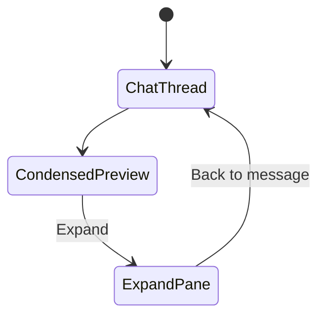

# ai-sql-view-restart

> **Clean restart** of the consolidated sql-view story (WI-289–WI-297). Presentation layer only —
> built strictly on [`ai-artifact-emit-contract`](../20260616-ai-artifact-emit-contract/STORY.md)
> (`feat/ai-chat-artefacts`), **not** on `feat/ai-chat-sql-result-view`.

**Story folder:** [`docs/workitems/completed/20260612-ai-sql-view-restart/`](.) — closed 2026-06-12 (implementation merged on story branch through WI-298).
>
> | Merged concept | Delivered in |
> |----------------|--------------|
> | **Artefact view** (framework, `chatArtifactTreatments`, chat-type reactions) | WI-289, WI-291, WI-292 |
> | **SQL in chat view** (condensed preview, Run/Export, chat-native card) | WI-290–293 |
> | **SQL expand view** (full pane, back-to-message, paging, `QueryDataView`) | WI-294–296 |
> | Open in Analysis, inline-analysis host-apply, shared data component | WI-289, WI-290, WI-295 |
> | **Design doc** [`chat-artefact-architecture.md`](../../../design/ai/chat-artefact-architecture.md) | WI-289, WI-294, WI-297 |

## Restart rationale

The first implementation on `feat/ai-chat-sql-result-view` was built from `origin/dev` **without**
artifact emission. It regressed the artefacts foundation (inline router, salvage workarounds) and
mixed that debt with the presentation layer. **This story restarts from scratch:**

- **Branch from:** `origin/feat/ai-chat-artefacts` (not `dev`, not the old sql-view branch)
- **Reference only:** `origin/feat/ai-chat-sql-result-view` — UX patterns, file layout ideas, requirements catalogue; **not** commit history or salvage code
- **Abandon:** `feat/ai-chat-sql-result-view` (`GeneratedSqlAnswerSalvage`, client prose inference, `resolveMessageArtifacts`)

## Prerequisite (hard gate)

**Must be satisfied before WI-289 implementation code** (docs-only WI-289 may start in parallel):

| Prerequisite | Source |
|--------------|--------|
| `ArtifactEmissionCoordinator` emits `generated-sql` after `validate_sql` | `feat/ai-chat-artefacts` / WI-303–306 |
| `RegistryAgentEventRouter` + registry-driven SSE | WI-305 |
| Scenario packs green (`ArtifactEmitScenariosIT`) | WI-307–308 |
| Basic UI cards (`ArtifactCard`, `AssistantReplyRouter`, schema-capture, unknown) | WI-305 + foundation UI work |
| Canonical emission doc | [`artifact-foundation.md`](../../../design/agentic/artifact-foundation.md) |

Verify before starting **code** (after WI-289 docs):

```bash
./gradlew :ai:mill-ai-test:testIT --tests "*ArtifactEmit*"
./gradlew :ai:mill-ai:test --tests "*ArtifactEmission*"
```

Story doc: [`docs/workitems/completed/20260616-ai-artifact-emit-contract/`](../20260616-ai-artifact-emit-contract/STORY.md)

## Pre-implementation cleanup (step 0 — not a WI)

Before WI-290 code, ensure the working tree matches the **artefacts foundation base**:

- **Discard** any staged/copied files from `git checkout origin/feat/ai-chat-sql-result-view` that import salvage helpers (`resolveMessageArtifacts`, `assistantDisplayContent`, `inferSqlArtifactFromProse`, …) — these symbols **do not exist** on the foundation branch
- Create branch `feat/ai-sql-view` from `origin/feat/ai-chat-artefacts` (or rebase current branch onto it)

```bash
git fetch origin
git checkout -b feat/ai-sql-view origin/feat/ai-chat-artefacts
```

## Goal

Deliver **chat-inferred artefact presentation** for unified AI chat:

- **`chatArtifactTreatments`** — each **chat type** defines how artefacts are handled
- **Condensed (in-chat) view** — SQL ↔ Data preview in **`general`** chat; chat-native styling
- **Expand view** — full chat content pane; back to originating message; paging
- **`QueryDataView`** — shared across Analysis, condensed, and expand modes
- **`inline-analysis`** — host-apply SQL to editor (no preview/expand)
- **Open in Analysis** — transient `chatHandoff` (no save, no `executionId`)
- Backend GET replay wire + client `queryService` execution + attach-result persistence

**Predecessor:** [`completed/20260506-ai-v3-mill-ui-general-chat`](../completed/20260506-ai-v3-mill-ui-general-chat/STORY.md) (WI-229–WI-233).

**Supersedes:** `feat/ai-chat-sql-result-view` and abandoned `in-progress/ai-sql-view/`.

## Layer separation (normative)

| Layer | Owner | This story |
|-------|-------|------------|
| Artifact **generation** (coordinator, descriptors, router, SSE) | `ai-artifact-emit-contract` | **Do not change** `mill-ai` runtime |
| Artifact **wire replay** + **attach-result** (`ArtifactWireMapper`, GET turns, POST execution-result) | WI-290 | `mill-ai-service` + mill-ui types/service only |
| **Presentation** (condensed, expand, treatments, wiring) | WI-291–296 | `mill-ui` only |

**Explicitly out of this story:** `GeneratedSqlAnswerSalvage`, inline `AgentEventRouter` body edits,
`LangChain4jAgent` emission changes, client prose/JSON salvage inference, deleting foundation `ArtifactCard` components.

## Chat types (v1)

| ChatType | SQL/data treatment |
|----------|---------------------|
| `general` | Condensed preview + expand + Run/Export/Open in Analysis |
| `inline-analysis` | `host-apply` → editor |
| `inline-model` / `inline-knowledge` | Registry stubs; facet/schema/unknown via existing `ArtifactCard` |

## Two views (`general` chat)

| View | WI | Layout |
|------|-----|--------|
| **In-chat condensed** | 291–293 | ~900px; `SqlDataCondensedPreview` |
| **Expand** | 294–296 | Full chat pane; same visual family |



## Execution order

0. **Prerequisite gate** — artefacts scenario packs green; working tree clean of old-branch salvage
1. **WI-289** — Design contract (presentation + replay; cross-link emission foundation)
2. **WI-290** — Backend GET replay wire + attach-result + client Run types
3. **WI-291** — Preview framework + `SqlDataCondensedPreview` (fresh, foundation-compatible)
4. **WI-292** — Chat-type wiring + GET hydrate (`ChatContext`, inline hosts)
5. **WI-293** — Condensed-path verification (**checkpoint** — do not start expand until green)
6. **WI-294** — Expand + QueryDataView design (docs)
7. **WI-295** — Shared `QueryDataView` extraction
8. **WI-296** — Expand shell + SQL expand wiring
9. **WI-298** — Mid-chat agent profile switch (toolbar + PATCH)
10. **WI-297** — Story closure

## Scope

| In | Out |
|----|-----|
| Presentation: artefact framework + condensed + expand + QueryDataView | Artifact **emission** runtime (`mill-ai`) |
| GET replay wire + attach-result POST | Salvage workarounds (backend or client) |
| **`docs/design/ai/chat-artefact-architecture.md`** (presentation + replay layers) | Chart/metadata/DQ bodies (stubs) |
| Chat-native UI (not Analysis chrome in chat views) | Server execute-sql |
| Extend (not delete) artefacts `ArtifactCard` / `assistantReplyView` | Facet promotion lifecycle |
| Open in Analysis handoff | `ai:integration` CI restore |
| Fresh implementation using old branch as **read-only** UX reference | Old branch git history / cherry-picks |

## Design deliverables (story)

Primary architecture doc (created in **WI-289**, expand sections in **WI-294**, finalized in **WI-297**):

- **[`docs/design/ai/chat-artefact-architecture.md`](../../../design/ai/chat-artefact-architecture.md)** — presentation + replay layers; **§ Emission** cross-links [`artifact-foundation.md`](../../../design/agentic/artifact-foundation.md)

Supporting updates: [`ai-v3-chat-transport-extensions.md`](../../../design/agentic/ai-v3-chat-transport-extensions.md), [`GENERAL-CHAT-DESIGN.md`](../../../design/ui/mill-ui/GENERAL-CHAT-DESIGN.md), [`docs/design/ai/README.md`](../../../design/ai/README.md).

## Design references

- [`artifact-foundation.md`](../../../design/agentic/artifact-foundation.md) — emission foundation (prerequisite; **canonical** for coordinator/registry/SSE)
- [`artifact-emit-contract.md`](../../../design/agentic/artifact-emit-contract.md) — original decision record
- [`capabilities_design.md`](../../../design/ai/capabilities_design.md) §15 (generate-only SQL)

## Placement

[`docs/workitems/completed/20260612-ai-sql-view-restart/`](.) — archived from `planned/` → `in-progress/` (WI-289) → `completed/` (WI-297).

## Branching, tracker, commit, and push (normative)

Follow [`RULES.md`](../../RULES.md) **Per-WI cadence** and **Complete working copy per WI**, plus this
story’s delivery rhythm:

**After each completed WI (289–297), before starting the next:**

1. **Tracker** — set the WI line to `[x]` in **Work Items** below; on the **first** `[x]`, move the
   folder `planned/ai-sql-view-restart/` → `in-progress/ai-sql-view-restart/` (same commit).
2. **WI file** — update the completed WI’s acceptance checkboxes / notes when applicable.
3. **Commit** — one commit for the **full intentional working copy** of that WI (code, tests, design
   docs, `STORY.md`, WI markdown). Prefix: `[docs]` / `[feat]` / `[test]` per [`RESTART-NOTES.md`](RESTART-NOTES.md).
   Do not start the next WI with uncommitted changes from the finished WI.
4. **Push** — push the story branch to `origin` after each WI commit so remote stays in sync:
   `git push -u origin HEAD` (first push) or `git push origin HEAD` (subsequent).

**At story closure (WI-297 only):** rebase/squash per [`RULES.md`](../../RULES.md) **Completion (Story
level)** (~6–10 logical commits above merge base). After rewrite, push with
`git push --force-with-lease origin <feature-branch>` if the branch was already pushed.

**Branch:** `feat/ai-sql-view` from `origin/feat/ai-chat-artefacts` (see § Pre-implementation cleanup).

## Work Items

- [x] WI-289 — [`WI-289-ai-sql-view-design-contract.md`](WI-289-ai-sql-view-design-contract.md)
- [x] WI-290 — [`WI-290-ai-sql-view-backend-replay-attach.md`](WI-290-ai-sql-view-backend-replay-attach.md)
- [x] WI-291 — [`WI-291-ai-sql-view-preview-framework.md`](WI-291-ai-sql-view-preview-framework.md)
- [x] WI-292 — [`WI-292-ai-sql-view-chat-wiring.md`](WI-292-ai-sql-view-chat-wiring.md)
- [x] WI-293 — [`WI-293-ai-sql-view-condensed-verification.md`](WI-293-ai-sql-view-condensed-verification.md)
- [x] WI-294 — [`WI-294-ai-sql-view-expand-design.md`](WI-294-ai-sql-view-expand-design.md)
- [x] WI-295 — [`WI-295-ai-sql-view-query-data-view.md`](WI-295-ai-sql-view-query-data-view.md)
- [x] WI-296 — [`WI-296-ai-sql-view-expand-implementation.md`](WI-296-ai-sql-view-expand-implementation.md)
- [x] WI-298 — [`WI-298-chat-profile-switch.md`](WI-298-chat-profile-switch.md)
- [x] WI-297 — [`WI-297-ai-sql-view-closure.md`](WI-297-ai-sql-view-closure.md)

## Verification (story level)

- **Prerequisite:** artefacts scenario packs green before WI-290 code
- **Checkpoint (WI-293):** condensed path + chat types + replay wire — before expand work
- **Closure (WI-297):** full story smoke + design docs + no salvage paths in diff vs artefacts base

## Reference implementation (old branch — light use only)

Use `origin/feat/ai-chat-sql-result-view` **file paths and UX patterns only** when implementing
fresh code on the artefacts foundation. See [`RESTART-NOTES.md`](RESTART-NOTES.md) for porting
catalogue, red-flag list, and integration rewrite policy.

## Supplementary notes

**[`RESTART-NOTES.md`](RESTART-NOTES.md)** — playbook, data flow, pitfalls, MR strategy, test commands.

## Story lineage

| Artifact | Notes |
|----------|--------|
| Spec origin | Docs commit `479e4e52` (`planned/ai-sql-view/`) |
| Restart folder | `planned/ai-sql-view-restart/` — artefacts prerequisite + salvage exclusion |
| WI renumber (2026-06) | 11 WIs (289–299) regrouped to 9 WIs (289–297); aligned with foundation-first plan |
| Implementation branch | `feat/ai-sql-view` from `origin/feat/ai-chat-artefacts` |
