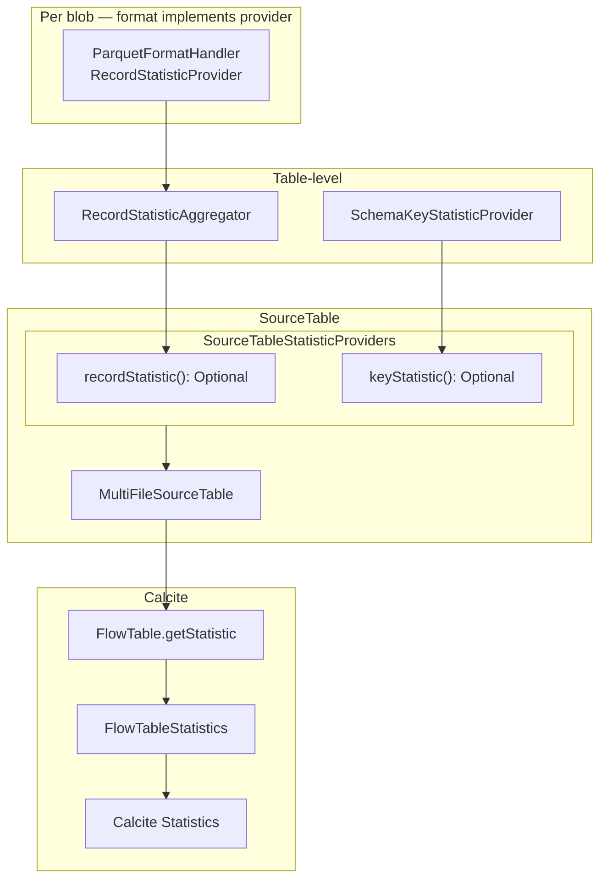

# WI-314 — Flow table statistics for Calcite planner

## Status: **complete** (2026-06-18)

Implemented on branch `feat/flow-performace-statistics`. Commits: `7a9d5d74`, `77970cd6`, `679e3007`.

### Delivered vs plan

| Planned | Actual |
|---------|--------|
| Slice providers + aggregator + holder | Done — `io.qpointz.mill.source.statistics.*` |
| Parquet footer row counts | Done — `ParquetFormatHandler` + `RecordStatisticReader` |
| `FlowTable.getStatistic()` | Done — `FlowTableStatistics.toCalciteStatistic` |
| Lazy memo at leaf + aggregator | Done — `BlobBoundRecordStatisticProvider`, `RecordStatisticAggregator` |
| Skymill parquet counts (14 / 210 / 1050) | Done — `FlowTableStatisticsTest` |
| Format opt-in via provider on handler | **Variant:** `RecordStatisticReader` + `BlobBoundRecordStatisticProvider` (not `RecordStatisticProvider` on `FormatHandler` directly) |

### Beyond original WI scope (landed same story)

| Extra | Module |
|-------|--------|
| `FlowTableScan.estimateRowCount()` for join metadata | `mill-data-source-calcite` (`77970cd6`) |
| Arrow IPC batch row counts | `mill-data-format-arrow` |
| CSV/TSV/FWF line-heuristic (approximate) stats | `mill-data-format-text` |
| Format capability design docs | `docs/design/source/formats/`, `docs/public/.../format-capabilities.md` |

### Not done (follow-ups)

| Item | Tracking |
|------|----------|
| YAML `format.statistics.mode` (`none` \| `approximate` \| `exact`) | Design: `docs/design/source/format-statistics-descriptor.md` |
| Avro / Excel record statistics | Future format work |
| Column NDV / histograms | Out of scope |

### Tests

`./gradlew :data:mill-data-source-core:test :data:formats:mill-data-format-parquet:test :data:formats:mill-data-format-text:test :data:formats:mill-data-format-arrow:test :data:mill-data-source-calcite:test` — passing on branch.

## Goal

Expose table statistics on `FlowTable` so Calcite can estimate row counts, prefer hash join build
sides, and order joins for small file-backed tables. Unblocks WI-315 (Volcano needs finite row
estimates; `Statistics.UNKNOWN` today drives expensive explore on Skymill multi-join queries).

## Starting baseline

Clean tree — no partial stats code:

- `FormatHandler`: `inferSchema` + `createRecordSource` only
- `SourceTable`: no statistics API
- `FlowTable`: no `getStatistic()` override
- `ParquetFormatHandler`: read path only

Depends on WI-311 only; can proceed in parallel with WI-312/313.

## Scope

- Record statistics via **format-level** `RecordStatisticProvider` (opt-in on handler, not on base `FormatHandler`)
- Table-level **aggregator** composes per-blob providers; aggregator IS-A `RecordStatisticProvider`
- **Key statistics** at table level only (schema convention — not format, not blob leaf)
- Lazy evaluation — no I/O at resolve; memoize at leaf provider and aggregator
- **Support semantics:** no provider instance wired = not supported; provider present = supported (value may still be unknown)
- `SourceTableStatisticProviders` holder with Optional-style accessors
- `FlowTable.getStatistic()` maps supported/provided slices to Calcite
- Unit tests: Skymill parquet counts, lazy eval, tables without wired providers

## Out of scope

- Eager statistics at resolve
- Statistics methods on base `FormatHandler` interface
- Separate `RecordStatisticCapable`, `BlobRecordStatisticProvider`, or other adapter layers
- Key statistics from format handlers or blob leaves
- Column NDV / histograms
- Collations unless files are physically sorted
- Distribution slice implementation (stub only)
- YAML `primaryKey` descriptor flag
- Shared footer cache between `inferSchema()` and statistics
- Planner smoke / RelOpt row-estimate test (optional stretch)
- Metadata facet / Spring wiring of extra slice providers (see **Future extensions** — idea only)

## Future extensions (ideas only — not WI-314)

The slice-provider + Optional holder model is intentionally **open for composition from multiple
components**, not only format/resolver wiring:

| Slice | WI-314 source | Possible later source |
|-------|---------------|---------------------|
| Record count | Parquet `RecordStatisticProvider` | — |
| Keys | `SchemaKeyStatisticProvider` (`id` convention) | Metadata facet provider (declared PK) |
| FK / referential | — | Metadata facet provider (relationship graph) |
| NDV / distribution | — | Metadata or format providers |

Because **support = Optional presence on the holder**, a Spring (or service) layer could assemble
`SourceTableStatisticProviders` by merging:

- resolver-wired format providers (record aggregator from blobs)
- optional `KeyStatisticProvider` from metadata when file/schema has no `id` but catalog declares PK
- optional FK/referential providers for join planning hints

`KeyStatisticAggregator` (future) could compose schema convention + metadata facet the same way
`RecordStatisticAggregator` composes blob leaves — same slice interface, aggregator IS-A provider.

No implementation or API design in WI-314; document as motivation for keeping providers slice-scoped
and holder-based rather than monolithic `SourceTableStatistics`.

## Design principles

1. **Minimal interfaces** — `RecordStatisticProvider` + `RecordStatisticAggregator`; format implements provider when capable
2. **Support = wiring** — absent provider instance means not supported; present provider means supported regardless of unknown values
3. **Aggregation outside SourceTable** — aggregators compose providers; table only holds wired graph
4. **File-count agnostic** — aggregator over one or N blob-scoped provider instances
5. **Keys are table-level** — derived from schema at resolve; never from format/blob chain
6. **Lazy + memoized** — leaf and aggregator cache first read
7. **Calcite mapping last** — `FlowTable` inspects holder and maps slices to Calcite

## Support vs value semantics

| Situation | Meaning |
|-----------|---------|
| No `RecordStatisticProvider` wired on table | Record statistics **not supported** |
| Provider wired | Record statistics **supported** |
| `provider.recordStatistic()` returns null or `estimatedRowCount == null` | Supported but **value unknown** |
| `provider.recordStatistic()` returns count | Supported and **known** |

Same pattern for key slice via Optional provider on holder.

Do **not** use `isSupported()` on provider interfaces — Optional presence on the holder expresses support.

## Architecture



### Record slice chain

```
FormatHandler (optional RecordStatisticProvider)   ← Parquet implements directly
        ↓ one instance per blob, blob+source bound at wiring
RecordStatisticAggregator(providers)               ← IS-A RecordStatisticProvider
        ↓
SourceTableStatisticProviders.recordStatistic()    ← Optional.empty if not wired
        ↓
FlowTable.getStatistic()
```

### Key slice (table level only)

```
SchemaKeyStatisticProvider(schema)               ← wired at resolve from RecordSchema
        ↓
SourceTableStatisticProviders.keyStatistic()       ← Optional.empty if no id column
        ↓
FlowTable.getStatistic()
```

Keys are **not** format statistics. No format handler implements key providers.

## Core model (`io.qpointz.mill.source.statistics`)

### Slices

```kotlin
data class RecordStatistic(val estimatedRowCount: Long?)

data class KeyStatistic(val uniqueKeys: List<List<Int>>)
```

### Record provider (format + aggregator)

```kotlin
interface RecordStatisticProvider {
    /** Lazy read; null when value unknown after I/O or evaluation. */
    fun recordStatistic(): RecordStatistic?
}

class RecordStatisticAggregator(
    private val providers: Iterable<RecordStatisticProvider>,
) : RecordStatisticProvider {
    // Memoized on first recordStatistic()
    // Sum counts when all providers return non-null estimatedRowCount; else null slice
}
```

**Format opt-in:** `ParquetFormatHandler : FormatHandler, RecordStatisticProvider`

- Provider is **blob-scoped** at use time: wiring creates one lightweight binding per blob
  (e.g. `ParquetRecordStatisticProvider(handler, blob, blobSource)` **internal** factory/wrapper,
  or handler factory method `forBlob(blob, blobSource): RecordStatisticProvider`).
- Prefer **one public interface** (`RecordStatisticProvider`) on the format side; keep blob binding
  as package-private wiring detail — not a separate public capability interface.

**Strict multi-blob rule:** aggregator returns unknown (`null` slice) if any child provider returns
unknown row count. Tables mixing stats-capable and non-capable formats get no record provider wired
(no aggregator children → Optional empty on holder).

### Key provider (table level only)

```kotlin
interface KeyStatisticProvider {
    fun keyStatistic(): KeyStatistic?
}

class SchemaKeyStatisticProvider(
    private val schema: RecordSchema,
) : KeyStatisticProvider {
    // No I/O; id column → uniqueKeys; else null slice
}
```

### Memoization

| Level | Caches |
|-------|--------|
| Leaf (per-blob provider) | Parquet footer read → `RecordStatistic` |
| `RecordStatisticAggregator` | Combined `RecordStatistic` |
| `SchemaKeyStatisticProvider` | Optional; cheap schema lookup |

Use lazy delegate or small internal memo wrapper — not on `SourceTable`.

### SourceTable holder

```kotlin
class SourceTableStatisticProviders private constructor(
    private val record: RecordStatisticProvider?,
    private val key: KeyStatisticProvider?,
) {
    fun recordStatistic(): Optional<RecordStatisticProvider> =
        Optional.ofNullable(record)

    fun keyStatistic(): Optional<KeyStatisticProvider> =
        Optional.ofNullable(key)

    companion object {
        fun of(
            record: RecordStatisticProvider? = null,
            key: KeyStatisticProvider? = null,
        ) = SourceTableStatisticProviders(record, key)
    }
}

interface SourceTable {
    fun statisticProviders(): SourceTableStatisticProviders =
        SourceTableStatisticProviders.of()
}
```

- **`recordStatistic().isPresent`** → record stats supported
- **`recordStatistic().get().recordStatistic()`** → slice value (may be unknown)
- Same for key Optional

`MultiFileSourceTable` stores `SourceTableStatisticProviders` built at resolve (wiring only).

### Resolve wiring (`SourceResolver`)

For each logical table:

1. **Record:** for each blob, if `handler is RecordStatisticProvider`, create blob-bound leaf;
   if any leaves exist, wire `RecordStatisticAggregator(leaves)` into holder; else `record = null`.
2. **Key:** if schema has `id` column, wire `SchemaKeyStatisticProvider(schema)`; else `key = null`.
3. No footer reads at resolve.

Single-file and multi-file tables use identical aggregator wiring.

## Calcite adapter (`mill-data-source-calcite`)

```kotlin
override fun getStatistic(): Statistic {
    val holders = sourceTable.statisticProviders()
    return FlowTableStatistics.toCalciteStatistic(holders)
}
```

`FlowTableStatistics.toCalciteStatistic` logic:

1. **Record:** if `holders.recordStatistic().isEmpty` → row count unavailable
2. Else read `holders.recordStatistic().get().recordStatistic()?.estimatedRowCount`
3. **Key:** if `holders.keyStatistic().isPresent` → map `keyStatistic()?.uniqueKeys`
4. Row count null/unknown → `Statistics.UNKNOWN` (keys alone do not produce known stats)
5. Else `Statistics.of(rowCount, keysAsImmutableBitSets)`

| Calcite field | Source |
|---------------|--------|
| `getRowCount()` | Optional record provider → slice |
| `getKeys()` | Optional key provider → slice |
| `getCollations()` | empty |
| `getDistribution()` | default `ANY` |

## Implementation plan

### Phase A — Core (`mill-data-source-core`)

| Step | Action |
|------|--------|
| A.1 | Slice types: `RecordStatistic`, `KeyStatistic` |
| A.2 | `RecordStatisticProvider`, `RecordStatisticAggregator` (with memo) |
| A.3 | `KeyStatisticProvider`, `SchemaKeyStatisticProvider` |
| A.4 | Blob binding helper for format providers (internal, not public capability interface) |
| A.5 | `SourceTableStatisticProviders` with Optional accessors |
| A.6 | `SourceTable.statisticProviders()`; `MultiFileSourceTable` holds holder |
| A.7 | `SourceResolver` wires leaves + aggregator + schema key provider |

### Phase B — Parquet (`mill-data-format-parquet`)

| Step | Action |
|------|--------|
| B.1 | `ParquetFormatHandler implements RecordStatisticProvider` (via blob-bound instances) |
| B.2 | Footer row count in leaf `recordStatistic()` |

### Phase C — Calcite (`mill-data-source-calcite`)

| Step | Action |
|------|--------|
| C.1 | `FlowTableStatistics.toCalciteStatistic(SourceTableStatisticProviders)` |
| C.2 | Override `FlowTable.getStatistic()` |

### Phase D — Tests

| Test | Assert |
|------|--------|
| `ParquetFormatHandlerTest` | blob-bound provider returns row count 3 |
| `RecordStatisticAggregatorTest` | 1 vs N providers; partial unknown → null; memoization |
| `SchemaKeyStatisticProviderTest` | `id` → Optional key provider wired; keys in slice |
| Resolver test | no I/O at resolve; first slice read triggers footer |
| `FlowTableStatisticsTest` | Skymill: cities≈14, passenger≈210, bookings≈1050 |
| CSV/stub table | `recordStatistic().isEmpty`; Calcite `UNKNOWN` |
| Key Optional | table without `id` → `keyStatistic().isEmpty` |

## Files (expected touch)

**New (`mill-data-source-core`):**

- `statistics/RecordStatistic.kt`, `KeyStatistic.kt`
- `statistics/RecordStatisticProvider.kt`, `RecordStatisticAggregator.kt`
- `statistics/KeyStatisticProvider.kt`, `SchemaKeyStatisticProvider.kt`
- `statistics/SourceTableStatisticProviders.kt`
- internal blob-binding helper (e.g. `BlobBoundRecordStatisticProvider.kt`)
- tests under `statistics/`

**New (`mill-data-source-calcite`):**

- `FlowTableStatistics.kt`, `FlowTableStatisticsTest.kt`

**Modified:**

- `SourceTable.kt`, `MultiFileSourceTable.kt`, `SourceResolver.kt`
- `ParquetFormatHandler.kt`, `ParquetFormatHandlerTest.kt`
- `FlowTable.kt`

## Acceptance

- Base `FormatHandler` unchanged; Parquet opt-in via `RecordStatisticProvider`
- Support = Optional presence on holder; no `isSupported()` on providers
- Keys table-level only; not on format handlers
- Aggregation in `RecordStatisticAggregator` only
- Lazy memo at leaf + aggregator
- Single/multi-file same wiring path
- `./gradlew :data:mill-data-source-core:test :data:formats:mill-data-format-parquet:test :data:mill-data-source-calcite:test` passes

## Modules

- `data/mill-data-source-core`
- `data/formats/mill-data-format-parquet`
- `data/mill-data-source-calcite`
