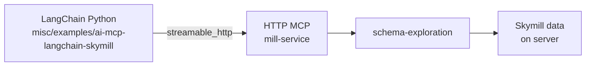

# ai-v3-mcp-server-poc

**Backlog:** [A-56](../../BACKLOG.md) · [A-31](../../BACKLOG.md) · **Status:** `closed` **2026-06-22**

## Goal

Deliver an **initial MCP server prototype** that exposes the existing v3 **AI capability registry**
as MCP tools, prompts, and resources — with **no bespoke MCP tool catalog**. Every MCP surface must
derive from a `CapabilityProvider` registered in `mill-ai`; new MCP capabilities are added only by
implementing new AI capabilities first.

**Design baseline:** [`docs/design/agentic/v3-mcp-capability-exposure.md`](../../../design/agentic/v3-mcp-capability-exposure.md)  
**Review package:** [`REVIEW.md`](REVIEW.md)  
**Branch:** `feat/ai-v3-mcp-server-poc`

## Architectural principle (locked)

| Rule | Detail |
|------|--------|
| **Single extension path** | New MCP tools/resources/prompts = new `CapabilityProvider` + YAML manifest in `mill-ai` |
| **No parallel MCP catalog** | Platform data-plane MCP ([`docs/design/platform/mcp.md`](../../../design/platform/mcp.md), backlog **P-10**) is **not** implemented as bespoke MCP; missing tools become AI capabilities first |
| **Core + transport split** | `mill-ai-mcp-core` framework-free; HTTP hosts catalog+executor on mill-service; stdio bridge deferred ([A-96](../../BACKLOG.md) / WI-328) |
| **Namespaced tools** | MCP tool names use `{capabilityId}.{toolName}` (e.g. `demo.say_hello`) |
| **Profile filter** | Server may expose all discovered capabilities or restrict to an `AgentProfile` capability set |
| **MCP exposure opt-out** | Capability YAML `mcp.enabled` (default `true`); controls whole capability including CAPTURE tools |
| **Server allowlist** | `mill.ai.mcp.capabilities` — empty = all eligible; non-empty = only listed ids (no exclude-list) |
| **Tool kind metadata** | MCP tool descriptors expose `kind` (QUERY/CAPTURE) for clients; **no** MCP-side enforcement logic by kind in POC |
| **Authoring `mcp.enabled`** | **Undecided** — do not change `schema-authoring` / `metadata-authoring` YAML until decided; document as deployment guidance only |
| **MCP Java SDK only** | Story MCP modules use `io.modelcontextprotocol.sdk:mcp` (BOM) for all protocol wire handling |

## Module layout (target)

| Module | Depends on | Role |
|--------|------------|------|
| `ai/mill-ai-mcp-core` | `mill-ai` | Catalog, catalog-scoped executor, admission gate, WI-042 descriptors |
| `ai/mill-ai-mcp-transport-http` | core, MCP Java SDK servlet, Spring Boot | **Authoritative HTTP MCP** on mill-service (`/services/mcp`, `/services/**` auth) |
| `misc/examples/ai-mcp-langchain-skymill/` | WI-330 | LangChain Python + mill-service Skymill demo |

`mill-ai-mcp-transport-stdio` (stdio → HTTP bridge) is **backlog** [A-96](../../BACKLOG.md) / [WI-328](../../backlog/WI-328-mill-ai-mcp-transport-stdio.md) — not part of this story delivery.

## Story delivery (per `docs/workitems/RULES.md`)

Implement **WIs WI-325–WI-327, WI-329, WI-330** on branch `feat/ai-v3-mcp-server-poc` — one commit per WI,
(WI-328 descoped to backlog A-96).
tests passing, **MR mergeable** before story closure. Post-merge follow-ups (e.g. `mill-service`
default enablement, authoring YAML defaults) decided **after** MR lands — not pre-decided blockers.

**Story closure** (archive, `MILESTONE.md`, history squash) only when user explicitly requests it.

## MCP exposure control

Capabilities declare MCP settings in the **capability YAML manifest** under a top-level `mcp:` block.
Default when omitted: **`mcp.enabled: true`** (all capabilities exposed).

```yaml
# capabilities/example.yaml
mcp:
  enabled: false   # opt out of MCP catalog and tool invocation
  # reserved for future options (auth, rate limits, …)
```

`CapabilityDescriptor` carries `mcp: CapabilityMcpSettings` (loaded from manifest). When
`mcp.enabled` is `false`, tools, prompts, and protocol resources are omitted from the MCP catalog;
direct tool invocation is rejected. In-process agent profiles are unaffected.

Filter order: `CapabilityRegistry` → **`mcp.enabled`** → **`mill.ai.mcp.capabilities`** (if set) → optional `AgentProfile` → admission gate.

Tool inventory (QUERY vs CAPTURE): [design doc §15](../../../design/agentic/v3-mcp-capability-exposure.md).

## MCP mapping (from design)

| Mill asset | MCP surface | URI / name |
|------------|-------------|------------|
| Capability descriptor | Resource | `mill://capabilities/{id}` |
| Tool | MCP tool | `{capabilityId}.{toolName}` |
| Prompt | MCP prompt | `{capabilityId}/{promptId}` |
| Protocol | Resource | `mill://capabilities/{id}/protocols/{protocolId}` |
| Artifact schema | Resource | `mill://artifacts/{kind}` |

## Prerequisites (on `dev`)

- Nine capability providers registered via `ServiceLoader` in `ai/mill-ai`
- `CapabilityRegistry`, `CapabilityManifest`, `ToolBinding`, `ProfileRegistry`
- Add `io.modelcontextprotocol.sdk:mcp-bom` to [`libs.versions.toml`](../../../libs.versions.toml) (WI-327)

## Out of scope (this story)

- Full production RBAC / trust model (admission **stub** only; see also backlog **A-79**)
- MCP exposure of internal `AgentEvent` streaming
- LLM agent loop over MCP (clients invoke tools directly)
- Embedding MCP in `apps/mill-service` **production config** by default (WI-329 wires autoconfigure; enablement remains opt-in)
- Step-Back, chart capability, scenario FSM

## Work item order

| Seq | WI | Rationale |
|-----|-----|-----------|
| 1 | WI-325 | Design doc and extension rules before code |
| 2 | WI-326 | Descriptor model (A-31 / WI-042) used by catalog |
| 3 | WI-327 | Core catalog + catalog-scoped executor + Gradle modules |
| 4 | WI-329 | **HTTP MCP backend** (MCP Java SDK servlet + Spring Boot security) |
| 5 | WI-330 | LangChain Python + mill-service Skymill example |

## Work Items

- [x] WI-325 — MCP capability exposure design doc (`WI-325-mcp-capability-exposure-design.md`)
- [x] WI-326 — External capability asset descriptors (`WI-326-external-capability-asset-descriptors.md`)
- [x] WI-327 — MCP core module: catalog, executor, admission (`WI-327-mill-ai-mcp-core.md`)
- [x] WI-329 — HTTP MCP backend on mill-service + Mill security (`WI-329-mill-ai-mcp-transport-http.md`)
- [x] WI-330 — LangChain Python + Skymill MCP example (`WI-330-langchain-python-skymill-mcp-example.md`)

**Descoped:** [WI-328](../../backlog/WI-328-mill-ai-mcp-transport-stdio.md) — stdio bridge → backlog [A-96](../../BACKLOG.md).

## Verify (full story — before MR)

```bash
./gradlew :ai:mill-ai:test --tests "*CapabilityManifest*"
./gradlew :ai:mill-ai-mcp-core:test
./gradlew :ai:mill-ai-mcp-transport-http:test :ai:mill-ai-mcp-transport-http:testIT
# WI-330: manual LangChain + Skymill smoke (see WI-330)
```

## Testing strategy

See **Testing strategy** section below and plan doc. Principle: **heavy unit tests on
`mill-ai-mcp-core`**, **thin `testIT` on HTTP transport** (wire protocol proof only), **no LLM /
no full data plane** in automated MCP tests for this story.

### Pyramid

| Layer | Module | Suite | What to prove |
|-------|--------|-------|----------------|
| **Manifest** | `mill-ai` | `test` | `mcp.enabled` YAML load; default `true` when block absent (`CapabilityManifestTest`, `CapabilityMcpSettingsTest`) |
| **Core** | `mill-ai-mcp-core` | `test` | Catalog, executor, filters, descriptors — no transport |
| **HTTP transport** | `mill-ai-mcp-transport-http` | `testIT` | MCP Java SDK Streamable HTTP servlet; auth + list/call smoke (WI-329) |
| **Manual** | HTTP MCP / Cursor | — | Streamable HTTP `url` in `mcp.json`; stdio bridge deferred (A-96) |

### Core unit tests (`mill-ai-mcp-core`) — primary coverage

Use **`CapabilityRegistry.from(...)`** with inline test providers (same pattern as
[`CapabilityRegistryTest`](../../../ai/mill-ai/src/test/kotlin/io/qpointz/mill/ai/core/capability/CapabilityRegistryTest.kt)).
Do **not** rely on `ServiceLoader` or real data dependencies in unit tests.

| Test class | Key scenarios |
|------------|----------------|
| `CapabilityMcpCatalogTest` | Tool/prompt/resource counts; namespaced tool names (`demo.say_hello`); `mcp.enabled: false` omits capability; `hello-world` profile filter; descriptor metadata on resources; **23 tools when all nine manifests loaded and exposure filters unset** |
| `CapabilityMcpExecutorTest` | `demo.say_hello` happy path with empty `CapabilityDependencies`; unknown tool; disabled capability → clear rejection; **profile-filtered tool rejected at invoke**; **allowlist-blocked tool rejected at invoke**; admission gate denial |
| `ExternalCapabilityAssetDescriptorTest` | Required fields present; URI scheme; JSON serialization round-trip |

**Test fixtures:** `src/test/resources/capabilities/test-mcp-disabled.yaml` with `mcp.enabled: false`;
minimal `AgentContext(contextType = "general")` helper.

### What not to automate in this story

- Full agent loop / `LangChain4jAgent` over MCP
- All nine production capabilities with `SchemaCatalogPort` / SQL validators
- `mill-ai-test` `ScenarioPack` extension (defer — conversation regression is a separate concern)
- Cursor end-to-end (manual checklist in design doc only)

### HTTP transport `testIT` (WI-329)

`@SpringBootTest` with `mill.ai.mcp.enabled=true`; MCP Java SDK servlet transport.

| Test | Assert |
|------|--------|
| `shouldListTools_includingDemoSayHello` | `demo.say_hello` in tool list |
| `shouldCallDemoSayHello_andReturnGreeting` | `tools/call` → greeting |
| `shouldOmitDisabledCapability_fromToolList` | `mcp.enabled: false` fixture absent |
| `shouldRejectToolCall_outsideProfile` | catalog-scoped executor |
| `shouldRequireAuthentication_whenSecurityEnabled` | 401 without creds on `/services/mcp` |

### Relationship to existing `mill-ai` tests

| Existing | MCP story |
|----------|-----------|
| `CapabilityManifestTest` | Extend for `mcp:` block (in `mill-ai`, WI-327) |
| `CapabilityRegistryTest` | Reuse provider/fixture patterns; do not duplicate registry tests |
| `ProfileCapabilityMatrixTest` | Profile filter in MCP catalog mirrors profile ids — one MCP-specific test suffices |

## Integration demo (WI-330)

Part of story delivery (WI-330). Example packaging (Gradle bridge invocation vs documented command) decided during WI-330.



- **Backend:** mill-service with `skymill-ai` + `mill.ai.mcp.enabled=true`
- **Client:** Python LangChain connects directly to `MILL_MCP_URL` (Streamable HTTP)
- **Not CI-gated** (requires `OPENAI_API_KEY` for agent; `smoke_tools.py` is LLM-free)

## Related backlog (deferred)

| Ref | Item | Notes |
|-----|------|-------|
| **P-10** | Platform MCP Data Provider | Implement as AI capabilities first, then auto-exposed via this stack |
| **A-79** | Capability admission in `LangChain4jAgent` | MCP admission gate should align when A-79 lands |
| **A-31** | External asset descriptors | Fulfilled by **WI-326** (supersedes **WI-042** in `planned/ai-v3`) |
| **A-96** | stdio MCP bridge → remote HTTP | Descoped from this story; [WI-328](../../backlog/WI-328-mill-ai-mcp-transport-stdio.md) |

## Related planned stories

| Story | Notes |
|-------|-------|
| [`planned/mcp-data-query-tool/`](../planned/mcp-data-query-tool/STORY.md) | **`data-query.execute_sql`** — read-only SQL execution over MCP via capability (WI-338–WI-341); not BACKLOG until promoted |
