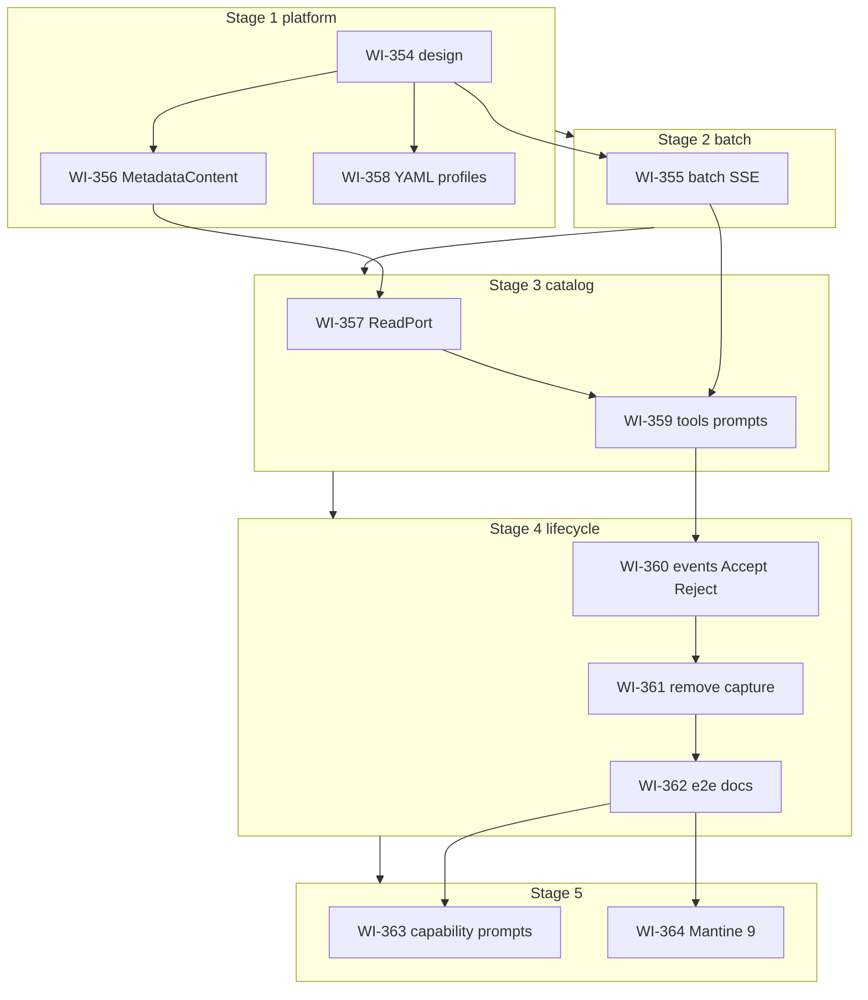
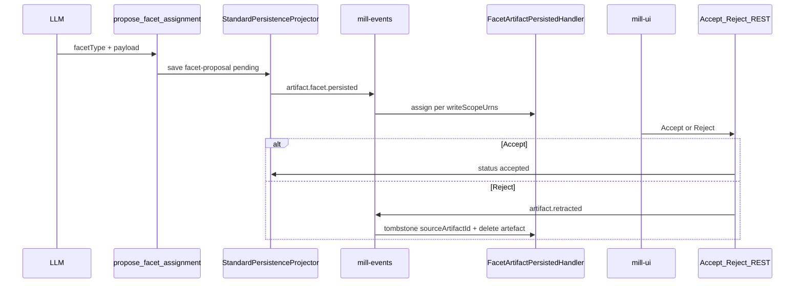

# Implementation plan — metadata-authoring-profiles

**Status:** planning complete (2026-06-25) — **no code implementation yet**  
**Normative sources:** [`STORY.md`](STORY.md), [`GAPS.md`](GAPS.md), [`RULES.md`](../../RULES.md)  
**Handover entry:** [`COLDSTART.md`](COLDSTART.md)

This file persists the agent planning session: staged delivery, WI renumber legend, locked GAPS decisions, and implementation notes for multi-artifact runtime, SSE, and facet lifecycle.

---

## 1. Story goal (one paragraph)

Make **`metadata-authoring`** **catalog-generic**: the LLM uses `list_facet_categories` → `list_facet_types` → `get_facet_type` → `validate_facet_payload` → `propose_facet_assignment` for **any** registered facet type. Add **`MetadataContent`**, YAML **agent profiles**, real **`MetadataReadPort`**, multi-artifact batch runtime ( **WI-355** — dedicated stage-2 MR), and **facet lifecycle** (chat-scope assign on persist + Accept/Reject via **in-process `mill-events`**). Remove all **`capture_*`** and the **`schema-authoring`** capability.

---

## 2. Delivery model (5 stages; WI-355 isolated for review)

**Override:** [`RULES.md`](../../RULES.md) default “one branch per story” → **one branch + one MR per stage**. Everything else in RULES applies (per-WI commit, tracker, complete working copy).

| Stage | Branch | WIs (implement in order) | Mill components |
| ----- | ------ | ------------------------ | --------------- |
| **1** | `feat/meta-authoring-platform` | WI-354 → WI-356 → WI-358 | `docs/design`, `metadata` (entity + seeds), `ai/mill-ai` (profiles) |
| **2** | `feat/meta-artifact-batch` | **WI-355** | `ai/mill-ai` (agent, batch, pointers, SSE), `ui/mill-ui` |
| **3** | `feat/meta-authoring-catalog` | WI-357 → WI-359 | `ai/mill-ai-data`, `metadata`, `ai/mill-ai` capabilities |
| **4** | `feat/meta-authoring-lifecycle` | WI-360 → WI-361 → WI-362 | `core/mill-events`, `metadata` scope, `ai/mill-ai-service`, `ui/mill-ui`, `ai/mill-ai-test`, docs |
| **5** | `feat/meta-capability-prompts` / `feat/mill-ui-mantine-9` | WI-363 · WI-364 (separate MRs) | WI-363: `ai/mill-ai` capability YAML + profile prompts, `ai/mill-ai-test`, `docs/design/agentic/`. WI-364: `ui/mill-ui` Mantine 9 |



**Hard gates:** Do **not** start stage **2** until stage **1** MR is **merged** (WI-355 needs WI-354 design). Do **not** start stage **3** until stage **2** MR is **merged** (WI-359 needs WI-355 batch). Do **not** start WI-359 before WI-357 on the stage 3 branch. Do **not** start stage **5** until stage **4** MR is **merged** (WI-363 / WI-364 baseline on `dev`). WI-363 and WI-364 are **independent** — either order or parallel MRs.

### Per-stage workflow

1. `git fetch origin && git checkout -b <stage-branch> origin/dev`
2. Implement **all WIs in stage order** — **one commit per WI** + `[x]` in [`STORY.md`](STORY.md) after each WI
3. Run stage verify commands (§4)
4. **Squash** per-WI commits → **2–4 logical commits** by component (or one if tight); push (`--force-with-lease` if rewritten)
5. Open **MR → `dev`** listing all stage WIs; wait for review + merge before next stage

**Not at stage MR:** story archive, MILESTONE/BACKLOG, story-level history rewrite ([`RULES.md`](../../RULES.md) § Story closure — explicit user request only).

---

## 3. WI renumber legend and file index

Planning IDs **WI-354…363** map to execution order. **On disk, filenames still use WI-345…353** until a renumber pass lands.

| Planned ID | Was | Stage | Current file |
| ---------- | --- | ----- | ------------ |
| **WI-354** | WI-345 | 1 | [`WI-345-metadata-authoring-design-contract.md`](WI-345-metadata-authoring-design-contract.md) |
| **WI-356** | WI-352 | 1 | [`WI-352-metadata-content-entity-and-seed.md`](WI-352-metadata-content-entity-and-seed.md) |
| **WI-358** | WI-348 | 1 | [`WI-348-agent-profiles-metadata-authoring.md`](WI-348-agent-profiles-metadata-authoring.md) |
| **WI-355** | WI-351 | **2** | [`WI-351-multi-artifact-protocol-runtime.md`](WI-351-multi-artifact-protocol-runtime.md) |
| **WI-357** | WI-346 | 3 | [`WI-346-metadata-read-port-adapter.md`](WI-346-metadata-read-port-adapter.md) |
| **WI-359** | WI-347 | 3 | [`WI-347-metadata-authoring-capability.md`](WI-347-metadata-authoring-capability.md) |
| **WI-360** | WI-353 | 4 | [`WI-353-facet-artifact-lifecycle-events.md`](WI-353-facet-artifact-lifecycle-events.md) |
| **WI-361** | WI-350 | 4 | [`WI-350-schema-authoring-description-tool-cleanup.md`](WI-350-schema-authoring-description-tool-cleanup.md) |
| **WI-362** | WI-349 | 4 | [`WI-349-metadata-authoring-tests-docs.md`](WI-349-metadata-authoring-tests-docs.md) |
| **WI-363** | — | **5** | [`WI-363-capability-prompt-declaration.md`](WI-363-capability-prompt-declaration.md) |
| **WI-364** | — | **5** | [`WI-364-mantine-v9-migration.md`](WI-364-mantine-v9-migration.md) |

### Pending housekeeping (optional before stage 1)

- Git mv files to WI-354…362 names
- Global replace old WI refs in story folder + [`GAPS.md`](GAPS.md)

---

## 4. Verify commands by stage

### Stage 1 — platform (design, content, profiles)

```bash
# WI-354: design review only (no Gradle)

# WI-356 — MetadataContent
./gradlew :metadata:mill-metadata-core:test --tests "*MetadataContent*"

# WI-358 — YAML profiles
./gradlew :ai:mill-ai:test --tests "*Profile*"
```

### Stage 2 — multi-artifact batch (WI-355 only)

```bash
# WI-355 — batch + SSE (GAPS §1, §15–§16)
./gradlew :ai:mill-ai:test --tests "*LangChain4jAgentEmit*" --tests "*ChatSse*" --tests "*ProtocolFinal*"
./gradlew :ui:mill-ui:test --tests "*chatService*" --tests "*artifactGroups*"
```

### Stage 3 — catalog

```bash
# WI-357 — MetadataReadPort
./gradlew :ai:mill-ai-data:test --tests "*Metadata*"

# WI-359 — catalog tools + prompts
./gradlew :ai:mill-ai:test --tests "*Metadata*"
```

### Stage 4 — lifecycle + ship

```bash
# WI-360
./gradlew :core:mill-events:test
./gradlew :ai:mill-ai-service:testIT --tests "*Artifact*"
# + mill-ui Accept/Reject Vitest

# WI-361 — no capture_* in manifests
./gradlew :ai:mill-ai:test --tests "*SchemaAuthoring*"

# WI-362 — full story
./gradlew :metadata:mill-metadata-core:test --tests "*MetadataContent*"
./gradlew :ai:mill-ai:test --tests "*Metadata*"
./gradlew :ai:mill-ai:test --tests "*SchemaAuthoring*"
./gradlew :ai:mill-ai:test --tests "*Profile*"
./gradlew :ai:mill-ai-data:test --tests "*Metadata*"
./gradlew :ai:mill-ai-service:testIT --tests "*Artifact*"
./gradlew :ai:mill-ai-service:testIT --tests "*metadata*"
./gradlew :core:mill-events:test
./gradlew :ai:mill-ai-test:test --tests "*facet*"
./gradlew :ui:mill-ui:test
```

### Stage 5 — capability prompts (WI-363) + Mantine 9 (WI-364)

```bash
# WI-363 — per-capability intents + profile composition (after stage 4 merged)
./gradlew :ai:mill-ai:test --tests "*Profile*"
./gradlew :ai:mill-ai:test --tests "*Metadata*"
./gradlew :ai:mill-ai-test:test --tests "*facet*"

# WI-364 — mill-ui Mantine 9 (separate branch feat/mill-ui-mantine-9; parallel with WI-363)
cd ui/mill-ui && npm run lint && npm run build && npm run test -- --run
```

---

## 5. Locked GAPS summary (all decisions closed)

| § | Topic | Owner WI | Decision |
| --- | ----- | -------- | -------- |
| 1 | WI-355 proof | WI-355 | Mock LLM 2× `propose_facet_assignment` + L1–L6 layer tests |
| 2 | `applicableTo` | WI-357/359 | `validateFacetPayload(..., metadataEntityId?)` |
| 3b | List vs get facet type | WI-359 | Summary list; full schema via `get_facet_type` |
| 3c | Scopes | WI-359 | `list_metadata_scopes`; `writeScopeUrns[]` on artefact |
| 4 | MetadataContent | WI-356 | Separate entity; not on `FacetTypeDefinition` |
| 5/23 | Lifecycle | WI-360 | Persist event → scope assign; Accept/Reject via **in-process** `mill-events` (architectural boundary) |
| 6 | Relation keys | WI-359 | `relation-source` / `relation-target` / `relation` |
| 7 | schema-authoring cap | WI-361 | Removed |
| 8 | schema-authoring profile | WI-358 | Deprecated id |
| 9 | Partial batch | WI-355/359 | Emit all successes |
| 10 | SQL + facets | WI-355/360 | Heterogeneous multi-artifact same turn |
| 11 | FacetProposalWire replay | — | Leave wire; breaking OK |
| 12 | Harness catalog | WI-357 | Expand port; WI-362 scenarios only |
| 13 | Design docs | WI-354/362 | Hub `metadata-facet-catalog-v3.md` |
| 14 | Agent runtime | WI-355 | `LangChain4jAgent` only; delete `SchemaExplorationAgent.kt` |
| 15 | Multi-artifact GET | WI-355 | List pointers + full `TurnResponse.artifacts[]` |
| 16 | SSE multi-part | WI-355 | Append mode + `partType: multi`; UI Vitest |
| 18 | MCP | WI-362 | Profile-driven; all new tools enabled |
| 19–20 | Verify vs UI | — | Resolved (doc hygiene) |
| 21 | Batch envelope | WI-355 | `{ results[] }` mandatory at story close |
| 22 | Plural batch tool | — | **No** — parallel singular + batch protocol |

Full detail: [`GAPS.md`](GAPS.md).

---

## 6. WI-355 — multi-artifact + SSE (GAPS §1, §15, §16)

**Problem:** `LangChain4jAgent` single `captureBinding`; SSE `mode: replace` drops earlier structured parts.

**Deliver:**

- Batch `ProtocolFinal` `{ results: [] }` for `metadata.faceting.capture`
- Fan-out → N persisted artefacts, list pointer `metadata-facet-proposals`, GET hydration
- Delete `SchemaExplorationAgent.kt`
- **SSE (breaking):** N `item.part.updated` (1st replace, 2..N append); `item.completed` with `partType: "multi"` when N>1
- mill-ui Vitest: N facet cards on live SSE path

**Key files:**

- `ai/mill-ai/.../LangChain4jAgent.kt`
- `ai/mill-ai/.../sse/AgentEventToSseMapper.kt`, `ChatSseEvent.kt`
- `ui/mill-ui/.../chatService.ts`, `ChatContext.tsx`, `artifactGroups.ts`

**Tests:** L1–L6 per [`WI-351-multi-artifact-protocol-runtime.md`](WI-351-multi-artifact-protocol-runtime.md).

---

## 7. WI-356 — MetadataContent

**Deliver:** JPA entity, seeds (`facet-type-example`, `facet-type-category`), `FacetProposalMerger` (used by WI-360 handler).

**Modules:** `metadata/mill-metadata-core`, `metadata/mill-metadata-persistence`.

---

## 8. WI-357 + WI-359 — read path + catalog tools

**WI-357:** Replace `EmptyMetadataReadPort` with production adapter in `mill-ai-data`; expand harness to ≥5 facet types (§12).

**WI-359:** `list_facet_categories`, reshape `list_facet_types`, `get_facet_type`, `list_metadata_scopes`, prompts (`metadata-authoring.intent/reasoning/batch`); capture stamps `writeScopeUrns[]` from context — **does not** write scope inline.

**Normative loop:** see [`STORY.md`](STORY.md) § Authoring loop.

---

## 9. WI-360 — facet lifecycle (was WI-353 plan)

**Event bus stance:** WI-360 is the **first production consumer** of [`general-event-bus`](../../../design/platform/general-event-bus.md) — **in-process** transport (`InMemoryEventTransport` / `SpringEventTransport`). This is an **architectural** producer/consumer split (AI persistence vs metadata scope writes), **not** remediation of operational drift. Distributed transport (Kafka/outbox) remains **P-50** backlog.



**Implementation checklist:**

| Task | Location |
| ---- | -------- |
| **`ArtifactRef` in `mill-ai` core** (`id`, `type`, `urn`; URN rules from `AiV3Urns`) | `ai/mill-ai/.../artifact/` |
| Wire **`artifactId`** on GET + SSE structured parts | `ArtifactWireMapper`, `AgentEventToSseMapper`, `ArtifactResponse` |
| Per-artefact attach: **`parentArtifactId`** + **`sourceArtifactId`** on `sql.result` | `UnifiedChatService`, `AttachExecutionResultHttpRequest` |
| mill-ui sql↔data pairing by **`artifactId`** | `chatSqlExecution.ts`, `artifactGroups.ts` |
| Event types `ARTIFACT_FACET_PERSISTED`, `ARTIFACT_RETRACTED` | `core/mill-events/.../EventTypes.kt` |
| Publish after save | `ArtifactObserver` → `FacetArtifactEventPublisher` |
| Scope assign handler | `FacetArtifactPersistedHandler` + `FacetProposalMerger` |
| `ArtifactStore.delete` + `status` | `ai/mill-ai` persistence |
| Accept/Reject REST | `ai/mill-ai-service` |
| Retract handler | `FacetArtifactRetractedHandler` by `sourceArtifactId` |
| UI buttons | `FacetCondensedPreview.tsx` + `ChatArtifactActionBar` |
| Design doc rewrite | `docs/design/agentic/ai-v3-chat-metadata-scope.md` |

---

## 10. WI-361 + WI-362 — cleanup + proof

**WI-361:** Remove `schema-authoring.yaml`, `SchemaAuthoringCapability`, all `capture_*`.

**WI-362:** Skymill testIT, scenario packs (multi-facet, mixed SQL+facet, **multi-SQL per-artefact grid binding**, Accept/Reject), design/public docs, MCP inventory §15 update.

---

## 11. MR template (per stage)

```markdown
## Stage N — <branch name>

### WIs in this MR
- [ ] WI-354 … (list all stage WIs with links)

### Summary
<2–4 bullets of what changed>

### Verify
<paste command output>

### Pipeline
<link to green GitLab pipeline>
```

---

## 12. Common pitfalls

- Starting WI-359 before WI-355 stage MR is **merged** — multi-facet will not persist/stream
- Bundling WI-355 with platform WIs — use **dedicated stage 2** MR for agent/SSE review
- Putting `examples[]` on `FacetTypeDefinition` — use **MetadataContent**
- LLM passing `scopeUrn` on capture — runtime sets **`writeScopeUrns[]`**
- Treating DQ utterances as SQL when `metadata-authoring` profile is active
- Framing `mill-events` as a temporary workaround — it is the **normative** in-process bus at current maturity
- Opening story closure (archive/MILESTONE) at stage MR time — wait for explicit request

---

## 13. Related design docs

| Doc | Primary WI |
| --- | ---------- |
| [`metadata-facet-catalog-v3.md`](../../../design/agentic/metadata-facet-catalog-v3.md) | WI-354 outline → WI-362 rewrite |
| [`metadata-content.md`](../../../design/metadata/metadata-content.md) | WI-356 |
| [`artifact-foundation.md`](../../../design/agentic/artifact-foundation.md) | WI-355 |
| [`ai-v3-chat-transport-extensions.md`](../../../design/agentic/ai-v3-chat-transport-extensions.md) | WI-355 (SSE §16) |
| [`ai-v3-chat-metadata-scope.md`](../../../design/agentic/ai-v3-chat-metadata-scope.md) | WI-360 |
| [`v3-mcp-capability-exposure.md`](../../../design/agentic/v3-mcp-capability-exposure.md) | WI-362 |

---

## 14. Planning session todos (remaining doc/code)

| ID | Task | Status |
| -- | ---- | ------ |
| rename-wi-files | Git mv WI-345…353 → WI-354…362 | pending |
| update-gaps-refs | GAPS.md WI numbers → 354–362 | pending |
| update-wi-internals | Each WI: Stage N header, new Depends links | pending |
| stage-1-impl | Execute stage 1 on `feat/meta-authoring-platform` | pending |
| stage-2-impl | Execute stage 2 (`feat/meta-artifact-batch`, WI-355 only) after stage 1 MR merged | pending |
| stage-3-impl | Execute stage 3 after stage 2 MR merged | pending |
| stage-4-impl | Execute stage 4 after stage 3 MR merged | pending |
