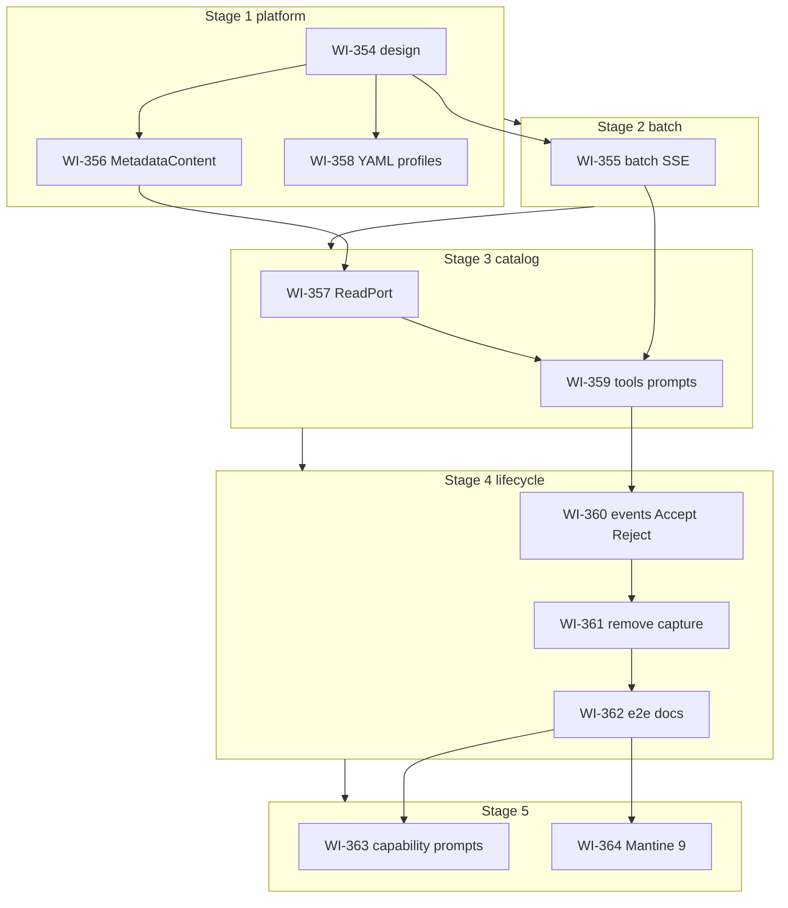

# Metadata authoring capability and agent profiles

**Status:** `closed` (**2026-06-29**)  
**Milestone:** **0.8.0**  
**Delivery:** **staged** — five stages, one branch + MR per stage (see § Staged delivery). **Handover:** [`PLAN.md`](PLAN.md) + [`COLDSTART.md`](COLDSTART.md).  
**Story folder:** [`docs/workitems/completed/20260629-metadata-authoring-profiles/`](.) — archived **2026-06-29**.  
**Backlog:** **A-98** (`done`)

## Goal

**Primary:** Make **`metadata-authoring`** **catalog-generic** — the LLM must recognize and capture
**any facet type** registered in the system (not only **`descriptive`**), using reviewed tools:

- **`list_facet_categories`** — distinct categories from catalog + joined **`facet-type-category`** guidance ([`GAPS.md`](GAPS.md) §4)
- **`list_facet_types`** — catalog **summary** for reasoning (shortlist `facetTypeKey`) — [`GAPS.md`](GAPS.md) §3b
- **`get_facet_type`** — full manifest + **`contentSchema`** + joined **`facet-type-example`** hints
- **`validate_facet_payload(facetType, payload)`** — validates proposal against facet type schema (dry-run)
- **`propose_facet_assignment(target, facetType, payload)`** — capture only when schema (+ applicability) valid; **no** LLM `scopeUrn` or `mergeAction`
- **No `capture_<specific facet>`** tools

**Secondary:** YAML-defined **agent profiles** (including **`metadata-authoring`**), real
**`MetadataReadPort`** on mill-service, **`MetadataContent`** seeds, operator seed config, and
**facet artefact lifecycle** — capture-time chat-scope assign + **Accept/Reject** (**WI-360**).

Today, facet capture is effectively **descriptive-only** in tests and practice: parallel
**`capture_description`** in [`schema-authoring.yaml`](../../../../ai/mill-ai/src/main/resources/capabilities/schema-authoring.yaml),
harness ports with a single facet type, and **`EmptyMetadataReadPort`** on mill-service so the catalog
tools return nothing in production.

## Staged delivery

**Story-specific override** of default [`RULES.md`](../../RULES.md) “one branch per story”: this story uses **one branch + one MR per stage**, with **multiple WIs per stage** grouped by Mill component / concern. All other RULES apply unless noted below. **Story closure** remains **explicit user request only**.

Each **stage** = one branch → per-WI commits during work → **squash** to a small logical set → **one MR** → `dev` → **your review**. Next stage branches from **`origin/dev`** only **after** the prior stage MR is **merged**.

### Renumber legend (planning 2026-06-25; stage split 2026-06-25)

| New WI | Was | Stage |
| ------ | --- | ----- |
| **WI-354** | WI-345 | 1 |
| **WI-356** | WI-352 | 1 |
| **WI-358** | WI-348 | 1 |
| **WI-355** | WI-351 | **2** (dedicated — review isolation) |
| **WI-357** | WI-346 | 3 |
| **WI-359** | WI-347 | 3 |
| **WI-360** | WI-353 | 4 |
| **WI-361** | WI-350 | 4 |
| **WI-362** | WI-349 | 4 |
| **WI-363** | — | **5** (new — MR !412 review 2026-06-26) |
| **WI-364** | — | **5** (new — mill-ui Mantine 9 migration) |

*(File renames WI-345…353 → WI-354…362 pending.)*

### Stage table (5 stages — component groups)

| Stage | Branch | WIs (order on branch) | Components | Merge gate |
| ----- | ------ | --------------------- | ---------- | ---------- |
| **1** | `feat/meta-authoring-platform` | **WI-354** → **WI-356** → **WI-358** | `docs/design`, `metadata` (`MetadataContent` entity + seeds), `ai/mill-ai` (YAML profiles) | WI-354: design review. WI-356: `:metadata:mill-metadata-core:test --tests "*MetadataContent*"`. WI-358: `:ai:mill-ai:test --tests "*Profile*"` |
| **2** | `feat/meta-artifact-batch` | **WI-355** | `ai/mill-ai` (agent, batch protocol, pointers, SSE), `ui/mill-ui` (multi-card SSE) | **WI-355 only:** L1–L6 + mill-ui SSE Vitest ([`GAPS.md`](GAPS.md) §1, §15–§16) — **requires stage 1 merged** (WI-354 design contract) |
| **3** | `feat/meta-authoring-catalog` | **WI-357** → **WI-359** | `ai/mill-ai-data`, `metadata`, `ai/mill-ai` (capabilities + prompts) | WI-357: `:ai:mill-ai-data:test --tests "*Metadata*"`. WI-359: `:ai:mill-ai:test --tests "*Metadata*"` — **requires stages 1–2 merged** (WI-356 content + WI-355 batch) |
| **4** | `feat/meta-authoring-lifecycle` | **WI-360** → **WI-361** → **WI-362** | `core/mill-events`, `metadata` (scope rows), `ai/mill-ai` (`ArtifactRef` core type), `ai/mill-ai-service`, `ui/mill-ui` (Accept/Reject + per-artefact SQL binding), `ai/mill-ai-test`, `docs/` | WI-360: `:core:mill-events:test` + `:ai:mill-ai-service:testIT --tests "*Artifact*"` + mill-ui lifecycle tests. WI-361: no `capture_*` in manifests. WI-362: lifecycle e2e + design integration pass |
| **5** | `feat/meta-capability-prompts` / `feat/mill-ui-mantine-9` | **WI-363** · **WI-364** (separate branches/MRs) | WI-363: `ai/mill-ai` (capability YAML, profile prompts), `ai/mill-ai-test`, `docs/design/agentic/`. WI-364: `ui/mill-ui` (Mantine 9) | WI-363: per-capability intents + `:ai:mill-ai:test --tests "*Profile*"` + `:ai:mill-ai-test:test --tests "*facet*"`. WI-364: `npm run lint` + `build` + `test -- --run` in `ui/mill-ui` — **both require stage 4 merged**; **no cross-dependency** |

**Rationale:** Stages **1–3** land platform, batch, and catalog tools. Stage **4** delivers lifecycle and e2e on the **transitional** intent model (cross-capability routes in `metadata-authoring.intent`). Stage **5** refactors prompts and capability declarations to the **target** model (per-capability intents, profile-level composition) without changing tool or artefact contracts.



### Per-stage workflow (normative)

On top of [`RULES.md`](../../RULES.md) **Per-WI cadence** and **Complete working copy per WI**.

1. **Branch** — `git fetch origin && git checkout -b <stage-branch> origin/dev` (after previous stage MR **merged**).
2. **Implement WIs in stage order** (see table) — each WI: acceptance criteria in `WI-NNN-*.md`.
3. **Tracker after each WI** — `[x]` in **Work Items**; update WI file; **first `[x]`** → `planned/` → `in-progress/`.
4. **One commit per WI** — full working copy (code, tests, `STORY.md`, WI doc) before starting the **next WI on the same branch**.
5. **End of stage** — run **all** stage merge-gate commands; **squash** per-WI commits into a **small logical set** (typically **2–4 commits** grouped by component, e.g. platform / metadata / profiles for stage 1 — or **one** if stage is small). Push (`--force-with-lease` if rewritten).
6. **MR** → `dev` — list **all WIs** in stage, verify output, pipeline link. **Wait for your review and merge** before next stage.
7. **Do not** start stage **N+1** until stage **N** MR is **merged**.

**Not at stage MR:** story archive, MILESTONE/BACKLOG, story-level history rewrite.

## Architectural decisions (locked — planning review 2026-06-25)

| Decision | Choice |
|----------|--------|
| **Authoring model** | **`list_facet_categories`** → **`list_facet_types`** → **`get_facet_type`** → **`validate_facet_payload`** → **`propose_facet_assignment`** |
| **Proposal shape** | **`propose_facet_assignment(metadataEntityId, facetTypeKey, payload)`** — payload from type **`contentSchema`**; **no** `scopeUrn` or `mergeAction` tool args |
| **Validation** | **`validate_facet_payload`** + optional **`metadataEntityId`** for **`applicableTo`**; shared with capture ([`GAPS.md`](GAPS.md) §2) |
| **Capability roles** | **`schema`** + **`metadata`** = read-only; **`metadata-authoring`** = capture only; **`schema-authoring` capability removed** ([`GAPS.md`](GAPS.md) §7) |
| **`MetadataContent`** | Separate entity for authoring support — **`facet-type-example`**, **`facet-type-category`** ([`GAPS.md`](GAPS.md) §4); **not** on `FacetTypeDefinition` |
| **Category guidance** | `MetadataContent` `contentKind: facet-type-category`, `targetUrn: urn:mill/metadata/facet-type-category:<slug>`; **`list_facet_categories`** merges catalog categories + content |
| **Examples** | `MetadataContent` `contentKind: facet-type-example`; **`get_facet_type`** joins synthetic **`examples[]`** on wire only |
| **Scopes on context** | **`AgentContext.scopes`**: `{ scopeUrn, access: r \| w \| rw }`; chat default: global **`r`**, chat **`rw`** ([`GAPS.md`](GAPS.md) §3c, §5) |
| **Capture write targets** | Runtime sets **`writeScopeUrns[]`** on artefact; **`artifact.facet.persisted`** assigns facets into those scopes (**WI-360**) |
| **Facet lifecycle** | **Accept** locks artefact; **Reject** retracts scope + deletes artefact via **`mill-events`** ([`GAPS.md`](GAPS.md) §23) |
| **Lifecycle event transport** | **In-process `mill-events`** (`InMemoryEventTransport` / `SpringEventTransport`) — **architectural** producer/consumer boundary ([`general-event-bus.md`](../../../design/platform/general-event-bus.md)); **not** operational-drift remediation. Kafka/outbox → **P-50** backlog only (**WI-360**) |
| **Merge on persist** | **`FacetProposalMerger`** in **`FacetArtifactPersistedHandler`** — **`SINGLE`** / **`MULTIPLE`** SET ([`GAPS.md`](GAPS.md) §5) |
| **Relation facet keys** | **`relation-source`** / **`relation-target`** on **table** by join role; **`relation`** on **schema/model** for full edge ([`GAPS.md`](GAPS.md) §6) |
| **Profile definition** | Multi-document YAML, **`kind: AgentProfile`** |
| **Profile `schema-authoring`** | **Deprecated** — use `metadata-authoring` (facets) or `data-analysis` (SQL) ([`GAPS.md`](GAPS.md) §8) |
| **Profile registry** | **`mill.ai.profiles.seed.resources`** |
| **`list_facet_types` output** | Summary only — no **`contentSchema`** (§3b) |
| **`get_facet_type` output** | Full manifest + joined **`examples[]`** |
| **Capture scope** | Chat-scope facet write via **`artifact.facet.persisted`** handler (**WI-360**); global scope never auto-written |
| **Chat artefact** | **`facet-proposal`** + **`writeScopeUrns[]`**; **`status`**: `pending` → `accepted` \| retracted |
| **Multi-facet per turn** | Batch `{ results[] }` → N artefacts; **full** turn + pointer + GET support (**WI-351** §15) |
| **Partial batch failure** | Emit all successes; continue on failure ([`GAPS.md`](GAPS.md) §9) |
| **Mixed SQL + facets** | One turn: **`generated-sql`** + **`facet-proposal`(s)**; **Accept/Reject** on facets (§10, §23) |
| **Intent routing (stages 3–4)** | **Transitional:** `metadata-authoring.intent` includes cross-capability routes (`DATA_QUERY`, `EXPLORE`) for `data-analysis` mixed turns — documented; **not** the long-term model |
| **Intent routing (stage 5)** | **Target:** per-capability intents only; profile composes non-overlapping union — **WI-363** |
| **MCP** | Profile-driven exposure via existing catalog; **all new tools MCP-enabled** (default); inventory doc in **WI-349** ([`GAPS.md`](GAPS.md) §18) |

## Gap (why this story exists)

| Gap | Evidence |
|-----|----------|
| **Descriptive-only capture path** | `capture_description` + tests/harness only exercise `descriptive` |
| **Dual capture mechanisms** | `capture_*` vs `propose_facet_assignment` |
| **Catalog tools unused in prod** | `EmptyMetadataReadPort` |
| **Split artefact paths** | `schema.authoring.capture` vs `metadata.faceting.capture` |
| **Profiles are code-only** | Kotlin `*AgentProfile.kt` objects |
| **Weak intent → facet routing** | No catalog-generic prompts; SQL confusion on DQ utterances |
| **Single-capture runtime** | `LangChain4jAgent` last-wins `captureBinding` |
| **No MetadataContent** | Examples/category guidance mixed into facet definitions or prompts only |
| **Capture-only artefacts** | Facets persist as chat artefacts but are **not** assigned to chat scope; no Accept/Reject |

## Prerequisites

- [`ai-facet-catalog-inference`](../../completed/20260428-ai-facet-catalog-inference/STORY.md)
- [`dqm-metadata-facets`](../../completed/20260624-dqm-metadata-facets/STORY.md)
- [`ai-chat-facet-display`](../../completed/20260619-ai-chat-facet-display/STORY.md)

## Module touchpoints

| Area | Change |
|------|--------|
| `metadata/mill-metadata-core` | **WI-356** `MetadataContent`, seeds, `FacetProposalMerger` |
| `metadata/mill-metadata-persistence` | **WI-356** JPA `metadata_content`; **WI-360** scope facet rows + **`sourceArtifactId`** |
| `ai/mill-ai-data` | **WI-357** `MetadataReadPort` |
| `core/mill-events` | **WI-360** `artifact.facet.persisted` / `artifact.retracted` event types |
| `core/mill-events-autoconfigure` | **WI-360** `EventConsumer` handler registration |
| `ai/mill-ai` | **WI-355** batch; **WI-359** tools; **WI-360** event publish hooks |
| `ai/mill-ai-service` | **WI-360** Accept/Reject REST |
| `ui/mill-ui` | **WI-355** multi-card; **WI-360** Accept/Reject buttons; **WI-364** Mantine 9 |

## Out of scope

- Cross-chat / global promotion UI (**M-23** admin) — chat-scope assign + Accept/Reject only in this story
- **M-32** admin UI
- Unified Mill seed runner (all `kind` types)

## Work item order

| Seq | WI | Stage | Rationale |
|-----|-----|-------|-----------|
| 1 | WI-354 | **1** | Design contract |
| 2 | WI-356 | **1** | **MetadataContent** (entity + seeds; merger used in WI-360) |
| 3 | WI-358 | **1** | YAML profiles |
| 4 | WI-355 | **2** | Multi-artifact platform — **dedicated MR**; **blocks WI-359** |
| 5 | WI-357 | **3** | **MetadataReadPort** — depends WI-356 |
| 6 | WI-359 | **3** | Catalog tools + prompts — depends WI-355, WI-356, WI-357 |
| 7 | WI-360 | **4** | Facet lifecycle + **promote `ArtifactRef` to `mill-ai` core** (wire `artifactId`, per-artefact attach) — depends WI-355, WI-356, WI-359 |
| 8 | WI-361 | **4** | Remove `capture_*` — depends WI-359, WI-355 |
| 9 | WI-362 | **4** | E2e + docs on transitional intents — depends WI-360, WI-361 |
| 10 | WI-363 | **5** | Per-capability intents + profile prompt composition — depends WI-362 |
| 11 | WI-364 | **5** | Mantine 9 migration in mill-ui — depends WI-362; **parallel** with WI-363 |

## Work Items

- [x] WI-354 — Design contract (`WI-345-metadata-authoring-design-contract.md`) — *was WI-345*
- [x] WI-355 — Multi-artifact protocol (`WI-351-multi-artifact-protocol-runtime.md`) — *was WI-351*
- [x] WI-356 — `MetadataContent` entity + seeds (`WI-352-metadata-content-entity-and-seed.md`) — *was WI-352*
- [x] WI-357 — `MetadataReadPort` adapter (`WI-346-metadata-read-port-adapter.md`) — *was WI-346*
- [x] WI-358 — YAML agent profiles (`WI-348-agent-profiles-metadata-authoring.md`) — *was WI-348*
- [x] WI-359 — Catalog-generic facet tools (`WI-347-metadata-authoring-capability.md`) — *was WI-347*
- [x] WI-360 — Facet lifecycle + events (`WI-360-facet-artifact-lifecycle-events.md`) — *was WI-353*
- [x] WI-361 — Remove `capture_*` (`WI-361-schema-authoring-description-tool-cleanup.md`) — *was WI-350*
- [x] WI-362 — Tests, scenarios, docs (`WI-349-metadata-authoring-tests-docs.md`) — *was WI-349*
- [x] WI-363 — Capability prompt declaration (`WI-363-capability-prompt-declaration.md`) — *stage 5; separate MR*
- [x] WI-364 — Mantine 9 migration (`WI-364-mantine-v9-migration.md`) — *stage 5; separate MR*

## Verify (full story — before story archive)

Run after **stage 5** MRs merged (stage 4 verify + WI-363 / WI-364 gates):

```bash
./gradlew :metadata:mill-metadata-core:test --tests "*MetadataContent*"
./gradlew :ai:mill-ai:test --tests "*Metadata*"
./gradlew :ai:mill-ai:test --tests "*SchemaAuthoring*"
./gradlew :ai:mill-ai:test --tests "*Profile*"
./gradlew :ai:mill-ai-data:test --tests "*Metadata*"
./gradlew :ai:mill-ai-service:testIT --tests "*Artifact*"
./gradlew :ai:mill-ai-service:testIT --tests "*metadata*"
./gradlew :core:mill-events:test
./gradlew :ai:mill-ai-test:test --tests "*facet*"
./gradlew :ui:mill-ui:test
```

**Stage 5 add-on (WI-363):**

```bash
./gradlew :ai:mill-ai:test --tests "*Profile*"
./gradlew :ai:mill-ai:test --tests "*Metadata*"
./gradlew :ai:mill-ai-test:test --tests "*facet*"
```

**Stage 5 add-on (WI-364):**

```bash
cd ui/mill-ui && npm run lint && npm run build && npm run test -- --run
```

## Prompt enforcement

When **`metadata-authoring`** is active, prompts **must** route documentary utterances to facet capture
(not SQL, not idle chat). See [`GAPS.md`](GAPS.md) §4 for dynamic category index (not a static YAML table).

### Prompt assets (WI-347)

| Prompt id | Role |
|-----------|------|
| **`metadata-authoring.intent`** | Classify `AUTHOR_FACET` vs explore vs SQL vs chat |
| **`metadata-authoring.reasoning`** | **`list_facet_categories`** → ground → **`list_facet_types`** → **`get_facet_type`** → validate → capture |
| **`metadata-authoring.batch`** | Parallel multi-facet capture |
| **`metadata.faceting.system`** | Profile-neutral grounding |
| **`metadata.faceting.request`** | Payload generation from **`get_facet_type`** |

### Authoring loop (normative)

```
ground (schema) → metadataEntityId
→ list_metadata_scopes()           # AgentContext scopes (r / w / rw)
→ list_facet_categories()          # category + signalPhrases from MetadataContent
→ list_facet_types(category=…) → get_facet_type(facetTypeKey)
→ validate_facet_payload → propose_facet_assignment
→ facet-proposal artefact (pending, writeScopeUrns[] from context)
→ artifact.facet.persisted → chat-scope facet rows (FacetProposalMerger, sourceArtifactId)
→ UI: Accept (lock artefact) | Reject → artifact.retracted → undo scope + delete artefact
```

## Multi-facet batch

**Sweet spot (locked §22):** N parallel **`propose_facet_assignment`** calls → **WI-351** batch **`ProtocolFinal`** `{ results[] }` → N artefacts. **No** plural `propose_facet_assignments` tool. **WI-347** **`metadata-authoring.batch`** prompt guides parallel capture.

**Partial batch failure (locked §9):** parallel captures → persist **every** success; failures remediated in the next tool round — never all-or-nothing.

**Mixed SQL + facets (locked §10):** same turn may persist `generated-sql` + `facet-proposal`(s); facets assigned on persist; **Accept/Reject** on facet cards (§23).

## Manual verification bookmark

- [ ] **Multi-artifact visual UX (mill-ui)** — Manually verify N `facet-proposal` cards in general chat after runtime can produce a real multi-capture turn (best after **WI-359** prompts, or sooner via **GET replay** with N persisted `artifacts[]` rows). Expect: section title **“Facet proposals”** (plural), stacked **`FacetCondensedPreview`** cards, optional assistant text below. **Note:** mock `chatService` does not stream multi-part SSE; use mill-service + REST (`npm run dev` → proxy `localhost:8080`) or a dev transcript fixture. *Bookmarked 2026-06-25 — not gated on WI-355 merge alone (Vitest L6 only).*

- [ ] **Global artefact fingerprint + per-artefact execution binding** — **Stage 4 (WI-360 / WI-362).** JPA already has `ArtifactEntity.artifactId` + `urn`; `ArtifactRecord` carries `artifactId` at the persistence port but **GET/SSE wire drops it** and attach is turn-scoped — N `sql` cards can show the wrong grid. **Deliver in stage 4:** promote portable **`ArtifactRef`** (`id`, `type`, `urn`) in `mill-ai` core; expose **`artifactId`** on `ArtifactResponse` + SSE structured parts; **`sourceArtifactId`** on `sql.result` + `parentArtifactId` on attach API; mill-ui keys sql↔data by id. Not a content hash. Prerequisite for Accept/Reject REST (`…/artifacts/{artifactId}/…`) and mixed **SQL + SQL** turns. *Deferred from WI-355 — 2026-06-25.*

## Tool matrix (locked)

| Capability | Tools |
|------------|--------|
| `metadata` | `list_facet_categories`, `list_facet_types`, `get_facet_type`, `list_metadata_scopes`, `list_content`, `get_content`, `list_entity_facets`, `validate_facet_payload` |
| `metadata-authoring` | `propose_facet_assignment` |

## Related design docs ([`GAPS.md`](GAPS.md) §13)

| Doc | WI | Role |
|-----|-----|------|
| [`metadata-facet-catalog-v3.md`](../../../design/agentic/metadata-facet-catalog-v3.md) | WI-345 outline → WI-349 rewrite | **Canonical** authoring hub |
| [`metadata-content.md`](../../../design/metadata/metadata-content.md) | WI-345 skeleton → WI-352 | Domain entity |
| [`ai-v3-chat-metadata-scope.md`](../../../design/agentic/ai-v3-chat-metadata-scope.md) | WI-360 | Scope + Accept/Reject lifecycle |
| [`artifact-foundation.md`](../../../design/agentic/artifact-foundation.md) | WI-355 | Batch `ProtocolFinal` |
| [`general-event-bus.md`](../../../design/platform/general-event-bus.md) | WI-360 | Event type catalog note; in-process transport |

## Branch (stage 5 closure)

**WI-363** delivered on **`feat/meta-capability-prompts`** (MR !415). **WI-364** on **`feat/mill-ui-mantine-9`** (merged). Stages **1–4** landed via dedicated stage branches per § Staged delivery.
