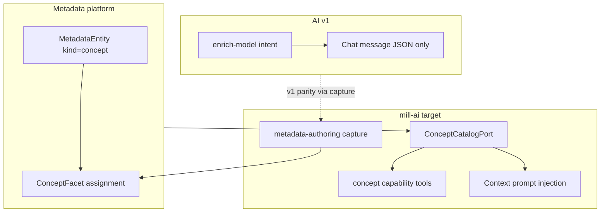

# Implementation plan — AI concepts (mill-ai v3)

**Status:** draft for review (2026-06-29) — **no code implementation yet**  
**Normative sources:** [`STORY.md`](STORY.md), WI files in this folder, [`RULES.md`](../../RULES.md)  
**Branch:** `feat/ai-concepts`

This file persists the full planning session: legacy analysis, target architecture, metadata model,
capability design, injection mechanics, authoring parity, and WI mapping. Concepts are model-level
metadata attached to the model entity and persisted in `w`; refine details here before
implementing WI-366.

---

## Work item mapping

| Plan section | WI |
|--------------|-----|
| Metadata model | **WI-366** |
| Concept catalog port + read capability | **WI-367** |
| Concept injection in `data-analysis` (general chat) | **WI-369** |
| Authoring / v1 enrich-model capture | **WI-370** |
| Agent iteration limit config guardrail | **WI-372** |

**Deferred (out of story):** WI-368 (knowledge-context chat), WI-371 (mill-ui knowledge inline chat).

**Staged execution (agreed):** start with **model** (WI-366), then **read + SQL grounding**
with the runtime guardrail first or in parallel (WI-372 before/alongside WI-367, then WI-367 and
WI-369), then **author** (WI-370).

**Story-level acceptance (general chat):**

1. WI-366 seeds a VIP passenger concept as a model-level `concept` facet on
   `ModelEntityUrn.MODEL_ENTITY_ID` in `w`.
2. WI-367 returns it through `get_concept` and `get_model_concepts`.
3. WI-369 lets a `data-analysis` chat use concept tools or injection to ground a "vip passengers"
   SQL request on the concept definition and indicative SQL.
4. WI-370 captures and accepts a new or refined concept through general chat, then it is readable
   through the WI-367 concept catalog path.
5. WI-372 makes the native tool-loop limit configurable so concept-tool scenarios can raise the
   limit without changing production defaults.

---

## What "concepts" are (legacy → platform)

In **AI v1** ([`ai/legacy/mill-ai-v1-core`](../../../ai/legacy/mill-ai-v1-core)), concepts were **not**
first-class persisted objects. They appeared as:

- LLM-structured JSON in the **`enrich-model`** intent (`type: "concept"` with `name`, `description`,
  `sql`, `tags`, legacy `category`, `targets`) — see
  [`enrich-model/user.prompt`](../../../ai/legacy/mill-ai-v1-core/src/main/resources/templates/nlsql/intent/enrich-model/user.prompt)
- String lists in **step-back** reasoning (`core-concepts`, `required-concepts`) —
  [`StepBackSummary.java`](../../../ai/legacy/mill-ai-v1-core/src/main/java/io/qpointz/mill/ai/nlsql/models/stepback/StepBackSummary.java)
- **No write path**: enrichments stayed in `UserChatMessage.content`; stored concepts were **not**
  fed back into schema prompts
  ([`SchemaMessageSpec`](../../../ai/legacy/mill-ai-v1-core/src/main/java/io/qpointz/mill/ai/nlsql/messages/specs/SchemaMessageSpec.java)
  ignores `ConceptFacet`)

In **grinder UI** ([`ui/mill-grinder-ui`](../../../ui/mill-grinder-ui)), concepts are **read-only
metadata entities**:

- `GET /api/metadata/v1/entities?kind=concept` (legacy UI used `type=CONCEPT`)
- Detail via `concept` facet →
  [`ConceptFacetView.tsx`](../../../ui/mill-grinder-ui/src/component/data-model/components/facets/ConceptFacetView.tsx)
- Active route `/context` (legacy `/concepts` redirect)

**Platform source of truth today** (already implemented outside `mill-ai`):

| Layer | Location | Role |
|-------|----------|------|
| Facet payload | [`ConceptFacet.kt`](../../../metadata/mill-metadata-core/src/main/kotlin/io/qpointz/mill/metadata/domain/core/ConceptFacet.kt) | `concepts[]` with name, description, sql, tags, source; treat legacy `category` and `targets` as compatibility, not first-iteration concept truth |
| Candidate links | [`ConceptTarget.kt`](../../../metadata/mill-metadata-core/src/main/kotlin/io/qpointz/mill/metadata/domain/core/ConceptTarget.kt) | Useful as proposed links/relations between concept metadata and model objects; prefer artifact/protocol metadata outside the concept facet |
| Entity URN | [`ModelEntityUrn.forConcept`](../../../data/mill-data-metadata/src/main/kotlin/io/qpointz/mill/data/metadata/ModelEntityUrn.kt) | `urn:mill/model/concept:<id>` |
| Entity listing | [`MetadataEntityController.listEntities(kind=concept)`](../../../metadata/mill-metadata-service/src/main/kotlin/io/qpointz/mill/metadata/api/MetadataEntityController.kt) | Browse concept entities |
| Example seed | [`example.yml`](../../../metadata/mill-metadata-core/src/test/resources/metadata/example.yml) | `concept_premium_customers` entity |

**mill-ai gap**: no `concept` capability, no `ConceptCatalogPort`,
[`MetadataEntityIds`](../../../ai/mill-ai/src/main/kotlin/io/qpointz/mill/ai/capabilities/metadata/MetadataEntityIds.kt)
only resolves `schema` / `table` / `attribute` paths, and
[`buildAgentSystemPrompt`](../../../ai/mill-ai/src/main/kotlin/io/qpointz/mill/ai/runtime/langchain4j/AgentSystemPrompt.kt)
has no context injection. Design already calls for this in
[`v3-foundation-decisions.md` §5.3 / §7.3](../../../design/agentic/v3-foundation-decisions.md).

**Required v1-style concept behaviour in v3:**

1. Recognize user intent to define or refine a business concept.
2. Generate or normalize a concept name.
3. Summarize and rewrite the concept description into metadata-quality prose.
4. Generate an indicative list of tags.
5. Generate an indicative SQL hint for extracting the concept from the DB; prefer valid SQL, but
   treat the SQL as concept metadata and reasoning guidance.

**v3 persistence rule:** concepts are model-level metadata. Captured concepts are always attached
to the model entity and persisted into the `w` context, the same way other captured facets are
persisted. The concept facet should carry the concept definition, tags, and indicative SQL
hint. Candidate object links inferred during capture should be emitted as protocol/artifact metadata
outside the facet payload and processed separately, because they describe relations between metadata
and objects rather than the concept itself. Concept read tools must expose persisted concept facets
so SQL generation can reason over them. For example, if a user asks "give me vip passengers", the
SQL agent should be able to retrieve the "VIP passenger" concept definition, tags, and
indicative SQL hint.



---

## Recommended metadata model (WI-366 — start here)

**Decision: concepts are model-level facet metadata on the logical model root only.** Captured
concepts are always assigned to [`ModelEntityUrn.MODEL_ENTITY_ID`](../../../data/mill-data-metadata/src/main/kotlin/io/qpointz/mill/data/metadata/ModelEntityUrn.kt)
(`urn:mill/model/model:model-entity`) and persisted in the `w` context. This is the sole adequate
assignment target because concepts may span schemas and objects. Legacy `targets[]` may be read for
compatibility, but first-iteration capture should not populate it as part of the concept facet.
Standalone `type: CONCEPT` metadata entities are not assignment targets in v1 ([`GAPS.md`](GAPS.md)
GAP-1 **locked**).

| Field | Convention |
|-------|------------|
| Assignment target | **`ModelEntityUrn.MODEL_ENTITY_ID`** only (`urn:mill/model/model:model-entity`) |
| Chat binding | **General chat only** — `data-analysis` profile on `/chat`; concept tools + optional prompt injection for SQL grounding (WI-369). **No** `contextType=knowledge` / contextual inline chat in this story (WI-368 deferred). |
| Logical concept ref | `urn:mill/model/concept:<slug>` — canonical id within model-level facets on `MODEL_ENTITY_ID` (GAP-2 **locked**) |
| Optional entity `kind` | `concept` — legacy browse/listing only; not used for v1 capture assignment |
| Facet type | `urn:mill/metadata/facet-type:concept` |
| Platform facet definition | Required in platform facets (`platform-bootstrap.yaml` seed plus `platform-facet-types.json` reference) with a real `contentSchema` |
| Applicability | `urn:mill/metadata/entity-type:model` only — assignment on `ModelEntityUrn.MODEL_ENTITY_ID` (GAP-1, GAP-4 **locked**) |
| Facet payload | One `ConceptFacet` entry per assignment: `concepts[]` with **exactly one** element; facet type `targetCardinality: MULTIPLE` so the model root can carry many concept assignments (GAP-3 **locked**). Multiple concepts → multiple assignments, not one payload with many entries |
| Candidate object links | Optional protocol/artifact metadata outside the facet payload; process with event consumers into relation/link projections |
| `source` | `MANUAL` \| `INFERRED` \| `NL2SQL` (already in [`Enums.kt`](../../../metadata/mill-metadata-core/src/main/kotlin/io/qpointz/mill/metadata/domain/Enums.kt)) |

**WI-366 deliverables:**

1. **Design note**
   [`docs/design/agentic/concept-metadata-model.md`](../../../design/agentic/concept-metadata-model.md)
   — canonical representation, model-level assignment target, `w` context persistence,
   URN mapping table, facet payload examples, candidate link handling outside the
   facet payload, and explicit non-goals (no taxonomy tree).
2. **Define the platform concept facet type**: add a first-class `FacetTypeDefinition` for
   `urn:mill/metadata/facet-type:concept` to
   [`platform-bootstrap.yaml`](../../../metadata/mill-metadata-core/src/main/resources/metadata/platform-bootstrap.yaml)
   and align the reference descriptor in
   [`platform-facet-types.json`](../../../metadata/mill-metadata-core/src/main/resources/metadata/platform-facet-types.json).
   The current reference entry is not enough: it has an empty `contentSchema` and is not loaded from
   the bootstrap seed.
3. **Facet descriptor shape**: define `contentSchema` for the model-level concept payload: one
   assignment per concept; `concepts[]` with exactly one entry (name, rewritten description, tags,
   indicative SQL, source, source session). Do not include category or LLM-inferred targets in the
   first-iteration schema.
4. **Applicability**: set `applicableTo` to **`ModelEntityUrn.MODEL_ENTITY_ID`** only.
5. **Test fixture**: extend metadata IT seed (or `mill-ai-test` fixture) with 2–3 model-level
   concept facets including descriptions, tags, and indicative SQL.
6. **Concept ref resolution** in design: **`ConceptRefs`** (not `MetadataEntityIds`) accepts only
   `urn:mill/model/concept:<slug>`; physical catalog paths remain on `MetadataEntityIds` (GAP-5
   **locked**; implement in WI-367).

---

## Concept capability + injection (WI-367, WI-369)

Follow the established **port → adapter → capability → profile** pattern used by
[`SchemaCapability`](../../../ai/mill-ai/src/main/kotlin/io/qpointz/mill/ai/capabilities/schema/SchemaCapability.kt).

### Port (`mill-ai`) — WI-367

New `ConceptCatalogPort` in `ai/mill-ai` with agent-facing wire types (not raw facet maps):

- `listConceptTags(scope?)` → distinct concept tags, optionally with counts, from concept facet assignments in the active read scope
- `listConcepts(scope?, tag?)` → summary rows (`conceptId`, `name`, `description`, `tags`,
  `metadataEntityUrn`)
- `getConcept(conceptRef)` → full detail including `sql`, `source`, and tags
- `searchConcepts(query, tag?)` → deterministic lexical match on name/description/tags; **not** semantic/vector search in v1
- `getModelConcepts(contextRef?)` → all model-level concept facets from the active `w` context

`ConceptCapabilityDependency` + register in
[`SchemaFacingCapabilityDependencyFactory`](../../../ai/mill-ai/src/main/kotlin/io/qpointz/mill/ai/dependencies/SchemaFacingCapabilityDependencyFactory.kt)
(new `CONCEPT = "concept"` constant).

### Adapter (`mill-ai-data`) — WI-367

`ServiceConceptCatalogAdapter` backed by in-process:

- `FacetService.resolve(MODEL_ENTITY_ID, MetadataReadContext)` → list/parse `concept` facet assignments
- Resolve concept refs via **`ConceptRefs`**: `urn:mill/model/concept:<slug>` only (GAP-5 **locked**)

Wire in `AiV3DataAutoConfiguration` + `SpringCapabilityDependencyAssembler`.

### Capability manifest — WI-367

New `capabilities/concept.yaml` + `ConceptCapabilityProvider`:

| Tool | Kind | Purpose |
|------|------|---------|
| `list_concept_tags` | QUERY | List distinct tags for targeted concept discovery |
| `list_concepts` | QUERY | Browse/filter concepts, including optional tag filter |
| `get_concept` | QUERY | Full definition by id/URN/slug |
| `search_concepts` | QUERY | Lexical keyword discovery over name, description, and tags |
| `get_model_concepts` | QUERY | Model-level concept facets from the active `w` context |

Prompts:

- `concept.system` — when to use concept tools vs schema tools
- `concept.focus` — template for injected focused concept body

Register in `META-INF/services/...CapabilityProvider`.

### Non-overlap contract (WI-363 guardrail)

The concept capability must follow the WI-363 prompt-composition model: each capability owns only
capability-scoped intent, and profiles compose mixed turns. Concept prompts/tools must not duplicate
schema, SQL, metadata catalog, or generic authoring responsibilities.

| Capability | Owns | Concept must not duplicate |
|------------|------|----------------------------|
| `schema` | Physical schema discovery and catalog-path grounding | Do not reimplement `list_schemas`, `list_tables`, `list_columns`, `list_relations`, or `resolve_metadata_entity` |
| `sql-query` | DATA_QUERY classification, SQL generation, validation, generated-SQL artifacts | Do not validate SQL or emit generated-SQL artifacts; concept SQL is only an indicative metadata hint |
| `metadata` | Facet category/type catalog, scope listing, payload validation | Do not expose generic facet catalog tools from `concept` |
| `metadata-authoring` | Generic `propose_facet_assignment` CAPTURE lifecycle | Do not add `capture_concept` or any typed facet capture tool; use `propose_facet_assignment` for persistence |
| Profile prompts | Mixed-turn routing across loaded capabilities | Do not make `concept.intent` classify DATA_QUERY, EXPLORE, or AUTHOR_FACET globally |

`concept.intent` should be capability-local: detect concept lookup/explanation/search and concept
definition/refinement signals only. In `data-analysis`, profile-level intent composes
`sql-query.intent`, `schema.intent`, `metadata-authoring.intent`, and `concept.intent` so a request
such as "give me vip passengers" can route to DATA_QUERY while also using concept tools as
reasoning context.

### Profiles (in scope)

Extend existing profile in
[`platform-agent-profiles.yaml`](../../../ai/mill-ai/src/main/resources/profiles/platform-agent-profiles.yaml):

```yaml
id: data-analysis  # WI-369 (GAP-8 **locked**)
capabilities: [..., concept]  # SQL grounding + MCP concept.* when mill.ai.mcp.profile=data-analysis
prompts:
  data-analysis.intent:
    # compose concept.intent as semantic hints after sql-query.intent; not a DATA_QUERY route
```

**Deferred:** `concept-exploration` profile and `contextType=knowledge` binding (WI-368).

### Injection mechanics — WI-369 (general / data-analysis chat)

**A. Prompt injection (optional, deterministic)**

Extend `buildAgentSystemPrompt` (or small `ConceptContextInjector` called from
`LangChain4jChatRuntime`):

| Context | Injection |
|---------|-----------|
| `data-analysis` general chat (`/chat`, no contextual binding) | Optional compact model-level concept summary in system prompt; `concept.system` instructs agent to call `list_concept_tags`, `list_concepts`, `search_concepts`, or `get_model_concepts` when user uses domain language |

Primary path is **tool discovery** on `data-analysis` — injection is an optimization, not required
for story closure.

**Deferred (WI-368):** `contextType=knowledge` focused injection, `context-profiles` mapping,
`concept-exploration` profile, rehydration rules for knowledge contextual chat.

### Tests

- Unit: `ConceptCatalogAdapterTest`, `ConceptRefsTest` (WI-367)
- `ProfileIntentPromptTest` coverage: `concept.intent` remains capability-local and
  `data-analysis.intent` composes concept with SQL/schema/authoring routes without overlap (WI-369).
- `mill-ai-test` scenario: SQL generation for a phrase such as "vip passengers" can use a
  model-level concept definition and indicative SQL hint before producing SQL (WI-369)

---

## Authoring / capture (WI-370)

Reuse **`metadata-authoring`** rather than a v1-style monolithic enrich-model intent. Map v1
enrichment types:

| v1 `enrich-model` type | v3 path |
|------------------------|---------|
| `concept` | `propose_facet_assignment` with `facetTypeKey=concept` on the model entity in `w` |
| `model` | `descriptive` on schema/table/attribute entities |
| `rule` | DQ facet types (`dq-null-check`, etc.) |
| `relation` | `relation-source` / `relation-target` |

**Additional work for concepts** (not covered by generic authoring today):

1. **Intent recognition** — detect user turns that define or refine one or more business concepts.
2. **Payload generation** — per concept: normalize name, rewrite description, propose tags, and
   produce an indicative SQL hint.
3. **Payload mapping** — translate each generated concept (and v1 enrichment JSON) → one
   `ConceptFacet.Concept` in `concepts[0]` without LLM-inferred `targets` in the facet.
4. **Facet assignment** — **one `propose_facet_assignment` per concept** on `MODEL_ENTITY_ID` in
   `w`. When the LLM infers multiple concepts in one turn, emit **parallel** proposals (batch
   `results[]` / multi-artifact lifecycle — same as WI-351); never combine multiple concepts into
   one facet assignment (GAP-3 **locked**).
5. **Candidate links** — when the model can ground relevant schema/table/attribute objects, expose
   them in the protocol/artifact envelope as proposed links keyed by `conceptRef` and
   `parentFacetArtifactId`, not in the facet payload (GAP-7 **locked**).
6. **Relate pipeline** — deferred to `concept-object-relations` (WI-374–375): separate
   `concept.link.*` events and consumers; assign-facet stays on `artifact.facet.persisted`.
7. **Approval lifecycle** — facet proposal artifacts (`facet-proposal`) + accept/reject (already
   exists); set `source=NL2SQL` and `sourceSession=<chatId>`.
8. **Profile** — extend `data-analysis` or add capture-oriented profile with `concept` +
   `metadata-authoring` for general-chat concept definition turns (not knowledge contextual chat).

---

## Deferred — knowledge / contextual chat (WI-368, WI-371)

Out of **`ai-concepts`** story scope (subject to separate review). Previously planned:

- `concept-exploration` profile, `contextType=knowledge`, `context-profiles` config
- mill-ui `/knowledge` inline chat wiring

See [`WI-368-concept-chat-injection.md`](WI-368-concept-chat-injection.md) and
[`WI-371-mill-ui-knowledge-chat.md`](WI-371-mill-ui-knowledge-chat.md).

---

## Runtime guardrail: configurable agent iteration limit (WI-372)

`LangChain4jAgent` currently has a hard-coded native tool-loop guard:
`MAX_ITERATIONS = 20`. Exhaustion returns the fallback answer
`Reached maximum iteration limit without producing a final answer.` The limit should be
externally tunable for deployments and tests without changing concept capability behavior.

Add `mill.ai.chat.max-iterations` to `AiV3ChatProperties` with default `20`, thread it through
`LangChain4jChatRuntime`, and pass it into `LangChain4jAgent` as a constructor parameter. Keep
the existing fallback contract and validate positive values. This is intentionally a runtime
guardrail rather than concept-specific behavior: it supports safer concept-tool rollout and reliable
integration scenarios while preserving the production default.

---

## Key files to touch (by WI)

| WI | Primary modules |
|----|-----------------|
| WI-366 | `metadata/mill-metadata-core` platform facets/seeds/tests, `docs/design/agentic/` |
| WI-367 | `ai/mill-ai`, `ai/mill-ai-data`, `ai/mill-ai-autoconfigure` |
| WI-369 | `ai/mill-ai`, `ai/mill-ai-autoconfigure`, `ai/mill-ai-test` |
| WI-370 | `ai/mill-ai` metadata-authoring, `ai/mill-ai-service` artifact flow |
| WI-372 | `ai/mill-ai`, `ai/mill-ai-autoconfigure`, runtime/property tests |

---

## Out of scope (initial delivery)

- Semantic/vector concept search; `search_concepts` is lexical in v1, with tag filtering for deterministic narrowing
- MCP exposure (auto-follows capability manifest when enabled)
- Full v1 step-back reasoner parity (concepts as strings → replaced by concept tools + injection)
- `ui/mill-grinder-ui` changes (legacy/retired)

---

## Open questions (refine during review)

Tracked in [`GAPS.md`](GAPS.md). Lock in WI-366 before implementation:

- ~~Single vs multiple `concepts[]` entries per model-level facet~~ — **locked:** many `concept`
  assignments on the model root; one assignment per concept; `concepts[]` length 1 (GAP-3).
- ~~Exact model entity URN / context reference used for `w` concept facet assignment~~ — **locked:** `ModelEntityUrn.MODEL_ENTITY_ID` (GAP-1).
- ~~Platform model entity-type URN for `concept.applicableTo`~~ — **locked:** `urn:mill/metadata/entity-type:model` (GAP-4); seed in `platform-bootstrap.yaml`.
- Candidate link protocol and relate event contract (`concept-object-relations`; GAP-7 **locked**).
- ~~Concept logical ref URN~~ — **locked:** `urn:mill/model/concept:<slug>` (GAP-2).
- ~~`data-analysis` + `concept` profile and MCP exposure~~ — **locked:** GAP-8.
- Knowledge / contextual chat — **deferred** (WI-368, WI-371).
