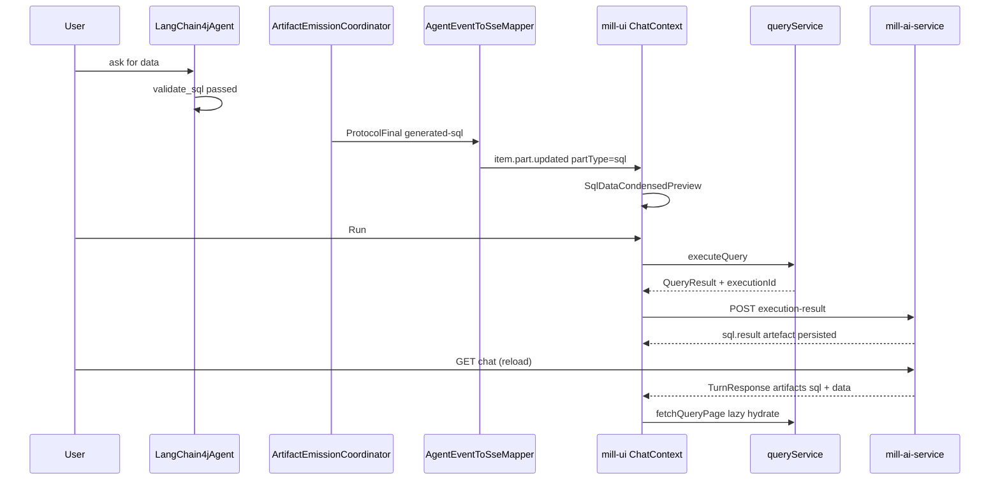

# Restart notes — ai-sql-view-restart

Supplementary guidance for implementers. Normative requirements remain in [`STORY.md`](STORY.md) and WI files.

## Provenance

| Item | Value |
|------|--------|
| **Story spec base** | Docs commit `479e4e5263c6412cc31117b9efe2d19c9dd7b9f0` (`planned/ai-sql-view/`) |
| **Foundation base** | `origin/feat/ai-chat-artefacts` (branch from here, not `dev`) |
| **Abandoned attempt** | `origin/feat/ai-chat-sql-result-view` — reference files only |
| **Abandoned story folder** | [`in-progress/ai-sql-view/`](../../in-progress/ai-sql-view/) on old branch (do not continue) |

The `479e4e52` docs were a **good presentation-layer plan** but lacked: artefacts prerequisite,
layer separation, do-not-port list, and salvage exclusion. This restart folder adds those.

## MR and branch strategy

**Preferred (two MRs):**

1. Merge `feat/ai-chat-artefacts` → `dev` first.
2. Branch `feat/ai-sql-view` from updated `dev`; implement WI-289–299; MR to `dev`.

**Alternative (single stacked MR):**

- One branch: artefacts commits + fresh sql-view commits on top.
- Squash at story closure into ~6–10 logical commits per [`RULES.md`](../../RULES.md).

**Do not:**

- Rebase or merge `feat/ai-chat-sql-result-view`.
- Cherry-pick commits from the old sql-view branch.

## Suggested commit structure (restart branch)

| # | Prefix | Content |
|---|--------|---------|
| 1 | `[docs]` | WI-289: design docs + `chat-artefact-architecture.md` draft |
| 2 | `[feat]` | WI-290: `ArtifactWireMapper`, GET replay wire, service tests |
| 3 | `[feat]` | WI-291: attach endpoint + client Run wiring |
| 4 | `[feat]` | WI-292–293: `artifactPreview/` framework + chat surfaces |
| 5 | `[feat]` | WI-296: `QueryDataView` extraction |
| 6 | `[feat]` | WI-297–298: expand shell + SQL expand |
| 7 | `[test]` | WI-294 + WI-299: verification + story closure docs |

One commit per WI during implementation is also valid per RULES; squash at closure.

## End-to-end data flow (target)



Layers **above Coord/SSE** are artefacts story. Layers **from UI Run onward** are this story.

## Persist kind → wire kind mapping (WI-290)

| Persisted (`ArtifactRecord.kind` / payload) | Consumer wire (`ArtifactResponse.kind`) | Source |
|---------------------------------------------|---------------------------------------|--------|
| `sql.generated` / `artifactType: generated-sql` | `sql` | Agent emission (artefacts) |
| `sql.result` / `artifactType: sql-result` | `data` | Client attach (WI-291) |
| Facet / metadata kinds | `facet-proposal` | Agent emission (artefacts) |
| `sql.validation` | *(not exposed on GET wire)* | Audit only — ARTIFACT destination |

`ArtifactWireMapper` lives in `mill-ai-service` only; it must not duplicate registry routing logic.

## File porting catalogue (from `feat/ai-chat-sql-result-view`)

Copy paths as **new files** or **surgical edits** on artefacts base. Never merge old-branch commits.

### Backend — port (additive)

| Path |
|------|
| `ai/mill-ai-service/.../ArtifactWireMapper.kt` |
| `ai/mill-ai-service/.../ArtifactWireMapperTest.kt` |
| `ai/mill-ai-service/.../UnifiedChatServiceTest.kt` (attach/replay tests) |
| `ai/mill-ai-autoconfigure/.../AiV3ChatServiceAutoConfiguration.kt` (`ArtifactStore` wiring) |
| DTO/controller/service interface changes for attach + `TurnResponse.artifacts` |

### Frontend — port (additive directories)

| Path |
|------|
| `ui/mill-ui/src/components/chat/artifactPreview/**` |
| `ui/mill-ui/src/components/chat/expand/**` |
| `ui/mill-ui/src/components/data/**` |
| `ui/mill-ui/src/utils/artifactWireParse.ts` |
| `ui/mill-ui/src/types/chatWire.ts` (wire types) |

### Frontend — rewrite integration (do not copy wholesale)

| Path | Why |
|------|-----|
| `ChatContext.tsx` | Old branch has salvage; merge artefacts SSE + replay hooks only |
| `InlineChatContext.tsx` | Same |
| `chatService.ts` | Same |
| `chatArtifactParse.ts` | Keep artefacts `schema-capture`/`unknown`; add `data` only |
| `MessageBubble.tsx` | Route via `ArtifactPreviewRouter` |

## Do not port (red flags in diff review)

| Path / symbol | Reason |
|---------------|--------|
| `GeneratedSqlAnswerSalvage.kt` | Symptom fix; coordinator handles emission |
| Inline `DefaultAgentEventRouter` body in `AgentEventRouter.kt` | Use `RegistryAgentEventRouter` |
| `LangChain4jAgent.kt` salvage/coordinator removal | Artefacts branch owns this |
| `inferSqlArtifactFromProse`, `inferArtifactFromMisplacedJsonText` | Client salvage |
| `resolveMessageArtifacts` salvage fallbacks | Wire + SSE only |
| Deletion of `AssistantReplyRouter.tsx` | Extend, don't delete |
| Deletion of `SchemaCaptureArtifactCard`, `UnknownArtifactCard` | Keep from artefacts |
| `AiChatControllerIT` structured-part test removal | Restore artefacts version |

If any of these appear in a PR for this story, **reject** — they indicate accidental old-branch port.

## UI routing: before vs after

| Stage | Assistant message path |
|-------|------------------------|
| **Artefacts branch** | `MessageBubble` → `AssistantReplyRouter` → `ArtifactCard` → `SqlArtifactCard` (code only) |
| **After this story (`general`)** | `MessageBubble` → `ArtifactPreviewRouter` → `MessageArtifactComposer` → `SqlDataCondensedPreview` |
| **After this story (facet/schema/unknown)** | Same router → `ArtifactCard` (artefacts components unchanged) |
| **After this story (`inline-analysis`)** | `host-apply` only — no preview card |

`ArtifactPreviewRouter` supersedes `AssistantReplyRouter` for layout chrome only; underlying
`ArtifactCard` switch remains for non-SQL kinds.

## Files that conflict if you rebase old branch (avoid)

If someone attempts rebase of `feat/ai-chat-sql-result-view` onto artefacts, these **10 files** conflict:

- `ai/mill-ai/.../AgentEventRouter.kt`
- `ai/mill-ai/.../LangChain4jAgent.kt`
- `ai/mill-ai/.../DefaultEventRoutingPolicyTest.kt`
- `ui/mill-ui/src/context/ChatContext.tsx`
- `ui/mill-ui/src/context/InlineChatContext.tsx`
- `ui/mill-ui/src/services/chatService.ts`
- `ui/mill-ui/src/services/__tests__/chatService.test.ts`
- `ui/mill-ui/src/types/chat.ts`
- `ui/mill-ui/src/utils/chatArtifactParse.ts`
- `ui/mill-ui/src/utils/__tests__/chatArtifactParse.test.ts`

**Resolution policy for restart:** take artefacts version for runtime; write fresh integration for UI transport.

## Manual testing profile

Use **`data-analysis`** agent profile in General Chat (`/chat`) — it includes `sql-query` capability
with `emitsOnSuccess` on `validate_sql`. Prompt example:

> Show me the top 10 rows from any available table.

**Success:** structured SQL card appears (not JSON/prose in bubble). **Failure:** revisit artefacts
prerequisite gate before debugging UI.

For facet cards: **`schema-authoring`** profile in inline-model context.

## Feature flags

| Flag | Default | Gates |
|------|---------|-------|
| `chatSqlExecute` | `true` | Run/Export in condensed + expand (`general` only) |

Defined in [`ui/mill-ui/src/features/defaults.ts`](../../../../ui/mill-ui/src/features/defaults.ts).

## Pitfalls during implementation

1. **Assuming artefacts exist on `dev`** — always branch from `feat/ai-chat-artefacts` or post-merge `dev`.
2. **Fixing emission in this story** — if SQL still appears as prose, fix artefacts story, not salvage.
3. **Deleting basic `SqlArtifactCard`** — evolve styling into `ChatArtifactCard`; keep for reference until WI-292 lands.
4. **Skipping attach after Run** — history reload won't lazy-hydrate without `sql.result` artefact.
5. **Passing `executionId` in Open in Analysis** — explicitly forbidden; chat and Analysis sessions are isolated.
6. **Using Analysis chrome in chat views** — `QueryDataView` modes `condensed`/`expanded` use chat density only.
7. **Modifying `mill-ai-test` scenario packs** — owned by artefacts story unless replay wire breaks baselines.

## Relationship to other story folders

| Folder | Status |
|--------|--------|
| [`planned/ai-sql-view-restart/`](.) | **Active** — use this |
| [`in-progress/ai-sql-view/`](../../in-progress/ai-sql-view/) | **Abandoned** — historical; do not check WIs |
| [`in-progress/ai-artifact-emit-contract/`](../../in-progress/ai-artifact-emit-contract/) | **Prerequisite** — must complete or merge first |

At closure, archive **this** folder to `completed/YYYYMMDD-ai-sql-view-restart/`. Leave abandoned
`in-progress/ai-sql-view/` in place until separately archived or deleted by user housekeeping.

## Test commands quick reference

```bash
# Prerequisite gate (before WI-289 code)
./gradlew :ai:mill-ai-test:testIT --tests "*ArtifactEmit*"
./gradlew :ai:mill-ai:test --tests "*ArtifactEmission*"
./gradlew :ai:mill-ai:test --tests "*LangChain4jAgentEmit*"

# Per WI-290+
./gradlew :ai:mill-ai-service:test
./gradlew :ai:mill-ai-persistence:testIT

# UI
cd ui/mill-ui && npm run test && npm run build
```

## Original docs commit (reference)

The presentation WI text at `479e4e52` remains valid for: treatment matrix, Open in Analysis handoff
derivation, `QueryDataView` modes, expand navigation, and chat-native styling principles. Restart
docs intentionally **removed** only emission/salvage assumptions and **added** foundation boundaries.
