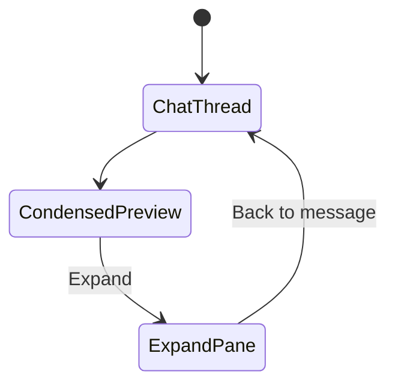

# ai-sql-view-restart

> **Clean restart** of the consolidated sql-view story (WI-289–WI-299). Presentation layer only —
> built on top of [`ai-artifact-emit-contract`](../in-progress/ai-artifact-emit-contract/STORY.md)
> (`feat/ai-chat-artefacts`), not on `feat/ai-chat-sql-result-view`.
>
> | Merged concept | Delivered in |
> |----------------|--------------|
> | **Artefact view** (framework, `chatArtifactTreatments`, chat-type reactions) | WI-289, WI-292, WI-293 |
> | **SQL in chat view** (condensed preview, Run/Export, chat-native card) | WI-291–294 |
> | **SQL expand view** (full pane, back-to-message, paging, `QueryDataView`) | WI-295–298 |
> | Open in Analysis, inline-analysis host-apply, shared data component | WI-289, WI-291, WI-296 |
> | **Design doc** [`chat-artefact-architecture.md`](../../../design/ai/chat-artefact-architecture.md) | WI-289, WI-295, WI-299 |

## Restart rationale

The first implementation on `feat/ai-chat-sql-result-view` was built from `origin/dev` **without**
artifact emission. It regressed the artefacts foundation (inline router, salvage workarounds) and
mixed that debt with the presentation layer. **This story restarts from scratch:**

- **Branch from:** `origin/feat/ai-chat-artefacts` (not `dev`, not the old sql-view branch)
- **Reference only:** old branch files as a catalogue for additive presentation code — **not** commit history
- **Abandon:** `feat/ai-chat-sql-result-view` (salvage, `GeneratedSqlAnswerSalvage`, client prose inference)

## Prerequisite (hard gate)

**Must be satisfied before WI-289:**

| Prerequisite | Source |
|--------------|--------|
| `ArtifactEmissionCoordinator` emits `generated-sql` after `validate_sql` | `origin/feat/ai-chat-artefacts` / WI-303–306 |
| `RegistryAgentEventRouter` + registry-driven SSE | WI-305 |
| Scenario packs green (`ArtifactEmitScenariosIT`) | WI-307–308 |
| Basic UI cards (`ArtifactCard`, `AssistantReplyRouter`) on artefacts branch | WI-305 + 999d53e8 |

Verify before starting implementation:

```bash
./gradlew :ai:mill-ai-test:testIT --tests "*ArtifactEmit*"
./gradlew :ai:mill-ai:test --tests "*ArtifactEmission*"
```

Story doc: [`docs/workitems/in-progress/ai-artifact-emit-contract/`](../in-progress/ai-artifact-emit-contract/STORY.md)  
Design: [`docs/design/agentic/artifact-emit-contract.md`](../../../design/agentic/artifact-emit-contract.md)

## Goal

Deliver **chat-inferred artefact presentation** for unified AI chat on branch **`feat/ai-sql-view`**:

- **`chatArtifactTreatments`** — each **chat type** defines how artefacts are handled.
- **Condensed (in-chat) view** — SQL ↔ Data preview in **`general`** chat; chat-native styling.
- **Expand view** — full chat content pane; back to originating message; paging.
- **`QueryDataView`** — shared across Analysis, condensed, and expand modes.
- **`inline-analysis`** — host-apply SQL to editor (no preview/expand).
- **Open in Analysis** — transient `chatHandoff` (no save, no `executionId`).
- Backend GET replay wire + client `queryService` execution.

**Predecessor:** [`completed/20260506-ai-v3-mill-ui-general-chat`](../completed/20260506-ai-v3-mill-ui-general-chat/STORY.md) (WI-229–WI-233).

**Supersedes:** `feat/ai-chat-sql-result-view` and [`in-progress/ai-sql-view`](../in-progress/ai-sql-view/) (abandoned implementation).

**Branch:** `feat/ai-sql-view` — create from `origin/feat/ai-chat-artefacts`:

```bash
git fetch origin
git checkout -b feat/ai-sql-view origin/feat/ai-chat-artefacts
```

## Layer separation (normative)

| Layer | Owner | This story |
|-------|-------|------------|
| Artifact **generation** (coordinator, descriptors, router, SSE) | `ai-artifact-emit-contract` | **Do not change** `mill-ai` runtime |
| Artifact **wire replay** (`ArtifactWireMapper`, GET turns) | WI-290 | Service layer only |
| Client **Run + attach** metadata | WI-291 | `mill-ai-service` + mill-ui |
| **Presentation** (condensed, expand, treatments) | WI-292–298 | mill-ui only |

**Explicitly out of this story:** `GeneratedSqlAnswerSalvage`, inline `AgentEventRouter` body,
`LangChain4jAgent` emission changes, client prose/JSON salvage inference.

## Chat types (v1)

| ChatType | SQL/data treatment |
|----------|---------------------|
| `general` | Condensed preview + expand + Run/Export/Open in Analysis |
| `inline-analysis` | `host-apply` → editor |
| `inline-model` / `inline-knowledge` | Registry stubs; facet card via existing `ArtifactCard` |

## Two views (`general` chat)

| View | WI | Layout |
|------|-----|--------|
| **In-chat condensed** | 292–294 | ~900px; `ChatArtifactCard` |
| **Expand** | 295–298 | Full chat pane; same visual family |



## Execution order

0. **Prerequisite gate** — artefacts scenario packs green (see above)
1. WI-289 — Design contract (presentation + replay; references emit contract)
2. WI-290 — Backend GET replay wire (`mill-ai-service` only)
3. WI-291 — Client execute + attach
4. WI-292 — Framework + condensed preview
5. WI-293 — Chat-type wiring
6. WI-294 — Condensed verification (checkpoint)
7. WI-295 — Expand + QueryDataView design
8. WI-296 — Shared QueryDataView
9. WI-297 — Expand shell
10. WI-298 — SQL expand wiring
11. WI-299 — Story closure

## Scope

| In | Out |
|----|-----|
| Presentation: artefact framework + condensed + expand + QueryDataView | Artifact **emission** runtime (artefacts story) |
| GET replay wire + attach-result POST | Salvage workarounds (backend or client) |
| **`docs/design/ai/chat-artefact-architecture.md`** (presentation + replay layers) | Chart/metadata/DQ bodies (stubs) |
| Chat-native UI (not Analysis chrome in chat views) | Server execute-sql |
| Extend (not delete) artefacts `ArtifactCard` / `AssistantReplyRouter` | Facet promotion lifecycle |
| Open in Analysis handoff | `ai:integration` CI restore |
| Port additive files from old branch as reference | Old branch git history |

## Design deliverables (story)

Primary architecture doc (created/updated in **WI-289**, finalized in **WI-299**):

- **[`docs/design/ai/chat-artefact-architecture.md`](../../../design/ai/chat-artefact-architecture.md)** — presentation + replay layers; **§ emission** cross-links [`artifact-emit-contract.md`](../../../design/agentic/artifact-emit-contract.md).

Supporting updates: [`ai-v3-chat-transport-extensions.md`](../../../design/agentic/ai-v3-chat-transport-extensions.md), [`GENERAL-CHAT-DESIGN.md`](../../../design/ui/mill-ui/GENERAL-CHAT-DESIGN.md), [`docs/design/ai/README.md`](../../../design/ai/README.md).

## Design references

- [`artifact-emit-contract.md`](../../../design/agentic/artifact-emit-contract.md) — emission foundation (prerequisite)
- [`capabilities_design.md`](../../../design/ai/capabilities_design.md) §15 (generate-only SQL)

## Placement

[`docs/workitems/planned/ai-sql-view-restart/`](.) — move to `in-progress/` on first WI `[x]`.

## Work Items

- [ ] WI-289 — [`WI-289-ai-sql-view-design-contract.md`](WI-289-ai-sql-view-design-contract.md)
- [ ] WI-290 — [`WI-290-ai-sql-view-get-artifact-replay.md`](WI-290-ai-sql-view-get-artifact-replay.md)
- [ ] WI-291 — [`WI-291-ai-sql-view-query-execute-attach.md`](WI-291-ai-sql-view-query-execute-attach.md)
- [ ] WI-292 — [`WI-292-ai-sql-view-artifact-preview-ui.md`](WI-292-ai-sql-view-artifact-preview-ui.md)
- [ ] WI-293 — [`WI-293-ai-sql-view-chat-surfaces-parity.md`](WI-293-ai-sql-view-chat-surfaces-parity.md)
- [ ] WI-294 — [`WI-294-ai-sql-view-condensed-verification.md`](WI-294-ai-sql-view-condensed-verification.md)
- [ ] WI-295 — [`WI-295-ai-sql-view-expand-design.md`](WI-295-ai-sql-view-expand-design.md)
- [ ] WI-296 — [`WI-296-ai-sql-view-shared-query-data-view.md`](WI-296-ai-sql-view-shared-query-data-view.md)
- [ ] WI-297 — [`WI-297-ai-sql-view-expand-shell.md`](WI-297-ai-sql-view-expand-shell.md)
- [ ] WI-298 — [`WI-298-ai-sql-view-expand-sql-wiring.md`](WI-298-ai-sql-view-expand-sql-wiring.md)
- [ ] WI-299 — [`WI-299-ai-sql-view-verification-closure.md`](WI-299-ai-sql-view-verification-closure.md)

## Verification (story level)

- **Prerequisite:** artefacts scenario packs green before WI-289 code
- Artefact framework + condensed + expand + chat types + Open in Analysis + **design doc** — see WI-294 and WI-299
- **No salvage paths** in final implementation

## Reference implementation (old branch)

Use `origin/feat/ai-chat-sql-result-view` **file paths only** when porting additive presentation code.
Do **not** cherry-pick commits. See layer separation and do-not-port list in WI-289.

## Supplementary notes

Implementation playbook (porting catalogue, data flow, pitfalls, MR strategy, test commands):

**[`RESTART-NOTES.md`](RESTART-NOTES.md)**

## Story lineage

| Artifact | Notes |
|----------|--------|
| Spec origin | Docs commit `479e4e52` (`planned/ai-sql-view/`) |
| Restart folder | `planned/ai-sql-view-restart/` — adds artefacts prerequisite + salvage exclusion |
| Implementation branch | `feat/ai-sql-view` from `origin/feat/ai-chat-artefacts` |
