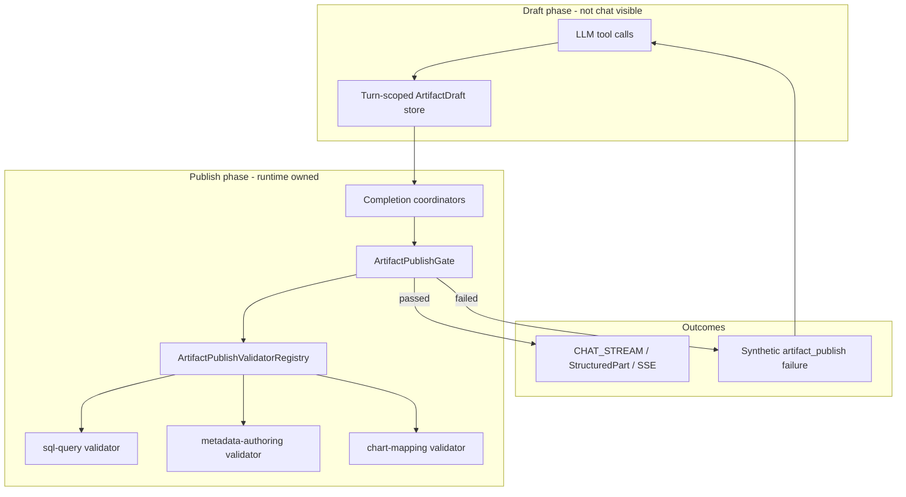

# Story: Deterministic artifact publish validation

**Status:** `planned` — standalone story; **not** part of `analysis-inline-chat-foundation`.

**Backlog:** [A-98](../BACKLOG.md)  
**Branch (when started):** `feat/artifact-publish-validation` from `origin/dev`  
**Milestone:** TBD (add to `MILESTONE.md` on story start)

**Normative design:** [`docs/design/agentic/artifact-publish-validation.md`](../../../design/agentic/artifact-publish-validation.md)  
**Open decisions:** [`GAPS.md`](GAPS.md)

---

## Goal

Replace **model-owned** artifact validation (prompt compliance + optional `validate_*` tool calls)
with a **runtime-owned publish gate**. Every artifact that reaches **CHAT_STREAM** or durable
**ARTIFACT** storage must pass a **capability-provided validator** registered by **artifact key**
before publication.

The gate applies to **all agent profiles** and **all chat surfaces** (General Chat, inline hosts,
MCP, future APIs) — independent of `profileId`, `contextType`, or UI module.

This story is **agentic runtime / capability** work (`ai/mill-ai*`, `mill-ai-data`,
`mill-ai-autoconfigure`). It does **not** implement inline-chat UI, Analysis apply/run, or mill-ui
changes except documentation of the stronger publish contract.

---

## Problem statement

### Today (model-owned)

| Step | Who decides | Risk |
|------|-------------|------|
| Compose SQL / facet / chart draft | LLM + tools | OK |
| Call `validate_sql` / `validate_chart_spec` | LLM (prompt) | Skippable |
| Retry on failure (up to 3×) | LLM (prompt) | Unenforced |
| Emit `generated-sql` to chat | Coordinator when last tool said `passed=true` | Trusts model attestation |
| Mock / test shortcuts | UI or tests | Bypass backend entirely |

Hosts (Analysis copilot strips, General Chat cards, inline artifact strips) **assume** that a
structured SQL/facet/chart part is safe to show and act on. That assumption is only as strong as
model compliance with capability prompts.

### Target (runtime-owned)

| Step | Who decides |
|------|-------------|
| Draft / propose | LLM + composition tools |
| **Publish validate** | **Runtime gate + capability validator (deterministic)** |
| Emit to CHAT_STREAM / ARTIFACT | Runtime only after pass |
| Correction on fail | Runtime injects rejection → LLM revises → retry (max attempts in **code**) |

**Platform invariant (normative):**

> If a publishable artifact appears in CHAT_STREAM or durable ARTIFACT for a turn, it passed the
> owning capability's publish validator in that turn.

---

## Terminology

| Term | Meaning |
|------|---------|
| **Draft** | Turn-scoped payload candidate not yet visible to chat consumers |
| **Publish** | Emission of `ProtocolFinal` / structured SSE part / durable artifact row |
| **Publishable artifact** | Descriptor with `destinations` containing `CHAT_STREAM` and/or host-actionable `ARTIFACT` |
| **Diagnostic artifact** | Tool-result kinds with `destinations: []` (e.g. `sql-validation`) — internal only |
| **Validator key** | Primary: qualified descriptor id `{capabilityId}.{descriptorId}` (e.g. `sql-query.generated-sql`) |
| **Publish gate** | Runtime component that calls validators before any publish |
| **Correction loop** | Runtime-fed rejection → LLM revision → re-validate; not prompt-owned |
| **`artifact_publish`** | Virtual runtime tool name used for synthetic `ToolExecutionResultMessage` on reject |

---

## Principles (locked)

1. **Publish gate, not prompt gate** — validation at emission time; LLM drafts, runtime publishes.
2. **All publishable artifact kinds** — every gated descriptor in capability YAML (see inventory
   below); diagnostic tool results stay internal.
3. **Capability duty** — each capability registers **`ArtifactPublishValidator` by key**; runtime
   orchestrates gate + correction loop only.
4. **Profile- and surface-agnostic** — same gate for `data-analysis`, `analysis-copilot`, schema
   authoring, inline chat, General Chat; no `profileId` / `contextType` branches in the gate.
5. **Fail closed** — missing validator for a publishable descriptor → **block publish** + telemetry.
6. **Attempt limits in code** — default **3** publish attempts per validator key per turn (not YAML prose).

---

## Current vs target architecture

### Current emission path (simplified)

```text
LLM → validate_sql tool → ToolResult (passed/fail)
  → SqlArtifactCompletionCoordinator (plan if passed=true)
  → ProtocolFinal (generated-sql) → CHAT_STREAM
```

Validation authority = **last tool result the model chose to produce**.

### Target emission path

```text
LLM → propose_* / composition tools → draft in turn-scoped store
  → CompletionCoordinator (recipe complete)
  → ArtifactPublishGate.tryPublish(key, draft)
       → ArtifactPublishValidatorRegistry → capability validator
       → pass: normalized payload → ProtocolFinal → CHAT_STREAM
       → fail: PublishRejected → synthetic artifact_publish tool result → LLM loop
```

Validation authority = **capability validator at publish time only**.



---

## Publishable artifact inventory (initial)

From capability YAML manifests (`ai/mill-ai/src/main/resources/capabilities/`). **Each row requires
a capability validator** unless marked excluded in [GAPS.md](GAPS.md).

| Capability | Validator key (primary) | persistKind | wirePartType | destinations | Host role |
|------------|-------------------------|-------------|--------------|--------------|-----------|
| `sql-query` | `sql-query.generated-sql` | `sql.generated` | `sql` | CHAT_STREAM, ARTIFACT | **Actionable** — Apply/Run (Analysis), execute elsewhere |
| `sql-query` | `sql-query.sql-description` | `sql.description` | TBD | CHAT_STREAM | Informational schema echo — see GAP-1 |
| `sql-query` | `sql-query.sql-result` | `sql.result` | `data` | CHAT_STREAM | Execution rows — see GAP-1 |
| `metadata-authoring` | `metadata-authoring.inferred-facet` | `metadata.faceting.capture` | `facet-proposal` | CHAT_STREAM, ARTIFACT | **Actionable** — facet accept/reject |
| `chart-mapping` | (nested in `generated-sql` visualizations) | — | — | via SQL final | Chart spec binding — WI-398 |

**Explicitly not gated for chat (diagnostic):**

| artifactKind | destinations | Notes |
|--------------|--------------|-------|
| `sql-validation` | `[]` | Tool feedback only; may inform LLM, never a strip |
| `chart-validation` | `[]` | Same |

---

## Validator registry (capability duty)

### Key resolution order

1. **Qualified descriptor id** — `sql-query.generated-sql` (primary)
2. **persistKind** — `sql.generated` (replay / persistence routing)
3. **artifactKind** — `generated-sql` (fallback if globally unique)

### SPI (summary — full contract in design doc)

```kotlin
interface ArtifactPublishValidator {
    fun keys(): Set<ArtifactValidatorKey>
    fun validate(request: ArtifactPublishValidationRequest): ArtifactPublishValidationResult
}
```

Capabilities expose validators through the same discovery path as existing dependencies
(`CapabilityDependencyContainer`, Spring `SpringCapabilityDependencyAssembler`, or `ServiceLoader`).

**One validator per publishable descriptor** is the default; a capability may register multiple
validators for multiple keys.

### Initial capability ownership (WI-398)

| Module | Validator(s) | Delegates to |
|--------|----------------|--------------|
| `mill-ai` / sql-query | `sql-query.generated-sql` | `validateSqlContext` + `BackendSqlValidator` |
| `mill-ai-data` | SQL parse/dialect | `SqlProvider.parseSql`, dialect normalizer |
| `mill-ai` / metadata-authoring | `metadata-authoring.inferred-facet` | Facet payload + entity rules |
| `mill-ai` / chart-mapping | chart portion of SQL final | `validate_chart_spec` rules at publish time |

---

## Correction loop (runtime-owned)

When publish validation **fails**:

1. **Do not** emit `ProtocolFinal` / structured SSE part / durable artifact.
2. Increment per-key **publish attempt** counter (default max **3** per turn).
3. Append **synthetic** `ToolExecutionResultMessage` for virtual tool **`artifact_publish`**:

```json
{
  "artifactKey": "sql-query.generated-sql",
  "passed": false,
  "attempt": 2,
  "message": "Syntax error near FROM",
  "fieldErrors": { "sql": "..." }
}
```

4. `LangChain4jAgent` **`iteration++`** — model receives failure like any tool error.
5. Model revises draft via propose/composition tools; coordinator retries publish on next finalize.
6. On **attempt exhaustion** — terminal fail: assistant **prose only** with last `message`; **no strip**.

Hard ceiling: existing `maxIterations` (20) on `LangChain4jAgent`.

**Chat consumer visibility:**

| Event | User sees actionable strip? |
|-------|----------------------------|
| `PublishRejected` / `artifact_publish` failure | No |
| `PublishApproved` → `ProtocolFinal` | Yes |
| Terminal exhaustion | Error prose only |

Inline Analysis and General Chat share identical behavior.

---

## Stages and work items

Execute in order. Each WI completes with one commit + `STORY.md` checkbox + push (per
[`RULES.md`](../RULES.md)).

| Stage | WI | Ready when | Delivers |
|-------|-----|------------|----------|
| **1 — Design + gate** | [WI-397](WI-397-artifact-publish-validation-design.md) | Story approved | Design doc, SPI, `ArtifactPublishGate`, correction loop in `LangChain4jAgent`, SQL coordinator hook, fail-closed tests |
| **2 — Capability validators** | [WI-398](WI-398-capability-publish-validators.md) | WI-397 merged | Validators for sql-query, metadata-authoring, chart-mapping; Spring wiring |
| **3 — Prompts + closure** | [WI-399](WI-399-prompt-tool-validation-cleanup.md) | WI-398 merged | YAML/prompt cleanup, scenario baselines, public docs, story archive |

### Work item tracker

- [ ] [WI-397](WI-397-artifact-publish-validation-design.md) — Design contract + runtime publish gate + correction loop
- [ ] [WI-398](WI-398-capability-publish-validators.md) — Capability-owned validators by key
- [ ] [WI-399](WI-399-prompt-tool-validation-cleanup.md) — Prompt/tool cleanup + tests/docs + story closure

---

## Module / code map (implementation guide)

| Area | Likely touchpoints |
|------|-------------------|
| SPI + registry | `ai/mill-ai/.../core/artifact/` or `.../runtime/publish/` |
| Publish gate | `ArtifactPublishGate`, integrate before `ProtocolFinal` emission |
| SQL coordinator | `SqlArtifactCompletionCoordinator.kt` — draft + finalize via gate |
| Agent loop | `LangChain4jAgent.kt` — synthetic `artifact_publish` on reject |
| SSE bridge | `LangChain4jChatRuntime.kt` — unchanged if gate is before `ProtocolFinal` |
| SQL validator | `SqlQueryCapability.kt`, `BackendSqlValidator.kt`, `SqlQueryToolHandlers.kt` |
| Facet validator | `metadata-authoring` capability module |
| Chart validator | `chart-mapping` capability module |
| Spring wiring | `SpringCapabilityDependencyAssembler.kt`, `AiV3AutoConfiguration.kt` |
| Capability YAML | `sql-query.yaml`, `metadata-authoring.yaml`, `chart-mapping.yaml` (WI-399) |
| Tests | `LangChain4jAgentEmitTest`, `SqlArtifactCompletionCoordinatorTest`, new gate tests, `AiChatControllerIT` |
| Design | `docs/design/agentic/artifact-publish-validation.md` |

---

## Dependencies

### Technical (in-repo)

- `ArtifactDescriptorRegistry` — descriptor keys and destinations
- `SqlArtifactCompletionCoordinator` / `CompletionPlanRegistry`
- `LangChain4jAgent` tool loop + `ToolExecutionResultMessage`
- `LangChain4jChatRuntime` → `ChatRuntimeEvent.StructuredPart` → SSE
- Existing `SqlValidator` / `BackendSqlValidator`

### Not a dependency

- **`analysis-inline-chat-foundation`** — may close before or after this story. Analysis hosts
  already consume SQL strips; this story hardens the platform contract they rely on.

### Related (informational)

| Story | Relationship |
|-------|----------------|
| [`analysis-inline-chat-foundation`](../in-progress/analysis-inline-chat-foundation/STORY.md) | Consumer of publishable SQL strips; defers publish gate to **this** story |
| Completed chart / SQL artifact stories (`WI-366`–`370`, `WI-367`) | Defined artifact shapes gate must honor |

---

## Non-goals

- Changing mill-ui inline-chat layout, splitter, or Analysis apply/run UX
- Semantic row-level policy enforcement (beyond capability-defined validation)
- Replacing Calcite parse validation with full semantic query planning
- Distributed validation services — validators run in-process with the agent runtime
- Making mock UI fully gate-faithful (document only unless GAP-3 changes)
- New user-facing "validation failed" strips for drafts — failures stay internal until terminal prose

---

## Verification (story level)

After all WIs:

```bash
# AI modules
cd ai && ./gradlew :mill-ai:test :mill-ai:testIT
cd ai && ./gradlew :mill-ai-service:test :mill-ai-service:testIT
cd ai && ./gradlew :mill-ai-data:test :mill-ai-autoconfigure:test

# Regression scenarios (when baselines updated in WI-399)
cd ai && ./gradlew :mill-ai-test:testIT
```

**Integration acceptance scenario (manual or IT):**

1. Send a data-query turn that produces invalid SQL draft.
2. Assert **no** `item.part.updated` with `partType: sql` until validator passes.
3. Assert `artifact_publish` synthetic failures in agent message history (or diagnostic SSE).
4. Repeat for `analysis-copilot` and `data-analysis` profiles — same gate behavior.

---

## Story closure checklist

Per [`RULES.md`](../RULES.md) **Completion (Story level)**:

1. All WIs `[x]` in this `STORY.md`; folder moved to `docs/workitems/completed/YYYYMMDD-artifact-publish-validation/`
2. `MILESTONE.md` updated
3. `BACKLOG.md` A-98 → `done`
4. `docs/design/agentic/artifact-publish-validation.md` complete (normative)
5. `docs/public/src/` updated if user-facing AI docs mention validation (WI-399)
6. MR-ready squash on `feat/artifact-publish-validation` (~≤10 commits)

---

## Assumptions

- Validators are **synchronous** and fast enough for the agent turn (parse / schema checks).
- Published payload after pass uses **`normalizedPayload`** from the validator as canonical wire body.
- Virtual tool `artifact_publish` does not need to appear in capability tool manifests if system
  prompt + synthetic results suffice (see GAP-4).
- `validate_sql` may remain temporarily as a draft helper during migration (WI-399).
