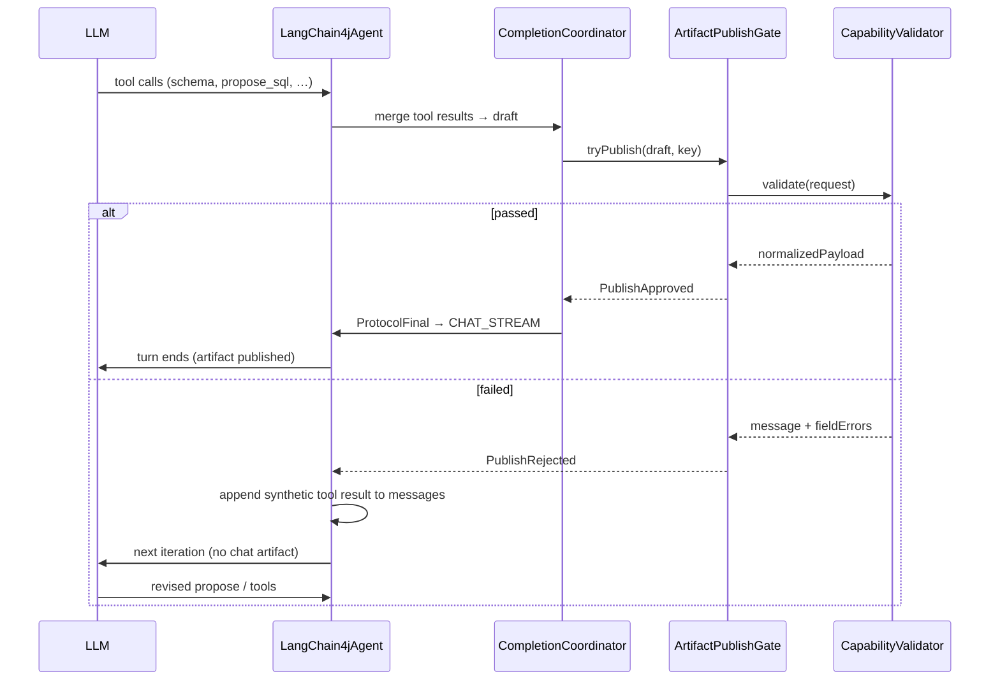

# WI-397 - Artifact publish validation design + runtime gate

> **Story context:** Exhaustive planning detail (inventory, module map, verification, non-goals) lives in
> [`STORY.md`](STORY.md). Normative design: [`docs/design/agentic/artifact-publish-validation.md`](../../../design/agentic/artifact-publish-validation.md).
> Open decisions: [`GAPS.md`](GAPS.md).

## Goal

Define the **deterministic artifact publish validation** contract and implement the **runtime publish
gate** so no publishable artifact reaches chat consumers unless the owning capability's validator
passes.

## Problem

Today validation is **model-owned**:

- Capability prompts instruct the LLM to call tools such as `validate_sql` and to self-retry.
- Coordinators emit `generated-sql` only when the model's last `validate_sql` returned `passed=true`.
- Attempt limits and correction loops live in YAML prose, not in code.
- Mock UI and prompt non-compliance can surface SQL (or other payloads) without a hard invariant.

Hosts (Analysis copilot, General Chat, future inline surfaces) need a **single guarantee**:

> **If a publishable artifact appears in CHAT_STREAM / durable ARTIFACT, it passed the capability
> publish validator in this turn.**

## Scope

### In scope

- **Publishable artifacts** — descriptors with `destinations` containing `CHAT_STREAM` and/or
  host-actionable `ARTIFACT` (e.g. `sql-query.generated-sql`, `metadata.faceting.capture`,
  chart visualization finals bound to SQL).
- **Runtime gate** in the emission path (before `ProtocolFinal` / structured SSE parts).
- **Capability validator SPI** — each capability registers validators for its publishable kinds.
- **Deterministic retry loop** — on publish failure, inject structured rejection into the agent
  tool loop; enforce max attempts in code.
- **Profile-agnostic** — applies to every profile that uses gated capabilities (`data-analysis`,
  `analysis-copilot`, schema authoring, etc.).
- **Surface-agnostic** — inline chat, General Chat, MCP consumers share the same gate.

### Out of scope (this WI)

- Concrete validator implementations per capability (WI-398).
- Prompt/tool YAML cleanup (WI-399).
- UI changes (hosts already treat published artifacts as actionable; optional `validated` metadata
  is a follow-up).
- Semantic/business validation beyond what each capability defines (e.g. row-level policy).

## Design requirements

### 1. Publish gate (runtime duty)

Introduce a runtime component (e.g. `ArtifactPublishGate` or extend completion coordinators) that:

1. Intercepts **every** emission candidate destined for `CHAT_STREAM` or durable `ARTIFACT`.
2. Resolves the target [ArtifactDescriptor] and owning `capabilityId`.
3. Invokes the capability's **publish validator** for that descriptor / `persistKind`.
4. On **pass** — allow normal routing (`ProtocolFinal` → `StructuredPart` → SSE).
5. On **fail** — **do not publish**; return a structured failure to the agent loop for revision.

The gate must be the **only** path to publishable artifacts (no bypass via legacy
`emitOnToolSuccess`, direct tool-result routing to `CHAT_STREAM`, or mock shortcuts without an
explicit test-only flag).

### 2. Capability duty (validator SPI)

Each capability registers **artifact validators by key** — one validator per publishable artifact
descriptor the capability owns. The runtime resolves validators through a central registry; it does
not embed capability-specific rules.

#### Validator keys (normative)

Use stable lookup keys aligned with [ArtifactDescriptorRegistry]:

| Key form | Example | When to use |
|----------|---------|-------------|
| **Qualified descriptor id** | `sql-query.generated-sql` | **Primary** — `{capabilityId}.{descriptorId}` from capability YAML `artifacts:` |
| **persistKind** | `sql.generated` | Secondary index for persistence / replay routing |
| **artifactKind** | `generated-sql` | Fallback only when unique across loaded capabilities |

Registry API (conceptual):

```kotlin
interface ArtifactPublishValidator {
    /** Keys this validator handles (qualified ids preferred). */
    fun keys(): Set<ArtifactValidatorKey>

    fun validate(
        request: ArtifactPublishValidationRequest,
    ): ArtifactPublishValidationResult
}

data class ArtifactValidatorKey(
    val capabilityId: String,
    val descriptorId: String,          // e.g. "generated-sql"
) {
    val qualifiedId: String get() = "$capabilityId.$descriptorId"
}

data class ArtifactPublishValidationRequest(
    val key: ArtifactValidatorKey,
    val descriptor: ArtifactDescriptor,
    val draftPayload: Map<String, Any?>,
    val attempt: Int,                  // publish attempt in this turn (1-based)
    val context: AgentContext,
)

data class ArtifactPublishValidationResult(
    val passed: Boolean,
    val message: String? = null,       // model-facing correction hint
    val fieldErrors: Map<String, String> = emptyMap(),  // optional structured hints
    val normalizedPayload: Map<String, Any?>? = null,   // canonical publish body on pass
    val warnings: List<String> = emptyList(),
)
```

**Capability provider duty:** expose validators via `CapabilityPublishValidatorProvider` (or extend
existing dependency container) — same pattern as `SqlQueryCapabilityDependency`:

```kotlin
// sql-query module registers:
ArtifactPublishValidator for key sql-query.generated-sql
  → delegates to SqlValidator + title/description rules
```

- Multiple validators per capability are normal (one per publishable artifact block in YAML).
- **No validator** for a publishable descriptor → **fail closed** (do not publish; telemetry).
- Validators are **stateless**; turn-scoped draft state lives in the runtime/coordinator.

Validation **implementation** is capability-specific:

| Capability | Validator key(s) | Responsibility |
|------------|------------------|----------------|
| `sql-query` | `sql-query.generated-sql` | Parse/dialect normalize, title/description shape |
| `chart-mapping` | `chart-mapping.*` (TBD in WI-398) | Chart spec vs trusted SQL schema |
| `metadata-authoring` | `metadata-authoring.facet-proposal` | Facet payload + target entity |

Tool-level artifacts such as `sql-validation`, `chart-validation` with `destinations: []` remain
**diagnostic** — they are not publish gates and must not be required for chat publication.

### 3. Draft vs publish

Separate phases explicitly:

| Phase | Owner | Chat-visible? |
|-------|--------|----------------|
| Draft / propose | Model + tools | No |
| **Publish validate** | **Runtime + capability** | No |
| Publish | Runtime | Yes (CHAT_STREAM / ARTIFACT) |

Model tools may still help **compose** drafts (e.g. schema listing, SQL editing helpers), but
**must not** be documented as the authority for whether an artifact is published.

### 4. Deterministic correction loop (runtime-owned)

When publish validation **fails**, the runtime must **not** emit the artifact and must **feed structured
rejection back into the LLM** so it can revise the draft — without relying on prompt compliance.

#### Turn-scoped draft store

Introduce a turn-scoped **artifact draft** held by the completion coordinator (or
`ArtifactPublishSession`):

```text
turnId + qualifiedValidatorKey → ArtifactDraft(payload, attempt, planId?)
```

Drafts are populated by:

- Completion coordinators merging tool results (current SQL path), and/or
- Explicit **propose** tools (`propose_sql`, `propose_facet`, …) in WI-398/399.

Publish is attempted only when the coordinator believes the draft is **complete** for its recipe
(e.g. `sql-only` plan ready to finalize).

#### Correction loop (fits existing LangChain4j tool loop)

Today `LangChain4jAgent` already continues the loop when tools run but no `ProtocolFinal` ends the
turn (`iteration++` after coordinator batch). Extend that path:



**Implementation choice (recommended): synthetic tool feedback**

On `PublishRejected`, before `iteration++`, append a `ToolExecutionResultMessage` for a **virtual
runtime tool** that the model is trained/prompted to understand:

| Field | Value |
|-------|--------|
| Virtual tool name | `artifact_publish` (runtime-only; not a capability tool) |
| Result JSON | `{ "artifactKey": "sql-query.generated-sql", "passed": false, "attempt": 2, "message": "...", "fieldErrors": { "sql": "..." }, "draftRef": "..." }` |

This reuses the **existing** correction mechanism (`messages.add(ToolExecutionResultMessage…)`)
without a second planner. The LLM sees a failed publish exactly like a failed tool.

Alternative considered: `AgentEvent.ObservationMade` — rejected because it is not wired into the
LangChain4j message list today; synthetic tool result is the minimal change.

#### Attempt policy (code, not prompt)

Per publish key (or per turn):

| Policy | Default |
|--------|---------|
| `maxPublishAttempts` | **3** per `qualifiedValidatorKey` per turn |
| On reject | increment attempt; inject synthetic `artifact_publish` failure |
| On `attempt > max` | **terminal reject** — no publish; assistant prose with last `message` only |
| Hard ceiling | existing `maxIterations` (20) on `LangChain4jAgent` |

Turn state tracks:

```kotlin
data class PublishAttemptState(
    val key: ArtifactValidatorKey,
    var attempt: Int,
    var lastRejection: ArtifactPublishValidationResult?,
)
```

#### What the model does on rejection (prompt WI-399)

Prompts describe **behavior**, not enforcement:

- "If `artifact_publish` returns `passed: false`, revise the draft using `message` / `fieldErrors`
  and call the propose tool again."
- Remove "call validate_sql up to 3 times" — runtime owns attempts.

#### What chat consumers see

| Event | User-visible? |
|-------|----------------|
| `PublishRejected` / synthetic tool result | Optional diagnostic (`item.tool.result` for `artifact_publish`) or suppress in UI |
| Failed draft | **Never** as structured strip |
| `PublishApproved` → `ProtocolFinal` | Yes — sql / facet / chart strip |

Inline Analysis and General Chat behave identically: only approved publishes become strips.

#### Coordinator changes (SQL first)

Refactor `SqlArtifactCompletionCoordinator.handleValidateSql`:

- **Today:** creates plan only when tool result `passed == true` (model-attested).
- **Target:** create/update draft from **propose** payload regardless; call `ArtifactPublishGate`
  at finalize time; remove dependency on model calling `validate_sql` with `passed: true`.

`validate_sql` may become a thin draft helper or deprecated (WI-399).

### 5. Profile and surface independence

- Gate keys off **artifact descriptor + capability**, not `profileId` or `contextType`.
- `analysis-copilot`, `data-analysis`, and future profiles using `sql-query` share the same SQL
  publish validator.
- Inline vs General Chat: identical SSE wire shape; gate runs in `LangChain4jChatRuntime` /
  service layer before `ChatRuntimeEvent.StructuredPart`.

### 6. Wire / persistence metadata

Published artifacts should carry optional metadata for hosts (backward-compatible):

- `validation.passed: true` (implicit — only published when true)
- `validation.warnings: []` when capability returns non-blocking warnings
- Normalized fields from validator (e.g. `normalizedSql`) are the canonical payload in the
  published artifact

## Deliverables

1. **Design doc** — `docs/design/agentic/artifact-publish-validation.md` (normative).
2. **SPI** — `CapabilityPublishValidator` (+ registry/factory) in `mill-ai` core.
3. **Runtime gate** — integrated into emission path used by `SqlArtifactCompletionCoordinator` and
   any other coordinator that emits `ProtocolFinal` to `CHAT_STREAM`.
4. **Fail-closed default** — missing validator blocks publish.
5. **Unit tests** — gate pass/fail, no emit on fail, attempt accounting, fail-closed without
   validator.
6. **Integration test** — agent turn where model proposes invalid SQL: no `item.part.updated`
   sql strip until validator passes (stub validator).

## Acceptance criteria

- No publishable artifact with `CHAT_STREAM` destination is emitted without calling the owning
  capability publish validator in the same turn.
- Failed validation never produces a host-actionable structured part (sql strip, facet strip, etc.).
- Missing capability validator for a publishable descriptor blocks publish (fail closed).
- Retry attempt limit is enforced in runtime code, not only in prompts.
- Behavior is identical for inline and non-inline chats when the same capability/profile stack is
  used.
- Existing tests that assume model-only `validate_sql` gating are updated or superseded.

## Verification

```bash
cd ai && ./gradlew :mill-ai:test :mill-ai-service:test
cd ai && ./gradlew :mill-ai:testIT :mill-ai-service:testIT
```

## Related

- Story: [STORY.md](STORY.md)
- Follow-up: [WI-398](WI-398-capability-publish-validators.md), [WI-399](WI-399-prompt-tool-validation-cleanup.md)
- Prior art: `SqlArtifactCompletionCoordinator`, `ArtifactDescriptorRegistry`, `sql-query.yaml`
