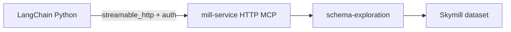

# LangChain + Skymill over Mill MCP (HTTP)

Demonstrates an external **LangChain (Python)** agent calling Mill **v3 capability tools** over
**Streamable HTTP** (`/services/mcp`) — no parallel tool definitions in Python and no Mill REST chat
API.



## Prerequisites

- **Java 21** + repo Gradle wrapper (mill-service)
- **Python 3.10+** and [Poetry](https://python-poetry.org/)
- **OpenAI API key** (for `skymill_agent.py` only; `smoke_tools.py` does not call an LLM)
- Skymill dataset on the server classpath via profile **`skymill-ai`**

## 1. Start mill-service (MCP backend)

From the repository root:

```bash
./gradlew :apps:mill-service:bootRun \
  --args='--spring.profiles.active=skymill-ai --mill.ai.mcp.enabled=true --mill.ai.mcp.profile=schema-exploration --mill.security.enable=false'
```

MCP endpoint: `http://localhost:8080/services/mcp`

### With Mill security enabled

Add Basic auth (same model as `/services/jet`):

```bash
./gradlew :apps:mill-service:bootRun \
  --args='--spring.profiles.active=skymill-ai --mill.ai.mcp.enabled=true --mill.ai.mcp.profile=schema-exploration --mill.security.enable=true --mill.security.authentication.basic.enable=true --mill.security.authentication.basic.store=classpath:passwd.yml'
```

Set `MILL_MCP_BASIC_USER` / `MILL_MCP_BASIC_PASSWORD` in `.env` (see `.env.example`).

### SQL validation stretch

Use MCP profile **`data-analysis`** on the server to expose `sql-query.validate_sql`:

```bash
--mill.ai.mcp.profile=data-analysis
```

## 2. Install Python dependencies

**Poetry (recommended):**

```bash
cd misc/examples/ai-mcp-langchain-skymill
poetry install
cp .env.example .env
# edit .env — set OPENAI_API_KEY
```

**pip alternative:**

```bash
cd misc/examples/ai-mcp-langchain-skymill
python -m venv .venv
source .venv/bin/activate   # Windows: .venv\Scripts\activate
pip install -r requirements.txt
cp .env.example .env
```

## 3. Smoke test (no LLM)

Confirms HTTP MCP wiring and `schema.*` tools:

```bash
poetry run python smoke_tools.py
```

Expected output includes `schema.list_tables`, `schema.list_columns`, etc.

## 4. Run the LangChain agent

```bash
poetry run python skymill_agent.py "What schemas and tables exist in Skymill?"
poetry run python skymill_agent.py "What columns does the bookings table have?"
poetry run python skymill_agent.py "How are bookings related to passengers?"
```

The agent loads tools **only** from Mill MCP (`MultiServerMCPClient` + `streamable_http` transport).

## Environment variables

| Variable | Default | Purpose |
|----------|---------|---------|
| `OPENAI_API_KEY` | — | Required for `skymill_agent.py` |
| `OPENAI_MODEL` | `gpt-4o-mini` | Chat model id |
| `MILL_MCP_URL` | `http://localhost:8080/services/mcp` | Mill MCP HTTP endpoint |
| `MILL_MCP_TOKEN` | — | Bearer token when security uses token auth |
| `MILL_MCP_BASIC_USER` / `MILL_MCP_BASIC_PASSWORD` | — | Basic auth for `/services/**` |

## Architecture notes

- **Transport:** MCP Streamable HTTP (SSE-capable); LangChain config uses `transport: "streamable_http"`.
- **Tool names:** Mill namespaced ids (`schema.list_tables`, …) from capability manifests — not redefined in Python.
- **Data plane:** Skymill lives on **mill-service** (`skymill-ai`); this example does not bundle CSV/Parquet locally.
- **stdio bridge:** Optional backlog [A-96 / WI-328](../../../docs/workitems/backlog/WI-328-mill-ai-mcp-transport-stdio.md) for legacy stdio-only IDE clients; this demo connects **directly over HTTP**.

## Manual checklist (WI-330)

- [x] mill-service boots with `skymill-ai` + MCP enabled
- [x] `poetry run python smoke_tools.py` lists `schema.list_tables`
- [x] Agent answers a schema question using MCP tool calls (watch server logs)
- [x] With security on, smoke + agent work with Basic auth env vars

## References

- Design: [`docs/design/agentic/v3-mcp-capability-exposure.md`](../../../docs/design/agentic/v3-mcp-capability-exposure.md)
- Skymill dataset: [`test/datasets/skymill/README.md`](../../../test/datasets/skymill/README.md)
- Story WI-330: [`docs/workitems/completed/20260622-ai-v3-mcp-server-poc/WI-330-langchain-python-skymill-mcp-example.md`](../../../docs/workitems/completed/20260622-ai-v3-mcp-server-poc/WI-330-langchain-python-skymill-mcp-example.md)
